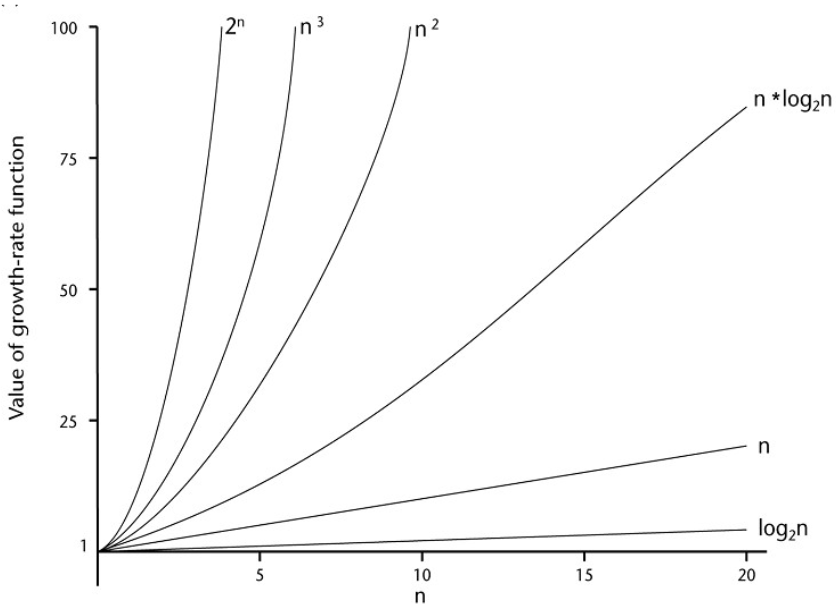
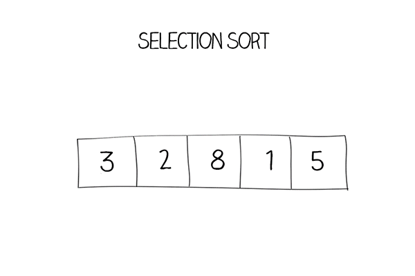
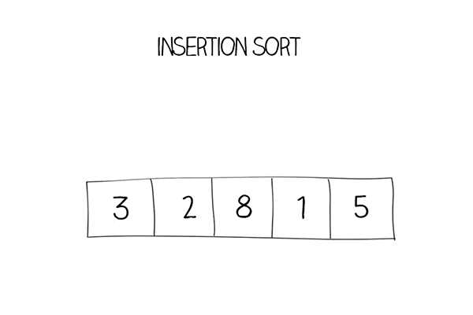
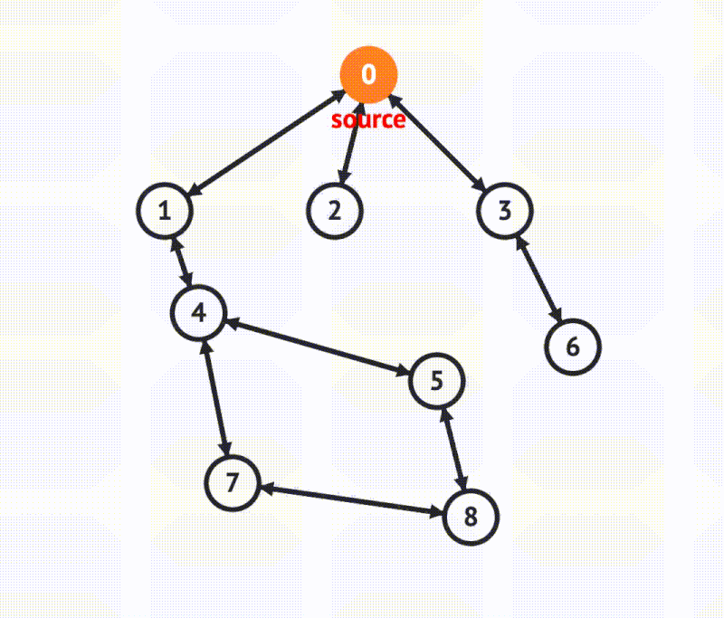

# x Class Notes
## En

## Taslak
### Algoritma Çalışma Zamanı Analizi
- Algoritma çalışma zamanı analizi, algoritmanın çalışma süresini belirlemek için kullanılan bir tekniktir.
```c
    int i = 1; // Maliyet: c1, Zaman: 1
    int sum = 0; // Maliyet: c2, Zaman: 1
    while (i <= n) { // Maliyet: c3, Zaman: n
        sum += i; // Maliyet: c4, Zaman: n-1
        i++; // Maliyet: c5, Zaman: n-1
    }
```
- Yukarıdaki algoritmanın çalışma zamanı analizi:
    - T(n) = c1 + c2 + c3n + c4(n-1) + c5(n-1) = c1 + c2 + c3n + c4n - c4 + c5n - c5 = (c3 + c4 + c5)n + (c1 + c2 - c4 - c5)
    - T(n) = an + b
    - T(n) = O(n)

```c
    int i = 1; // Maliyet: c1, Zaman: 1
    sum = 0; // Maliyet: c2, Zaman: 1
    while (i <= n) { // Maliyet: c3, Zaman: n
        int j = 1; // Maliyet: c4, Zaman: n
        while (j <= n) { // Maliyet: c5, Zaman: n^2
            sum += i + j; // Maliyet: c6, Zaman: n^2
            j++; // Maliyet: c7, Zaman: n^2
        }
        i++; // Maliyet: c8, Zaman: n
    }
```
- Yukarıdaki algoritmanın çalışma zamanı analizi:
    - T(n) = c1 + c2 + c3n + c4n + c5n^2 + c6n^2 + c7n^2 + c8n = c5n^2 + c6n^2 + c7n^2 + c4n + c3n + c8n + c1 + c2
    - T(n) = an^2 + bn + c
    - T(n) = O(n^2)

### Order of Growth
- Bir algoritmanın orantılı zaman gereksinimi, büyüme oranı(veya büyüme hızı) olarak bilinir.

|n|log<sub>2</sub>n|n|nlog<sub>2</sub>n|n<sup>2</sup>|n<sup>3</sup>|2<sup>n</sup>|!n|
|-|-|-|-|-|-|-|-|
|10<sup>1</sup>|1|10|10|100|1000|1024|3628800|
|10<sup>2</sup>|2|100|200|10000|1000000|1048576|1.1240007277776077e+301|
|10<sup>3</sup>|3|1000|3000|1000000|1000000000|1073741824|9.332621544394415e+157|



### Order of Growth Notation
#### Big-O Notation
- Bir algoritmanın çalışma zamanının en kötü durumda ne kadar süreceğini belirlemek için kullanılır.
- T(n) = O(f(n)) if and only if there exist positive constants c and n<sub>0</sub> such that 0 ≤ T(n) ≤ cf(n) for all n ≥ n<sub>0</sub>.
- Örnek: T(n) = 5n<sup>2</sup> + 3n + 2, T(n) = O(n<sup>2</sup>)
- Örnek: T(n) = 3n<sup>n</sup> + 2<sup>n</sup>, T(n) = O(n<sup>n</sup>)


#### Big-Ω (Omega) Notation
- Bir algoritmanın çalışma zamanının en iyi durumda ne kadar süreceğini belirlemek için kullanılır.
- T(n) = Ω(f(n)) if and only if there exist positive constants c and n<sub>0</sub> such that 0 ≤ cf(n) ≤ T(n) for all n ≥ n<sub>0</sub>.
- Örnek: T(n) = 5n<sup>2</sup> + 3n + 2, T(n) = Ω(n)
- Örnek: T(n) = 3n<sup>n</sup> + 2<sup>n</sup>, T(n) = Ω(2<sup>n</sup>)

#### Big-Θ (Theta) Notation
- Bir algoritmanın çalışma zamanının en iyi ve en kötü durumda ne kadar süreceğini belirlemek için kullanılır.
- T(n) = Θ(f(n)) if and only if there exist positive constants c<sub>1</sub>, c<sub>2</sub> and n<sub>0</sub> such that 0 ≤ c<sub>1</sub>f(n) ≤ T(n) ≤ c<sub>2</sub>f(n) for all n ≥ n<sub>0</sub>.
- Örnek: T(n) = 5n<sup>2</sup> + 3n + 2, T(n) = Θ(n<sup>2</sup>)
- Örnek: T(n) = 3n<sup>n</sup> + 2<sup>n</sup>, T(n) = Θ(n<sup>n</sup>)


### Selection Sort
- Selection sort, bir diziyi sıralamak için kullanılan bir algoritmadır.
- En küçük elemanı bulup dizinin başına yerleştirir.
- En kötü durumda O(n<sup>2</sup>) zaman karmaşıklığına sahiptir.
- En iyi durumda O(n<sup>2</sup>) zaman karmaşıklığına sahiptir.
- Ortalama durumda O(n<sup>2</sup>) zaman karmaşıklığına sahiptir.


### Bubble Sort
- Bubble sort, bir diziyi sıralamak için kullanılan bir algoritmadır.
- Komşu elemanları karşılaştırıp yer değiştirir.
- En kötü durumda O(n<sup>2</sup>) zaman karmaşıklığına sahiptir.
- En iyi durumda O(n) zaman karmaşıklığına sahiptir.
- Ortalama durumda O(n<sup>2</sup>) zaman karmaşıklığına sahiptir.


### Insertion Sort
- Insertion sort, bir diziyi sıralamak için kullanılan bir algoritmadır.
- Dizinin ilk elemanını sıralı kabul eder ve diğer elemanları sıralı kısmın içine ekler.
- En kötü durumda O(n<sup>2</sup>) zaman karmaşıklığına sahiptir.
- En iyi durumda O(n) zaman karmaşıklığına sahiptir.
- Ortalama durumda O(n<sup>2</sup>) zaman karmaşıklığına sahiptir.


### Merge Sort
- Merge sort, bir diziyi sıralamak için kullanılan bir algoritmadır.
- Diziyi ikiye böler ve her iki parçayı sıralar.
- En kötü durumda O(nlogn) zaman karmaşıklığına sahiptir.
- En iyi durumda O(nlogn) zaman karmaşıklığına sahiptir.
- Ortalama durumda O(nlogn) zaman karmaşıklığına sahiptir.


### Quick Sort
- Quick sort, bir diziyi sıralamak için kullanılan bir algoritmadır.
- Dizinin bir elemanını pivot olarak seçer ve pivotun solundakileri küçük, sağdakileri büyük yapar.
- En kötü durumda O(n<sup>2</sup>) zaman karmaşıklığına sahiptir.
- En iyi durumda O(nlogn) zaman karmaşıklığına sahiptir.
- Ortalama durumda O(nlogn) zaman karmaşıklığına sahiptir.


### Sequential Search
- Sequential search, bir dizide bir elemanın olup olmadığını kontrol etmek için kullanılan bir algoritmadır.
- Dizinin başından başlayarak elemanı bulana kadar arar.
- En kötü durumda O(n) zaman karmaşıklığına sahiptir.
- En iyi durumda O(1) zaman karmaşıklığına sahiptir.
- Ortalama durumda O(n) zaman karmaşıklığına sahiptir.


### Binary Search
- Binary search, bir dizide bir elemanın olup olmadığını kontrol etmek için kullanılan bir algoritmadır.
- Dizinin ortasından başlayarak elemanı bulana kadar arar.
- Dizinin sıralı olması gerekir.
- En kötü durumda O(log<sub>2</sub>n) zaman karmaşıklığına sahiptir.
- En iyi durumda O(1) zaman karmaşıklığına sahiptir.
- Ortalama durumda O(log<sub>2</sub>n) zaman karmaşıklığına sahiptir.


### Traveling Salesman Problem
- Traveling salesman problem, bir satıcı için en kısa yolu bulmak için kullanılan bir algoritmadır.
- Tüm şehirleri ziyaret edip en kısa yolu bulur.
- En kötü durumda O(n!) zaman karmaşıklığına sahiptir.
- En iyi durumda O(n<sup>2</sup>2<sup>n</sup>) zaman karmaşıklığına sahiptir.
- Ortalama durumda O(n<sup>2>2<sup>n</sup>) zaman karmaşıklığına sahiptir.


### Knapsack Problem
- Knapsack problem, bir çantanın kapasitesi dahilinde en değerli eşyaları seçmek için kullanılan bir algoritmadır.
- En kötü durumda O(2<sup>n</sup>) zaman karmaşıklığına sahiptir.
- En iyi durumda O(2<sup>n</sup>) zaman karmaşıklığına sahiptir.
- Ortalama durumda O(2<sup>n</sup>) zaman karmaşıklığına sahiptir.


### Assignment Problem
- Assignment problem, bir işi yapacak en uygun kişileri seçmek için kullanılan bir algoritmadır.
- n adam ve n iş arasında en uygun kişileri seçer.
- Her işi sadece bir kişi yapabilir.
- Her aday seçilecek.
- Toplam maliyeti en düşük olanı seçer.
- En kötü durumda O(n!) zaman karmaşıklığına sahiptir.
- En iyi durumda O(n<sup>3</sup>) zaman karmaşıklığına sahiptir.
- Ortalama durumda O(n<sup>3</sup>) zaman karmaşıklığına sahiptir.


### Graphs
- Graph, düğümler ve kenarlardan oluşan bir veri yapısıdır.
- Düğümler (vertex) ve kenarlar (edge) ile tanımlanır.
- Düğümler arasındaki ilişkileri gösterir.

- Yönlü graf: Kenarlar bir yönden diğerine doğru gider.


#### Graph Representation
- Adjacency matrix: Düğümler arasındaki ilişkileri matris olarak gösterir.

- Adjacency list: Düğümler arasındaki ilişkileri liste olarak gösterir.


#### Topological Sort
- Topological sort, ön şartları olan işleri sıralamak için kullanılan bir algoritmadır.


#### Depth First Search
- Depth first searc
- Önceliği derinliğe verir.
- Önce en uzun yola gider.



#### Breadth First Search
- Breadth first search, bir düğümü ziyaret edip diğer düğümleri ziyaret etmek için kullanılan bir algoritmadır.
- Önceliği genişliğe verir.
- Önce en kısa yola gider.


### Master Theorem
- Master theorem, bir algoritmanın çalışma zamanını belirlemek için kullanılan bir tekniktir.
- T(n) = aT(n/b) + f(n), f(n) = O(n<sup>c</sup>), a ≥ 1, b > 1, c > 0

|T(n)|Koşul|
|-|-|
|O(n<sup>log<sub>b</sub>a</sup>)|a > b<sup>c</sup>|
|O(n<sup>c</sup>log<sub>b</sub>n)|a = b<sup>c</sup>|
|O(n<sup>c</sup>)|a < b<sup>c</sup>|
> Örnek:\
> T(n) = 2T(n/2) + 1\
> a = 2, b = 2, f(n) = 1, c = 0\
> a > b<sup>c</sup>\
> T(n) = O(n<sup>log<sub>2</sub>2</sup>) = O(n)

### Binary Tree
- Binary tree, her düğümün en fazla iki çocuğu olan bir ağaç yapısıdır.
- Düğümler, sol ve sağ olmak üzere iki çocuğa sahiptir.
- Düğümler, kök, yaprak ve iç düğüm olmak üzere üç türe ayrılır.


#### AVL Tree
- AVL tree, bir binary tree yapısıdır.
- Her düğümün yüksekliği en fazla 1 fark olacak şekilde dengelenir.
- Düğümler, sağ ve sol olmak üzere iki çocuğa sahiptir.
- Düğümler, kök, yaprak ve iç düğüm olmak üzere üç türe ayrılır.

- Balance factor: Düğümün sağ ve sol alt ağaç yüksekliği farkı.

#### 2-3 Tree
- 2-3 tree, bir binary tree yapısıdır.
- Her düğümün 2 veya 3 çocuğu vardır.
- Düğümler, kök, yaprak ve iç düğüm olmak üzere üç türe ayrılır.
- Düğüm 2 çocuğa sahipse 2-node, 3 çocuğa sahipse 3-node olarak adlandırılır.
- 2-node: 1 anahtar, 2 çocuk, sol alt ağaçtaki anahtarlar küçük, sağ alt ağaçtaki anahtarlar büyük
- 3-node: 2 anahtar, 3 çocuk, sol alt ağaçtaki anahtarlar küçük, ortadaki anahtarlar orta, sağ alt ağaçtaki anahtarlar büyük


#### Heap
- Heap, bir binary tree yapısıdır.
- Her düğümün en fazla iki çocuğu vardır.
- Düğümler, kök, yaprak ve iç düğüm olmak üzere üç türe ayrılır.
- Düğümler, sağ ve sol olmak üzere iki çocuğa sahiptir.
- Dengeli bir binary tree yapısıdır.
- Min heap: Her düğüm kendisinden küçük olan çocuklara sahiptir.
- Max heap: Her düğüm kendisinden büyük olan çocuklara sahiptir.


#### Heap Sort
- Heap sort, bir diziyi sıralamak için kullanılan bir algoritmadır.
- Diziyi heap yapısına dönüştürür ve sıralar.

#### Sorting by Counting
- Sorting by counting, bir diziyi sıralamak için kullanılan bir algoritmadır.
- Dizideki elemanları sayar ve sıralar.


### Horspool's Algorithm
- Horspool's algorithm, bir string içinde bir pattern aramak için kullanılan bir algoritmadır.
- Pattern'ı sağdan sola doğru tarar.
- Pattern'daki her karakterin değeri hesaplanır.
- Eşleşme olmadığında pattern'ı o kadar kaydırır.
- Eşleşme olduğunda pattern'ı o kadar kaydırır.
- Letter Value = (Pattern Length - 1) - Index
- Every other character = Pattern Length
- Last character = Pattern Length if not already set


### Boyer-Moore Algorithm
- Boyer-Moore algorithm, bir string içinde bir pattern aramak için kullanılan bir algoritmadır.
- Pattern'ı sağdan sola doğru tarar.

### Hashing
- Hashing, bir veriyi bir hash fonksiyonu ile bir değere dönüştürmek için kullanılan bir algoritmadır.
- Hash table, bir veriyi bir hash fonksiyonu ile bir değere dönüştürüp saklamak için kullanılan bir veri yapısıdır.
> Örnek:\
> H(x) = x mod 10\
> |Cell|Value|
> |-|-|
> |0|10|
> |1|11|
> |2|42|
> |3|33|
> |4|24|
> |5|55|

#### Collision
- Collision, iki verinin aynı hücreye yerleşmesi durumudur.
- Collision çözüm yöntemleri:
    - Separate chaining: Çakışan verileri aynı hücrede bir liste olarak saklar.
    - Open addressing: Çakışan verileri farklı hücrelere yerleştirir.

- Separate chaining:
> Örnek:\
> H(x) = x mod 10\
> |Cell|Value|
> |-|-|
> |0|10 -> 20 -> 30|
> |1|11|
> |2|42|
> |3|33|
> |4|24|
> |5|55 -> 65|

- Open addressing:
    - Linear probing: Çakışan verileri bir sonraki hücreye yerleştirir. (i)
    > Örnek:\
    > H(x) = x mod 10\
    > |Cell|Value|
    > |-|-|
    > |0|10|
    > |1|11|
    > |2|42|
    > |3|32|
    > |4|24|
    > |5|53|

    - Quadratic probing: Çakışan verileri bir kare ileri hücreye yerleştirir. (i<sup>2</sup>)
    > Örnek:\
    > H(x) = x mod 10\
    > |Cell|Value|
    > |-|-|
    > |0|10|
    > |1|20|
    > |2|42|
    > |3|32|
    > |4|30|
    > |5|51|

    - Double hashing: Çakışan verileri farklı bir hash fonksiyonu ile bir hücre ileriye yerleştirir. (i * H'(x))
    > Örnek:\
    > H(x) = x mod 10\
    > H'(x) = 7 - (x mod 7)\
    > |Cell|Value|
    > |-|-|
    > |0|10|
    > |2|42|
    > |3|33|
    > |4|24|
    > |5|32|
    > |6|51|
    > |7|20|

### B-Trees
- B-trees, bir binary tree yapısıdır.
- Her düğümün en fazla m çocuğu vardır.
- Düğümler, kök, yaprak ve iç düğüm olmak üzere üç türe ayrılır.


### Coin-Row Problem
- Coin-row problem, bir dizi parayı seçmek için kullanılan bir algoritmadır.
- c<sub>n</sub> farklı paraları olan bir dizi.
- Bir parayı seçtiğinizde, sağdaki ve soldaki paraları seçemezsiniz.
- En fazla parayı seçmek için kullanılır.
> F(n) = max(c<sub>n</sub> + F(n-2), F(n-1))\
> F(0) = 0, F(1) = c<sub>1</sub>


### KnapSack Problem
- KnapSack problem, bir çantanın kapasitesi dahilinde en değerli eşyaları seçmek için kullanılan bir algoritmadır.
- n eşyaları olan bir dizi.
- Her eşyanın ağırlığı ve değeri vardır.
- Çantanın kapasitesi dahilinde en değerli eşyaları seçer.


### Floyd-Warshall Algorithm
- Floyd-Warshall algorithm, bir graf içindeki en kısa yolu bulmak için kullanılan bir algoritmadır.
- Her düğüm arasındaki en kısa yolu bulur.
- Düğümler arasındaki ağırlıkları hesaplar.
- Düğümler arasındaki en kısa yolu bulur.


### Spanning Tree
- Spanning tree, bir graf içindeki en kısa yolu bulmak için kullanılan bir algoritmadır.
- Bir graf içindeki tüm düğümleri ve kenarları içerir.
- Düğümler arasındaki en kısa yolu bulur.
- Döngüleri yok eder.


### Prim's Algorithm
- Prim's algorithm, bir graf içindeki en kısa yolu bulmak için kullanılan bir algoritmadır.
- Bir düğümden başlayarak en kısa yolu bulur.
- Düğümler arasındaki ağırlıkları hesaplar.
- Düğümler arasındaki en kısa yolu bulur.


### Kruskal's Algorithm
- Kruskal's algorithm, bir graf içindeki en kısa yolu bulmak için kullanılan bir algoritmadır.
- Düşük ağırlıklı kenarları birleştirir.
- Düğümler arasındaki ağırlıkları hesaplar.
- Düğümler arasındaki en kısa yolu bulur.


### Dijkstra's Algorithm
- Dijkstra's algorithm, bir graf içindeki en kısa yolu bulmak için kullanılan bir algoritmadır.
- Bir düğümden başlayarak en kısa yolu bulur.
- Düğümler arasındaki ağırlıkları hesaplar.
- Düğümler arasındaki en kısa yolu bulur.


### Huffman Coding
- Huffman coding, bir string içindeki karakterleri kodlamak için kullanılan bir algoritmadır.
- Karakterlerin frekanslarına göre kodlar.
- En sık kullanılan karakterlere en kısa kodları verir.
- En az kullanılan karakterlere en uzun kodları verir.
- Küçükten büyüğe sıralanır. Ağaç yapısı oluşturulur.
- Sol çocuk 0, sağ çocuk 1 olarak kodlanır.


### Bellman-Ford Algorithm
- Bellman-Ford algorithm, bir graf içindeki en kısa yolu bulmak için kullanılan bir algoritmadır.
- Bir düğümden başlayarak en kısa yolu bulur.
- Düğümler arasındaki ağırlıkları hesaplar.
- Düğümler arasındaki en kısa yolu bulur.


### Ford-Fulkerson Algorithm
- Ford-Fulkerson algorithm, bir graf içindeki en kısa yolu bulmak için kullanılan bir algoritmadır.
- Bir düğümden başlayarak en kısa yolu bulur.
- Düğümler arasındaki ağırlıkları hesaplar.
- Düğümler arasındaki en kısa yolu bulur.
