# <center>BIL365 - Derin Öğrenme</center>

- *Değerlendirme Sistemi*:
    - Ara Sınav: 40%
        - Sınav: 100%
    - Final: 60%
        - Proje: 100%
<hr>

# Ders Notları

## Sınav Konuları

- Derin öğrenmeden **test** olacak.
- **Vize öncesi** konular sorulabilir; ancak ağırlık büyük ihtimalle **vize sonrası** konularda.
- Hoca vize sonrası işlenen kavramlara (örn. **overfitting**) da değindiklerini söyledi.
- Muhtemelen **test ağırlıklı**; belki **1 klasik** soru da gelebilir.

### Vize sonrası (muhtemel ağırlık)

- **Overfitting ve genelleme**: train–val farkı, bias/variance sezgisi, çözüm seti (düzenlileştirme + doğru split).
  - Detay: [Aşırı Öğrenme (Overfitting)](#aşırı-öğrenme-overfitting-tanım-ve-belirtiler)
  - Tamamlayıcı: [Train/Validation/Test](#trainvalidationtest-neden-ve-nasıl)
- **Validation ve hiperparametre seçimi**: validation setin rolü, overfitting’i erken yakalama, ayar yapma mantığı.
  - Detay: [Validation Seti: Rol ve Hiperparametre Ayarı](#validation-seti-rol-ve-hiperparametre-ayarı)
- **Düzenlileştirme**: Dropout, L1/L2 (weight decay), early stopping, batch norm (ne işe yarar / ne zaman).
  - Detay: [Düzenlileştirme](#düzenlileştirme-dropout-l1l2-weight-decay)
  - Detay: [Erken Durdurma ve Batch Normalization](#erken-durdurma-ve-batch-normalization)
- **Gradyan problemleri ve mimari çözümler**: vanishing/exploding gradient; residual bağlantıların neden önemli olduğu.
  - Detay: [Derin Ağlarda Gradyan Sorunları](#derin-ağlarda-gradyan-sorunları)
  - Detay: [ResNet](#resnet-residual-bağlantılar)
- **Transfer öğrenme**: feature extraction vs fine-tuning; hangi durumda hangisi; dondurma/çözme mantığı.
  - Detay: [Transfer Öğrenme](#transfer-öğrenme-genel-bakış)
  - Detay: [Feature Extraction](#transfer-özellik-çıkarma-feature-extraction)
  - Detay: [Fine-Tuning](#transfer-i̇nce-ayar-fine-tuning)
- **Vize sonrası yeni başlıklar (işlendiyse)**: hangi problem türü ne çözer (generative/vision/sequence).
  - Detay: [Autoencoders](#autoencoders) • [GAN](#gan) • [Object Detection](#object-detection) • [Semantic Segmentation](#semantic-segmentation)
  - Detay: [RNN](#rnn) • [LSTM](#lstm) • [Transformer](#transformers)

### Vize öncesi (genel başlıklar çıkabilir)

- **ML vs DL farkları**: özellik çıkarımı, veri ihtiyacı, hesaplama/donanım, uçtan uca sistem mantığı.
  - Detay: [ML vs DL Karşılaştırma](#makine-öğrenmesi-vs-derin-öğrenme-karşılaştırma)
- **CNN tarihi ve temel sezgi**: LeNet/AlexNet, ImageNet etkisi, SOTA kavramı (neden önemli?).
  - Detay: [LeNet ve CNN’ler](#derin-öğrenme-lenet-1998-ve-cnnler) • [AlexNet](#alexnet-2012-başarı-ve-yenilikler) • [SOTA Modeller](#state-of-the-art-sota-modeller)

### Test + 1 klasik soru için ipucu

- Kısa tanım + fark soruları: “X nedir?”, “X vs Y farkı?”, “hangi yöntem overfitting’i azaltır?”, “hangi metrik neyi ölçer?”
- Klasik gelirse: genelde bir kavramı **örnekle açıklama** (örn. overfitting’i nasıl anlarsın ve nasıl düzeltirsin?).

## İçindekiler
- [BIL365 - Derin Öğrenme](#bil365---derin-öğrenme)
- [Ders Notları](#ders-notları)
  - [Sınav Konuları](#sınav-konuları)
  - [İçindekiler](#i̇çindekiler)
  - [Giriş: Yapay Zeka, Makine Öğrenmesi, Derin Öğrenme](#giriş-yapay-zeka-makine-öğrenmesi-derin-öğrenme)
    - [Özet](#özet)
    - [Temel Kavramlar](#temel-kavramlar)
    - [İpuçları / Notlar](#i̇puçları--notlar)
    - [Hızlı Sorular](#hızlı-sorular)
  - [Makine Öğrenmesi vs Derin Öğrenme: Karşılaştırma](#makine-öğrenmesi-vs-derin-öğrenme-karşılaştırma)
    - [Özet](#özet-1)
    - [İpuçları / Notlar](#i̇puçları--notlar-1)
    - [Hızlı Sorular](#hızlı-sorular-1)
  - [ML vs DL: Kavramlar](#ml-vs-dl-kavramlar)
  - [ML vs DL: Özellik Çıkarımı](#ml-vs-dl-özellik-çıkarımı)
  - [ML vs DL: Veri İhtiyacı](#ml-vs-dl-veri-i̇htiyacı)
  - [ML vs DL: Model Karmaşıklığı](#ml-vs-dl-model-karmaşıklığı)
  - [ML vs DL: Donanım ve Hesaplama](#ml-vs-dl-donanım-ve-hesaplama)
  - [ML vs DL: Uygulama Örnekleri](#ml-vs-dl-uygulama-örnekleri)
  - [Yapay Zekanın Tarihçesi (1943–2009)](#yapay-zekanın-tarihçesi-19432009)
    - [Özet](#özet-2)
    - [Zaman Çizelgesi (Seçme Başlıklar)](#zaman-çizelgesi-seçme-başlıklar)
    - [Kavşak Noktaları (Detay)](#kavşak-noktaları-detay)
    - [Hızlı Sorular](#hızlı-sorular-2)
  - [1990'lar: MLP, Backprop, BPTT, CNN, LSTM](#1990lar-mlp-backprop-bptt-cnn-lstm)
    - [Özet](#özet-3)
    - [Temel Noktalar](#temel-noktalar)
    - [Hızlı Sorular](#hızlı-sorular-3)
  - [Erken Dönem: Neden Başarısız Oldu?](#erken-dönem-neden-başarısız-oldu)
    - [Özet](#özet-4)
    - [Ana Gerekçeler](#ana-gerekçeler)
    - [Notlar](#notlar)
    - [Hızlı Sorular](#hızlı-sorular-4)
  - [Derin Öğrenme: LeNet (1998) ve CNN'ler](#derin-öğrenme-lenet-1998-ve-cnnler)
    - [Özet](#özet-5)
    - [LeNet'in Temelleri](#lenetin-temelleri)
    - [Neden Sınırlı Kaldı (O Dönem)?](#neden-sınırlı-kaldı-o-dönem)
    - [Notlar](#notlar-1)
    - [Hızlı Sorular](#hızlı-sorular-5)
  - [ImageNet ve ILSVRC (2009–2012)](#imagenet-ve-ilsvrc-20092012)
    - [Özet](#özet-6)
    - [Temel Noktalar](#temel-noktalar-1)
    - [Hızlı Sorular](#hızlı-sorular-6)
  - [AlexNet (2012): Başarı ve Yenilikler](#alexnet-2012-başarı-ve-yenilikler)
    - [Özet](#özet-7)
    - [Mimari ve Ölçek](#mimari-ve-ölçek)
    - [Öne Çıkan Teknikler](#öne-çıkan-teknikler)
    - [Notlar](#notlar-2)
    - [Hızlı Sorular](#hızlı-sorular-7)
    - [AlexNet: Torchvision ile Çıkarım (Güncel API)](#alexnet-torchvision-ile-çıkarım-güncel-api)
  - [State-of-the-Art (SOTA) Modeller](#state-of-the-art-sota-modeller)
    - [Özet](#özet-8)
    - [Rolü ve Bağlam](#rolü-ve-bağlam)
    - [Temsilî Aileler (Bilgisayarlı Görü)](#temsilî-aileler-bilgisayarlı-görü)
    - [Kaynaklar](#kaynaklar)
    - [Hızlı Sorular](#hızlı-sorular-8)
  - [Transfer Öğrenme: Genel Bakış](#transfer-öğrenme-genel-bakış)
    - [Özet](#özet-9)
    - [Neden İşe Yarar?](#neden-i̇şe-yarar)
  - [Transfer: Özellik Çıkarma (Feature Extraction)](#transfer-özellik-çıkarma-feature-extraction)
  - [Transfer: İnce Ayar (Fine-Tuning)](#transfer-i̇nce-ayar-fine-tuning)
  - [AlexNet → CIFAR-10: Veri ve Dönüşümler](#alexnet--cifar-10-veri-ve-dönüşümler)
  - [AlexNet → CIFAR-10: Model ve Dondurma/Çözme](#alexnet--cifar-10-model-ve-dondurmaçözme)
  - [AlexNet Transfer: Eğitim ve Değerlendirme](#alexnet-transfer-eğitim-ve-değerlendirme)
  - [VGG-16: Mimari ve Transfer](#vgg-16-mimari-ve-transfer)
    - [Özet](#özet-10)
    - [Hızlı Notlar](#hızlı-notlar)
    - [Kod: Son Katmanı Değiştir (CIFAR‑10)](#kod-son-katmanı-değiştir-cifar10)
    - [Kod: Özel Sınıflandırıcı Bloğu](#kod-özel-sınıflandırıcı-bloğu)
  - [Derin Ağlarda Gradyan Sorunları](#derin-ağlarda-gradyan-sorunları)
    - [Vanishing Gradient (Kaybolan Gradyan)](#vanishing-gradient-kaybolan-gradyan)
    - [Exploding Gradient (Patlayan Gradyan)](#exploding-gradient-patlayan-gradyan)
    - [Çözüm Yöntemleri](#çözüm-yöntemleri)
  - [ResNet: Residual Bağlantılar](#resnet-residual-bağlantılar)
    - [Özet](#özet-11)
    - [Kod: ResNet-50 Transfer (CIFAR‑10)](#kod-resnet-50-transfer-cifar10)
  - [Inception (GoogLeNet): Inception Modülü](#inception-googlenet-inception-modülü)
    - [Özet](#özet-12)
    - [Kod: Inception v3 Transfer (CIFAR‑10)](#kod-inception-v3-transfer-cifar10)
  - [MobileNet: Hafif Mimariler](#mobilenet-hafif-mimariler)
    - [Özet](#özet-13)
    - [Kod: MobileNetV2 Transfer (CIFAR‑10)](#kod-mobilenetv2-transfer-cifar10)
  - [EfficientNet: Bileşik Ölçeklendirme](#efficientnet-bileşik-ölçeklendirme)
    - [Özet](#özet-14)
    - [Kod: EfficientNet‑B0 Transfer (CIFAR‑10)](#kod-efficientnetb0-transfer-cifar10)
    - [Hızlı Sorular](#hızlı-sorular-9)
  - [Aşırı Öğrenme (Overfitting): Tanım ve Belirtiler](#aşırı-öğrenme-overfitting-tanım-ve-belirtiler)
    - [Tanım](#tanım)
    - [Nasıl Anlarız?](#nasıl-anlarız)
  - [Train/Validation/Test: Neden ve Nasıl?](#trainvalidationtest-neden-ve-nasıl)
  - [Validation Seti: Rol ve Hiperparametre Ayarı](#validation-seti-rol-ve-hiperparametre-ayarı)
  - [Validation Seti: CIFAR-10 Örnek (random\_split)](#validation-seti-cifar-10-örnek-random_split)
  - [Aşırı Öğrenmenin Nedenleri](#aşırı-öğrenmenin-nedenleri)
  - [Aşırı Öğrenmeyi Önleme: Veri Odaklı](#aşırı-öğrenmeyi-önleme-veri-odaklı)
  - [Aşırı Öğrenmeyi Önleme: Model Odaklı](#aşırı-öğrenmeyi-önleme-model-odaklı)
  - [Düzenlileştirme: Dropout, L1/L2 (Weight Decay)](#düzenlileştirme-dropout-l1l2-weight-decay)
    - [Dropout](#dropout)
    - [L2 (Weight Decay)](#l2-weight-decay)
    - [L1 (Elle ekleme)](#l1-elle-ekleme)
  - [Erken Durdurma ve Batch Normalization](#erken-durdurma-ve-batch-normalization)
    - [Erken Durdurma (patience=5 örneği)](#erken-durdurma-patience5-örneği)
    - [Batch Normalization](#batch-normalization)
  - [Uygulama: Transfer Öğrenme Kıyaslama Görevi](#uygulama-transfer-öğrenme-kıyaslama-görevi)
  - [Hiyerarşik Temsil Öğrenimi](#hiyerarşik-temsil-öğrenimi)
    - [Özet](#özet-15)
    - [Katmanlara Göre Örnekler](#katmanlara-göre-örnekler)
    - [Hızlı Sorular](#hızlı-sorular-10)
  - [Derin Öğrenmede Zorluklar: Non-konveksite ve Rastsallık](#derin-öğrenmede-zorluklar-non-konveksite-ve-rastsallık)
    - [Özet](#özet-16)
    - [Temel Noktalar](#temel-noktalar-2)
    - [Hızlı Sorular](#hızlı-sorular-11)
  - [Boru Hatları vs Uçtan Uca Sistemler](#boru-hatları-vs-uçtan-uca-sistemler)
    - [Özet](#özet-17)
    - [Notlar](#notlar-3)
    - [Hızlı Sorular](#hızlı-sorular-12)
  - [Yapay Sinir Ağları: Tanım ve Bileşenler](#yapay-sinir-ağları-tanım-ve-bileşenler)
    - [Özet](#özet-18)
    - [Temel Kavramlar](#temel-kavramlar-1)
    - [Notlar](#notlar-4)
    - [Hızlı Sorular](#hızlı-sorular-13)
  - [Nöron Aktivasyonu ve Hesaplama](#nöron-aktivasyonu-ve-hesaplama)
    - [Özet](#özet-19)
    - [Detaylar](#detaylar)
    - [Hızlı Sorular](#hızlı-sorular-14)
  - [Aktivasyon Fonksiyonları: Lineer, Sigmoid, Tanh, ReLU](#aktivasyon-fonksiyonları-lineer-sigmoid-tanh-relu)
    - [Özet](#özet-20)
    - [Tanımlar ve Özellikler](#tanımlar-ve-özellikler)
    - [İpuçları](#i̇puçları)
    - [Hızlı Sorular](#hızlı-sorular-15)
  - [ReLU ve Seyrek Aktivite](#relu-ve-seyrek-aktivite)
    - [Özet](#özet-21)
    - [Mekanizma](#mekanizma)
    - [Neden Önemli?](#neden-önemli)
    - [Hızlı Sorular](#hızlı-sorular-16)
  - [Perceptron: İleri Yayılım](#perceptron-i̇leri-yayılım)
    - [Özet](#özet-22)
    - [Formül (Tek Çıkış)](#formül-tek-çıkış)
    - [Formül (Çoklu Çıkış / C sınıf)](#formül-çoklu-çıkış--c-sınıf)
    - [Hızlı Sorular](#hızlı-sorular-17)
  - [Softmax Aktivasyonu ve Özellikleri](#softmax-aktivasyonu-ve-özellikleri)
    - [Özet](#özet-23)
    - [Tanım](#tanım-1)
    - [Özellikler](#özellikler)
    - [İpuçları](#i̇puçları-1)
    - [Hızlı Sorular](#hızlı-sorular-18)
  - [Tek Gizli Katmanlı Sinir Ağı](#tek-gizli-katmanlı-sinir-ağı)
    - [Özet](#özet-24)
    - [Formül ve Boyutlar](#formül-ve-boyutlar)
    - [Notlar](#notlar-5)
    - [Hızlı Sorular](#hızlı-sorular-19)
  - [Çok Katmanlı Perceptron (Genel İleri Yayılım)](#çok-katmanlı-perceptron-genel-i̇leri-yayılım)
    - [Özet](#özet-25)
    - [İleri Yayılım Denklemleri](#i̇leri-yayılım-denklemleri)
    - [Toplam Parametre ve Hesaplama](#toplam-parametre-ve-hesaplama)
    - [Hızlı Sorular](#hızlı-sorular-20)
  - [Derin Sinir Ağı](#derin-sinir-ağı)
    - [Özet](#özet-26)
    - [Notlar](#notlar-6)
    - [Hızlı Sorular](#hızlı-sorular-21)
  - [Örnek: Uçuşum Gecikecek mi?](#örnek-uçuşum-gecikecek-mi)
    - [Problem Tanımı](#problem-tanımı)
    - [Basit MLP Kurulumu (İkili Sınıflandırma)](#basit-mlp-kurulumu-i̇kili-sınıflandırma)
    - [Notlar](#notlar-7)
    - [Hızlı Sorular](#hızlı-sorular-22)
  - [Kayıp Fonksiyonları ve Toplam Kayıp](#kayıp-fonksiyonları-ve-toplam-kayıp)
    - [Çapraz Entropi (Softmax – Çok Sınıflı)](#çapraz-entropi-softmax--çok-sınıflı)
    - [İkili Çapraz Entropi (Sigmoid – İkili)](#i̇kili-çapraz-entropi-sigmoid--i̇kili)
    - [Ortalama Kare Hata (Regresyon)](#ortalama-kare-hata-regresyon)
    - [Veri Üzerinde Toplam Kayıp ve Düzenlileştirme](#veri-üzerinde-toplam-kayıp-ve-düzenlileştirme)
    - [Notlar](#notlar-8)
    - [Hızlı Sorular](#hızlı-sorular-23)
  - [Eğitim Süreci ve Optimizasyon](#eğitim-süreci-ve-optimizasyon)
    - [Özet](#özet-27)
    - [Adım Adım (Epoch içinde)](#adım-adım-epoch-içinde)
    - [Terimler](#terimler)
    - [Optimizer’lar ve Öğrenme Oranı](#optimizerlar-ve-öğrenme-oranı)
    - [Hızlı Sorular](#hızlı-sorular-24)
  - [İnteraktif: TensorFlow Playground](#i̇nteraktif-tensorflow-playground)
  - [Iris: Problem Tanımı](#iris-problem-tanımı)
    - [Özet](#özet-28)
    - [Notlar](#notlar-9)
  - [Iris: Veriyi Yükleme ve Bölme](#iris-veriyi-yükleme-ve-bölme)
    - [Adımlar](#adımlar)
    - [İpuçları](#i̇puçları-2)
  - [Iris: Dataset ve DataLoader](#iris-dataset-ve-dataloader)
    - [Özet](#özet-29)
    - [Notlar](#notlar-10)
  - [Iris: Model (SimpleClassifier)](#iris-model-simpleclassifier)
    - [Mimari](#mimari)
    - [Önemli Nokta](#önemli-nokta)
  - [Iris: Eğitim Döngüsü](#iris-eğitim-döngüsü)
    - [Kurulum](#kurulum)
    - [Döngü](#döngü)
    - [İpuçları](#i̇puçları-3)
  - [Iris: Değerlendirme ve Doğruluk](#iris-değerlendirme-ve-doğruluk)
    - [Adımlar](#adımlar-1)
    - [Notlar](#notlar-11)
  - [Iris: Model Kaydetme / Yükleme](#iris-model-kaydetme--yükleme)
    - [Kayıt](#kayıt)
    - [Yükleme](#yükleme)
    - [Dikkat](#dikkat)
  - [İkili Sınıflandırma: Problem ve Dönüşüm](#i̇kili-sınıflandırma-problem-ve-dönüşüm)
    - [Özet](#özet-30)
    - [Dönüşüm İlkeleri](#dönüşüm-i̇lkeleri)
    - [Hızlı Sorular](#hızlı-sorular-25)
  - [Breast Cancer: Veriyi Yükleme ve Bölme](#breast-cancer-veriyi-yükleme-ve-bölme)
    - [Adımlar](#adımlar-2)
    - [Not](#not)
  - [Breast Cancer: Dataset ve DataLoader](#breast-cancer-dataset-ve-dataloader)
    - [Özet](#özet-31)
    - [İpucu](#i̇pucu)
  - [Breast Cancer: Model (Sigmoid vs Logit)](#breast-cancer-model-sigmoid-vs-logit)
    - [Mimari](#mimari-1)
    - [Neden B Tercih Edilir?](#neden-b-tercih-edilir)
  - [Breast Cancer: Eğitim](#breast-cancer-eğitim)
    - [Kurulum](#kurulum-1)
    - [Döngü](#döngü-1)
    - [Sınıf Dengesizliği](#sınıf-dengesizliği)
  - [Breast Cancer: Değerlendirme ve Eşikleme](#breast-cancer-değerlendirme-ve-eşikleme)
    - [Adımlar](#adımlar-3)
    - [Not](#not-1)
  - [Breast Cancer: Tahmin ve Girdi Şekli](#breast-cancer-tahmin-ve-girdi-şekli)
    - [Not](#not-2)
    - [Hızlı Sorular](#hızlı-sorular-26)
  - [MNIST: Veri Kümesi ve Görselleştirme](#mnist-veri-kümesi-ve-görselleştirme)
    - [Özet](#özet-32)
    - [Yükleme ve İlk Görüntü](#yükleme-ve-i̇lk-görüntü)
    - [Not](#not-3)
  - [MNIST: Dönüşümler (ToTensor, Normalize)](#mnist-dönüşümler-totensor-normalize)
    - [Özet](#özet-33)
    - [Örnek](#örnek)
  - [MNIST: MLP Baseline (Flatten + FC)](#mnist-mlp-baseline-flatten--fc)
    - [Özet](#özet-34)
    - [Mimari](#mimari-2)
    - [Not](#not-4)
  - [MNIST: Eğitim ve Değerlendirme](#mnist-eğitim-ve-değerlendirme)
    - [Eğitim](#eğitim)
    - [Değerlendirme](#değerlendirme)
    - [Hızlı Sorular](#hızlı-sorular-27)
  - [GPU Kullanımı (CUDA vs CPU)](#gpu-kullanımı-cuda-vs-cpu)
    - [Adımlar](#adımlar-4)
    - [Not](#not-5)
  - [Neden MLP Görüntüler İçin İdeal Değil?](#neden-mlp-görüntüler-i̇çin-i̇deal-değil)
    - [Özet](#özet-35)
    - [Not](#not-6)
  - [Yerel Bölgeler ve Sezgi](#yerel-bölgeler-ve-sezgi)
    - [Özet](#özet-36)
  - [CNN: Evrişimli Katmanlar ve Ağırlık Paylaşımı](#cnn-evrişimli-katmanlar-ve-ağırlık-paylaşımı)
    - [Özet](#özet-37)
    - [Notlar](#notlar-12)
  - [CNN: Stride ve Padding](#cnn-stride-ve-padding)
    - [Kavramlar](#kavramlar)
    - [Çıkış Boyutu](#çıkış-boyutu)
  - [CNN: Normalizasyon Katmanları](#cnn-normalizasyon-katmanları)
    - [Özet](#özet-38)
    - [Formül (BatchNorm, kanal başına)](#formül-batchnorm-kanal-başına)
  - [CNN: Havuzlama (Pooling)](#cnn-havuzlama-pooling)
    - [Özet](#özet-39)
    - [Not](#not-7)
  - [CNN: Flatten ve Dropout](#cnn-flatten-ve-dropout)
    - [Özet](#özet-40)
  - [CNN: Basit Mimari Akışı (MNIST)](#cnn-basit-mimari-akışı-mnist)
    - [Akış](#akış)
    - [Notlar](#notlar-13)
  - [Otomatik Kodlayıcılar (Autoencoders)](#autoencoders)
    - [Mimari: Encoder – Bottleneck – Decoder](#ae-architecture)
    - [Kayıp: Reconstruction Error](#ae-loss)
    - [Kullanım Alanları](#ae-uses)
    - [Gürültü Azaltan AE (Denoising)](#denoising-ae)
    - [Değişimsel Otomatik Kodlayıcı (VAE)](#vae)
    - [Evrişimli Otomatik Kodlayıcılar](#conv-ae)
  - [Üretken Çekişmeli Ağlar (GAN)](#gan)
    - [Ayırt Edici vs Üretken Modeller](#disc-vs-gen)
    - [Mimari: Generator ve Discriminator](#gan-arch)
    - [Amaç Fonksiyonu (Minimax)](#gan-objective)
    - [Eğitim Adımları](#gan-training)
    - [GAN Eğitmek Neden Zor?](#gan-challenges)
    - [Örnek GAN Aileleri](#gan-families)
    - [Pix2Pix (cGAN)](#pix2pix)
    - [CycleGAN](#cyclegan)
    - [Uygulama Örnekleri](#gan-apps)
  - [Nesne Tespiti (Object Detection)](#object-detection)
    - [Problem Tanımı: Ne + Nerede](#od-problem)
    - [Kayan Pencere (Sliding Window)](#od-sliding-window)
    - [Bölge Önerileri (Region Proposals)](#od-region-proposals)
    - [R-CNN Ailesi: R-CNN → Fast → Faster](#od-rcnn-family)
    - [Kutuları Karşılaştırma: IoU](#od-iou)
    - [Örtüşen Kutular: NMS](#od-nms)
    - [Başarı Ölçümü: mAP (COCO)](#od-map)
    - [Tek Aşamalı Dedektörler ve YOLO](#od-single-stage)
  - [Semantic Segmentation](#semantic-segmentation)
    - [Tanım ve Sezgi](#seg-definition)
    - [Fully Convolutional Network (FCN)](#seg-fcn)
    - [Downsampling → Upsampling Tasarımları](#seg-down-up)
    - [Upsampling Yöntemleri](#seg-upsampling)
    - [U-Net](#unet)
    - [Kayıp Fonksiyonları](#seg-losses)
    - [Değerlendirme Metrikleri](#seg-metrics)
    - [Semantic vs Instance vs Panoptic](#seg-taxonomy)
    - [Instance Segmentation ve Mask R-CNN](#instance-seg)
    - [Panoptic Segmentation](#panoptic)
    - [Keypoint / Pose Estimation](#keypoint)
  - [Tekrarlayan Sinir Ağları (RNN)](#rnn)
    - [Neden RNN? Sıralı Veriler](#rnn-why)
    - [Döngüsel Yapı ve Hidden State](#rnn-hidden)
    - [BPTT ve Vanishing Gradient](#rnn-bptt)
    - [Zaman Serileri: Windowing (Pencereleme)](#rnn-windowing)
    - [Sequence Length ve Prediction Horizon](#rnn-horizon)
    - [Tensor Boyutları ve Data Leakage](#rnn-tensors)
  - [LSTM (Long Short-Term Memory)](#lstm)
    - [Motivasyon: Uzun Vadeli Bağımlılık](#lstm-why)
    - [Cell State ve Kapılar](#lstm-gates)
    - [Uygulamalar](#rnn-apps)
  - [Metin Vektörleştirme ve Embedding](#text-vectorization)
    - [Vocabulary ve One-Hot](#one-hot)
    - [Word Embeddings](#word-embeddings)
    - [PyTorch: nn.Embedding](#nn-embedding)
  - [Transformer Mimarisi](#transformers)
    - [Transformer’a Geçiş (Neden?)](#why-transformers)
    - [Genel Mimari: Encoder–Decoder](#transformer-architecture)
    - [Self-Attention: Query, Key, Value](#self-attention)
    - [Scaled Dot-Product Attention](#scaled-dot-product-attention)
    - [Multi-Head Attention](#multi-head-attention)
    - [Add & Norm (Residual + LayerNorm)](#add-norm)
    - [Feed Forward Network (FFN)](#ffn)
    - [Decoder: Masked Self-Attention](#decoder-masked-attention)
    - [Cross-Attention (Encoder–Decoder)](#cross-attention)
    - [Kullanım Alanları](#transformer-apps)
    - [BERT (Encoder-only)](#bert)
    - [GPT (Decoder-only)](#gpt)
    - [GPT vs BERT](#gpt-vs-bert)
    - [Güncel Trendler](#transformer-trends)
    - [NLP Platformları](#nlp-platforms)
  - [Regresyon: Problem ve Dönüşüm](#regression-problem)
    - [Özet](#özet-41)
    - [Dönüşüm İlkeleri](#dönüşüm-i̇lkeleri-1)
    - [Hızlı Sorular](#hızlı-sorular-28)
  - [Diabetes: Veriyi Yükleme ve Bölme](#diabetes-veriyi-yükleme-ve-bölme)
    - [Adımlar](#adımlar-5)
    - [İpucu](#i̇pucu-1)
  - [Diabetes: Dataset ve DataLoader](#diabetes-dataset-ve-dataloader)
    - [Özet](#özet-42)
    - [Not](#not-8)
  - [Diabetes: Model (Lineer Çıkış)](#diabetes-model-lineer-çıkış)
    - [Mimari](#mimari-3)
    - [Not](#not-9)
  - [Diabetes: Eğitim](#diabetes-eğitim)
    - [Kurulum](#kurulum-2)
    - [Döngü](#döngü-2)
    - [Hızlı Sorular](#hızlı-sorular-29)
  - [Diabetes: Değerlendirme (MSE/RMSE)](#diabetes-değerlendirme-msermse)
    - [Formüller](#formüller)
    - [Uygulama Notu](#uygulama-notu)
  - [Dijital Görüntü: Temel Türler](#dijital-görüntü-temel-türler)
    - [Özet](#özet-43)
    - [Karşılaştırma](#karşılaştırma)
    - [Hızlı Sorular](#hızlı-sorular-30)
  - [İkili (Binary) Görüntü](#i̇kili-binary-görüntü)
    - [Özet](#özet-44)
    - [Kullanımlar](#kullanımlar)
    - [Notlar](#notlar-14)
    - [Hızlı Sorular](#hızlı-sorular-31)
  - [Gri Seviyeli Görüntü](#gri-seviyeli-görüntü)
    - [Özet](#özet-45)
    - [Bit Derinliği](#bit-derinliği)
    - [Notlar](#notlar-15)
    - [Hızlı Sorular](#hızlı-sorular-32)
  - [Renkli Görüntü (RGB)](#renkli-görüntü-rgb)
    - [Özet](#özet-46)
    - [Temsil ve Boyutlar](#temsil-ve-boyutlar)
    - [Notlar](#notlar-16)
    - [Hızlı Sorular](#hızlı-sorular-33)

<a id="giris-yz-ml-dl"></a>

## Giriş: Yapay Zeka, Makine Öğrenmesi, Derin Öğrenme

### Özet

- Yapay Zeka (YZ): İnsan zekasına benzer işlevleri (öğrenme, problem çözme, örüntü tanıma) bilgisayarlara kazandırmayı amaçlayan alan.
- Makine Öğrenmesi (MÖ): YZ'nin bir alt dalı; sistemlerin veriden örüntüler öğrenerek insan müdahalesi olmadan performansını geliştirmesi ve geleceğe yönelik tahminler yapması.
- Derin Öğrenme (DÖ): Çok katmanlı (derin) hesaplama modelleriyle veri temsillerini kademeli soyutlama seviyelerinde otomatik öğrenen yöntemler sınıfı.

> "Derin öğrenme, birden fazla işleme katmanından oluşan hesaplama modellerinin, verinin çoklu soyutlama seviyelerinde gösterimlerini öğrenmesine olanak tanır." — Yann LeCun, Yoshua Bengio, Geoff Hinton

### Temel Kavramlar

- Yapay Zeka
    - Amaç: Bilişsel kabiliyetlerin otomasyonu (akıl yürütme, planlama, algı, öğrenme).
    - Yaklaşımlar: Kural tabanlı sistemler, arama/optimizasyon, öğrenmeye dayalı yöntemler.

- Makine Öğrenmesi
    - Tanım: Veriye dayalı öğrenme; modeller örüntüleri keşfeder ve tahmin üretir.
    - Çıktı: Sınıflandırma, regresyon, sıralama, kümeleme vb. (bu sayfada ağırlıkla tahmine vurgu yapılmıştır).

- Derin Öğrenme
    - Öz: Temsili öğrenme; özelliklerin elle çıkarılması yerine ağın katmanları tarafından otomatik öğrenilmesi.
    - Avantaj: Büyük veri ve hesaplama ile karmaşık örüntüleri öğrenebilme.

### İpuçları / Notlar

- İlişki: DÖ ⊂ MÖ ⊂ YZ. Derin öğrenme, makine öğrenmesinin bir alt kümesidir; makine öğrenmesi de yapay zekanın alt kümesidir.
 - DÖ'nün gücü: Çok katmanlı mimarilerle (derinlik) temsil gücü artar; yeterli veri ve hesaplama kritik faktörlerdir.
Görseller:

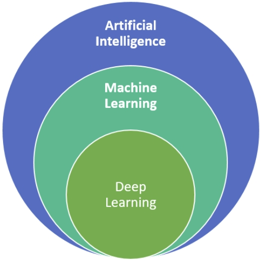

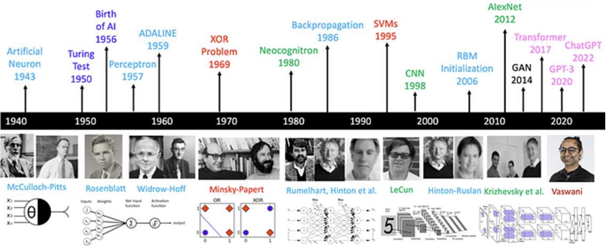

### Hızlı Sorular

1) MÖ'nün YZ içindeki yeri nedir?
2) Derin öğrenmeyi makine öğrenmesinden ayıran temel özellik nedir?
3) YZ'nin başlıca hedeflediği bilişsel kabiliyetlerden üçü hangileridir?

<a id="ml-vs-dl"></a>

## Makine Öğrenmesi vs Derin Öğrenme: Karşılaştırma

### Özet

- Makine Öğrenmesi (ML): İnsan tarafından tasarlanan özellikleri (feature engineering) kullanır; daha az veriyle ve daha basit modellerle iyi genelleme yapabilir.
- Derin Öğrenme (DL): Özellikleri ham veriden otomatik öğrenir (temsili öğrenme); çok veri ve hesaplama gücü ile üstün performans sağlar.

### İpuçları / Notlar

- Az veri + açıklanabilirlik önceliği: ML genellikle daha uygundur (lojistik regresyon, karar ağaçları, SVM, RF).
- Büyük veri + ham sinyaller (görüntü/ses/metin): DL (CNN/RNN/Transformer) uçtan uca temsillerle daha iyi sonuç verir.

### Hızlı Sorular

1) Hangi durumda elle özellik çıkarımı yerine otomatik temsili öğrenim tercih edilir?
2) Küçük veri kümelerinde aşırı öğrenmeyi azaltmak için hangi iki yaklaşımı kullanırsınız?

<a id="ml-dl-kavramlar"></a>

## ML vs DL: Kavramlar

- Makine Öğrenmesi (ML): Veriden örüntü öğrenen yöntemler ailesi; özellikler genellikle insan tarafından tanımlanır.
- Derin Öğrenme (DL): ML’nin alt alanı; çok katmanlı yapay sinir ağları ile özellikleri ve karar fonksiyonunu birlikte öğrenir.

<a id="ml-dl-ozellik"></a>

## ML vs DL: Özellik Çıkarımı

- ML: Özellik çıkarımı elle/uzman bilgisiyle yapılır.
    - Örnek (görüntü): Kenar, renk histogramı, doku tanımlayıcıları çıkarılıp SVM/LogReg’e verilir.
- DL: Özellik çıkarımı otomatik; ağ katmanları ham piksellerden kenar→doku→şekil→nesne hiyerarşisini kendisi öğrenir (CNN).

<a id="ml-dl-veri"></a>

## ML vs DL: Veri İhtiyacı

- ML: Az/orta ölçekli veri ile makul sonuçlar; küçük veriyle iyi genelleme potansiyeli.
- DL: Yüksek kapasite nedeniyle büyük veri (binlerce–milyonlarca örnek) gereksinimi; küçük veride overfitting riski yüksek, düzenlileştirme/aktar. öğrenme faydalıdır.

<a id="ml-dl-karmasiklik"></a>

## ML vs DL: Model Karmaşıklığı

- ML: Daha basit istatistiksel/öğrenme modelleri (Regresyon, Karar Ağacı, SVM, KNN, RF, GBM vb.). Parametre sayısı görece azdır.
- DL: Çok katmanlı sinir ağları (CNN, RNN/LSTM, Transformer vb.); parametre sayısı milyonlar–milyarlar olabilir.

<a id="ml-dl-donanim"></a>

## ML vs DL: Donanım ve Hesaplama

- ML: CPU çoğu zaman yeterlidir; eğitim genelde hızlıdır.
- DL: GPU/TPU gibi hızlandırıcılar gerektirir; eğitim daha uzun ve hesaplama yoğun olabilir.

<a id="ml-dl-uygulamalar"></a>

## ML vs DL: Uygulama Örnekleri

- Görüntü İşleme
    - ML: Elle çıkarılmış kenar/renk/doku + SVM/RF.
    - DL: CNN, ResNet, YOLO, U-Net.
- Doğal Dil İşleme
    - ML: TF-IDF/BoW + Naive Bayes/SVM.
    - DL: Transformer, BERT, GPT.
- Ses Tanıma
    - ML: MFCC + HMM/GM.
    - DL: RNN/LSTM, Wav2Vec, Conformer.
- Tıp/Biyomedikal
    - ML: Klinik tablolardan RF/GBM.
    - DL: Ultrason/MRI/CT analizi için CNN/U-Net; segmentasyon/sınıflandırma.

<a id="ai-tarihce-1943-2009"></a>

## Yapay Zekanın Tarihçesi (1943–2009)

### Özet

- Sinirsel hesaplama (McCulloch–Pitts) ile başlayan çizgi; perceptron, geri yayılım, CNN'ler, SVM, LSTM ve büyük veri kümeleri (ImageNet) ile ivme kazanmıştır.

### Zaman Çizelgesi (Seçme Başlıklar)

- 1943 — McCulloch & Pitts: Sinir ağlarına dayalı ilk matematiksel model; nöronlar mantık kapıları (AND/OR/NOT) gibi; ikili girdiler, eşik aşıldığında 1, aksi halde 0 üretir.
- 1950 — Alan Turing: Makine zekâsını tartışır; Turing Testi fikrini ortaya koyar.
- 1952 — Arthur Samuel: Dama için ilk makine öğrenmesi programı.
- 1957 — Frank Rosenblatt: Perceptron fikri; optik bir "beyin" inşası vizyonu.
- 1959 — Hubel & Wiesel: Görsel kortekste yalın ve karmaşık hücreler; yapay sinir ağlarına ilham.
- 1960 — Henry J. Kelley: Kontrol kuramı; AI ve sinir ağlarına uygulamalar.
- 1965 — Ivakhnenko & Lapa: İlk çalışan derin (çok katmanlı) öğrenme ağları.
- 1979–80 — Kunihiko Fukushima: Neocognitron; modern CNN'lere öncül mimari.
- 1982 — John Hopfield: Hopfield ağları; ilişkilendirilebilir bellek olarak tekrarlayan ağlar.
- 1985 — Terry Sejnowski: NETtalk; yazılı kelimelerin telaffuzunu öğrenir.
- 1986 — Rumelhart, Hinton, Williams: Geri yayılım (backpropagation) sürecinin ayrıntıları; eğitilebilir çok katmanlı ağlar.
- 1989 — Yann LeCun: CNN'lerle el yazısı rakam tanıma; çek/posta kodu okuma uygulamaları.
- 1993 — Jürgen Schmidhuber: Tekrarlayan sinir ağlarında derin öğrenme görevleri.
- 1995 — Cortes & Vapnik: Destek Vektör Makineleri (SVM); metin sınıflandırma, el yazısı tanıma vb.
- 1997 — Hochreiter & Schmidhuber: LSTM; RNN'lerde uzun bağımlılıkların öğrenilmesi.
- 1998 — Yann LeCun: Gradyan tabanlı öğrenmeye vurgu; derin öğrenmede tercih edilen yaklaşım.
- 2009 — Fei-Fei Li: ImageNet; etiketli büyük görsel veri tabanı ile derin öğrenmenin atılım zemini.

### Kavşak Noktaları (Detay)

- 1943: McCulloch–Pitts Nöronu
    - İkili girdileri toplayan eşik birimi; mantık kapılarıyla benzeşim.
    - Basit ama yapay sinir ağlarının temel soyut modeli.

- 1958: Rosenblatt'ın Perceptron Modeli
    - Tek nöronlu hesaplama modeli; ikili sınıflandırma yapar.
    - Basit bir eğitim algoritmasına sahiptir; donanım üzerinde de inşa edilmiştir.

- 1969: Minsky & Papert'in Eleştirisi
    - Perceptron'lar yalnızca doğrusal ayrılabilir fonksiyonları temsil eder; XOR örneğiyle sınırlılık.
    - Bu eleştiriler sıklıkla "AI Winter" ile ilişkilendirilse de, dönemsel finansman/ilgi düşüşünün tek nedeni değildir.

### Hızlı Sorular

1) Perceptron neden XOR problemini çözemiyor?
2) Geri yayılımın (1986) çok katmanlı ağlar için önemi nedir?
3) Hangi gelişme(ler) CNN'lerin pratik başarısını tetikledi (ipucu: Hubel & Wiesel, Neocognitron, LeCun)?

<a id="ai-1990lar"></a>

## 1990'lar: MLP, Backprop, BPTT, CNN, LSTM

### Özet

- 1990'larda çok katmanlı perceptronlar (MLP) ve geri yayılım (Backprop) ile teorik/pratik ilerlemeler yaşandı; RNN'ler için BPTT, CNN ve LSTM gibi mimariler tanıtıldı.

### Temel Noktalar

- Evrensel Yakınsama: Çok katmanlı perceptronlar yeterli genişlik/derinlikle herhangi bir sürekli fonksiyonu yaklaşıklar (Cybenko, 1989; Hornik, 1991).
- Eğitim Algoritmaları: Geriye Yayılım (Rumelhart, Hinton, Williams, 1986), Zaman Boyunca Geriye Yayılım (Werbos, 1988).
- Mimariler: CNN (LeCun ve ark., 1989) görüntülerde yerel duyarlılık ve paylaşımlı ağırlıklarla verimli; LSTM (Hochreiter & Schmidhuber, 1997) uzun-bağımlılık sorununu hafifletir.

### Hızlı Sorular

1) BPTT hangi problem sınıfı için gereklidir?
2) CNN'in iki temel fikrini sayın: yerel alıcı alanlar ve ...?
3) Neden LSTM, vanishing gradient sorununa bir çözüm sayılır?

<a id="dl-neden-zorlandi"></a>

## Erken Dönem: Neden Başarısız Oldu?

### Özet

- Veri ve hesaplama yetersizliği, el yapımı özelliklere bağımlılık ve optimizasyon/yorumlanabilirlik kaygıları nedeniyle derin ağlar uzun süre yaygınlaşamadı; SVM gibi yöntemler öne çıktı.

### Ana Gerekçeler

- Az Veride Çok Parametre: Etiketli örnek sayısı küçükken çok sayıda parametreyi öğrenmek zor; aşırı öğrenme (overfitting) riski yüksek.
- Büyük Veri ve GPU Eksikliği: Yaygın büyük veri kümeleri ve hızlandırıcı donanım (GPU) erişimi sınırlıydı; eğitim çok yavaştı.
- El Yapımı Özellikler: Dönemin yaklaşımı, hand-crafted feature'lar tasarlayıp klasik MÖ algoritmalarına vermekti; temsil öğrenimi zayıf kaldı.
- Dışbükey Olmayan Optimizasyon: Kayıp fonksiyonu çok tepe/çukur içerir; yerel minimumlara takılma ve eğitim kararsızlığı kaygıları.
- Yorumlanabilirlik: "Kara kutu" algısı güven sorunlarına yol açtı (tıp/finans gibi alanlarda).
- SVM'nin Başarısı: Dışbükey optimizasyon ve güçlü genelleme; az veriyle hızlı ve sağlam sonuçlar (Cortes & Vapnik, 1995).

### Notlar

- Non-konveksite tek başına engel değildir; iyi başlatma, normalizasyon ve optimizasyon teknikleriyle pratikte aşılabilir. Ancak 1990'larda ekosistem hazır değildi.

### Hızlı Sorular

1) Erken dönemde derin öğrenmeye karşı SVM neden cazipti?
2) El yapımı özellikler ile temsil öğrenimi arasındaki fark nedir?
3) Non-konveks optimizasyonda pratikte hangi teknikler yardımcı olur? (ipucu: initialization, normalization, optimizers)

<a id="lenet-1998"></a>

## Derin Öğrenme: LeNet (1998) ve CNN'ler

### Özet

- Yann LeCun ve ekibi 1998'de gradyan-temelli CNN (LeNet) ile el yazısı rakam tanımada yüksek başarı gösterdi; uygulamalar çek/posta kodu okumaya yayıldı.

### LeNet'in Temelleri

- Görev: 0–9 rakamlarının sınıflandırılması (MNIST benzeri).
- Çıktı: Her sınıf için olasılık tahmini; en yüksek olasılık etiket olarak seçilir.
- Yaklaşım: Evrişim + havuzlama + tam bağlı katmanlar; paylaşımlı ağırlıklar ve yerel alıcı alanlar ile parametre verimliliği.
- Ölçek: Yaklaşık ~60.000 parametre; dönem donanımı nedeniyle daha büyük problemlere ölçeklenmesi zordu.

### Neden Sınırlı Kaldı (O Dönem)?

- Düşük Hesaplama Kapasitesi: Geniş/deep CNN'lerin eğitimi pratik değildi; eğitim süreleri günler/haftalar sürebiliyordu.
- Veri Kıtlığı: Büyük, etiketli veri kümeleri sınırlıydı; genelleme güçleşiyordu.

### Notlar

Görseller:

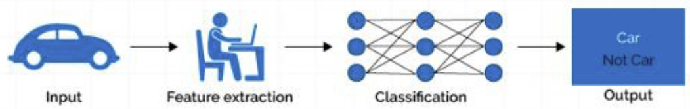

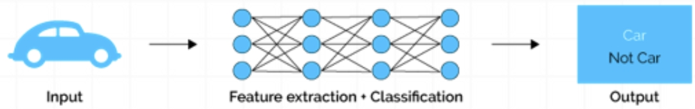

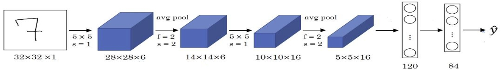

### Hızlı Sorular

1) LeNet'in iki ana bileşeni nedir (katman düzeyinde)?
2) Paylaşımlı ağırlıklar neden önemlidir?
3) 1998'de LeNet'in geniş ölçekli problemlerde sınırlı kalmasının iki nedeni?

Görseller:

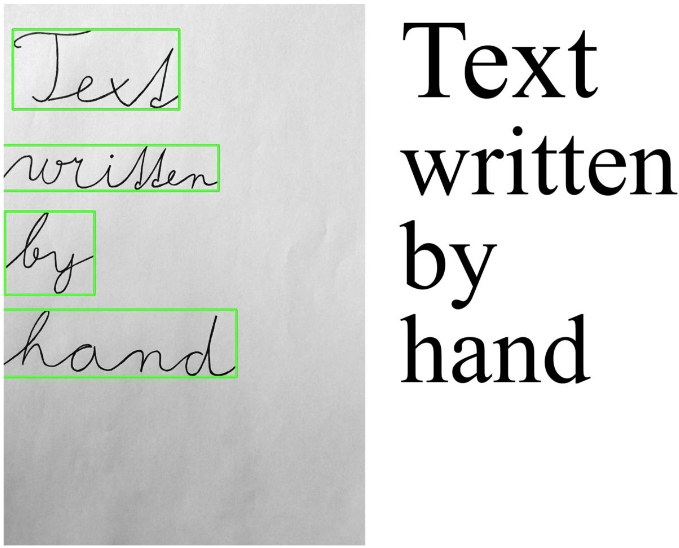

<a id="imagenet-ilsvrc"></a>

## ImageNet ve ILSVRC (2009–2012)

### Özet

- Derin öğrenmenin sıçrama yapması için hesaplama gücünün yanında geniş, etiketli veri setlerine ihtiyaç vardı. 2009'da küresel destekle oluşturulan ImageNet, bu ihtiyacı karşıladı.

### Temel Noktalar

- ImageNet (2009): 22 binin üzerinde kategori ve milyonlarca etiketli görüntü; geniş ölçekli görsel tanıma araştırmaları için standart.
- ILSVRC (2012): ImageNet tabanlı yıllık yarışma; sınıflandırma ve nesne tanıma görevleri için kıyaslama ortamı.

Görseller:

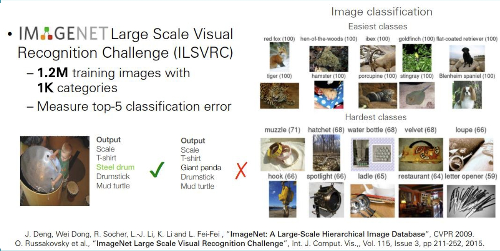

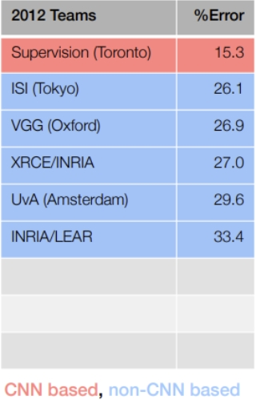

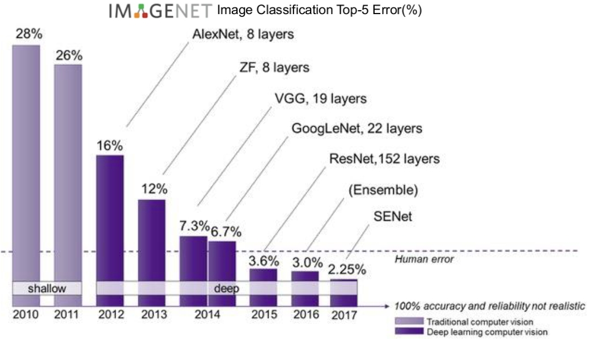

### Hızlı Sorular

1) Neden “büyük, etiketli veri” derin öğrenme için kritik?
2) ILSVRC’nin araştırma topluluğuna sağladığı iki fayda nedir?

Görseller:


<a id="alexnet-2012"></a>

## AlexNet (2012): Başarı ve Yenilikler

### Özet

- 2012 ILSVRC'de AlexNet’in başarısı, CNN ve derin öğrenmeye ilgiyi yeniden canlandırdı; mimari LeNet’e benzer olsa da derinlik, ölçek ve modern tekniklerle çarpıcı bir fark yarattı.

### Mimari ve Ölçek

- Katmanlar: 7 gizli katman (bazı max pooling katmanları sayılmazsa).
- Parametreler: ~60 milyon.

Görseller:

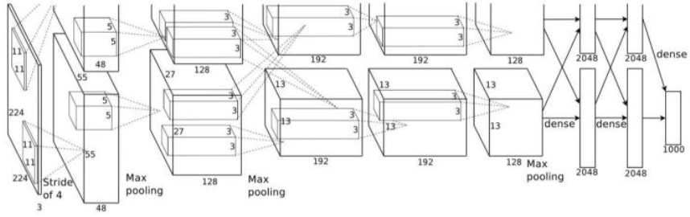

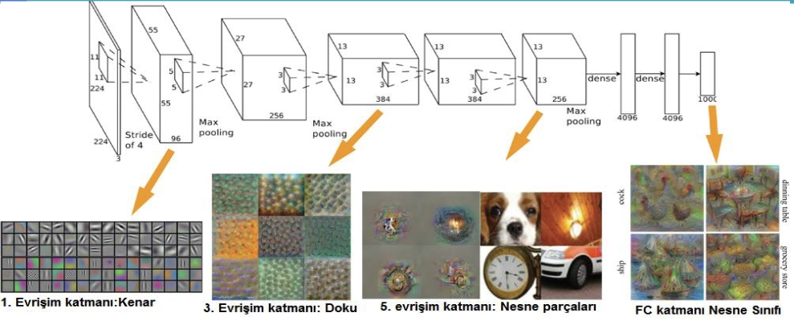

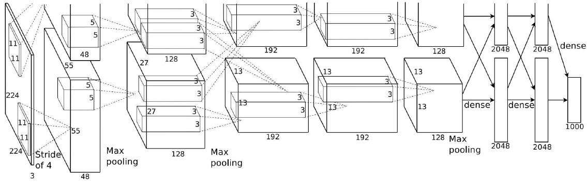
- Ekip: Alex Krizhevsky, Ilya Sutskever, Geoffrey Hinton.

### Öne Çıkan Teknikler

- ReLU aktivasyonları: Doğrusal doğrultulmuş birimler ile gradyanların sönüm sorunlarına karşı pratik avantaj.
- Veri artırma (data augmentation): Dönüşüm/bozulmalarla daha iyi genelleme.
- Dropout: Tam bağlı katmanlarda aşırı öğrenmeyi azaltma.

### Notlar

- LeNet ile benzer prensipler (evrişim + havuzlama + tam bağlı) daha derin ve geniş ölçekte uygulanmıştır.

### Hızlı Sorular

1) AlexNet’in başarısında en kritik iki düzenlileştirme tekniği nedir?
2) ReLU’nun sigmoid/tanh’a göre iki avantajını söyleyin.

<a id="alexnet-inference"></a>

### AlexNet: Torchvision ile Çıkarım (Güncel API)

- Mimari özeti: 8 katman (5×Conv + 3×FC), ≈60M parametre.
- 2012 ILSVRC’de geleneksel yöntemlere büyük fark atarak “ImageNet devrimini” başlatmıştır.

PyTorch/Torchvision’da önceden eğitilmiş AlexNet’i kullanmanın güncel yolu, ağırlık (weights) API’sidir. `pretrained=True` artık kullanımdan kalkmıştır (deprecated).

- Önerilen kullanım:
    - Ağırlıklar ve dönüştürmeler: `AlexNet_Weights.IMAGENET1K_V1`
    - Sınıf adları: `weights.meta['categories']`

Örnek (çıkarım):

```python
import torch
from PIL import Image
from torchvision.models import alexnet, AlexNet_Weights

# 1) Model ve ağırlıklar
weights = AlexNet_Weights.IMAGENET1K_V1
model = alexnet(weights=weights)
model.eval()

# 2) Dönüşümler (mean/std dahil)
preprocess = weights.transforms()

# 3) Görüntü oku ve hazırla
img = Image.open('OrnekResimler/kedi.jpg').convert('RGB')
batch = preprocess(img).unsqueeze(0)  # [1,3,224,224]

# 4) Cihaz (varsa GPU)
device = torch.device('cuda' if torch.cuda.is_available() else 'cpu')
model.to(device)
batch = batch.to(device)

with torch.no_grad():
        logits = model(batch)
        probs = torch.softmax(logits, dim=1)
        top_p, top_id = probs.topk(1, dim=1)

cls_name = weights.meta['categories'][top_id.item()]
print(f'Tahmin: {cls_name}  olasılık={top_p.item():.4f}')
```

Notlar:

- Eski örneklerde görülen `pretrained=True` yerine `weights=AlexNet_Weights.IMAGENET1K_V1` kullanın.
- Manuel `transforms.Normalize(mean=[0.485,0.456,0.406], std=[0.229,0.224,0.225])` doğru olsa da, `weights.transforms()` hatasız ve güncel ön-işlemeyi otomatik verir.
- Harici `imageNetClasses.txt` yerine `weights.meta['categories']` ile sınıf adlarını alın.

<a id="temsil-hiyerarsi"></a>

<a id="sota-models"></a>

## State-of-the-Art (SOTA) Modeller

### Özet

- SOTA (son teknoloji) modeller, belirli görevlerde mevcut en yüksek performanslı yaklaşımları temsil eder ve hem akademi hem endüstride yeni standartlar belirler.
- Kıyaslamalar (benchmarks) ve liderlik tabloları (leaderboards) SOTA’yı görünür kılar; SOTA dinamik olarak değişir.

### Rolü ve Bağlam

- Araştırma: Yeni mimari/öğrenme yöntemleri SOTA’yı iteratif olarak yukarı taşır (ör. CNN → ResNet → EfficientNet → Vision Transformers).
- Ürünleştirme: Veri/bütçe/kısıtlar altında SOTA yerine daha hafif modeller (MobileNet, EfficientNet-Lite) tercih edilebilir.

### Temsilî Aileler (Bilgisayarlı Görü)

- AlexNet (2012) → VGG/GoogLeNet (2014) → ResNet (2015) → DenseNet, Inception-v4
- MobileNet, ShuffleNet (mobil/edge)
- EfficientNet ailesi (ölçekleme prensipleri)
- Vision Transformer (ViT), Swin Transformer, ConvNeXt (CNN/Transformer hibritleri)

### Kaynaklar

- Torchvision önceden eğitilmiş modeller ve performansları: https://docs.pytorch.org/vision/main/models.html
    - Dokümantasyonda, her model için giriş boyutu, normalize değerleri, top-1/top-5 doğruluk ve `weights` kullanımı bulunur.

Görseller:

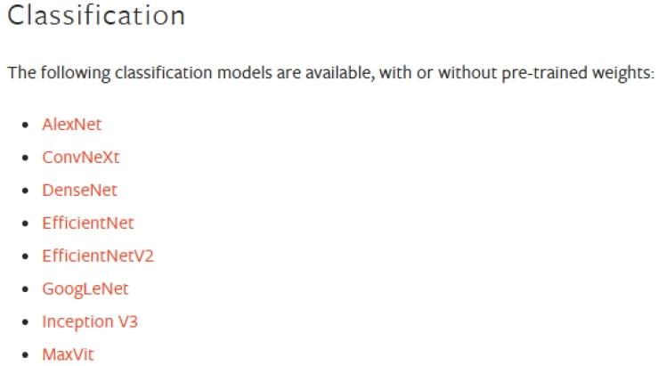

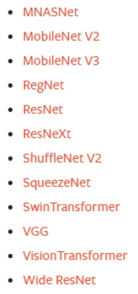

### Hızlı Sorular

1) Neden “en iyi doğruluk” her zaman “en iyi üretim modeli” değildir?
2) Torchvision’da bir modelin doğru ön-işlemesini otomatik almak için hangi API’yi kullanırsınız?

<a id="transfer-ogrenme"></a>

## Transfer Öğrenme: Genel Bakış

### Özet

- Transfer öğrenme, büyük ve çeşitli bir kaynak veri kümesinde (ör. ImageNet) önceden eğitilen bir modelin, hedef bir görev/veri kümesi için yeniden kullanılmasıdır.
- İki ana strateji vardır: Özellik Çıkarma (tüm ağı dondur, yalnızca son katmanı eğit) ve İnce Ayar (bazı/üst katmanları düşük LR ile yeniden eğit).

### Neden İşe Yarar?

- Alt katmanlar “genel” özellikleri (kenar, doku) öğrenir; üst katmanlar daha görev-özel temsiller taşır. Bu nedenle az veriyle de iyi performans sağlanabilir ve eğitim süresi kısalır.

Görseller:

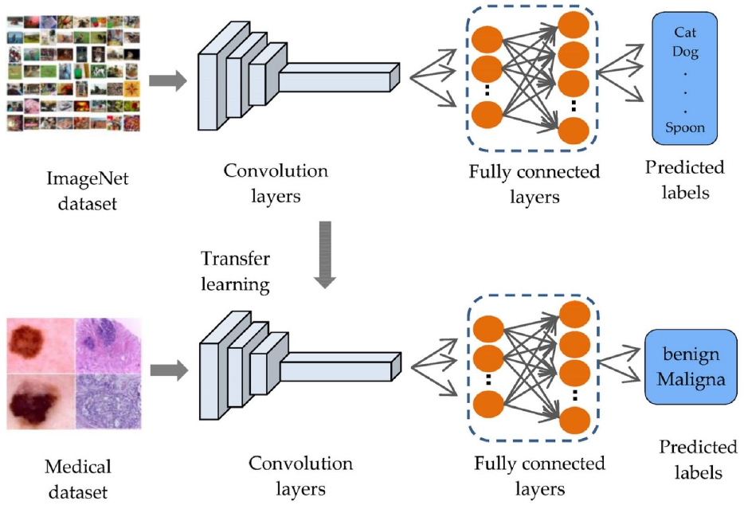

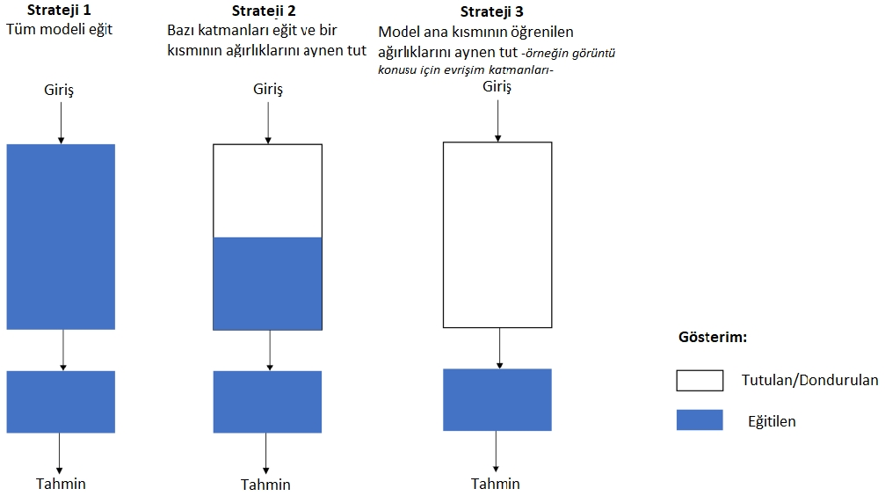

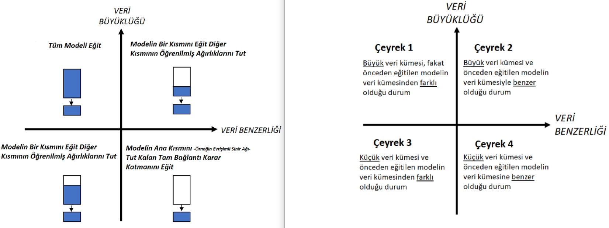

<a id="transfer-feature"></a>

## Transfer: Özellik Çıkarma (Feature Extraction)

- Önceden eğitilmiş modelin tüm katmanları dondurulur (`requires_grad=False`).
- Sadece son sınıflandırıcı katman (ör. `classifier[6]`) hedef sınıf sayısına uyacak şekilde yeniden tanımlanır ve eğitilir.
- Avantaj: Hızlı, aşırı öğrenme riski daha düşüktür. Dezavantaj: Hedef göreve uyum sınırlı kalabilir.

<a id="transfer-fine"></a>

## Transfer: İnce Ayar (Fine-Tuning)

- Önceden eğitilmiş ağın üst katmanları (veya son konvolüsyon bloğu) çözülür; düşük öğrenme oranı ile (ör. 10× daha küçük) yeniden eğitilir.
- Genellikle iki parametre grubu kullanılır: baş (classifier) için daha büyük LR, omurga (backbone) için daha küçük LR.
- Avantaj: Hedef göreve daha iyi uyum. Dezavantaj: Aşırı öğrenme riski ve eğitim maliyeti artar.

<a id="alexnet-transfer-data"></a>

## AlexNet → CIFAR-10: Veri ve Dönüşümler

- CIFAR-10 görüntüleri 32×32’dir; ImageNet ön-eğitimli ağı kullanmak için 224×224’e yeniden boyutlandırılır ve ImageNet istatistikleri ile normalize edilir.
- Torchvision’ın modern `weights` API’si, doğru ön-işlemeyi otomatik sağlayabilir.

Örnek (eğitim/validasyon dönüşümleri):

```python
from torchvision import datasets, transforms
from torch.utils.data import DataLoader
from torchvision.models import AlexNet_Weights

weights = AlexNet_Weights.IMAGENET1K_V1

train_tf = transforms.Compose([
    transforms.Resize(256),
    transforms.CenterCrop(224),
    transforms.RandomHorizontalFlip(),
    transforms.ToTensor(),
    transforms.Normalize(mean=weights.meta['mean'], std=weights.meta['std']),
])

test_tf = transforms.Compose([
    transforms.Resize(256),
    transforms.CenterCrop(224),
    transforms.ToTensor(),
    transforms.Normalize(mean=weights.meta['mean'], std=weights.meta['std']),
])

trainset = datasets.CIFAR10(root='./data', train=True, download=True, transform=train_tf)
testset  = datasets.CIFAR10(root='./data', train=False, download=True, transform=test_tf)

trainloader = DataLoader(trainset, batch_size=64, shuffle=True)
testloader  = DataLoader(testset,  batch_size=64, shuffle=False)
```

Not: Bazı örneklerde `testloader = DataLoader(trainset, ...)` hatası görülebilir; test loader’da `testset` kullanılmalıdır.

<a id="alexnet-transfer-model"></a>

## AlexNet → CIFAR-10: Model ve Dondurma/Çözme

Özellik çıkarma (yalnızca son katman eğitilir):

```python
import torch
import torch.nn as nn
from torchvision.models import alexnet, AlexNet_Weights

device = torch.device('cuda' if torch.cuda.is_available() else 'cpu')

weights = AlexNet_Weights.IMAGENET1K_V1
model = alexnet(weights=weights)

# Tüm ağı dondur
for p in model.parameters():
    p.requires_grad = False

# Sınıf sayısını 10’a uyarla
num_ftrs = model.classifier[6].in_features
model.classifier[6] = nn.Linear(num_ftrs, 10)
model = model.to(device)

criterion = nn.CrossEntropyLoss()
optimizer = torch.optim.Adam(model.classifier[6].parameters(), lr=1e-3)
```

İnce ayar (üst katmanları çöz, farklı LR’lar):

```python
# Önce herkesi dondur
for p in model.parameters():
    p.requires_grad = False

# Üst katmanları (ör. tüm classifier) çöz
for p in model.classifier.parameters():
    p.requires_grad = True

# (İsteğe bağlı) son konvolüsyon bloğunu çözmek için ad-hoc seçim yapılabilir
# Örn: for name, p in model.named_parameters():
#          if name.startswith('features.10'): p.requires_grad = True

# Parametre grupları: baş için daha büyük, omurga için daha küçük LR
head_params = filter(lambda p: p.requires_grad, model.parameters())
optimizer = torch.optim.SGD([
    { 'params': model.classifier.parameters(), 'lr': 1e-3 },
    # {'params': backbone_params, 'lr': 1e-4},  # omurga çözülürse ekleyin
], momentum=0.9)
```

<a id="alexnet-transfer-train-eval"></a>

## AlexNet Transfer: Eğitim ve Değerlendirme

Basit eğitim döngüsü:

```python
num_epochs = 5
for epoch in range(num_epochs):
    model.train()
    running_loss = 0.0
    for inputs, labels in trainloader:
        inputs, labels = inputs.to(device), labels.to(device)
        optimizer.zero_grad()
        outputs = model(inputs)
        loss = criterion(outputs, labels)
        loss.backward()
        optimizer.step()
        running_loss += loss.item()
    print(f"Epoch {epoch+1}, Loss: {running_loss/len(trainloader):.4f}")

model.eval()
correct = 0
total = 0
with torch.no_grad():
    for inputs, labels in testloader:
        inputs, labels = inputs.to(device), labels.to(device)
        outputs = model(inputs)
        _, pred = torch.max(outputs, 1)
        total += labels.size(0)
        correct += (pred == labels).sum().item()
print(f"Test Doğruluğu: {100.0*correct/total:.2f}%")
```

İpuçları / Notlar:

- Eğitimde `model.train()`, değerlendirmede `model.eval()` kullanın; `torch.no_grad()` bellek tasarrufu sağlar.
- İnce ayarda erken durdurma, ağırlık çürümesi (weight decay) ve daha uzun epoch sayısı genellikle faydalıdır.
- `pretrained=True` eski API’dır; artık `weights=AlexNet_Weights.IMAGENET1K_V1` kullanın.

<a id="vgg16"></a>

## VGG-16: Mimari ve Transfer

### Özet

- VGG (Visual Geometry Group), küçük 3×3 konvolüsyonları art arda kullanarak derinliğin performansa katkısını gösterdi. VGG-16/VGG-19 basit ve homojen bir mimariyle ResNet öncesi dönemin SOTA’sını belirledi.
- VGG-16, günümüzde de transfer öğrenme için güçlü ve sezgisel bir özellik çıkarıcıdır (ancak parametre ve hesaplama maliyeti yüksektir; ≈138M parametre).

Görseller:

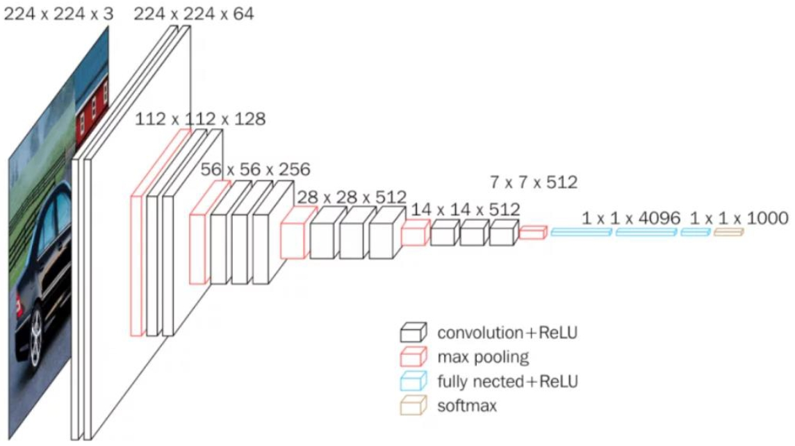

### Hızlı Notlar

- 3×3 filtreler + max-pooling blokları; sonunda büyük tam bağlı katmanlar (4096→4096→C).
- Derinlik artırma: Daha küçük çekirdeklerle daha derin ağlar ve daha fazla doğrusal olmayanlık.

### Kod: Son Katmanı Değiştir (CIFAR‑10)

```python
import torch.nn as nn
from torchvision.models import vgg16, VGG16_Weights

weights = VGG16_Weights.IMAGENET1K_V1
model = vgg16(weights=weights)
num_ftrs = model.classifier[6].in_features
model.classifier[6] = nn.Linear(num_ftrs, 10)
```

### Kod: Özel Sınıflandırıcı Bloğu

```python
import torch.nn as nn
from torchvision.models import vgg16, VGG16_Weights

weights = VGG16_Weights.IMAGENET1K_V1
model = vgg16(weights=weights)

num_ftrs = model.classifier[6].in_features  # 25088→4096 için ilk FC girişi 25088’dir
num_classes = 10
model.classifier = nn.Sequential(
    nn.Linear(num_ftrs, 4096), nn.ReLU(True), nn.Dropout(0.5),
    nn.Linear(4096, 4096),    nn.ReLU(True), nn.Dropout(0.5),
    nn.Linear(4096, num_classes),
)
```

İpuçları:

- `weights.transforms()` veya `Normalize(mean=weights.meta['mean'], std=weights.meta['std'])` ile doğru ön-işleme uygulayın.
- Özellik çıkarma için tüm ağı dondurup yalnızca `classifier`’ı eğitmek daha hızlıdır; ince ayarda `classifier` (ve gerekirse son konv bloğu) çözülür.

<a id="gradients-issues"></a>

## Derin Ağlarda Gradyan Sorunları

### Vanishing Gradient (Kaybolan Gradyan)

- Geri yayılımda gradyanlar derin katmanlara doğru küçülür, erken katmanlar güncellenemez; öğrenme durur veya çok yavaşlar.
- Sık sebepler: Sigmoid/tanh doygunluğu, çok derin ağlar, uygunsuz başlatma.

### Exploding Gradient (Patlayan Gradyan)

- Gradyanlar aşırı büyür; güncellemeler kararsız, loss dalgalı olur; ağırlıklar aşırı büyüyebilir.

### Çözüm Yöntemleri

- Aktivasyon: ReLU/LeakyReLU/ELU.
- Normalizasyon: BatchNorm/LayerNorm.
- Yapısal: Residual (skip) bağlantılar (ResNet).
- Optimizasyon: Uygun LR, LR planları, gradient clipping, ağırlık başlatma (He/Xavier).

<a id="resnet"></a>

## ResNet: Residual Bağlantılar

### Özet

- 2015 (He ve ark.): Skip connection ile girdi, birkaç katman sonrası çıktıya toplanır (y = F(x) + x). Gradyan akışı kolaylaşır; çok daha derin ağlar (50/101/152) eğitilebilir.

Görseller:

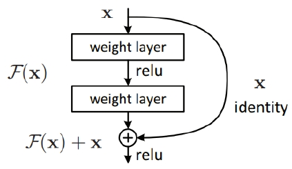

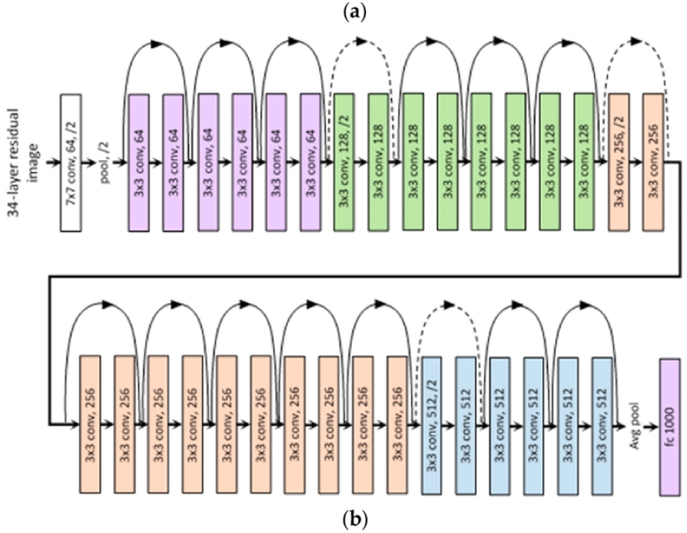

### Kod: ResNet-50 Transfer (CIFAR‑10)

```python
import torch.nn as nn
from torchvision.models import resnet50, ResNet50_Weights

weights = ResNet50_Weights.IMAGENET1K_V1
model = resnet50(weights=weights)
for p in model.parameters():
    p.requires_grad = False
num_ftrs = model.fc.in_features
model.fc = nn.Linear(num_ftrs, 10)
```

<a id="inception-googlenet"></a>

## Inception (GoogLeNet): Inception Modülü

### Özet

- 1×1, 3×3, 5×5 konv ve pooling’i paralel uygular; çıktılarını birleştirir. Farklı ölçeklerde özellikleri aynı katmanda yakalar; hesaplamayı 1×1 “bottleneck” ile düşürür.

Görseller:

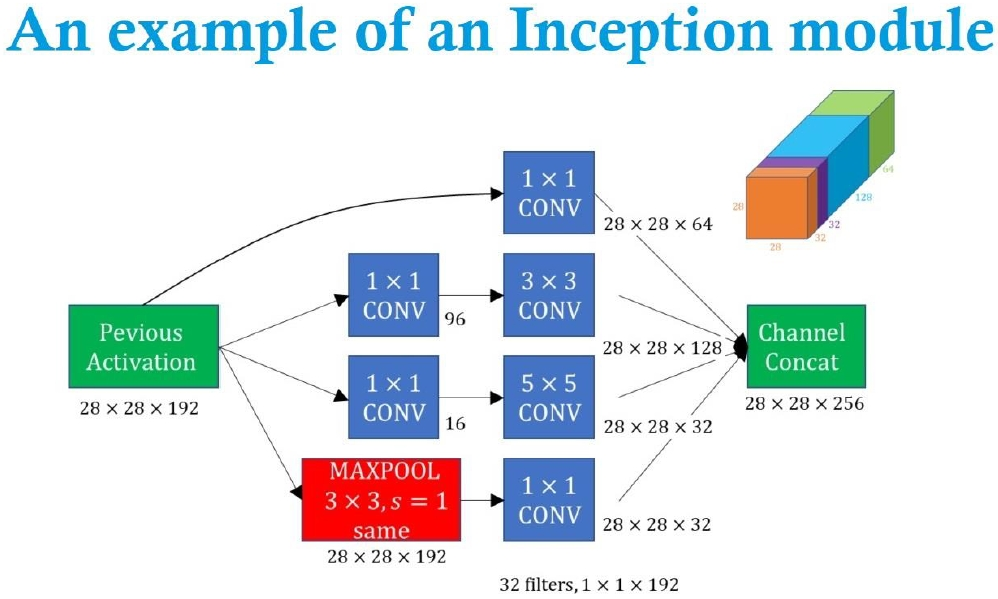

### Kod: Inception v3 Transfer (CIFAR‑10)

```python
import torch.nn as nn
from torchvision.models import inception_v3, Inception_V3_Weights

weights = Inception_V3_Weights.IMAGENET1K_V1
model = inception_v3(weights=weights, aux_logits=False)
for p in model.parameters():
    p.requires_grad = False
num_ftrs = model.fc.in_features
model.fc = nn.Linear(num_ftrs, 10)
# Not: Inception v3 varsayılan giriş boyutu 299'dur; weights.transforms() kullanın.
```

<a id="mobilenet"></a>

## MobileNet: Hafif Mimariler

### Özet

- Depthwise separable convolution ile parametre ve FLOP maliyetini büyük ölçüde azaltır; mobil/gömülü cihazlarda verimlidir (MobileNetV1/V2, ShuffleNet benzer amaçta).

### Kod: MobileNetV2 Transfer (CIFAR‑10)

```python
import torch.nn as nn
from torchvision.models import mobilenet_v2, MobileNet_V2_Weights

weights = MobileNet_V2_Weights.IMAGENET1K_V1
model = mobilenet_v2(weights=weights)
for p in model.parameters():
    p.requires_grad = False
num_ftrs = model.classifier[1].in_features
model.classifier[1] = nn.Linear(num_ftrs, 10)
```

<a id="efficientnet"></a>

## EfficientNet: Bileşik Ölçeklendirme

### Özet

- Compound scaling: Derinlik, genişlik ve çözünürlüğü dengeli birlikte ölçekler. MBConv + SE blokları ve Swish/SiLU aktivasyonları kullanır; yüksek doğruluk/verim dengesi sunar.

### Kod: EfficientNet‑B0 Transfer (CIFAR‑10)

```python
import torch.nn as nn
from torchvision.models import efficientnet_b0, EfficientNet_B0_Weights

weights = EfficientNet_B0_Weights.IMAGENET1K_V1
model = efficientnet_b0(weights=weights)
for p in model.parameters():
    p.requires_grad = False
num_ftrs = model.classifier[1].in_features
model.classifier[1] = nn.Linear(num_ftrs, 10)
```

### Hızlı Sorular

1) VGG’nin basit/homojen yapısının iki avantajı nedir, iki dezavantajı nedir?
2) Vanishing gradient’e karşı üç pratik çözüm söyleyin.
3) ResNet’in “y = F(x) + x” fikri neden derinleşmeyi kolaylaştırır?
4) Inception modülünde 1×1 konv’un rolü nedir?
5) MobileNet ve EfficientNet’in verimlilik yaklaşımları nasıl farklıdır?

<a id="overfitting"></a>

## Aşırı Öğrenme (Overfitting): Tanım ve Belirtiler

### Tanım

- Modelin eğitim verisini ezberleyip gürültüyü de öğrenmesi; yeni (görmediği) veride düşük performans göstermesidir. Genelleme zayıftır.
- Analojisi: Soruları cevaplarıyla ezberleyen öğrenci, farklı soruda başarısız olur.

### Nasıl Anlarız?

- İyi durum: Eğitim ve doğrulama hatası birlikte düşer.
- Overfitting: Eğitim hatası düşmeye devam ederken, doğrulama hatası artmaya başlar (ayrışma/boşluk büyür).

Görseller:

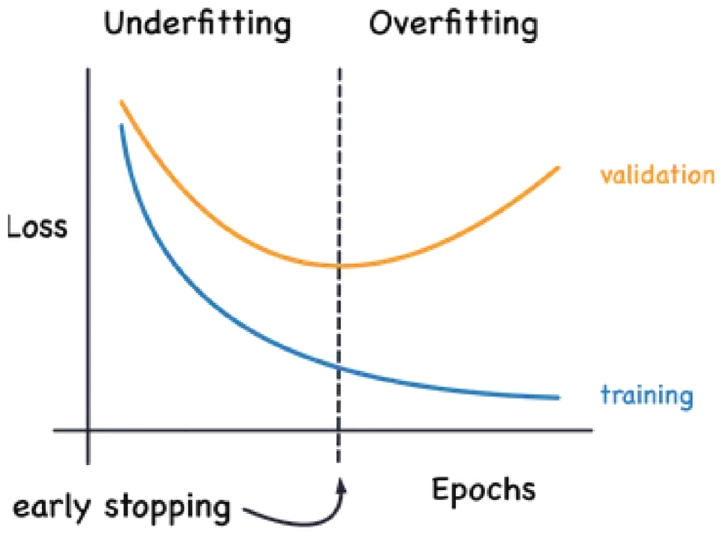

<a id="train-val-test"></a>

## Train/Validation/Test: Neden ve Nasıl?

- Hedef genellemedir; modelin görmediği verideki başarısını ölçmek için veri üçe ayrılır:
  1) Eğitim (%60–80): Öğrenme için kullanılır; ağırlıklar bu veriye göre güncellenir.
  2) Doğrulama (%10–20): Eğitim sırasında hiperparametre seçimi ve overfitting tespiti için kullanılır (öğrenme yoktur).
  3) Test (%10–20): Tüm ayarlardan sonra nihai, tarafsız değerlendirme için bir kez bakılır.

  Görseller:

  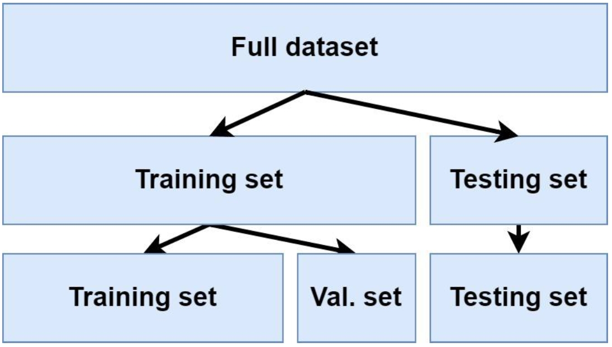

<a id="validation-role"></a>

## Validation Seti: Rol ve Hiperparametre Ayarı

- Overfitting tespiti: Eğitim loss’u düşerken validasyon loss’unun artması ezberlemeye işaret eder.
- Hiperparametreler: LR, katman/nöron sayısı, dropout oranı vb. Validasyon setinde karşılaştırılıp seçilir.

<a id="validation-cifar10"></a>

## Validation Seti: CIFAR-10 Örnek (random_split)

```python
import torch
from torch.utils.data import random_split, DataLoader
import torchvision
from torchvision import transforms

transform = transforms.Compose([
    transforms.Resize(256), transforms.CenterCrop(224),
    transforms.ToTensor(),
    transforms.Normalize(mean=[0.485,0.456,0.406], std=[0.229,0.224,0.225])
])

full_train = torchvision.datasets.CIFAR10(root='./data', train=True, download=True, transform=transform)
test_set   = torchvision.datasets.CIFAR10(root='./data', train=False, download=True, transform=transform)

total = len(full_train)
val_size = int(total * 0.2)
train_size = total - val_size

# Deterministik bölme için seed
g = torch.Generator().manual_seed(42)
train_set, val_set = random_split(full_train, [train_size, val_size], generator=g)

train_loader = DataLoader(train_set, batch_size=32, shuffle=True)
val_loader   = DataLoader(val_set,   batch_size=32, shuffle=False)
test_loader  = DataLoader(test_set,  batch_size=32, shuffle=False)
```

Notlar:

- Augmentation yalnızca eğitim setine uygulanır; validasyon/test için deterministik dönüşümler (Resize/CenterCrop/Normalize) kullanılır.
- Aynı bölmeyi tekrarlamak için seed sabitlenmelidir.

<a id="overfitting-causes"></a>

## Aşırı Öğrenmenin Nedenleri

1) Yetersiz/temsili olmayan veri → çeşitlilik az, gürültü ezberlenir.
2) Aşırı karmaşık model (yüksek kapasite) → gürültü dâhil her şeyi temsil eder.
3) Çok uzun eğitim (over‑training) → eğitim seti tekrar tekrar görülür, ezber artar.

<a id="overfit-prevent-data"></a>

## Aşırı Öğrenmeyi Önleme: Veri Odaklı

- Daha fazla veri toplamak (en etkili ama zorlu yol).
- Veri artırma (data augmentation): Döndürme, kırpma, flip, renk/parlaklık oynamaları.

Genişletilmiş eğitim augmentasyonu örneği (görselleştirme amaçlı):

```python
from torchvision import transforms

visualization_tf = transforms.Compose([
    transforms.RandomResizedCrop(224, scale=(0.5, 1.0)),
    transforms.RandomHorizontalFlip(p=0.5),
    transforms.RandomRotation(degrees=30),
    transforms.ColorJitter(brightness=0.2, contrast=0.2, saturation=0.2),
])
```

<a id="overfit-prevent-model"></a>

## Aşırı Öğrenmeyi Önleme: Model Odaklı

- Kapasiteyi düşürmek: Daha az katman/nöron.
- Transfer öğrenme: Büyük veriyle ön-eğitilmiş ağların özelliklerini yeniden kullanmak.

<a id="regularization"></a>

## Düzenlileştirme: Dropout, L1/L2 (Weight Decay)

### Dropout

```python
import torch.nn as nn

model_with_dropout = nn.Sequential(
    nn.Linear(784, 128), nn.ReLU(), nn.Dropout(p=0.5),
    nn.Linear(128, 10),  # CrossEntropyLoss ile Softmax eklemeyin (logits beklenir)
)
```

Not: CrossEntropyLoss kullanıyorsanız çıkışta Softmax uygulamayın; NLLLoss kullanıyorsanız LogSoftmax gerekir.

Görseller:


### L2 (Weight Decay)

```python
import torch.optim as optim

optimizer = optim.Adam(model_with_dropout.parameters(), lr=1e-3, weight_decay=1e-2)
```

### L1 (Elle ekleme)

```python
l1_lambda = 5e-3
base_loss = criterion(outputs, targets)
l1_norm = sum(p.abs().sum() for p in model.parameters())
loss = base_loss + l1_lambda * l1_norm
```

<a id="earlystop-bn"></a>

## Erken Durdurma ve Batch Normalization

### Erken Durdurma (patience=5 örneği)

```python
best_val = float('inf')
patience, wait = 5, 0
best_state = None
for epoch in range(100):
    train_one_epoch(...)
    val_loss = evaluate_val(...)
    if val_loss < best_val - 1e-4:
        best_val, wait = val_loss, 0
        best_state = {k: v.cpu() for k, v in model.state_dict().items()}
    else:
        wait += 1
        if wait >= patience:
            break
# En iyi ağırlıkları yükle
model.load_state_dict(best_state)
```

Görseller:

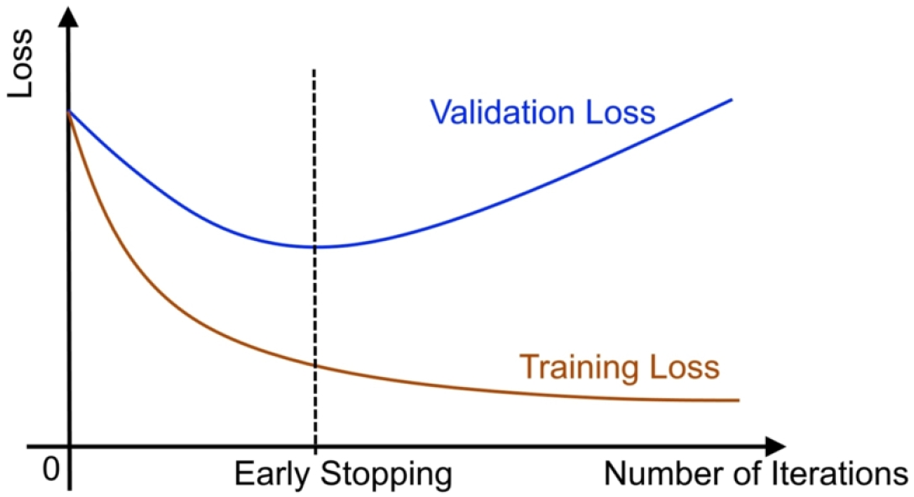

### Batch Normalization

- Conv için `nn.BatchNorm2d(C)`, Linear için `nn.BatchNorm1d(D)`.
- Eğitimde `model.train()` modunda mini‑batch istatistikleri; değerlendirmede `model.eval()` modunda running istatistikler kullanılır.

<a id="assignment-transfer"></a>

## Uygulama: Transfer Öğrenme Kıyaslama Görevi

Görev: Verilen çiçekler (veya yüz/yaş) veri setinde en az üç SOTA modelle transfer öğrenme yapıp karşılaştırın.

Koşullar (özet):

Görseller:

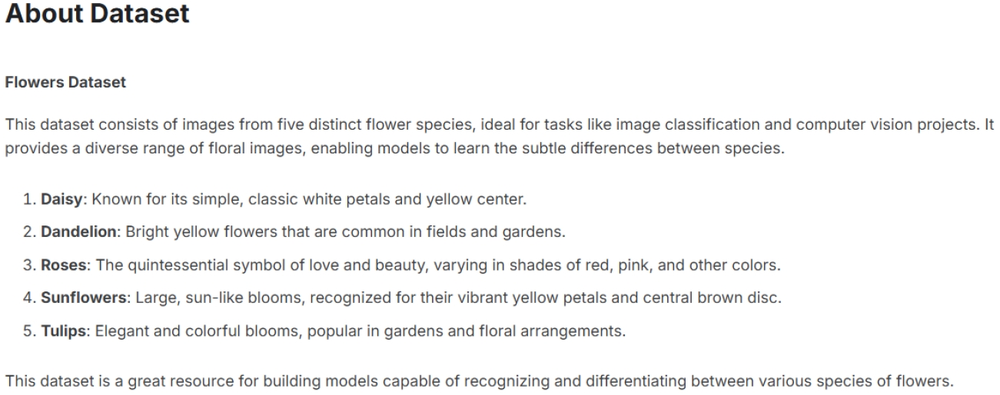

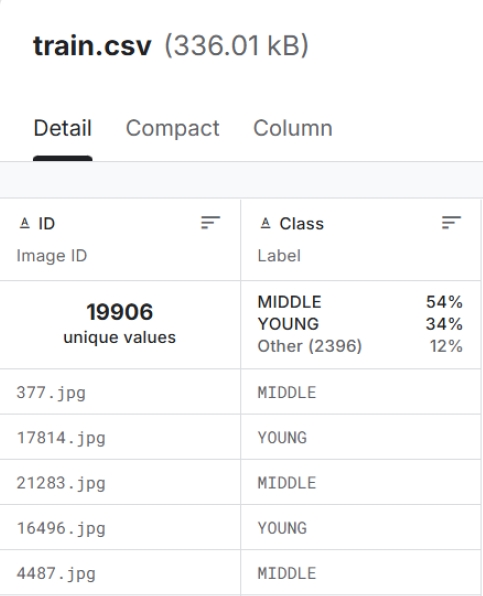

1) Modeller: MobileNetV3, InceptionV3, EfficientNet‑B0.
2) Eğitim/test fonksiyonlarını yeniden kullanılabilir yazın (model bağımsız).
3) Bölme: %80 eğitim / %10 doğrulama / %10 test; sabit random_seed ile tekrarlanabilir bölme.
4) Hiperparametreler: batch_size=32, lr=0.001.
5) Veri artırımı: Eğitimde uygulayın; val/test deterministik dönüşümler.
6) Erken durdurma: 5 adımda validasyon kaybı iyileşmezse durdurun.
7) Kayıt: Her model için ayrı klasörde loss/acc eğrileri, karışıklık matrisi, metrikler ve loglar.
8) En iyi modelin ağırlıklarını kaydedin.
9) Her model için yeni bir classifier başı tasarlayın (Linear + Dropout [+ BatchNorm1d opsiyonel]).
10) Sonuçları rapor edin ve en iyi modeli belirtin.

## Hiyerarşik Temsil Öğrenimi

### Özet

- Derin ağlar, girdilerden katmanlar boyunca giderek daha soyut ve ayrıştırıcı temsiller öğrenir: pikseller → kenarlar/dokular → şekiller/desenler → nesneler/konseptler.

### Katmanlara Göre Örnekler

- Alt katmanlar: Kenarlar, dokular, basit renk/geometrik motifler.
- Orta katmanlar: Basit şekiller ve birleşik desenler.
- Üst katmanlar: Nesne parçaları ve yüksek düzey semantik özellikler (ör. yüz parçaları).

Görseller:

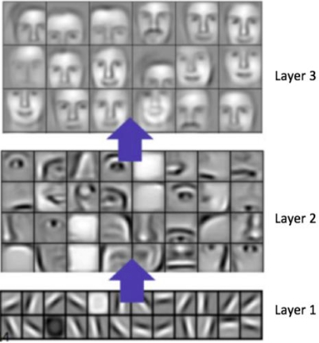

### Hızlı Sorular

1) Neden “özellik mühendisliği” yerine “temsili öğrenim” daha avantajlı olabilir?
2) Paylaşımlı ağırlıklar ve yerel alıcı alanlar, hiyerarşik temsile nasıl katkı sağlar?

<a id="dl-problemleri"></a>

## Derin Öğrenmede Zorluklar: Non-konveksite ve Rastsallık

### Özet

- Derinlik ≥ 3 olduğunda kayıp fonksiyonları genellikle dışbükey değildir; teorik garantiler zayıflar ve eğitim süreci başlangıçlara/hyperparametrelere duyarlı hale gelir.

### Temel Noktalar

- Non-konveks optimizasyon: Çoklu yerel minimumlar/eylemsiz bölgeler; farklı başlangıçlar farklı çözümlere götürebilir.
- Rastsallık: Stokastik süreçler (mini-batch sırası, dropout maskeleri vb.) sonuçlarda değişkenliğe neden olur.

### Hızlı Sorular

1) Non-konveks optimizasyonda pratikte hangi stratejiler kullanılır? (ipucu: iyi başlatma, öğrenme oranı planları, momentum/Adam, normalizasyon)
2) Neden aynı model farklı tohumlarla farklı sonuçlar verir?

<a id="pipeline-vs-e2e"></a>

## Boru Hatları vs Uçtan Uca Sistemler

### Özet

- Pipeline sistemlerde her adım ayrı değerlendirilir ve hata kaynağı kolay izole edilir; uçtan uca sistemlerde performans yüksek olabilir fakat neden/niçin çalışmadığını teşhis zorlaşır.

### Notlar

- Pipeline: Özellik çıkarma → modelleme → karar; adım başına metriklerle teşhis.
- Uçtan uca: Ham girdiden çıktıya tek model; hata analizinde açıklanabilirlik ek araçlar gerektirir.

### Hızlı Sorular

1) Hangi senaryolarda pipeline tercih edilir, hangilerinde uçtan uca?
2) Uçtan uca sistemlerde yorumlanabilirliği artırmak için iki yöntem söyleyin.

<a id="ann-intro"></a>

## Yapay Sinir Ağları: Tanım ve Bileşenler

### Özet

- Yapay Sinir Ağları (YSA), biyolojik sinir sistemlerinden esinlenen ve zekâ/öğrenme yetilerini taklit etmeyi amaçlayan hesaplama modelleridir. Temelinde sinir hücrelerinin (nöron) matematiksel olarak modellenmesi yatar.

### Temel Kavramlar

- Nöron: Ağırlıklı girişlerin toplandığı ve bir aktivasyon fonksiyonundan geçirildiği temel hesaplama birimi.
- Katmanlar: Girdi katmanı → gizli katman(lar) → çıktı katmanı; derinlik arttıkça temsil gücü artar.
- Bağlantılar ve Ağırlıklar: Öğrenmenin gerçekleştiği parametreler; gradyan temelli yöntemlerle güncellenir.

### Notlar

Görseller:

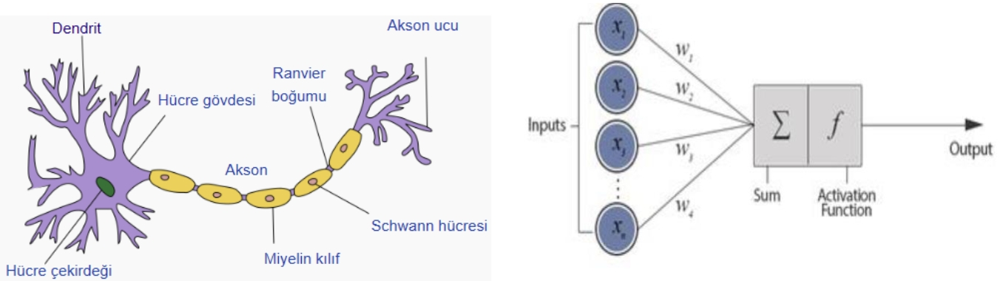

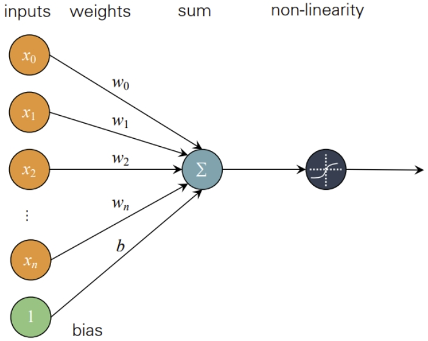

### Hızlı Sorular

1) Bir YSA’nın üç temel bileşeni nedir?
2) Derinlik neden temsil gücünü artırır?

<a id="neuron-activation"></a>

## Nöron Aktivasyonu ve Hesaplama

### Özet

- Bir nöron, giriş vektörünü ağırlıklarla çarpar, bias ekler ve sonucu bir aktivasyon fonksiyonundan geçirir: $a = w^\top x + b$, $y = h(a)$.

### Detaylar

- Ağırlıklı Toplam: $a = \sum_i w_i x_i + b$.
- Aktivasyon: $y = h(a)$; $h(\cdot)$ genellikle doğrusal olmayan bir fonksiyondur.
- Kesinlikle Artan Fonksiyon: $x_1 < x_2$ ise $g(x_1) < g(x_2)$ (kararı korur; türevi negatif değildir).

Görseller:

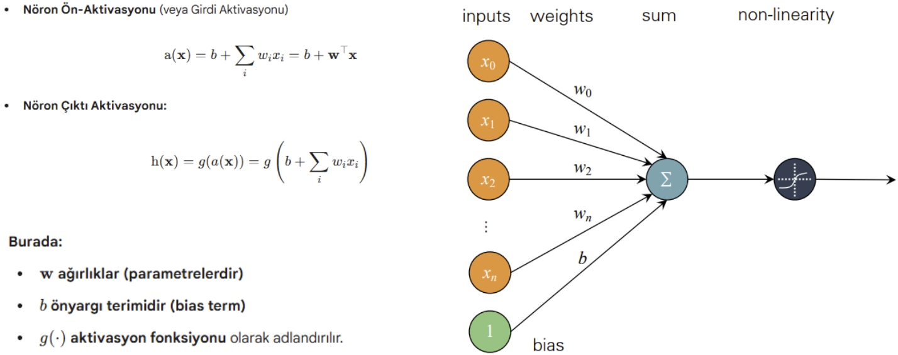

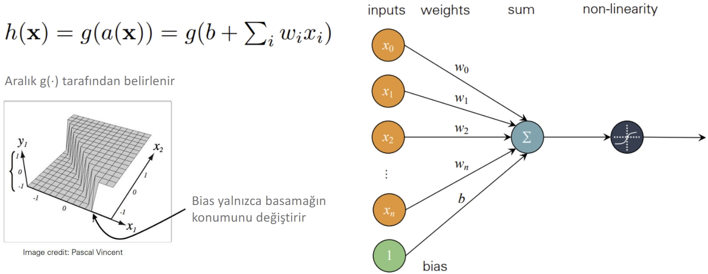

### Hızlı Sorular

1) Neden doğrusal olmayan aktivasyonlara ihtiyaç duyarız?
2) Ağırlıklı toplamın önüne normalizasyon eklemek neyi iyileştirir?

<a id="activation-functions"></a>

## Aktivasyon Fonksiyonları: Lineer, Sigmoid, Tanh, ReLU

### Özet

- Aktivasyon seçimi optimizasyonu, temsil gücünü ve genelleme kapasitesini etkiler. Yaygın seçenekler: lineer, sigmoid, tanh, ReLU.

### Tanımlar ve Özellikler

- Lineer: $f(x) = x$. Derin ağlarda yalnızca lineer kullanılırsa tüm ağ yine lineer olur (temsil gücü sınırlı).
- Sigmoid: $\sigma(x) = \frac{1}{1 + e^{-x}}$. Aralık $(0,1)$; doygunluk bölgelerinde gradyan sönümlenir; sıfır merkezli değildir.
- Tanh: $\tanh(x) = \frac{e^{x} - e^{-x}}{e^{x} + e^{-x}}$. Aralık $(-1,1)$; sıfır merkezli; yine doygunluklarda gradyan zayıflar.
- ReLU: $\mathrm{ReLU}(x) = \max(0,x)$. Hesaplama olarak ucuz; seyreklik üretir; üst sınır yok; “ölü ReLU” riski (gradyan 0’a kilitlenebilir).

Görseller:

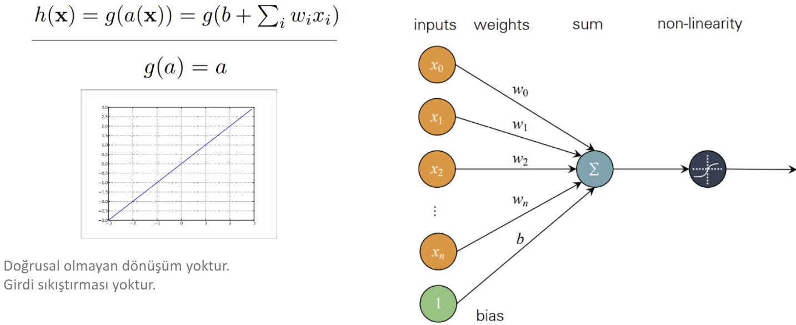

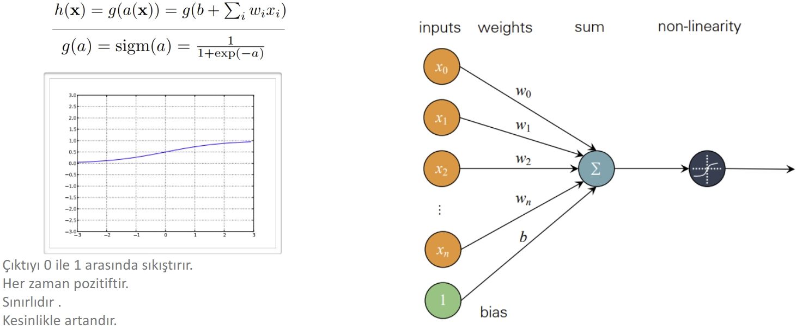

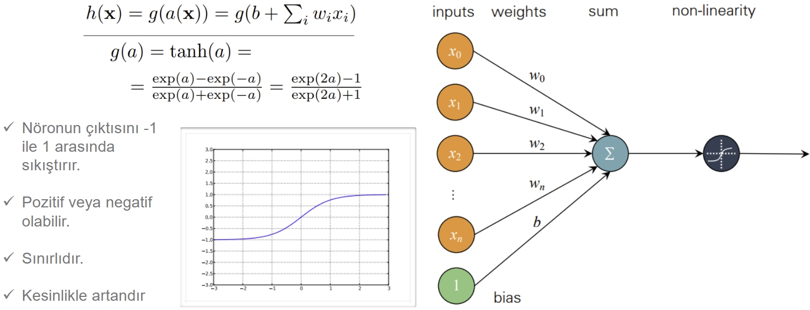

### İpuçları

- Derin ağlarda ReLU-türevleri pratikte daha hızlı ve stabildir; sigmoid/tanh genelde sınırlı katmanlarda tercih edilir veya dikkatli başlatma/normalizasyonla kullanılır.

### Hızlı Sorular

1) Sigmoid ve tanh’ın ortak dezavantajı nedir?
2) ReLU’nun iki pratik avantajını sayın.

<a id="relu-sparsity"></a>

## ReLU ve Seyrek Aktivite

### Özet

- ReLU, negatif girdilerde sıfır çıktısı üreterek birçok nöronu pasif bırakır; bu “seyrek aktivite” hem hesaplamayı hızlandırır hem de daha ayırt edici temsillere katkıda bulunur.

### Mekanizma

- Tanım: $f(x) = \max(0, x)$.
- İleri Yayılım: $x < 0$ iken çıktı $0$; bir sonraki katmana bilgi taşınmaz.

Görseller:

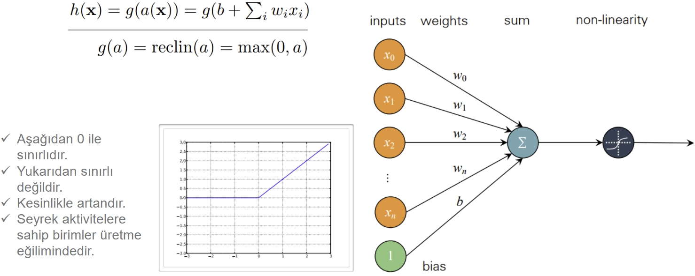
- Geri Yayılım: Pasif nöron gradyan almaz; etkili parametre sayısı azalır (düzenlileştirici etki).

### Neden Önemli?

- Hız: Sıfır çıktılar sonraki katmanlarda hesaplama yükünü düşürür.
- Temsil: Biyolojik sistemlerde de gözlenen seyreklik, daha bilgi-zengin ve ayrıştırıcı temsil ile ilişkilidir.

### Hızlı Sorular

1) ReLU’nun “seyrek aktivite” üretmesi neden hesaplamayı hızlandırır?
2) ReLU’da “ölü nöron” problemi nedir ve nasıl azaltılabilir? (ipucu: He init, Leaky ReLU, uygun LR)

<a id="perceptron-forward"></a>

## Perceptron: İleri Yayılım

### Özet

- Perceptron tek katmanlı bir doğrusal sınıflandırıcıdır; girişlerin ağırlıklı toplamını alır ve bir aktivasyon fonksiyonundan geçirir.

### Formül (Tek Çıkış)

- Giriş $x \in \mathbb{R}^d$, ağırlık $w \in \mathbb{R}^d$, bias $b \in \mathbb{R}$.
- Ön-aktivasyon: $a = w^\top x + b$.
- Çıkış: $\hat{y} = h(a)$.

### Formül (Çoklu Çıkış / C sınıf)

- Ağırlık matrisi $W \in \mathbb{R}^{C \times d}$, bias $b \in \mathbb{R}^C$.
- Logitler: $a = W x + b$.
- Sınıflandırmada tipik olarak $h$ olarak softmax kullanılır: $\hat{y} = \mathrm{softmax}(a)$.

### Hızlı Sorular

1) Perceptron’da aktivasyon fonksiyonu doğrusal olursa ne olur?
2) Çoklu çıkış durumunda neden vektör bias gerekir?

<a id="softmax"></a>

## Softmax Aktivasyonu ve Özellikleri

### Özet

- Çok sınıflı sınıflandırmada her sınıf için koşullu olasılık $P(c\mid x)$ tahmini üretir. Çıkış bileşenleri pozitiftir ve toplamları $1$’dir.

### Tanım

$$\mathrm{softmax}(a)_i = \frac{\exp(a_i)}{\sum_{c=1}^{C} \exp(a_c)} \quad \text{veya} \quad \mathbf{o}(\mathbf{a}) = \left[\frac{\exp(a_1)}{\sum_c \exp(a_c)},\dots,\frac{\exp(a_C)}{\sum_c \exp(a_c)}\right]^\top$$

### Özellikler

- Pozitiflik: $\mathrm{softmax}(a)_i > 0$.
- Toplam Bir: $\sum_i \mathrm{softmax}(a)_i = 1$.
- Tahmin: $\arg\max_i \, \mathrm{softmax}(a)_i$ en olası sınıf.

### İpuçları

- Sayısal Kararlılık: $\mathrm{softmax}(a) = \mathrm{softmax}(a - \max(a))$ (log-sum-exp hilesi) ile taşmaları önleyin.
- Sıcaklık (opsiyonel): $\mathrm{softmax}(a/T)$; $T>1$ daha düz, $T<1$ daha keskin dağılım verir.

### Hızlı Sorular

1) Neden softmax’e girmeden önce logitlerden $\max(a)$ çıkarılır?
2) $T$ sıcaklığı artırıldığında dağılım nasıl değişir?

<a id="one-hidden-layer"></a>

## Tek Gizli Katmanlı Sinir Ağı

### Özet

- Girişten gizli katmana doğrusal dönüşüm + doğrusal olmayan aktivasyon, ardından çıktı katmanına doğrusal dönüşüm ve sınıflandırmada softmax.

### Formül ve Boyutlar

- Giriş $x \in \mathbb{R}^d$.
- Gizli katman: $z = W_1 x + b_1$, $h = \phi(z)$, burada $W_1 \in \mathbb{R}^{m \times d}$, $b_1 \in \mathbb{R}^m$.
- Çıkış (logit): $a = W_2 h + b_2$, burada $W_2 \in \mathbb{R}^{C \times m}$, $b_2 \in \mathbb{R}^C$.
- Sınıflandırma: $\hat{y} = \mathrm{softmax}(a)$.

### Notlar

- Gizli aktivasyon $\phi$ olarak ReLU/tanh/sigmoid seçilebilir; pratikte çoğunlukla ReLU-türevleri kullanılır.
Görseller:

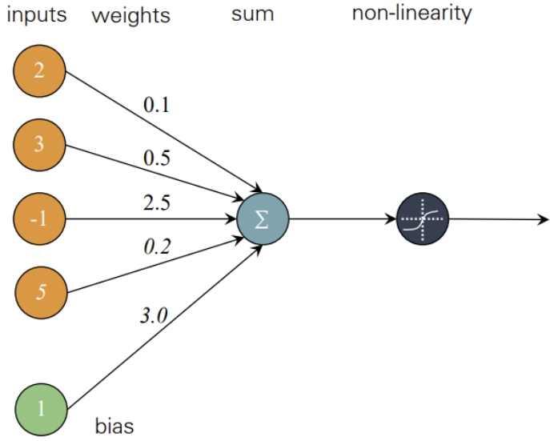

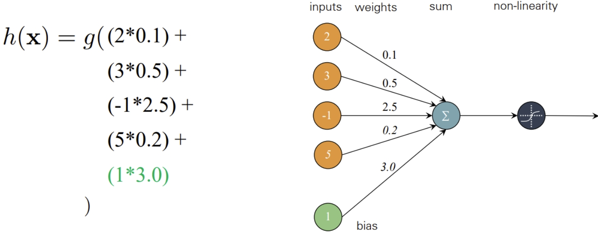

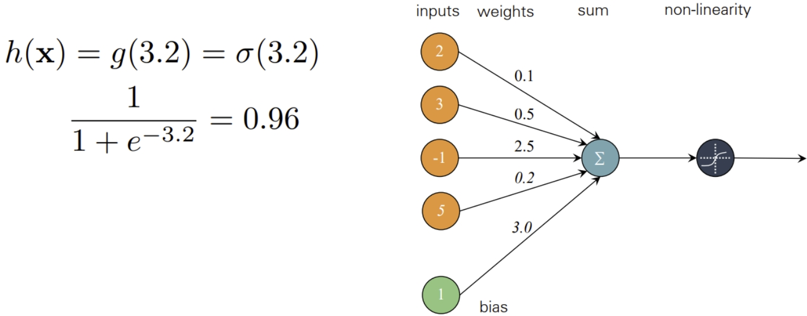

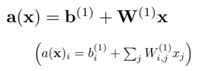

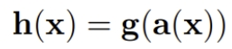

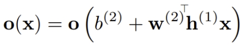

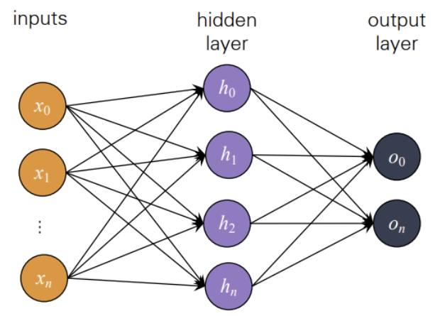

### Hızlı Sorular

1) Neden iki doğrusal katmanı arka arkaya koymak tek doğrusal dönüşüme eşdeğerdir?
2) Gizli katman boyutu $m$ arttıkça hangi riskler ortaya çıkar?

<a id="mlp-general"></a>

## Çok Katmanlı Perceptron (Genel İleri Yayılım)

### Özet

- L adet gizli katmana sahip MLP’de her katmanda doğrusal dönüşüm ve doğrusal olmayan aktivasyon uygulanır; çıktı katmanı görev tipine göre belirlenir (sınıflandırma/regresyon).

### İleri Yayılım Denklemleri

- Girdi: $h^{(0)} = x \in \mathbb{R}^{n_0}$.
- Katman $k = 1,\dots,L$ için ön-aktivasyon ve aktivasyon:
    - $a^{(k)} = W^{(k)} h^{(k-1)} + b^{(k)}$, burada $W^{(k)} \in \mathbb{R}^{n_k \times n_{k-1}}$, $b^{(k)} \in \mathbb{R}^{n_k}$.
    - $h^{(k)} = \phi^{(k)}\!\big(a^{(k)}\big)$.
- Çıkış katmanı ($k=L+1$):
    - $a^{(L+1)} = W^{(L+1)} h^{(L)} + b^{(L+1)}$.
    - Sınıflandırma: $\hat{y} = \mathrm{softmax}\big(a^{(L+1)}\big)$ (çok sınıflı) veya $\hat{y}=\sigma\big(a^{(L+1)}\big)$ (ikili).
    - Regresyon: $\hat{y} = a^{(L+1)}$ (lineer çıktı).

Görseller:

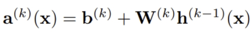

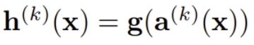

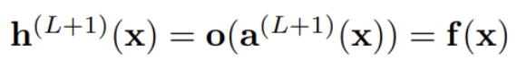

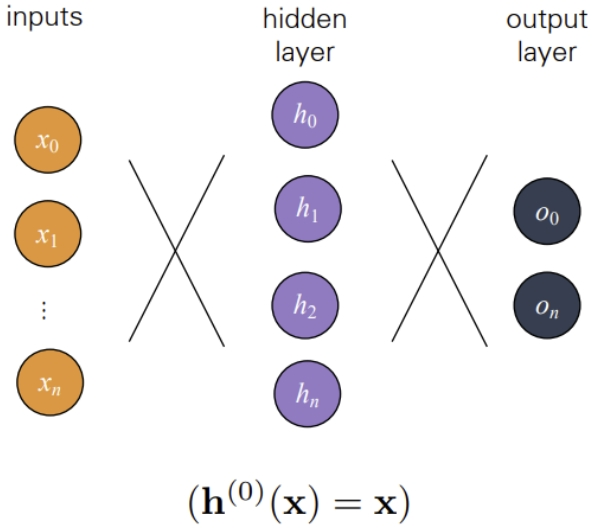

### Toplam Parametre ve Hesaplama

- Parametre Sayısı: $\sum_{k=1}^{L+1} (n_k n_{k-1} + n_k)$.
- İleri geçiş karmaşıklığı yaklaşık $\mathcal{O}\!\left(\sum_k n_k n_{k-1}\right)$ çarpım-toplama işlemleri.

### Hızlı Sorular

1) Aynı aktivasyon tüm katmanlarda şart mıdır? Neden?
2) Çıkış katmanının aktivasyonu göreve göre neden değişir?

<a id="deep-nn"></a>

## Derin Sinir Ağı

### Özet

- Gizli katman sayısı arttıkça (derinlik), modelin temsil gücü ve hiyerarşik özellik öğrenimi artar; aynı zamanda optimizasyon ve genelleme zorlukları da artar.

### Notlar

- Derinlik ≥ 3 genellikle “derin” olarak adlandırılır; pratikte residual/skip bağlantıları daha derin ağların eğitimini kolaylaştırır.

Görseller:

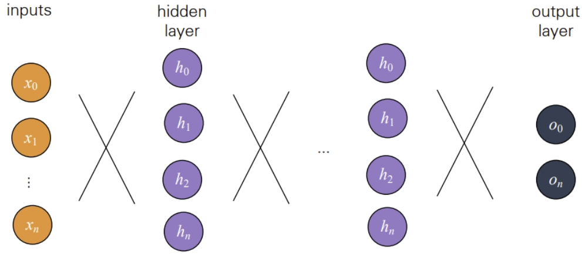

### Hızlı Sorular

1) Derinleşirken hangi düzenlileştirme teknikleri faydalıdır? (ör. dropout, weight decay, batch norm)

<a id="flight-delay"></a>

## Örnek: Uçuşum Gecikecek mi?

### Problem Tanımı

- Girdi özellikleri örneği: Sıcaklık (°F), Rüzgâr Hızı (mph), gün/saat, hava durumu vb.
- Amaç: Gecikme var/yok (ikili sınıflandırma) veya gecikme süresi (regresyon) tahmini.

Görseller:

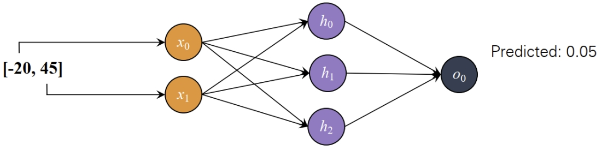

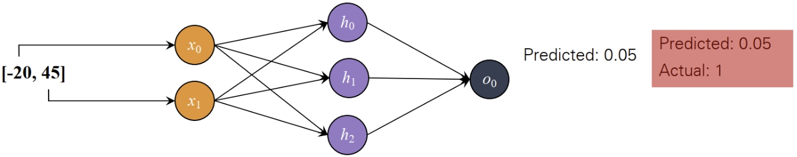

### Basit MLP Kurulumu (İkili Sınıflandırma)

- Girdi $x \in \mathbb{R}^{d}$ (normalize/standartlaştırılmış).
- Gizli: $h=\phi(W_1 x + b_1)$.
- Çıkış: $p=\sigma(W_2 h + b_2)$; $p = P(\text{gecikme}\mid x)$.

### Notlar

- Özellik ölçekleme performansı ciddi etkiler; kategorik değişkenler için one-hot/embedding kullanılabilir.

### Hızlı Sorular

1) Bu problemde neden softmax yerine sigmoid uygundur?
2) Hangi durumlarda bunu çok sınıflı bir probleme çevirebiliriz?

<a id="losses"></a>

## Kayıp Fonksiyonları ve Toplam Kayıp

### Çapraz Entropi (Softmax – Çok Sınıflı)

$$\ell_{CE}(\hat{y}, y) = - \sum_{c=1}^{C} y_c \, \log \hat{y}_c, \quad \hat{y} = \mathrm{softmax}(a)$$

### İkili Çapraz Entropi (Sigmoid – İkili)

$$\ell_{BCE}(p, y) = - \big[ y\,\log p + (1-y)\,\log(1-p) \big], \quad p = \sigma(a)$$

### Ortalama Kare Hata (Regresyon)

$$\ell_{MSE}(\hat{y}, y) = \tfrac{1}{2} \, \lVert \hat{y} - y \rVert^2$$

### Veri Üzerinde Toplam Kayıp ve Düzenlileştirme

$$J(\theta) = \frac{1}{N} \sum_{i=1}^{N} \ell\big(\hat{y}^{(i)}, y^{(i)}\big) + \lambda\,\Omega(\theta)$$

Burada $\Omega(\theta)$ genellikle $\tfrac{1}{2}\lVert \theta \rVert_2^2$ (L2) veya $\lVert \theta \rVert_1$ (L1) olarak seçilir.

Görseller:

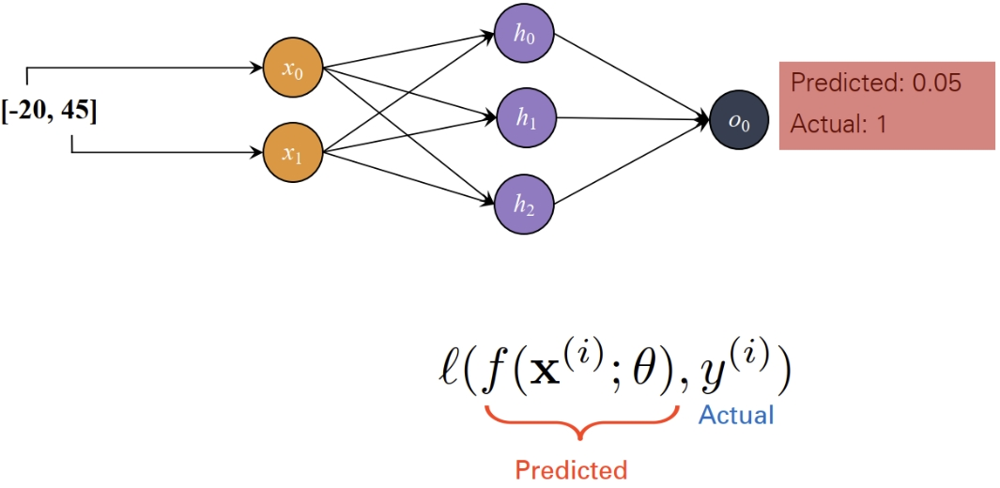


### Notlar

- Çok sınıflı sınıflandırmada softmax + çapraz entropi; ikili durumda sigmoid + ikili çapraz entropi tercih edilir. MSE çoğunlukla regresyon için uygundur.

### Hızlı Sorular

1) Neden çok sınıflı sınıflandırmada MSE yerine çapraz entropi tercih edilir?
2) L2 ağırlık cezalandırması (weight decay) ne işe yarar?

<a id="training"></a>

## Eğitim Süreci ve Optimizasyon

### Özet

- Eğitim, hatayı azaltacak şekilde ağın ağırlıklarının (parametrelerinin) güncellendiği yinelemeli bir süreçtir. Bir epoch, tüm eğitim verisinin modelden bir kez geçirilmesidir.

Görseller:


### Adım Adım (Epoch içinde)

1) Başlatma: Ağırlıkları rastgele başlat (uygun dağılım: He/Xavier). Biasları küçük değerlerle başlat.
2) İleri Yayılım: Her mini-batch için $\hat{y}=f_\theta(x)$ hesapla.
3) Kayıp: Seçilen kayıp fonksiyonuyla $\ell(\hat{y}, y)$ hesapla.
4) Geri Yayılım: Zincir kuralıyla $\nabla_\theta J(\theta)$ gradyanlarını bul.
5) Güncelleme: Bir optimizer ile parametreleri güncelle: $\theta \leftarrow \theta - \eta\,\nabla_\theta J(\theta)$.
6) Tekrar: Erken durdurma/öğrenme oranı planına göre epoch’lar boyunca devam et.

### Terimler

- Epoch: Tüm eğitim veri seti üzerinde bir tam geçiş.
- Mini-batch: Verinin küçük bir altkümesi; her güncellemede kullanılır.
- İterasyon: Bir mini-batch’in işlenmesi ve tek bir güncelleme adımı.

### Optimizer’lar ve Öğrenme Oranı

- SGD: $\theta \leftarrow \theta - \eta\,g$.
- Momentum: Birikimli yön ile hızlandırır.
- Adam: Uyarlanır öğrenme oranı + moment tahmini; pratikte sıklıkla etkilidir.
- Öğrenme Oranı (LR): Çok büyükse sapma/kararsızlık, çok küçükse yavaş yakınsama; planlar: step/plateau, cosine, warmup.

### Hızlı Sorular

1) Neden mini-batch kullanırız, tam-batch yerine?
2) LR çok büyük/çok küçük olduğunda ne gözlemlersiniz?
3) Hangi durumlarda Adam yerine saf SGD (+momentum) tercih edilir?

<a id="tf-playground"></a>

## İnteraktif: TensorFlow Playground

- Basit MLP yapılandırmalarını etkileşimli olarak deneyin: https://playground.tensorflow.org/
- Not: Özellik ölçekleme, aktivasyon ve karar sınırlarının nasıl değiştiğini gözlemleyin; aşırı öğrenmeyi görmek için veri gürültüsü ve model kapasitesiyle oynayın.

Görseller:


<a id="iris-problem"></a>

## Iris: Problem Tanımı

### Özet

- Iris veri seti 150 örnek ve 3 sınıftan (Setosa, Versicolor, Virginica) oluşur. Özellikler: sepal uzunluğu/genişliği, petal uzunluğu/genişliği (4 boyut). Amaç: örneği doğru class’a atamak (çok sınıflı sınıflandırma).

### Notlar

- Dengeli ve küçük bir veri setidir; hızlı prototipleme için uygundur.

Görseller:


<a id="iris-load-split"></a>

## Iris: Veriyi Yükleme ve Bölme

### Adımlar

- sklearn.datasets.load_iris ile veriyi yükleyin; $X \in \mathbb{R}^{N\times 4}$, $y \in \{0,1,2\}$.
- train_test_split ile eğitim/test ayırımı (ör. test_size=0.2, random_state=42).
- PyTorch tensör tipleri: özellikler `float32`, etiketler `long` (CrossEntropyLoss için gereklidir).

### İpuçları

- Özellikleri standardize etmek (ör. StandardScaler) genellikle eğitimi hızlandırır ve kararlılığı artırır.

<a id="iris-dataset"></a>

## Iris: Dataset ve DataLoader

### Özet

- `torch.utils.data.Dataset` ile özel bir sınıf yazıp `__len__` ve `__getitem__` metodlarını tanımlayın. `DataLoader` ile mini-batch (ör. 16) ve `shuffle=True` (eğitim) kullanın.

### Notlar

- Test `DataLoader`’ında `shuffle=False` uygundur. Büyük verilerde num_workers>0 ile hızlanma sağlanabilir.

<a id="iris-model"></a>

## Iris: Model (SimpleClassifier)

### Mimari

- `fc1: 4 → 10`, `fc2: 10 → 10`, `fc3: 10 → 3`; ara katmanlarda ReLU, çıkışta aktivasyon yok (logit). Kayıp fonksiyonu softmax ile birlikte CrossEntropyLoss olduğundan, logit beklenir.

### Önemli Nokta

- `nn.CrossEntropyLoss` giriş olarak `logits` (şekil `[N, C]`) ve hedef olarak `long` sınıf indeksleri (şekil `[N]`) bekler. Çıkış katmanına softmax eklemeyin.

<a id="iris-train"></a>

## Iris: Eğitim Döngüsü

### Kurulum

- Öğrenme oranı: 0.01, epoch: 100 (örnek). Optimizer: Adam. Kayıp: CrossEntropyLoss.

### Döngü

- Her batch için: ileri yayılım → kayıp → optimizer.zero_grad() → loss.backward() → optimizer.step(). Her 10 epoch’ta bir kaybı yazdırın.

### İpuçları

- `model.train()` eğitimde, `model.eval()` değerlendirmede. Erken durdurma/öğrenme oranı planları eklenebilir.

<a id="iris-eval"></a>

## Iris: Değerlendirme ve Doğruluk

### Adımlar

- `model.eval()` ve `torch.no_grad()` blokları ile ileri yayılım; `_, predicted = torch.max(outputs, 1)` ile sınıf indeksini alın. Doğruluk: doğru/total.

### Notlar

- Karışıklık matrisi, sınıf başına doğruluk gibi ek metrikler daha zengin analiz sağlar.

<a id="iris-save-load"></a>

## Iris: Model Kaydetme / Yükleme

### Kayıt

- Yalnızca ağırlıkları kaydetmek yaygındır: `torch.save(model.state_dict(), "model.pth")`.

### Yükleme

- Aynı mimariyi başlatın ve ağırlıkları yükleyin:
- `model = SimpleClassifier(input_size=4, num_classes=3)`
- `state = torch.load("model.pth")  # gerekirse map_location` 
- `model.load_state_dict(state)`
- `model.eval()`

### Dikkat

- Kodunuzdaki `NeuralNetwork()` yerine `SimpleClassifier(...)` kullanın; mimari uyuşmazlığı hata verir.
- Bazı PyTorch sürümlerinde `torch.load(..., weights_only=True)` parametresi mevcut değildir; uyum için yalnızca `torch.load(path)` kullanın.

<a id="binary-problem"></a>

## İkili Sınıflandırma: Problem ve Dönüşüm

### Özet

- Breast Cancer veri seti iki sınıflıdır. Çok sınıflı bir kurulumdan ikili sınıflandırmaya geçerken, çıktı katmanı boyutu 1’e iner ve aktivasyon/kişi kaybı ikili forma döner.

### Dönüşüm İlkeleri

- Çıktı: $\hat{p} = \sigma(a)$ tek bir olasılık (pozitif sınıf olasılığı).
- Kayıp: Binary Cross-Entropy (BCE) veya sayısal olarak kararlı `BCEWithLogitsLoss` (çıkışta sigmoid gerekmez).
- Etiket tipi: `float` (0.0/1.0) veya `long` da olabilir, fakat BCE için `float` kullanımı yaygındır.

### Hızlı Sorular

1) Çok sınıflıdan ikiliye geçerken hangi iki bileşeni değiştirirsiniz?
2) Neden `BCEWithLogitsLoss`, `BCELoss` + `sigmoid` ikilisine göre daha kararlıdır?

<a id="bc-load-split"></a>

## Breast Cancer: Veriyi Yükleme ve Bölme

### Adımlar

- `load_breast_cancer()` ile veriyi yükleyin; $X \in \mathbb{R}^{N\times d}$, $y \in \{0,1\}$.
- `train_test_split(X, y, test_size=0.2, random_state=42)` ile ayırın.
- Tensörler: `X -> float32`, `y -> float32` (BCE uyumu). Gerekirse standardizasyon uygulayın.

### Not

- Kod parçasında `fromsklearn` yazımı hatalıdır; `from sklearn ...` olmalıdır.

<a id="bc-dataset"></a>

## Breast Cancer: Dataset ve DataLoader

### Özet

- `Dataset` sınıfı ile örnek/etiket döndürün; `DataLoader` ile `batch_size=16`, eğitimde `shuffle=True`.

### İpucu

- `y` tensörünün şekli çoğunlukla `[N]` veya `[N,1]` olur; BCE için model çıktısıyla eşleştiğinden emin olun (gerekirse `labels.view(-1,1)`).

<a id="bc-model"></a>

## Breast Cancer: Model (Sigmoid vs Logit)

### Mimari

- Tam bağlı katmanlar: `input_size=30 → 10 → 10 → 1`.
- Çıkış: İki seçenek
    - Seçenek A (BCELoss): Çıkışta `sigmoid` uygula ve `nn.BCELoss()` kullan.
    - Seçenek B (Önerilir): Çıkışta aktivasyon yok (logit) ve `nn.BCEWithLogitsLoss()` kullan.

### Neden B Tercih Edilir?

- `BCEWithLogitsLoss`, sigmoid + BCE’yi tek adımda sayısal olarak kararlı şekilde uygular; taşmaları ve hassasiyet kaybını azaltır.

<a id="bc-train"></a>

## Breast Cancer: Eğitim

### Kurulum

- Öğrenme oranı: 0.01, epoch: 100, optimizer: Adam.
- Kayıp: `BCELoss` ise model çıkışı `sigmoid(fc3(x))` ve etiket `float` olmalı; `BCEWithLogitsLoss` ise model çıkışında sigmoid olmasın.

### Döngü

- Her batch: forward → loss → zero_grad → backward → step. Gerekirse `labels = labels.view(-1,1)` ile şekil eşleştir.

### Sınıf Dengesizliği

- `pos_weight` (BCEWithLogitsLoss argümanı) veya `class_weight` ile dengesiz veri setlerinde pozitif sınıfı dengeleyin.

<a id="bc-eval"></a>

## Breast Cancer: Değerlendirme ve Eşikleme

### Adımlar

- `model.eval()`, `torch.no_grad()`.
- Eğer çıkış logit ise: `probs = torch.sigmoid(outputs)`; sonra `pred = (probs > 0.5).float()`.
- Eğer çıkış zaten olasılık ise: doğrudan `pred = (outputs > 0.5).float()`.
- Doğruluk: `correct/total`; ayrıca ROC-AUC, F1 gibi metrikler kullanın.

### Not

- Örnekteki çıktı etiketi "Eğitim Veri Seti Doğruluğu" olarak yazılmış; değerlendirme test setinde yapıldığından metin "Test Veri Seti Doğruluğu" olmalıdır.

<a id="bc-predict"></a>

## Breast Cancer: Tahmin ve Girdi Şekli

### Not

- `torch.rand(30)` tek boyutlu tensör modelin `forward` metodu `[N, 30]` beklediğinde hata verebilir. Tek bir örnek için `random_inputs = torch.rand(1, 30)` şeklinde kullanın.

### Hızlı Sorular

1) Neden `BCEWithLogitsLoss` genellikle `BCELoss`’tan daha kararlıdır?
2) Eşik (0.5) yerine ROC-AUC üzerinde karar eşiği seçmenin avantajı nedir?

<a id="mnist-overview"></a>

## MNIST: Veri Kümesi ve Görselleştirme

### Özet

- MNIST, 28×28 piksel, tek kanallı (gri) el yazısı rakamlardan oluşur: 60K eğitim, 10K test görüntüsü; etiketler 0–9.

### Yükleme ve İlk Görüntü

- `torchvision.datasets.MNIST(root, train, download, transform)` ile indirilir.
- `DataLoader` ile `batch_size` seçilerek eğitime hazır hale getirilir.
- Görselleştirme için ilk batch’ten bir örnek alıp `plt.imshow(tensor.squeeze(), cmap='gray')` ile gösterilebilir.

Görseller:


### Not

- DataLoader’da test için `test_set` kullanın; `test_loader = DataLoader(test_set, ...)` (bazı örneklerde yanlışlıkla `train_set` kullanabiliyor).

<a id="mnist-transforms"></a>

## MNIST: Dönüşümler (ToTensor, Normalize)

### Özet

- `transforms.ToTensor()` görüntüyü [0,1] aralığında `[C,H,W]` tensöre çevirir.
- Normalizasyon, öğrenmeyi hızlandırır ve kararlı kılar; MNIST için tipik: `Normalize(mean=[0.1307], std=[0.3081])`.

### Örnek

- `transforms.Compose([transforms.ToTensor(), transforms.Normalize([0.1307],[0.3081])])`.

<a id="mnist-mlp"></a>

## MNIST: MLP Baseline (Flatten + FC)

### Özet

- Evrişim kullanmadan basit bir MLP kurmak için giriş 28×28 → 784’e düzleştirilir, birkaç tam bağlı katman ve ReLU kullanılır, çıkışta 10 logit üretilir.

### Mimari

- `Flatten → Linear(784,128) → ReLU → Linear(128,64) → ReLU → Linear(64,10)`; kayıp: `CrossEntropyLoss` (logits bekler; çıkışta softmax yok).

Görseller:


### Not

- Bazı örnek notlarda “3 çıkış nöronu” ifadesi geçiyor; MNIST için `num_classes=10` olmalıdır.

<a id="mnist-train-eval"></a>

## MNIST: Eğitim ve Değerlendirme

### Eğitim

- `optimizer = Adam(model.parameters(), lr=0.01)`; epoch döngüsünde `outputs = model(features)`, `loss = criterion(outputs, labels)`, `zero_grad → backward → step`.

### Değerlendirme

- `model.eval()` ve `torch.no_grad()` ile doğruluk: `_, predicted = torch.max(outputs, 1)`; `correct/total`.

### Hızlı Sorular

1) Neden çıkışta softmax uygulamıyoruz? (CELoss ile birlikte sayısal kararlılık)
2) Normalize etmeden eğitirseniz ne gözlemlersiniz?

<a id="gpu-usage"></a>

## GPU Kullanımı (CUDA vs CPU)

### Adımlar

1) Cihaz: `device = torch.device('cuda' if torch.cuda.is_available() else 'cpu')`.
2) Model: `model.to(device)`.
3) Eğitim: döngüde `inputs, labels = inputs.to(device), labels.to(device)`.

### Not

- Model ve verinin aynı cihazda olması gerekir; aksi halde hata alınır.

<a id="why-mlp-bad-for-images"></a>

## Neden MLP Görüntüler İçin İdeal Değil?

### Özet

- Parametre patlaması: 200×200×3 giriş, 10 gizli nöronlu bir katman için ≈ 1.2M parametre. Yerel yapı ve uzaysal yakınlık bilgisi kaybolur.

Görseller:


### Not

- Pikseller arası komşuluk bilgisi tam bağlı katmanlarda kullanılmaz; bu da veri/verim gereksinimini artırır.

<a id="local-regions"></a>

## Yerel Bölgeler ve Sezgi

### Özet

- İnsanlar nesneleri yerel ipuçlarından tanır; evrişim yaklaşımı da yerel bölgeler üzerinde çalışarak bu sezgiyi takip eder.

Görseller:


<a id="cnn-conv"></a>

## CNN: Evrişimli Katmanlar ve Ağırlık Paylaşımı

### Özet

- Küçük filtreler (örn. 3×3, 5×5) görüntü üzerinde kaydırılır; aynı ağırlıklar her konumda kullanılır (ağırlık paylaşımı). Bu, parametre verimliliği ve ötelemeye karşı denkliği sağlar.

### Notlar

- Öğrenilen filtreler kenar, köşe, doku gibi özellikleri yakalar; filtre sayısı arttıkça hesaplama maliyeti artar.

Görseller:


<a id="cnn-stride-padding"></a>

## CNN: Stride ve Padding

### Kavramlar

- Stride (adım): Filtrenin her hamlede kaç piksel kaydığı; daha büyük stride → daha küçük çıktı boyutu.
- Padding (dolgu): Kenarlara sıfır ekleyerek boyutu koruma ve kenar bilgisini koruma.

### Çıkış Boyutu

$$W' = \left\lceil \frac{W - F + 2P}{S} \right\rceil + 1,\quad H' = \left\lceil \frac{H - F + 2P}{S} \right\rceil + 1$$

Görseller:


<a id="cnn-norm"></a>

## CNN: Normalizasyon Katmanları

### Özet

- Özelliklerin normalize edilmesi optimizasyonu hızlandırır ve gradyanları dengeler. Yaygın katman: Batch Normalization.

### Formül (BatchNorm, kanal başına)

$$\hat{x} = \frac{x - \mu_B}{\sqrt{\sigma_B^2 + \epsilon}}, \quad y = \gamma \, \hat{x} + \beta$$

Görseller:


<a id="cnn-pooling"></a>

## CNN: Havuzlama (Pooling)

### Özet

- Kanal başına ayrı uygulanır; uzaysal boyutu küçültür, baskın özellikleri öne çıkarır; parametre içermez. Max/Avg türleri yaygındır.

### Not

- Komşu özellikler benzer olabileceği için bilgi kaybı sınırlıdır; aşırı havuzlama temsili zayıflatabilir.

Görseller:


<a id="cnn-flat-dropout"></a>

## CNN: Flatten ve Dropout

### Özet

- Flatten: Konvolüsyonel özellik haritalarını tam bağlı katmanlara bağlamak için tek boyutlu vektöre dönüştürür.
- Dropout: Eğitim sırasında rastgele nöronları devre dışı bırakıp aşırı öğrenmeyi azaltır (ör. p=0.5).

Görseller:


<a id="cnn-simple-arch"></a>

## CNN: Basit Mimari Akışı (MNIST)

### Akış

- `Conv(1→16, k=5, p=2) → ReLU → MaxPool(2)
    → Conv(16→32, k=5, p=2) → ReLU → MaxPool(2)
    → Flatten (32×7×7=1568) → Linear(1568,128) → Dropout(0.5) → Linear(128,10)`

### Notlar

- Girdi şekli `[B,1,28,28]`; padding sayesinde bazı katmanlarda genişlik/yükseklik korunur. Çıkış katmanı logits döndürür; kayıp `CrossEntropyLoss`.

<a id="autoencoders"></a>

## Otomatik Kodlayıcılar (Autoencoders)

### Özet

- Otomatik Kodlayıcı (Autoencoder, AE), verinin sıkıştırılmış bir temsilini öğrenmek için kullanılan denetimsiz bir yapay sinir ağıdır.
- Temel amaç, girdi $X$'i yeniden oluşturacak bir çıktı $X'$ üretmektir: $X \approx X'$.
- “Darboğaz (bottleneck)” katmanı, modeli girdiyi ezberlemek yerine en önemli özellikleri sıkışık bir temsilde tutmaya zorlar.

Görseller:


<a id="ae-architecture"></a>

### Mimari: Encoder – Bottleneck – Decoder

1) **Kodlayıcı (Encoder)**: $z = e(x)$
  - Girdiyi alır ve daha düşük boyutlu gizli uzaya (latent space) sıkıştırır.
2) **Darboğaz (Bottleneck)**: $z$
  - Öğrenilen sıkıştırılmış temsildir; boyut indirgeme burada gerçekleşir.
3) **Kod Çözücü (Decoder)**: $x' = d(z)$
  - Sıkıştırılmış temsilden girdiyi yeniden yapılandırmaya çalışır.

Hedef: **Girdi Katmanı ≈ Çıktı Katmanı**  \($X \approx X'$\)

### Notlar

- Darboğaz boyutu, girdiden daha küçük seçilir (örn. 1024 → 64). Bu kısıt, ağın “kopyala‑yapıştır” ezberine kaçmasını engelleyip temsil öğrenmeye zorlar.
- AE, verideki gürültüyü atıp ana kalıpları (features) latent uzaya sığdırmayı öğrenebilir.

<a id="ae-loss"></a>

### Kayıp: Reconstruction Error

- AE eğitimi, $X$ ile $X'$ arasındaki farkı en aza indirmeye dayanır. Bu fark **yeniden yapılandırma hatası**dır (reconstruction error).
- Veri tipine göre tipik kayıplar:
  - Reel değerli veriler (örn. piksel yoğunlukları): **MSE**
  - İkili (binary) veriler (örn. siyah/beyaz pikseller): **Binary Cross‑Entropy (BCE)**

Görseller:


### Kodlayıcı’nın Gücü: Özellik Çıkarımı

- Pratikte hedef yalnızca $X'$ üretmek değildir; asıl değerli parça eğitim sonunda elde edilen **Encoder**’dır.
- Eğitim bittikten sonra **Decoder atılabilir**; Encoder, yüksek boyutlu girdiyi (örn. 784 piksel MNIST) düşük boyutlu ve anlamlı bir vektöre (örn. 32‑boyut) dönüştüren bir **feature extractor** olur.
- Bu latent vektörler; SVM, RandomForest, basit MLP gibi denetimli modeller için ham piksellere göre daha iyi bir girdi temsili sağlayabilir.

<a id="ae-uses"></a>

### Kullanım Alanları

1) **Boyut azaltma ve görselleştirme** (2D/3D latent uzaya indirip görselleştirme)
2) **Özellik çıkarımı / ön‑eğitim** (denetimli modele daha iyi temsil sağlama)
3) **Anomali tespiti** (normal veride düşük, anormal veride yüksek reconstruction error)
4) **Görüntü iyileştirme / gürültü giderme** (Denoising AE)
5) **Üretken modeller** (VAE ile yeni örnek üretimi)

<a id="denoising-ae"></a>

### Gürültü Azaltan AE (Denoising Autoencoder)

Adımlar (özet):

1) Temiz görüntüyü alın: $x$.
2) Rastgele gürültü ekleyin: $x_{noisy}$.
3) Modele $x_{noisy}$ verin.
4) Decoder’dan temiz $x$’i yeniden yapılandırmasını isteyin.

Kayıp fikri:

$$L = L\big(x,\; d(e(x_{noisy}))\big)$$

Sonuç: Model, gürültüyü “filtrelemeyi” öğrenir.

Görseller:


<a id="vae"></a>

### Değişimsel Otomatik Kodlayıcı (VAE)

VAE, AE’ye benzer ancak **yeni veri üretebilen (generative)** olasılıksal bir mimaridir.

- Standart AE (deterministik): $z = e(x)$ (latent uzayda tek bir noktaya haritalar). Latent uzay “boşluklu” olabilir.
- VAE (stokastik): Encoder tek nokta yerine bir **dağılım** öğrenir ve iki vektör üretir:
  - Ortalama: $\mu$
  - Log‑varyans: $\log(\sigma^2)$

**Reparameterization trick** ile örnekleme:

$$z = \mu + \sigma \odot \epsilon, \quad \epsilon \sim \mathcal{N}(0, I)$$

Bu, rastgeleliği modele katarken gradyanların akmasına izin verir.

VAE kaybı (iki parça):

1) **Reconstruction loss**: $L_{rec}(x, x')$ (MSE veya BCE)
2) **KL divergence**: $D_{KL}\big(q(z\mid x)\;\|\;\mathcal{N}(0, I)\big)$

KL terimi, latent uzayı düzenleyerek sürekli ve pürüzsüz hale getirir; böylece latent uzaydan rastgele $z$ seçip decoder’a vererek **yeni örnekler** üretebilirsiniz.

Görseller:


<a id="conv-ae"></a>

### Evrişimli Otomatik Kodlayıcılar (Convolutional Autoencoders)

Neden?

- Görüntüyü düz vektöre çevirip (örn. 784) lineer katmanlara vermek, **piksel komşuluklarını** ve yerel desenleri kaybettirir.
- Parametre sayısı hızla büyür.

Çözüm: CNN tabanlı AE

- Encoder: Uzaysal boyutu küçültürken kanal sayısını artırır (özellik çıkarımı).
- Decoder: Özellik haritasını büyütüp görüntüyü geri oluşturur.

Encoder (downsampling) yöntemleri:

- **Pooling** (örn. 2×2 MaxPool): 32×32 → 16×16
- **Strided convolution** (stride=2): Modern mimarilerde pooling yerine sık kullanılır.

Takas (trade‑off): Uzaysal boyut azalırken (H,W ↓), kanal sayısı artar (C ↑).

Görseller:


Decoder (upsampling) yöntemleri:

1) **Interpolasyon + Conv** (Upsample + Conv)
  - Basit; bazen bulanık sonuçlar verebilir.
  - Bilinear interpolation: en yakın 2 komşudan ağırlıklı hesap.
  - Bicubic interpolation: en yakın 3 komşudan hesap.
2) **Transposed Convolution** (learnable upsampling)
  - “Deconvolution / Upconvolution / Fractionally‑strided conv” gibi isimlerle de anılır.
  - Özellikle segmentation/decoder mimarilerinde yaygındır.

Görseller:


### Hızlı Sorular

1) AE’de “target” neden girdinin kendisidir?
2) Darboğaz boyutunu çok büyük seçerseniz ne olur?
3) BCE hangi tür yeniden yapılandırma görevlerinde MSE’ye göre daha uygundur?
4) VAE’de KL divergence latent uzay üzerinde neyi “düzenler”?
5) Transposed convolution ile upsampling yaparken “checkerboard artifacts” neden oluşabilir? (ipucu: stride ve kernel uyumu)

<a id="gan"></a>

## Üretken Çekişmeli Ağlar (Generative Adversarial Networks, GAN)

### Özet

- Autoencoder’lar çoğunlukla **girdiyi yeniden yapılandırmaya** odaklanırken (olanı taklit), GAN’lar **yeni örnekler üretmeye** odaklanır (yeni bir şey yaratma).
- GAN, iki ağın rekabetiyle öğrenir:
  - **Generator (G)**: sahte örnek üretir.
  - **Discriminator (D)**: örneğin gerçek mi sahte mi olduğunu ayırt eder.

Görseller:


<a id="disc-vs-gen"></a>

### Ayırt Edici vs Üretken Modeller

- **Ayırt edici (discriminative) modeller**: $P(y\mid x)$ öğrenir. Amaç: sınıf sınırı çizmek.
  - Örnek: “Bu resim kedi mi köpek mi?”
- **Üretken (generative) modeller**: $P(x)$ veya $P(x\mid y)$ öğrenir. Amaç: veri dağılımından yeni örnek üretmek.
  - Örnek: “Hiç var olmayan yeni bir kedi resmi üret.”

<a id="gan-arch"></a>

### Mimari: Generator ve Discriminator

Kalpazan–Dedektif benzetmesi:

- **Generator (Kalpazan)**: rastgele gürültü vektörü $z$ alır ve sahte örnek üretir: $x_{fake} = G(z)$.
- **Discriminator (Dedektif)**: bir örnek alır (gerçek veya sahte) ve “gerçek olma olasılığı” üretir: $D(x) \in (0,1)$.

Pratik akış:

1) Gürültü (latent) vektörü: $z$ (örn. 100 boyutlu Gaussian noise)
2) Generator: $G(z) \rightarrow x_{fake}$ (görüntü üretiminde sıklıkla upsampling / transposed convolution blokları)
3) Gerçek veri: $x_{real}$ (eğitim setinden)
4) Discriminator: $D(x) \rightarrow$ olasılık (1: gerçek, 0: sahte)

Görseller:


<a id="gan-objective"></a>

### Amaç Fonksiyonu (Minimax)

GAN eğitimi, iki oyunculu bir **sıfır toplamlı oyun** gibi düşünülebilir:

$$\min_G\;\max_D\;V(D,G)=\mathbb{E}_{x\sim p_{data}}[\log D(x)] + \mathbb{E}_{z\sim p(z)}[\log(1 - D(G(z)))]$$

Sezgi:

- **D**, gerçek örneklerde $D(x)$'i 1’e; sahte örneklerde $D(G(z))$'yi 0’a yaklaştırmaya çalışır.
- **G**, ürettiği örneklerin $D$ tarafından “gerçek” sanılmasını ister.

Not:

- Uygulamada generator için sık kullanılan alternatif hedef: $\max_G\;\mathbb{E}_{z}[\log D(G(z))]$ (daha güçlü gradyan verebilir).

Görseller:


<a id="gan-training"></a>

### Eğitim Adımları

Adım 1 — **Discriminator’ı eğit** (Generator sabit):

- Gerçek resimler göster → hedef: 1
- Sahte resimler göster → hedef: 0
- Loss hesapla ve **yalnızca D ağırlıklarını** güncelle

Adım 2 — **Generator’ı eğit** (Discriminator sabit):

- Sahte resimler üret
- Bu resimleri D’ye ver
- Loss hesapla ve **yalnızca G ağırlıklarını** güncelle

<a id="gan-challenges"></a>

### GAN Eğitmek Neden Zor?

1) **Mod çökmesi (mode collapse)**: Generator çeşitliliği kaybedip sürekli benzer örnekler üretir.
2) **Yakınsamama (non‑convergence)**: Parametreler dengeye oturmak yerine salınım yapabilir.
3) **Dengeli eğitim ihtiyacı**: Discriminator çok güçlenirse generator gradyanı zayıflayıp öğrenemez.

<a id="gan-families"></a>

### Örnek GAN Aileleri

- GAN literatüründe (özellikle görüntü üretiminde) farklı mimari/öğrenme iyileştirmeleri olan birçok türev vardır.

Görseller:


Kaynaklar:

- https://arxiv.org/pdf/1708.05509.pdf
- https://github.com/simoninithomas/CatDCGAN
- https://github.com/JadeBlue96/DCGAN-Dog-Generator

Görseller:


<a id="pix2pix"></a>

### Pix2Pix (cGAN)

Pix2Pix, **Görüntüden Görüntüye Çeviri (Image‑to‑Image Translation)** problemleri için tasarlanmış bir **Şartlı GAN (cGAN)** yaklaşımıdır.

- Amaç: Giriş görüntüsünün içeriğini koruyup, hedef stile dönüştürmek.
  - Örn: eskiz → renkli çanta, uydu → harita, gündüz → gece.
- **Eşleşmiş (paired) veri** ister: (giriş, hedef) çiftleri birebir eşleşmiş olmalıdır.
- Generator tarafında sık kullanılan fikir: **U‑Net + skip connection** (detay kaybını azaltır).
- Discriminator tarafında sık kullanılan fikir: **PatchGAN**
  - Tek bir gerçek/sahte skoru yerine, görüntüyü yamalara bölüp her yama için karar vererek yüksek frekans detaylarını (doku/keskinlik) korumaya yardım eder.

Görseller:


Kaynaklar:

- https://arxiv.org/pdf/1611.07004v1.pdf
- https://github.com/phillipi/pix2pix

<a id="cyclegan"></a>

### CycleGAN

CycleGAN, Pix2Pix’in aksine **eşleşmiş veri (paired data) olmadan** görüntüden görüntüye çeviri yapmayı hedefler.

- Eğitim setinde birebir eşleşen (aynı sahnenin gündüz/gece gibi) çiftlere ihtiyaç yoktur.
- İki yönlü dönüşüm öğrenir:
  - $G: A \rightarrow B$
  - $F: B \rightarrow A$
- Temel fikir: **Döngüsel tutarlılık (cycle consistency)**
  - $A\rightarrow B\rightarrow A$ sonrası tekrar orijinale yakın olmalıdır.

Cycle consistency kaybı fikri (L1 örneği):

$$L_{cyc}=\mathbb{E}_{x\sim A}[\|F(G(x)) - x\|_1] + \mathbb{E}_{y\sim B}[\|G(F(y)) - y\|_1]$$

Sistemde genelde **2 Generator** ve **2 Discriminator** bulunur (A kümesini ve B kümesini ayrı denetleyen).

Görseller:


Kaynaklar:

- https://arxiv.org/pdf/1703.10593.pdf
- https://junyanz.github.io/CycleGAN/

<a id="gan-apps"></a>

### Uygulama Örnekleri

Görseller:


Bağlantılar:

- https://affinelayer.com/pixsrv/
- https://arxiv.org/pdf/1701.05957.pdf
- https://arxiv.org/pdf/1611.02200.pdf

### Hızlı Sorular

1) GAN’de generator ve discriminator hangi amaçlarla “çekişir”?
2) Mode collapse nedir ve neden problem yaratır?
3) Discriminator çok güçlenirse generator’ın öğrenmesi neden zorlaşır?
4) Pix2Pix neden paired data ister?
5) Cycle consistency fikri CycleGAN’de hangi sorunu çözer?

<a id="object-detection"></a>

## Nesne Tespiti (Object Detection)

Görseller:


<a id="od-problem"></a>

### Problem Tanımı: Ne + Nerede

- Giriş: Tek bir RGB görüntüsü.
- Çıktı: Görüntüdeki nesneler kümesi.
- Her nesne için iki tip bilgi tahmin edilir:
  1) **Ne?** Kategori etiketi (önceden tanımlı sınıflar)
  2) **Nerede?** Sınırlayıcı kutu (bounding box): $(x, y, w, h)$

Zorluklar:

- **Değişken sayıda çıktı**: Her görüntüde farklı sayıda nesne olabilir.
- **Çoklu çıktı türü**: Sınıflandırma + konum regresyonu birlikte gerekir.
- **Çözünürlük**: Sınıflandırma çoğu zaman 224×224; tespit için genelde daha yüksek çözünürlük (örn. 800×600) gerekir.

Görseller:


<a id="od-sliding-window"></a>

### Kayan Pencere (Sliding Window)

Fikir:

- Görüntünün birçok farklı bölgesine bir CNN uygulayıp her bölgeyi “nesne / arka plan” olarak sınıflandırmak.

Sorun:

- Olası kutu sayısı çok hızlı büyür.

Bir $H\times W$ görüntüde, $h\times w$ boyutlu tek bir pencere için olası konum sayısı:

$$N = (W - w + 1)(H - h + 1)$$

Farklı boyutlarda çok sayıda pencere düşünülünce kombinasyon patlar (örn. 800×600 için on milyonlar mertebesi).

Görseller:


<a id="od-region-proposals"></a>

### Bölge Önerileri (Region Proposals)

Amaç:

- Tüm olası kutuları denemek yerine, “muhtemelen nesneleri kapsayan” **küçük bir kutu adayları** seti üretmek.

Notlar:

- Genelde sezgisel yöntemlere dayanır.
- Örn. **Selective Search** ~2000 bölge önerisi üretebilir (CPU’da saniyeler içinde).

Görseller:


<a id="od-rcnn-family"></a>

### R-CNN Ailesi: R-CNN → Fast → Faster

**R-CNN (Region‑Based CNN)**

- (1) Region proposal ile ~2000 bölge çıkar.
- (2) Her bölgeyi 224×224’e getir.
- (3) Her bölgeyi CNN’den **ayrı ayrı** geçir.
- (4) Sınıf skorları + bbox dönüşümü tahmin et.
- (5) Skorlara göre en iyi kutuları seç, ground‑truth ile karşılaştır.

Ana problem: Çok yavaş (görüntü başına binlerce forward pass).

Görseller:


**Fast R-CNN**

- CNN özellik çıkarımı (backbone) görüntü için **bir kez** yapılır.
- Region’lar, özellik haritası üzerinden seçilir (ROI temelli).
- Böylece tekrar eden hesap yükü ciddi azalır.

Görseller:


**Faster R-CNN**

- Region proposal adımını da öğrenilebilir hale getirir: **Region Proposal Network (RPN)**.
- Özellik haritasının her konumunda **anchor box**(lar) üzerinden:
  - “Nesne var mı?” (classification)
  - “Kutuyu nasıl düzeltmeliyim?” (bbox regression)

Görseller:


<a id="od-iou"></a>

### Kutuları Karşılaştırma: IoU

**Intersection over Union (IoU)** (Jaccard similarity/index):

$$\mathrm{IoU}(A,B)=\frac{|A\cap B|}{|A\cup B|}$$

Yorum:

- IoU > 0.5: iyi
- IoU > 0.7: oldukça iyi
- IoU > 0.9: neredeyse mükemmel

Görseller:


<a id="od-nms"></a>

### Örtüşen Kutular: NMS (Non‑Maximum Suppression)

Sorun:

- Dedektörler aynı nesne için birçok **örtüşen** kutu üretebilir.

Çözüm: **NMS** (özet algoritma)

1) En yüksek skorlu kutuyu seç.
2) IoU’su eşikten büyük olan diğer kutuları ele (örn. 0.7).
3) Kutu kalırsa 1’e dön.

Görseller:


<a id="od-map"></a>

### Başarı Ölçümü: mAP (COCO)

- Nesne tespitinde yaygın metrik: **mAP (mean Average Precision)**.
- Genel fikir:
  1) Test görüntülerinde dedektörü çalıştır (NMS sonrası kutular).
  2) Her sınıf için tahminleri skora göre sırala.
  3) IoU eşiğine göre TP/FP kararlarıyla **Precision–Recall** eğrisi çıkar.
  4) Eğri altı alan: **AP**.
  5) Sınıflar üzerinde ortalama: **mAP**.

COCO mAP notu:

- Tek bir IoU eşiği yerine, IoU = 0.50, 0.55, …, 0.95 eşiklerinde hesaplanan AP’lerin ortalaması kullanılır.

Görseller:


<a id="od-single-stage"></a>

### Tek Aşamalı Dedektörler ve YOLO

İki yaklaşım:

- **İki aşamalı (two‑stage)**: Önce region proposal (RPN vb.), sonra sınıflandırma/regresyon (R‑CNN ailesi).
- **Tek aşamalı (single‑stage)**: Doğrudan yoğun tahmin (dense prediction) ile kutu + sınıf üretir (daha hızlı).

Görseller:


YOLO (You Only Look Once):

- Tek aşamalı, gerçek zamanlıya yakın çalışan popüler bir dedektör ailesidir.

Görseller:


### Hızlı Sorular

1) Nesne tespitinde neden “değişken sayıda çıktı” problemi vardır?
2) Sliding window yaklaşımı neden pratikte pahalıdır?
3) IoU neyi ölçer ve neden kullanılır?
4) NMS neden gereklidir?
5) COCO mAP neden birden fazla IoU eşiği üzerinden ortalama alır?

<a id="semantic-segmentation"></a>

## Semantic Segmentation

<a id="seg-definition"></a>

### Tanım ve Sezgi

- Semantic segmentation, görüntüdeki **her piksele** bir sınıf etiketi atar.
- Amaç “pikseller hangi sınıfa ait?” sorusudur; **farklı nesne örneklerini ayırmak** (hangi piksel hangi ineğe ait?) hedef değildir.

Görseller:


Naif yaklaşım (pratik değil):

- Her piksel için çevresinden bir yama (patch) alıp ayrı ayrı sınıflandırmak.
- Prensipte mümkün; ancak gerçek hayatta çok maliyetli olduğu için tercih edilmez.

Görseller:


<a id="seg-fcn"></a>

### Fully Convolutional Network (FCN)

- FCN, tam bağlı (FC) katmanlar yerine ağırlıkla **evrişimli katmanlardan** oluşarak tüm pikseller için aynı anda tahmin üretmeyi hedefler.
- Kayıp: **piksel başına cross-entropy** (çok sınıflı ise `CrossEntropy`, ikili ise `BCEWithLogitsLoss` gibi).

Sorunlar:

- Derinleştikçe receptive field artışı için tasarım zorlaşır.
- Büyük çözünürlükte doğrudan konvolüsyon maliyetlidir.

Bu yüzden pratikte daha yaygın tasarım: **Downsampling → Upsampling** (encoder–decoder) yapılarıdır.

Görseller:


<a id="seg-down-up"></a>

### Downsampling → Upsampling Tasarımları

- Downsampling (pooling / strided conv) ile uzaysal boyutu azaltıp hesaplamadan kazanırız.
- Upsampling ile tekrar orijinal çözünürlüğe yaklaşır ve piksel çıktısı üretiriz.

Görseller:


<a id="seg-upsampling"></a>

### Upsampling Yöntemleri

1) **Unpooling** (özellikle max-unpooling)
2) **Interpolasyon** (bilinear / bicubic)
3) **Learnable upsampling: Transposed Convolution**

**Max unpooling sezgisi**:

- Max pooling sırasında “en büyük değerin konumu” tutulur.
- Unpooling sırasında değerler o konumlara geri yerleştirilir.

Görseller:


**Transposed convolution** (öğrenilebilir büyütme):

- Stride/padding değerleriyle çıktı boyutu büyütülür; çakışan yerlerde toplama olur.
- “Deconvolution / Upconvolution / Fractionally-strided convolution” gibi isimlerle de geçer.

Görseller:


<a id="unet"></a>

### U-Net

U‑Net (2015, Ronneberger ve arkadaşları), özellikle tıbbi görüntülerde **az etiketli veriyle** yüksek hassasiyetli segmentasyon ihtiyacından doğan encoder–decoder mimarisidir.

Temel fikir:

- **Encoder (contracting path)**: “ne var?” bağlamsal bilgiyi çıkarır (downsampling ile H,W azalır; kanal sayısı artar).
- **Decoder (expansive path)**: “nerede?” bilgisini piksel düzeyinde geri kurar (upsampling ile H,W artar; kanal sayısı azalır).
- **Skip connections**: encoder’ın erken katmanlarındaki yüksek çözünürlüklü detayları decoder’a taşıyarak sınırları keskinleştirir.

Görseller:


<a id="seg-losses"></a>

### Kayıp Fonksiyonları

- **Binary Cross-Entropy (BCE)**: ikili segmentasyon için standart başlangıç.
- **Dice loss / IoU loss**: Örtüşmeyi doğrudan optimize eder; sınıf dengesizliğine (küçük tümör vs büyük arka plan) daha dayanıklıdır.
- **Focal loss**: Zor örneklere (yanlış sınıflanan piksellere) daha fazla ağırlık vererek dengesizlikte yardımcı olabilir.

Görseller:


<a id="seg-metrics"></a>

### Değerlendirme Metrikleri

- **IoU / Jaccard**: $\frac{|A\cap B|}{|A\cup B|}$ (1’e yakın daha iyi)
- **Dice**: $\frac{2|A\cap B|}{|A|+|B|}$ (IoU ile yakından ilişkilidir)

Görseller:


<a id="seg-taxonomy"></a>

### Semantic vs Instance vs Panoptic

- **Nesne tespiti**: kutu verir (çoğunlukla “things”).
- **Semantic segmentation**: piksel başına etiket verir, örnekleri ayırmaz (“things” + “stuff”).

Things vs Stuff:

- **Things**: örneklere ayrılabilir nesneler (insan, araba, kedi)
- **Stuff**: örneklere ayrılması anlamsız sınıflar (gökyüzü, çimen, su)

Görseller:


<a id="instance-seg"></a>

### Instance Segmentation ve Mask R-CNN

- **Instance segmentation**: görüntüdeki her nesneyi bulur ve her nesne için **piksel maskesi** üretir (yalnızca “things”).
- Yaygın yaklaşım: önce nesne algılama, sonra her ROI için maske tahmini.
- R‑CNN ailesine instance segmentation için ek bir “mask head” eklenebilir → **Mask R‑CNN** fikri.

Görseller:


<a id="panoptic"></a>

### Panoptic Segmentation

- **Panoptic segmentation**: tüm pikseller etiketlenir (things + stuff) ve ayrıca thing sınıfları **örneklere ayrılır**.

Görseller:


<a id="keypoint"></a>

### Keypoint / Pose Estimation

- Keypoint / pose estimation, nesne üzerinde ana noktaları (örn. insan eklemleri) tahmin eder.
- Uygulamada instance segmentation ile birlikte veya ayrı bir “pose head” ile ele alınabilir.

Görseller:


### Hızlı Sorular

1) Semantic segmentation ile instance segmentation arasındaki temel fark nedir?
2) Downsampling neden tercih edilir, neyi “kaybettirir”?
3) Skip connections U‑Net’te hangi problemi çözer?
4) Dice/IoU türü kayıplar sınıf dengesizliğinde neden faydalı olabilir?
5) Panoptic segmentation semantic + instance’dan hangi ek bilgiyi ister?

<a id="rnn"></a>

## Tekrarlayan Sinir Ağları (RNN)

<a id="rnn-why"></a>

### Neden RNN? Sıralı Veriler

- Tüm problemler sabit uzunlukta giriş/çıkışlarla iyi ifade edilemez.
- Konuşma tanıma, zaman serileri, metin gibi görevlerde **geçmiş bilgi** önemlidir.
- Standart ANN/CNN, girdilerin bağımsız olduğunu varsayma eğilimindedir; sıralı veride bu varsayım kırılır.

Örnekler:

- Cümle: “Bugün hava çok …” (sonraki kelime önceklere bağlı)
- Borsa: dünkü fiyat bugünü etkiler
- Video: sonraki kare önceki karelerin devamıdır

İhtiyaç: Geçmiş bilgiyi tutan bir **hafıza** (hidden state).

Görseller:


<a id="rnn-hidden"></a>

### Döngüsel Yapı ve Hidden State

- RNN, önceki adımın gizli durumunu (hidden state) mevcut girdiye ekleyerek tekrar kendine besler.
- Gizli durum $h_t$, modelin o ana kadar gördüklerinin sıkıştırılmış özetidir.

Sezgisel denklem:

$$h_t = f(x_t, h_{t-1})$$

- Aynı fonksiyon ve aynı parametreler her zaman adımında paylaşılır.

Görseller:


<a id="rnn-bptt"></a>

### BPTT ve Vanishing Gradient

- RNN eğitimi, **Backpropagation Through Time (BPTT)** ile yapılır.
- Hata sinyali zaman adımları boyunca geriye yayılır.

Ana sorun:

- **Vanishing gradient**: Zincir kuralı ile çok sayıda küçük türev çarpıldığında gradyan sıfıra yaklaşır; uzak geçmişten öğrenmek zorlaşır.

Görseller:


<a id="rnn-windowing"></a>

### Zaman Serileri: Windowing (Pencereleme)

Tek sütunlu bir zaman serisinden (örn. günlük yolcu sayısı) eğitim örnekleri üretmek için yaygın yöntem:

- Geçmiş $k$ adımı girdi ($X$) yap,
- Hemen sonraki değeri veya sonraki $N$ değeri hedef ($y$) yap.

Örnek (k=3):

- $X=[112,118,132] \rightarrow y=129$
- $X=[118,132,129] \rightarrow y=121$

Görseller:


<a id="rnn-horizon"></a>

### Sequence Length ve Prediction Horizon

- **Sequence length (input window)**: Modelin kaç geçmiş adımı “hatırladığı” (pencere genişliği).
  - Kısa pencere: yakın geçmişe duyarlı
  - Uzun pencere: mevsimsellik/uzun bağımlılık yakalayabilir; maliyet artar
- **Prediction horizon (output window)**: kaç adım ileri tahmin.
  - Single-step: bir sonraki adım (many-to-one)
  - Multi-step: gelecek $N$ adım (many-to-many)

Görseller:


<a id="rnn-tensors"></a>

### Tensor Boyutları ve Data Leakage

Windowing sonrası RNN girdisi tipik olarak 3 boyutludur:

$$[\text{Batch Size},\; \text{Sequence Length},\; \text{Input Size}]$$

- Batch size: aynı anda kaç pencere
- Sequence length: pencere genişliği
- Input size: her adımda özellik sayısı (örn. 1)

Kritik uyarı (zaman serisi):

- Train/test ayırırken ve windowing yaparken **shuffle yapılmaz**.
- Shuffle, testte “geleceği” sızdırır → **data leakage**.

Görseller:


### Hızlı Sorular

1) RNN’lerin ANN/CNN’e göre temel avantajı nedir?
2) Hidden state $h_t$ neyi temsil eder?
3) BPTT neden vanishing gradient sorununu büyütebilir?
4) Zaman serisinde shuffle neden data leakage doğurur?

<a id="lstm"></a>

## LSTM (Long Short-Term Memory)

<a id="lstm-why"></a>

### Motivasyon: Uzun Vadeli Bağımlılık

- Standart RNN, yakın geçmişi hatırlayıp uzak geçmişi unutmaya eğilimlidir.
- Uzak bilgi kritik olduğunda (özellikle dilde) bu “unutkanlık” ciddi sorun yaratır.
- LSTM (1997, Hochreiter & Schmidhuber), RNN’in uzun bağımlılık sorununu hafifletmek için geliştirilmiştir.

Görseller:


<a id="lstm-gates"></a>

### Cell State ve Kapılar

- **Cell state ($C_t$)**: bilginin uzun süre taşınabildiği “otoban”.
- **Kapılar (gates)**: hangi bilginin silineceğini/ekleneceğini kontrol eder (sigmoid ile 0–1).

Ana kapılar:

1) **Forget gate**: gereksiz bilgiyi siler
2) **Input gate**: yeni bilgiyi ekler
3) **Output gate**: bir sonraki adıma aktarılacak çıktıyı belirler

Görseller:


<a id="rnn-apps"></a>

### Uygulamalar

- Sentiment classification
- Image captioning (CNN + RNN/LSTM)

Görseller:


### Hızlı Sorular

1) LSTM’de cell state neden uzun bağımlılıkları taşımaya uygundur?
2) Forget gate neyi kontrol eder?
3) CNN + LSTM hangi görevde sık kullanılır?

<a id="text-vectorization"></a>

## Metin Vektörleştirme ve Embedding

<a id="one-hot"></a>

### Vocabulary ve One-Hot

- **Vocabulary (sözlük)**: veri setindeki tüm kelimelerin tekrarsız listesi.
- One-hot: sözlük boyutu kadar uzunlukta bir vektörde, kelimenin indeksine 1, diğerlerine 0.

Sorunlar:

1) **Boyut**: sözlük 100k ise 100k boyutlu seyrek vektör.
2) **Anlamsal yakınlık yok**: “otel” ve “motel” one-hot’ta eşit uzaklıkta.

Görseller:


<a id="word-embeddings"></a>

### Word Embeddings

- One-hot yerine kelimeleri daha küçük (örn. 50/100/300) boyutlu, yoğun (float) vektörlerle temsil ederiz.
- Bu vektörler **eğitim sırasında öğrenilir**; benzer kelimeler uzayda birbirine yaklaşır.

<a id="nn-embedding"></a>

### PyTorch: nn.Embedding

`nn.Embedding`, pratikte eğitilebilir büyük bir tablo (matris) gibi çalışır:

- Girdi: kelime ID’si (`LongTensor`)
- Çıktı: o ID’ye karşılık gelen embedding vektörü

Örnek:

```python
import torch
import torch.nn as nn

embed_layer = nn.Embedding(num_embeddings=1000, embedding_dim=50)

word_index = torch.tensor([5], dtype=torch.long)
vector = embed_layer(word_index)
print(vector.shape)  # torch.Size([1, 50])
```

Not:

- Bu embedding vektörleri genellikle RNN/LSTM gibi sıralı modellere giriş olarak verilir.

Görseller:


### Hızlı Sorular

1) One-hot neden verimsizdir?
2) Embedding neden anlamsal benzerlik yakalayabilir?
3) `nn.Embedding` katmanı backprop ile nasıl öğrenir?

<a id="transformers"></a>

## Transformer Mimarisi

<a id="why-transformers"></a>

### Transformer’a Geçiş (Neden?)

- RNN tabanlı modellerde uzun cümlelerde **uzak bağımlılıkları (long-range dependency)** öğrenmek zordur.
- RNN tabanlı modellerin **paralelleştirilmesi güçtür**; her adım bir önceki adıma bağımlıdır.
- Eğitim süreci uzundur; derinleştikçe **gradyan kaybolması/taşması** gibi problemler artar.

Görseller:


<a id="transformer-architecture"></a>

### Genel Mimari: Encoder–Decoder

- Transformer, temel olarak bir **temsil öğrenme (representation learning)** mimarisidir. İlk olarak 2017’de yayımlanan *“Attention is All you Need”* çalışmasıyla tanıtılmıştır.
- Amaç: Her kelimeyi yalnızca kendisiyle değil, **diğer tüm kelimelerle olan ilişkisiyle birlikte** temsil etmek.
- Geleneksel embedding yöntemlerinde (Word2Vec/GloVe) bağlam sabitken, Transformer’da bağlam **dinamik** olarak değişir.

Encoder:

- Girdi dizisindeki tüm kelimeleri **paralel** işler.
- Her kelime için zengin, bağlam bilgisine sahip bir vektör çıktısı üretir.

Encoder çıktısı ne işe yarar?

- Decoder’a aktarılır (**encoder–decoder attention / cross-attention**).
- Cümlenin tamamına yönelik bir “bilgi haritası” olarak düşünülebilir.
- BERT gibi sadece encoder kullanan modellerde görev çıktısı olarak doğrudan kullanılabilir.

Görseller:


<a id="self-attention"></a>

### Self-Attention: Query, Key, Value

- Encoder’ın en kritik bileşeni: **Multi-Head Self-Attention**.
- Girdideki her kelime, diğer tüm kelimelere bakarak ilişkilerini hesaplar.
- Her token için 3 vektör üretilir:
  - **Query (Q)**
  - **Key (K)**
  - **Value (V)**

Temel fikir:

- Her token’ın Query’si ile tüm token’ların Key’leri arasında benzerlik ölçülür.
- Elde edilen skorlar **softmax** ile olasılığa çevrilir.
- Bu olasılıklar ile Value vektörleri **ağırlıklı toplanır**.
- Sonuç: modelin o konumda hangi bilgilere odaklandığı.

Görseller:


<a id="scaled-dot-product-attention"></a>

### Scaled Dot-Product Attention

Dot-product / scaled attention genel formu:

$$\text{Attention}(Q, K, V) = \text{softmax}\left(\frac{QK^\top}{\sqrt{d_k}}\right) V$$

- $QK^\top$: hangi kelimenin hangisine ne kadar dikkat edeceği.
- $\sqrt{d_k}$ ile ölçekleme: skorların çok büyümesini engelleyerek softmax’ı daha stabil hale getirir.

Görseller:


<a id="multi-head-attention"></a>

### Multi-Head Attention

- Tek bir dikkat hesabı yerine, birden çok “head” ile farklı alt uzaylarda dikkat hesaplanır.
- Her head farklı tür ilişkileri öğrenebilir.

Görseller:


<a id="add-norm"></a>

### Add & Norm (Residual + LayerNorm)

- Attention çıktısı, girişle toplanır (**residual connection**) ve **layer normalization** uygulanır.
- Öğrenmeyi stabil hale getirir; derin mimaride gradyan kaybolmasını azaltır.
- Modelin “orijinal bilgiyi” korumasına yardımcı olur.

<a id="ffn"></a>

### Feed Forward Network (FFN)

- Her token embedding’i, iki katmanlı konum-bağımsız bir MLP’ye gider.
- Yapı: `Linear → ReLU (veya GELU) → Linear`
- Her pozisyonda aynı ağ çalışır (parametreler paylaşılır).

<a id="decoder-masked-attention"></a>

### Decoder: Masked Self-Attention

- Decoder, çıktı dizisini soldan sağa üretir.
- **Masked self-attention**: modelin henüz üretmediği “gelecek” kelimelere bakmasını engeller.
- Maske olmazsa model “kopya çekmiş” olur.

Görseller:


<a id="cross-attention"></a>

### Cross-Attention (Encoder–Decoder)

- Decoder, üretmeye çalıştığı kelime için encoder’daki tüm kelimelere bakar.
- Önemli ayrıntı:
  - Query → decoder’dan gelir
  - Key & Value → encoder’dan gelir
- Görevi: girdi cümlesi ile çıktı cümlesi arasında ilişki kurmak (örn. çeviri eşleştirmeleri).

Görseller:


Decoder’ın son aşaması:

- Katmanlardan çıkan vektörler `Linear + Softmax` ile kelime dağarcığı üzerinde olasılığa çevrilir.
- En olası kelime seçilir veya sampling yapılır.

Görseller:


<a id="transformer-apps"></a>

### Kullanım Alanları

NLP görevleri:

- **Dil Anlama (Encoder modeller — BERT, RoBERTa)**: sınıflandırma, NER, extractive QA, cümle benzerliği.
- **Dil Üretimi (Decoder modeller — GPT, LLaMA)**: metin üretimi/tamamlama, diyalog, abstraktif özetleme, kod üretimi.
- **Encoder–Decoder (T5, BART)**: çeviri, paraphrasing, soru üretimi, özetleme.

Görüntü ve multimodal:

- **Bilgisayarlı görü (ViT, Swin, DETR)**: sınıflandırma, nesne tespiti, segmentasyon, medikal görüntü.
- **Multimodal (CLIP, LLaVA, BLIP)**: görüntü–metin eşleştirme, captioning, text-to-image, video analizi.

Ses ve konuşma:

- **Speech Transformers (Whisper, wav2vec2.0, SpeechT5)**: STT, TTS, konuşmacı doğrulama, ses sınıflandırma.

Görseller:


<a id="bert"></a>

### BERT (Encoder-only)

- **Bidirectional Encoder Representations from Transformers (BERT)**: Google tarafından geliştirilen Transformer tabanlı dil modeli.
- Cümleyi iki yönlü (soldan sağa + sağdan sola) okur.
- Önceden eğitilmiş (pretrained) gelir ve çoğu görev için **fine-tuning** ile uyarlanır.

BERT’in uygulama alanları:

- Metin sınıflandırma (duygu analizi, konu tespiti)
- Soru-cevap (Question Answering)
- Metin benzerliği / arama motorları

Görseller:


<a id="gpt"></a>

### GPT (Decoder-only)

- **Generative Pre-trained Transformer (GPT)**: metin üretme ve dil modelleme için kullanılan bir dil modelidir.
- GPT, metni sadece soldan sağa okur ve bir kelimeyi tahmin etmek için önceki kelimelere dayanır (**next token prediction**).

Görseller:


GPT’nin tarihsel gelişimi (slayt özeti; sürüm/tarih detayları hızlı değişebilir):

| Sürüm | Yıl | Parametre | Not |
| --- | --- | ---: | --- |
| GPT-1 | 2018 | 117M | İlk decoder-only model |
| GPT-2 | 2019 | 1.5B | Zero-shot başarı, güvenlik tartışmaları |
| GPT-3 | 2020 | 175B | Few-shot learning devrimi |
| GPT-3.5 | 2022 | – | ChatGPT ilk sürüm |
| GPT-4 | 2023 | – | Multimodal |
| GPT-4o | 2024 | – | Real-time modal |
| GPT-5/5.1 | 2024–25 | – | Uzun bağlam, reasoning, tool use |

Görseller:


<a id="gpt-vs-bert"></a>

### GPT vs BERT

| Özellik | BERT | GPT |
| --- | --- | --- |
| Yapı | Encoder | Decoder |
| Attention yönü | Bidirectional | Unidirectional (masked) |
| Görev odağı | Anlama | Üretme |
| Eğitim hedefi | Masked LM | Next token prediction |
| Kullanım | Sınıflandırma/QA vb. | Metin üretimi/tamamlama |

Görseller:


Uygulama fikirleri:

- BERT ile soru-cevap
- GPT ile soru-cevap
- GPT ile metin üretimi

Görseller:


<a id="transformer-trends"></a>

### Güncel Araştırmalar ve Gelecek Trendler (Özet)

- Daha büyük bağlam pencereleri ve daha güçlü akıl yürütme
- **Multimodality** (metin + görüntü + ses)
- **RAG** ve harici bilgi kullanımı
- Araç kullanan / adım planlayan **ajan** sistemler
- Güvenlik, adalet, etik ve sorumluluk (örn. Constitutional AI)
- Daha fazla dil ve düşük kaynaklı dillere destek

<a id="nlp-platforms"></a>

### NLP Platformları

- **Hugging Face**: hazır Transformer modelleri, veri setleri; hızlı prototipleme ve fine-tuning.
- **TensorFlow Hub**: yeniden kullanılabilir modül paylaşımı (örn. Universal Sentence Encoder gibi embedding modülleri).
- **PyTorch Hub**: araştırma odaklı modellerin hızlı entegrasyonu; deneysel prototipler.

Görseller:


<a id="regression-problem"></a>

## Regresyon: Problem ve Dönüşüm

### Özet

- Regresyon problemlerinde hedef değişken süreklidir (ör. kan şekeri seviyesi). Çok sınıflı/ikili sınıflandırmaya uygun bir ağı, regresyona uyarlamak için çıktı katmanını lineer ve boyutunu 1 yapar, uygun bir regresyon kaybı (MSE/MAE) seçeriz.

### Dönüşüm İlkeleri

- Çıktı: $\hat{y} = a$ (lineer; aktivasyon yok).
- Kayıp: MSE/MAE gibi regresyon kayıpları; MSE yaygın ve türevlenebilir.
- Metrikler: RMSE, MAE, $R^2$.
- Etiket tipi: `float32`.

### Hızlı Sorular

1) Neden regresyonda çıkışta aktivasyon kullanmıyoruz?
2) MSE ve MAE’nin hataya duyarlılığı nasıl farklıdır?

<a id="diabetes-load-split"></a>

## Diabetes: Veriyi Yükleme ve Bölme

### Adımlar

- `load_diabetes()` ile veriyi yükleyin; $X \in \mathbb{R}^{N\times 10}$, $y \in \mathbb{R}$.
- `train_test_split(X, y, test_size=0.2, random_state=42)`.
- Tensör tipleri: `X -> float32`, `y -> float32` (not: bazı ders notlarında "long" yazabilir; regresyonda `float` kullanılmalıdır).

### İpucu

- Standartlaştırma (özellik ve hedef) eğitimi kararlı ve hızlı yapar; hedef standardizasyonu raporlamada geri dönüştürmeyi gerektirir.

<a id="diabetes-dataset"></a>

## Diabetes: Dataset ve DataLoader

### Özet

- `DiabetDataset` ile örnek/etiket döndürün; `DataLoader(batch_size=16, shuffle=True)`.

### Not

- Etiketin şekli `[N]` veya `[N,1]` olabilir; MSELoss ile şekil uyuşmazlığında `labels.view(-1,1)` kullanın veya modelinizi `[N]` döndürecek şekilde ayarlayın.

<a id="diabetes-model"></a>

## Diabetes: Model (Lineer Çıkış)

### Mimari

- Tam bağlı: `input_size=10 → 10 → 10 → 1`; ara katmanlarda ReLU; çıkış katmanında aktivasyon YOK (lineer).

### Not

- Sınıflandırma örneğinden kalan isim `SimpleClassifier` olsa da, fonksiyonel olarak bu bir regresördür; isimlendirme semantiktir.

<a id="diabetes-train"></a>

## Diabetes: Eğitim

### Kurulum

- Kayıp: `nn.MSELoss()`; optimizer: Adam; lr=0.01; epoch=100 (örnek).

### Döngü

- Her batch: forward → `loss = MSE(outputs, labels.view(-1,1))` → zero_grad → backward → step.

### Hızlı Sorular

1) Hedef standardizasyonu (y scaling) RMSE yorumunu nasıl etkiler?
2) Hangi durumda Huber loss (Smooth L1) MSE’ye tercih edilebilir?

<a id="diabetes-eval"></a>

## Diabetes: Değerlendirme (MSE/RMSE)

### Formüller

- MSE: $$\mathrm{MSE} = \frac{1}{N} \sum_{i=1}^{N} (\hat{y}_i - y_i)^2$$
- RMSE: $$\mathrm{RMSE} = \sqrt{\mathrm{MSE}}$$

### Uygulama Notu

- Toplam hata `reduction='sum'` ile toplanıp örnek sayısına bölünerek MSE elde edilir; RMSE için karekök alınır. Ek metrik: MAE, $R^2$.

<a id="digital-image-types"></a>

## Dijital Görüntü: Temel Türler

### Özet

- Dijital görüntüler, piksellerden oluşur ve her piksel bir veya daha çok kanal değerine sahiptir. Yaygın türler: İkili (Binary), Gri Seviye, Renkli (RGB).

### Karşılaştırma

- İkili: Her piksel 0/1 (veya 0/255) — maskeleme/bölütleme için kullanışlı.
- Gri Seviye: Tek kanal, tipik olarak 8-bit (0–255) parlaklık değeri.
- Renkli (RGB): Üç kanal (R,G,B); her kanal bir gri seviye görüntüdür; birleşimi renkli görüntüyü verir.

Görseller:


### Hızlı Sorular

1) Hangi görüntü türü maskeleme için en uygundur ve neden?
2) 8-bit ile 16-bit gri seviye arasındaki temel fark nedir?

<a id="binary-image"></a>

## İkili (Binary) Görüntü

### Özet

- Her piksel yalnızca iki değerden birini alır: arka plan (0/siyah) veya nesne (1/beyaz). Eşikleme (thresholding), doku analizi ya da bölütleme çıktılarının temsiliyle elde edilebilir.

### Kullanımlar

- Maskeleme: İlgili bölgeyi 1 ile, diğerlerini 0 ile işaretleyerek diğer işlemlerden izole etmek.
- Basit şekil analizi: Alan, çevre, bağıl konum ölçümleri.

### Notlar

- “İkilileştirme (binarization)” gri seviye veya renkli kanallardan eşikleme ile yapılır. Otsu vb. otomatik eşikleme yöntemleri de vardır.

Görseller:


### Hızlı Sorular

1) Global ve adaptif eşikleme arasındaki fark nedir?

<a id="grayscale-image"></a>

## Gri Seviyeli Görüntü

### Özet

- Tek kanallı parlaklık (intensity) görüntüsüdür. 8-bit gri seviye için her piksel 0–255 aralığındadır; 0 siyah, 255 beyaz, arası gri tonlar.

### Bit Derinliği

- Bit sayısı arttıkça ayırt edilebilir seviye sayısı artar: 8-bit → 256 seviye, 16-bit → 65,536 seviye.

### Notlar

- Görüntü boyutu (N×M), gri seviye aralığı G={0,...,255} (8-bit). Sayısallaştırma esnasında örnekleme (uzaysal çözünürlük) ve nicemleme (parlaklık çözünürlüğü) belirlenir.

Görseller:


### Hızlı Sorular

1) Nicemleme seviyesini artırmak hangi durumlarda gözle görülür fayda sağlar?

<a id="color-image-rgb"></a>

## Renkli Görüntü (RGB)

### Özet

- Renkli görüntü, üç gri seviye kanaldan oluşur: R (kırmızı), G (yeşil), B (mavi). Her kanal 0–255 arasında değer alır (8-bit). Piksel rengi (R,G,B) üçlüsüyle ifade edilir; beyaz (255,255,255), siyah (0,0,0).

### Temsil ve Boyutlar

- Veri yapısı genellikle (Yükseklik, Genişlik, Kanal) veya (Kanal, Yükseklik, Genişlik) düzendedir.
- 8-bit RGB teorik kombinasyon sayısı 256×256×256 = 16,777,216 renk (yaklaşık 16.7M) üretir.

### Notlar

- Farklı renk uzayları (HSV, Lab) belirli görevlerde avantaj sağlar (ör. parlaklık/renk bileşenlerini ayrıştırma). Derin öğrenmede ham RGB sık kullanılır; ön-işleme olarak normalizasyon yapılır.

Görseller:


### Hızlı Sorular

1) Neden bazı modeller (C,H,W) kanal-öncelikli düzeni tercih eder?
2) RGB yerine HSV kullanmanın faydası hangi görevlerde ortaya çıkar?
