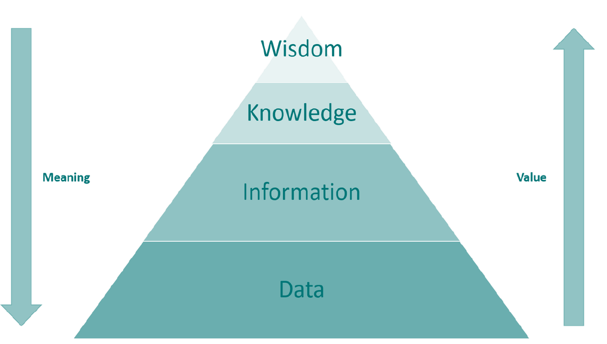
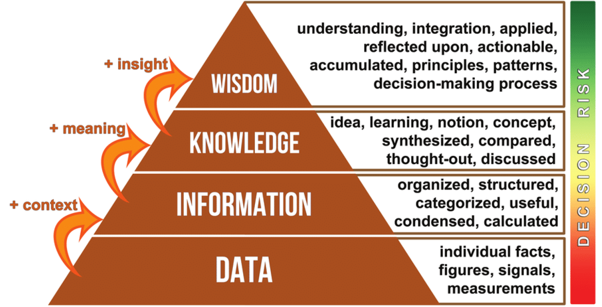

# Database Management Systems Class Notes
> Note system:
> - 2 Assigmnets: 10%
> - 4 Quizzes: 20%
> - Midterm: 25%
> - Final: 30%
> - Project: 15%
## Data Information Knowledge Wisdom (DIKW) Hierarchy

 
### Data
- Raw facts and figures
- No context
- No meaning

### Information
- Data with context
- Data with meaning
- Processed data
- Formatted data

### Knowledge
- Information with understanding
- Information with experience
- Information with insight
- Information with learning

### Wisdom
- Knowledge with wisdom
- Knowledge with intuition
- Knowledge with common sense
- Knowledge with judgment

### Examples

| Data | Information | Knowledge | Wisdom |
| --- | --- | --- | --- |
| 1234567890 | 123-45-6789 | Social Security Number | Identity |
| 12/12/2020 | December 12, 2020 | Date of Birth | Age |
| 12:00:00 | 12:00 PM | Noon | Time |

## Data Representation
### Some Data Types
- Bit
- Byte
- Numeric
    - Signed
    - Unsigned
    - Floating Point
- Character
- Text
- Image
- Sound

### Bit
- Binary Digit
- 0 or 1
- Smallest unit of data

### Byte
- 8 bits
- 256 possible values
- 0 to 255

### Numeric
- Integer
    - Signed
        - -2,147,483,648 to 2,147,483,647
    - Unsigned
        - 0 to 4,294,967,295
- Floating Point
    - 3.14
    - 2.71828

#### Decimal (Base 10) Number System
- 0 to 9

#### Binary (Base 2) Number System
- 0 to 1

#### Octal (Base 8) Number System
- 0 to 7

#### Hexadecimal (Base 16) Number System
- 0 to 9 and A (10) to F (15)

#### Prefixes
- 10^3 = Kilo (K)
- 10^6 = Mega (M)
- 10^9 = Giga (G)
- 10^12 = Tera (T)
- 10^15 = Peta (P)
- 10^18 = Exa (E)
- 10^21 = Zetta (Z)
- 10^24 = Yotta (Y)

#### Hexadecimal to Binary Conversion
- 0 = 0000
- 1 = 0001
- 2 = 0010
- 4 = 0100
- 8 = 1000
- A = 1010
- F = 1111
- 10 = 0001 0000
- 1F = 0001 1111
- 2A = 0010 1010
- 3C = 0011 1100
- 13C = 0001 0011 1100

#### Decimal to Hexadecimal Conversion
- 0 = 0
- 1 = 1
- 2 = 2
- 4 = 4
- 8 = 8
- 130: 
    - 130 / 16 = 8 with 2 remainder
- 2250:
    - 2250 / 16 = 140 with 10 remainder
    - 140 / 16 = 8 with 12 remainder
    - Result: 8AC

### Character
- A
- B
- C
- a
- b
- c
- 0
- 1
- 2

### Text
- A
- B
- CDE
- abc
- 123

### Image
- .jpg
- .png
- .gif
- .bmp

### Sound
- .mp3
- .wav
- .flac

## File Organization
### File
- Stream of bytes
- Collection of records with fields

#### File as Stream of Bytes
- 87359CarrollAlice in wonderland38180FolkFile Structures
- Data semantic is lost
- Data is not structured
- Cannot be processed

#### File as Collection of Records
- 87359, Carroll, Alice in wonderland
- 38180, Folk, File Structures
- Data semantic is preserved
- Data is structured
- Can be processed

### Record
- Collection of fields
- Collection of attributes
- Collection of columns

#### Record Structures
- Fixed Length
    - Fields have fixed length
    - Fields have fixed position
    - Fields have fixed order
    - Example: 87359CarrollAlice in wonderland38180FolkFile Structures
- Fixed Number
    - Fields have fixed length
    - Fields have fixed position
    - Fields have fixed order
    - Fields have fixed number
    - Example: 87359, Carroll, Alice in wonderland
- Begin each record with a length indicator
    - Fields have fixed length
    - Fields have fixed position
    - Fields have fixed order
    - Fields have fixed number
    - Fields have length indicator
    - Example: (5)837359(7)Carroll(18)Alice in wonderland(5)38180(4)Folk(13)File Structures
- Indexing
    - Fields have fixed length
    - Fields have fixed position
    - Fields have fixed order
    - Fields have fixed number
    - Fields have index
    - Example: 1: 87359, 2: Carroll, 3: Alice in wonderland, 4: 38180, 5: Folk, 6: File Structures

- Delimited
    - Fields have variable length
    - Fields have variable position
    - Fields have variable order
    - Fields have delimiter
    - Example: 87359/Carroll/Alice in wonderland/38180/Folk/File Structures

## XML
### XML Comments
- \<!-- Comment -->

### Why XML?
- Self-descriptive
- Human-readable
- Machine-readable
- Platform-independent
- Extensible
- Interoperable

## JSON
### Why JSON?
- Lightweight
- Human-readable
- Machine-readable
- Platform-independent
- Extensible
- Interoperable

## XML vs JSON vs CSV

| XML | JSON | CSV |
| --- | --- | --- |
| Extensible Markup Language | JavaScript Object Notation | Comma-Separated Values |
| Tags | Key-Value Pairs | Fields |
| Hierarchical | Flat | Flat |
| Complex | Simple | Simple |
| Verbose | Concise | Concise |

## SQL
### SQL Create Table
```sql
CREATE TABLE table_name (
    column1_name column1_datatype PRIMARY KEY NOT NULL UNIQUE,
    column2_name column2_datatype,
    column3_name column3_datatype NOT NULL,
    FOREIGN KEY (column2_name) REFERENCES table_name(column1_name)
);
```

### SQL Insert Into
```sql
INSERT INTO table_name (column1_name, column2_name, column3_name)
VALUES (value1, value2, value3);
```

### SQL Select
```sql
SELECT column1_name, column2_name, column3_name
FROM table_name
WHERE condition;
```

### SQL Update
```sql
UPDATE table_name
SET column1_name = value1, column2_name = value2, column3_name = value3
WHERE condition;
```

### SQL Delete
```sql
DELETE FROM table_name
WHERE condition;
```

### SQL Drop Table
```sql
DROP TABLE table_name;
```