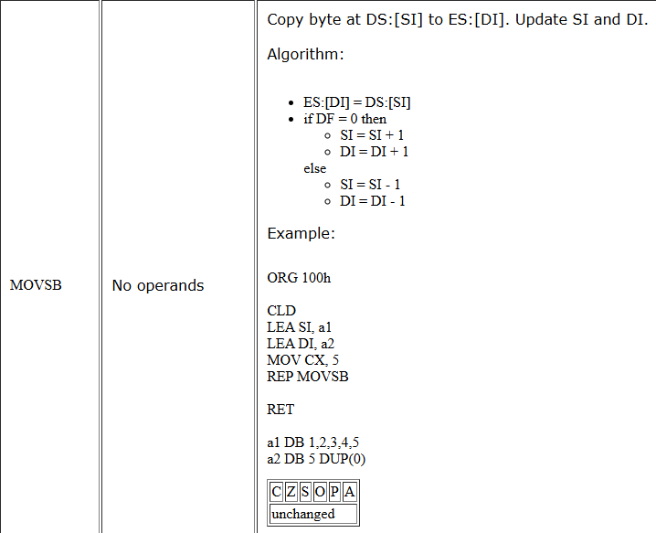
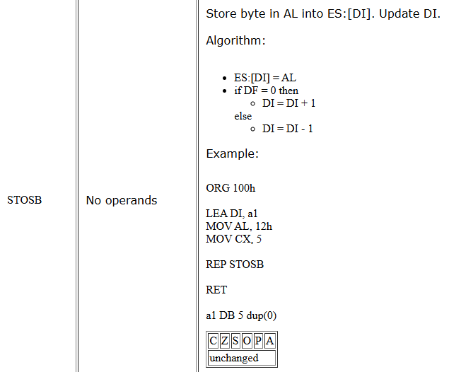

# Embedded Systems Course Notes

## Table of Contents
- [Registers, Segments, Pointers](#registers-segments-pointers)
    - [Segment Registers](#segment-registers)
    - [General Purpose Registers](#general-purpose-registers)
    - [Index Registers](#index-registers)
    - [Status Registers](#status-registers)
        - [Flags](#flags)
- [Memory Addressing Modes](#memory-addressing-modes)
- [Data Transfer Instructions](#data-transfer-instructions)
    - [MOV](#mov)
- [Arithmetic Instructions](#arithmetic-instructions)
    - [ADD](#add)
    - [INC](#inc)
    - [ADC](#adc)
    - [SUB](#sub)
    - [DEC](#dec)
    - [SBB](#sbb)
    - [CMP](#cmp)
    - [MUL](#mul)
    - [IMUL](#imul)
    - [DIV](#div)
    - [IDIV](#idiv)
- [Logical Instructions](#logical-instructions)
    - [AND](#and)
    - [OR](#or)
    - [XOR](#xor)
    - [NOT](#not)
    - [TEST](#test)
    - [NEG](#neg)
- [Shift and Rotate Instructions](#shift-and-rotate-instructions)
    - [SHL (SAL)](#shl-sal)
    - [SHR](#shr)
    - [ROL](#rol)
    - [ROR](#ror)
    - [SAL](#sal)
    - [SAR](#sar)
    - [RCL](#rcl)
    - [RCR](#rcr)
- [String Instructions](#string-instructions)
    - [LEA](#lea)
    - [MOVSB](#movsb)
    - [MOVSW](#movsw)
    - [CMPSB](#cmpsb)
    - [CMPSW](#cmpsw)
    - [SCASB](#scasb)
    - [SCASW](#scasw)
    - [LODSB](#lodsb)
    - [LODSW](#lodsw)
    - [STOSB](#stosb)
    - [STOSW](#stosw)
- [Control Transfer Instructions](#control-transfer-instructions)
    - [JMP](#jmp)
    - [JA](#ja)
    - [JBE](#jbe)
    - [JL](#jl)
    - [JGE](#jge)
    - [JNE](#jne)
    - [JE](#je)
    - [JC](#jc)
    - [JCXZ](#jcxz)
- [Iteration Instructions](#iteration-instructions)
    - [LOOP](#loop)
    - [LOOPE](#loope)
    - [LOOPNE](#loopne)

## Registers, Segments, Pointers
- 8086 has 14 16-bit registers
- 4 segment registers: CS, DS, SS, ES
- 4 general purpose registers: AX, BX, CX, DX
- 4 index registers: SI, DI, BP, SP
- 2 status registers: IP, FLAGS

### Segment Registers
- CS: Code Segment
    > Points to the segment where the program is stored
- DS: Data Segment
    > Points to the segment where the data is stored
- SS: Stack Segment
    > Points to the segment where the stack is stored
- ES: Extra Segment
    > Points to an extra segment

### General Purpose Registers
- AX: Accumulator
    > Used for arithmetic and I/O operations
- BX: Base
    > Used as a base pointer for memory access
- CX: Counter
    > Used as a loop counter
- DX: Data
    > Used as a data pointer

### Index Registers
- SI: Source Index
    > Used as a source index for string operations
- DI: Destination Index
    > Used as a destination index for string operations
- BP: Base Pointer
    > Used as a base pointer for memory access
- SP: Stack Pointer
    > Used as a stack pointer

### Status Registers
- IP: Instruction Pointer
    > Points to the next instruction to be executed
- FLAGS: Flags
    > Contains the status of the processor

#### Flags
- CF: Carry Flag
    > Set if an arithmetic operation generates a carry or borrow
- PF: Parity Flag
    > Set if the number of set bits is even
- AF: Auxiliary Carry Flag
    > Set if an arithmetic operation generates a carry from bit 3 to bit 4
- ZF: Zero Flag
    > Set if the result of an operation is zero
- SF: Sign Flag
    > Set if the result of an operation is negative
- TF: Trap Flag
    > Set if the processor is in single-step mode
- IF: Interrupt Flag
    > Set if interrupts are enabled
- DF: Direction Flag
    > Set if string operations should auto-decrement
- OF: Overflow Flag
    > Set if an arithmetic operation generates an overflow

## Memory Addressing Modes
- Immediate
    > Operand is a constant value
    > Example: `MOV AX, 5`
- Register
    > Operand is a register
    > Example: `MOV AX, BX`
- Direct, Displacement
    > Operand is a memory location
    > Example: `MOV AX, [1000]`
- Register Indirect
    > Operand is a memory location pointed to by a register
    > Example: `MOV AX, [BX]`
- Base-Index (Base Register + Index Register)
    > Operand is a memory location calculated by adding a base register and an index register
    > Example: `MOV AX, [BX+SI]`
- Register Relative
    > Operand is a memory location calculated by adding a register and a displacement
    > Example: `MOV AX, [BX+5]`
- Base-Index-Displacement
    > Operand is a memory location calculated by adding a base register, an index register, and a displacement
    > Example: `MOV AX, [BX+SI+5]`

## Data Transfer Instructions
- MOV
    > Moves data from one location to another
    > Example: `MOV AX, BX`\
    > 

## Arithmetic Instructions
- ADD
    > Adds two operands
    > Example: `ADD AX, BX`\
    > 
- INC
    > Increments an operand by 1
    > Example: `INC AX`\
    > 
- ADC
    > Adds two operands with carry
    > Example: `ADC AX, BX`\
    > 
- SUB
    > Subtracts two operands
    > Example: `SUB AX, BX`\
    > 
- DEC
    > Decrements an operand by 1
    > Example: `DEC AX`\
    > 
- SBB
    > Subtracts two operands with borrow
    > Example: `SBB AX, BX`\
    > 
- CMP
    > Compares two operands
    > Example: `CMP AX, BX`\
    > 
- MUL
    > Multiplies two operands
    > Example: `MUL BX`\
    > 
- IMUL
    > Multiplies two signed operands
    > Example: `IMUL BX`\
    > 
- DIV
    > Divides two operands
    > Example: `DIV BX`\
    > 
- IDIV
    > Divides two signed operands
    > Example: `IDIV BX`\
    > 

## Logical Instructions
- AND
    > Performs a bitwise AND operation
    > Example: `AND AX, BX`\
    > 
- OR
    > Performs a bitwise OR operation
    > Example: `OR AX, BX`\
    > 
- XOR
    > Performs a bitwise XOR operation
    > Example: `XOR AX, BX`\
    > 
- NOT
    > Performs a bitwise NOT operation
    > Example: `NOT AX`\
    > 
- TEST
    > Performs a bitwise AND operation without storing the result
    > Example: `TEST AX, BX`\
    > 
- NEG
    > Negates an operand
    > Example: `NEG AX`\
    > 

## Shift and Rotate Instructions
- SHL (SAL)
    > Shifts the bits of an operand to the left
    > Example: `SHL AX, 1`\
    > 
- SHR
    > Shifts the bits of an operand to the right
    > Example: `SHR AX, 1`\
    > 
- ROL
    > Rotates the bits of an operand to the left
    > Example: `ROL AX, 1`\
    > 
- ROR
    > Rotates the bits of an operand to the right
    > Example: `ROR AX, 1`\
    > 
- SAL
    > Shifts the bits of an operand to the left
    > Example: `SAL AX, 1`\
    > 
- SAR
    > Shifts the bits of an operand to the right
    > Example: `SAR AX, 1`\
    > 
- RCL
    > Rotates the bits of an operand to the left through the carry flag
    > Example: `RCL AX, 1`\
    > 
- RCR
    > Rotates the bits of an operand to the right through the carry flag
    > Example: `RCR AX, 1`\
    > 

## String Instructions
- LEA
    > Loads the effective address of a memory location into a register
    > Example: `LEA AX, [1000]`\
    > 
- MOVSB
    > Moves a byte from the source to the destination\
    > 
- MOVSW
    > Moves a word from the source to the destination\
    > 
- CMPSB
    > Compares a byte from the source with a byte from the destination\
    > 
- CMPSW
    > Compares a word from the source with a word from the destination\
    > 
- SCASB
    > Compares a byte from the destination with the accumulator\
    > 
- SCASW
    > Compares a word from the destination with the accumulator\
    > 
- LODSB
    > Loads a byte from the source into the accumulator\
    > 
- LODSW
    > Loads a word from the source into the accumulator\
    > 
- STOSB
    > Stores a byte from the accumulator into the destination\
    > 
- STOSW
    > Stores a word from the accumulator into the destination\
    > 

## Control Transfer Instructions
- JMP
    > Jumps to a specified address
    > Example: `JMP 1000`\
    > 
- JA
    > Jumps if above (CF=0 and ZF=0)
    > Example: `JA 1000`\
    > 
- JBE
    > Jumps if below or equal (CF=1 or ZF=1)
    > Example: `JBE 1000`\
    > 
- JL
    > Jumps if less (SF!=OF)
    > Example: `JL 1000`\
    > 
- JGE
    > Jumps if greater or equal (SF=OF)
    > Example: `JGE 1000`\
    > 
- JNE
    > Jumps if not equal (ZF=0)
    > Example: `JNE 1000`\
    > 
- JE
    > Jumps if equal (ZF=1)
    > Example: `JE 1000`\
    > 
- JC
    > Jumps if carry (CF=1)
    > Example: `JC 1000`\
    > 
- JCXZ
    > Jumps if CX is zero
    > Example: `JCXZ 1000`\
    > 

## Iteration Instructions
- LOOP
    > Decrements CX and jumps if CX is not zero
    > Example: `LOOP 1000`\
    > 
- LOOPE
    > Decrements CX and jumps if CX is not zero and ZF is zero
    > Example: `LOOPE 1000`\
    > 
- LOOPNE
    > Decrements CX and jumps if CX is not zero and ZF is one
    > Example: `LOOPNE 1000`\
    > 