# <center>BIL365 - Makine Öğrenmesi</center>

- *Değerlendirme Sistemi*:
    - Ara Sınav: 40%
        - Sınav: 100%
    - Final: 60%
        - Sınav: 60%
        - Proje: 40%
<hr>

# Ders Notları

## İçindekiler

- [BIL365 - Makine Öğrenmesi](#bil365---makine-öğrenmesi)
- [Ders Notları](#ders-notları)
  - [İçindekiler](#i̇çindekiler)
    - [Giriş ve Temel Kavramlar](#giriş-ve-temel-kavramlar)
      - [Dersin Amacı](#dersin-amacı)
      - [Öğrenme Çıktıları](#öğrenme-çıktıları)
      - [Giriş](#giriş)
      - [Neden Makine Öğrenimine İhtiyaç Vardır?](#neden-makine-öğrenimine-i̇htiyaç-vardır)
        - [Makine Öğrenimi Modeli Nedir?](#makine-öğrenimi-modeli-nedir)
      - [Makine Öğrenmesi Süreci](#makine-öğrenmesi-süreci)
      - [Temel Kavramlar](#temel-kavramlar)
        - [Özellikler ve Özellik Vektörü](#özellikler-ve-özellik-vektörü)
  - [Model Değerlendirme](#model-değerlendirme)
    - [Model Başarılarını Ölçmek için Kullanılan Teknikler](#model-başarılarını-ölçmek-için-kullanılan-teknikler)
    - [İç İçe (Nested) Çapraz Doğrulama](#i̇ç-i̇çe-nested-çapraz-doğrulama)
    - [Hiperparametre Optimizasyonu](#hiperparametre-optimizasyonu)
        - [Karar Sınırı ve Model Karmaşıklığı](#karar-sınırı-ve-model-karmaşıklığı)
    - [Bir Modelin Seçilmesi için Gereken Kriterler](#bir-modelin-seçilmesi-için-gereken-kriterler)
      - [Performans ve Doğruluk Kriterleri](#performans-ve-doğruluk-kriterleri)
      - [Operasyonel ve Verimlilik Kriterleri](#operasyonel-ve-verimlilik-kriterleri)
      - [Yapısal ve Uygulama Kriterleri](#yapısal-ve-uygulama-kriterleri)
      - [Bağlama Göre Önceliklendirme Örnekleri](#bağlama-göre-önceliklendirme-örnekleri)
  - [Makine öğrenme sorunu](#makine-öğrenme-sorunu)
  - [Lineer Regresyon](#lineer-regresyon)
    - [Notasyon (sürekli kullanılacaktır)](#notasyon-sürekli-kullanılacaktır)
  - [Çok değişkenli (çok boyutlu) Lineer Regresyon](#çok-değişkenli-çok-boyutlu-lineer-regresyon)
    - [Maliyet fonksiyonu](#maliyet-fonksiyonu)
  - [Dereceli azaltma metodu](#dereceli-azaltma-metodu)
  - [Sınıflandırma (Classification) — Giriş](#sınıflandırma-classification--giriş)
  - [Sınıflandırma Başarı Metrikleri](#sınıflandırma-başarı-metrikleri)
    - [Karmaşıklık Matrisi (Confusion Matrix)](#karmaşıklık-matrisi-confusion-matrix)
    - [Temel Ölçütler](#temel-ölçütler)
    - [ROC Eğrisi ve AUC](#roc-eğrisi-ve-auc)
  - [Uzaklık Ölçüleri](#uzaklık-ölçüleri)
    - [Öklid Uzaklığı (Euclidean Distance)](#öklid-uzaklığı-euclidean-distance)
    - [Karesel Öklid Uzaklığı (Squared Euclidean)](#karesel-öklid-uzaklığı-squared-euclidean)
      - [Örnek: Sıcaklık ve Nem Oranı ile Öklid Uzaklığı](#örnek-sıcaklık-ve-nem-oranı-ile-öklid-uzaklığı)
    - [Karl Pearson Uzaklığı (Standartlaştırılmış Öklid)](#karl-pearson-uzaklığı-standartlaştırılmış-öklid)
      - [Örnek: Sıcaklık ve Nem Oranı ile Karl Pearson Uzaklığı](#örnek-sıcaklık-ve-nem-oranı-ile-karl-pearson-uzaklığı)
    - [Manhattan (City-Block) Uzaklığı](#manhattan-city-block-uzaklığı)
      - [Örnek: Sıcaklık ve Nem Oranı ile Manhattan Uzaklığı](#örnek-sıcaklık-ve-nem-oranı-ile-manhattan-uzaklığı)
    - [Minkowski (Lp) Uzaklığı](#minkowski-lp-uzaklığı)
    - [Özellik Ölçekleme (Feature Scaling) — Mesafe Tabanlı Yöntemler](#özellik-ölçekleme-feature-scaling--mesafe-tabanlı-yöntemler)
      - [Normalleştirme (Min–Max)](#normalleştirme-minmax)
        - [Örnek: Min–Max Normalleştirme (min=2, max=90)](#örnek-minmax-normalleştirme-min2-max90)
  - [K-en Yakın Komşu (K-NN) Algoritması](#k-en-yakın-komşu-k-nn-algoritması)
    - [Adımlar](#adımlar)
    - [Pratik Notlar](#pratik-notlar)
    - [Örnek 1: (8,4) İçin K-NN Sınıflandırma (k = 4)](#örnek-1-84-i̇çin-k-nn-sınıflandırma-k--4)
    - [Örnek 2: (7,8,5) İçin K-NN — Min–Max Normalizasyon ile (k = 3)](#örnek-2-785-i̇çin-k-nn--minmax-normalizasyon-ile-k--3)
    - [Ağırlıklı Oylama (Weighted Voting)](#ağırlıklı-oylama-weighted-voting)
  - [Destek Vektör Makineleri (Support Vector Machines — SVM)](#destek-vektör-makineleri-support-vector-machines--svm)
    - [Karar Düzlemi, Marjin ve Destek Vektörleri](#karar-düzlemi-marjin-ve-destek-vektörleri)
    - [Sert ve Yumuşak Kenar Formülasyonu](#sert-ve-yumuşak-kenar-formülasyonu)
    - [Kernel Hilesi (Kernel Trick)](#kernel-hilesi-kernel-trick)
    - [Avantajlar (özet)](#avantajlar-özet)
  - [Karar Ağaçları](#karar-ağaçları)
    - [Dallanma Kriterleri](#dallanma-kriterleri)
    - [Örnek: Kök Düğüm Seçimi ve Dallanma Üzerine](#örnek-kök-düğüm-seçimi-ve-dallanma-üzerine)
    - [Karar ağacı oluşturma adımları](#karar-ağacı-oluşturma-adımları)
    - [En iyi bölen niteliği belirleme (İyilik Fonksiyonu)](#en-iyi-bölen-niteliği-belirleme-i̇yilik-fonksiyonu)
    - [Entropi](#entropi)
      - [Örnek: Entropi Hesabı](#örnek-entropi-hesabı)
      - [Örnek: MEMNUN Entropisi](#örnek-memnun-entropisi)
    - [Bilgi Kazancı (ID3 / C4.5)](#bilgi-kazancı-id3--c45)
      - [İşlem Adımları](#i̇şlem-adımları)
      - [Örnek: Bilgi Kazancı Hesabı (BORÇ özelliği)](#örnek-bilgi-kazancı-hesabı-borç-özelliği)
      - [Örnek: Bilgi Kazancı — MEMNUN Veri Kümesi](#örnek-bilgi-kazancı--memnun-veri-kümesi)
  - [Uygulama: Hava Problemi (ID3 / C4.5)](#uygulama-hava-problemi-id3--c45)
    - [Adım 1: Birinci Dallanma](#adım-1-birinci-dallanma)
    - [Adım 2: HAVA = “güneşli” dalı için dallanma](#adım-2-hava--güneşli-dalı-için-dallanma)
    - [Adım 3: HAVA = “bulutlu” dalı için dallanma](#adım-3-hava--bulutlu-dalı-için-dallanma)
    - [Sonuç: Oluşturulan Karar Ağacı](#sonuç-oluşturulan-karar-ağacı)
    - [C4.5 Algoritması](#c45-algoritması)
    - [Sınıflandırma ve Regresyon Ağaçları (CART)](#sınıflandırma-ve-regresyon-ağaçları-cart)
      - [Bölme (Split) Nasıl Seçilir?](#bölme-split-nasıl-seçilir)
      - [Sınıflandırma için Ölçütler](#sınıflandırma-için-ölçütler)
      - [Twoing Algoritması (detay)](#twoing-algoritması-detay)
        - [Örnek: Twoing ile Karar Ağacı (MEMNUN — 11 gözlem)](#örnek-twoing-ile-karar-ağacı-memnun--11-gözlem)
      - [Gini Algoritması (detay)](#gini-algoritması-detay)
        - [Örnek: Gini ile Karar Ağacı](#örnek-gini-ile-karar-ağacı)
        - [Sayısal Değerler için Gini Algoritması](#sayısal-değerler-için-gini-algoritması)
      - [Regresyon için Ölçütler](#regresyon-için-ölçütler)
        - [Regresyon Ağaçları (detay)](#regresyon-ağaçları-detay)
          - [Örnek (küçük veri seti)](#örnek-küçük-veri-seti)
      - [Regresyon Başarı Metrikleri](#regresyon-başarı-metrikleri)
        - [Ortalama Kare Hata (MSE) ve Kök Ortalama Kare Hata (RMSE)](#ortalama-kare-hata-mse-ve-kök-ortalama-kare-hata-rmse)
        - [Belirleme Katsayısı (R²)](#belirleme-katsayısı-r)
      - [Uygulama Notları](#uygulama-notları)
    - [Kural Çıkartma (Rule Extraction)](#kural-çıkartma-rule-extraction)
    - [Bilinmeyen Öznitelik Değerleri (Missing Values)](#bilinmeyen-öznitelik-değerleri-missing-values)
    - [Ezber (Overfitting) ve Budama](#ezber-overfitting-ve-budama)
      - [Ağaç Budama](#ağaç-budama)
        - [Örnek: Hata toleransı ile budama](#örnek-hata-toleransı-ile-budama)

### Giriş ve Temel Kavramlar

#### Dersin Amacı

Makine öğrenimi (ML) günümüzün IoT ve Büyük Veri uygulamalarında anormallik algılama, tahmin, sınıflandırma, kümeleme, ilişkilendirme, boyut azaltma, desen tanıma, eğilim analizi ve öngörücü bakım gibi birçok alanda kullanılmaktadır. Bu dersin amacı, makine öğrenmesi kavramlarını teorik temelleri ve pratik uygulamalarıyla birlikte kapsamlı şekilde öğretmektir.

**Önemli Noktalar**

- Kullanım alanları: anormallik tespiti, regresyon (tahmin), sınıflandırma, kümeleme, ilişkilendirme kuralları, boyut azaltma, desen tanıma, eğilim analizi, öngörücü bakım.
- IoT ve Büyük Veri gibi modern veri ekosistemleri ML uygulamalarının önemini artırır.
- Ders hem algoritma/matematiksel model geliştirme (optimizasyon, modelleme) hem de pratik uygulama örneklerine odaklanacaktır.

**Önemli Tanımlar**

- Makine Öğrenmesi: Veriden öğrenen ve performansını veriyle iyileştirebilen algoritmalar ve modeller bütünü.
- Anormallik Algılama: Normal davranıştan sapmaları tespit etmeye yönelik yöntemler.
- Öngörücü Bakım: Sensör verileri ve modeller kullanılarak ekipman arızalarını önceden tahmin etme süreci.

#### Öğrenme Çıktıları

- Makine öğrenmesi kavramını öğrenir.
- Makine öğrenmesi türlerini öğrenir.
- En çok kullanılan makine öğrenmesi algoritmalarını öğrenir.
- Farklı alanlardaki problemlere makine öğrenmesi çözümlerini uygular ve yorumlar.
- Farklı makine öğrenmesi yöntemlerinin avantaj ve dezavantajlarını kıyaslayarak yorumlar.
- Makine öğrenmesi sonuçlarını (model çıktıları) yorumlar.

#### Giriş

- Öğrenme, deneyim yoluyla bilgi, anlayış veya beceri kazanma; davranışsal eğilimlerin deneyime göre düzeltilmesi, güncellenmesi ve iyileştirilmesidir.
- Bilgi sayısallaştırılıp veriye dönüştürüldüğünde, veri toplayan, sınıflandıran, birleştiren ve kıyaslama yapan algılayıcıların doğru karar verebilmesi için insan ve hayvanlardaki algılama/öğrenme süreçlerinin iyi anlaşılması önemlidir.
- Doğadaki örnekler: baykuşlar bir farenin ayak sesini kilometrelerce öteden algılayabilir; filler uzak mesafelerden gelen sismik sinyalleri hisseder; yaban arıları tehditleri önceden fark edip topluca saldırıya geçebilir — bunlar algılama ve öğrenmenin farklı örüntüleridir.

- Bu bölümde hedef: makine öğrenmesinin temel kavramlarını, öğrenmenin tanımını ve biyolojik algılama örneklerinin ML için taşıdığı ilhamı kısa ve somut bir şekilde sunmak.

**Makine Öğrenimi — Kullanım Durumları**

- Anormallik algılama
- Tahmin (regresyon)
- Sınıflandırma
- Kümeleme
- İlişkilendirme (association rules)
- Boyut azaltma
- Desen bulma
- Eğilim ya da yön bulma
- Öngörücü bakım

Bu kullanım durumları, gelişmiş bilişim uygulamaları (IoT, Büyük Veri vb.) içinde makine öğrenmesinin yaygın olarak kullanılmasının nedenlerini gösterir.

**Örnek — E-posta (Spam) Filtreleme**

- Kural tabanlı yaklaşım: Geçerli e-posta ile istenmeyen postaları ayırt etmek için sabit kurallar (ör. sahte başlık, belirli kelimeler) yazılabilir.
- Zorluklar: Hangi metnin geçerli olduğunu doğru şekilde tanımlayan kurallar yazmak zordur; bu, ya çok sayıda kaçırılmış spam (false negatives) ya da yanlış yere bloklanan geçerli e-postalar (false positives) ile sonuçlanır.
- Uyarlanma problemi: Spam gönderenler stratejilerini değiştirerek kuralları atlatabilir; kuralları yazmak ve güncel tutmak yorucu ve etkisiz hale gelir.
- Neden ML: Makine öğrenimi sistemleri veriden öğrenerek farklı örüntüleri yakalayabilir, zamanla güncellenebilir ve kural yazma yükünü azaltarak daha esnek bir çözüm sunar.

#### Neden Makine Öğrenimine İhtiyaç Vardır?

- Tanım: Makine öğrenimi, örnek veriler veya geçmiş deneyimleri kullanarak belirli bir performans kriterini optimize etmek için bilgisayarları programlama yaklaşımıdır.
- Amaç: Olasılıksal modeller kurarak büyük veri kütlelerinden faydalı bilgileri otomatik çıkarmak ve karar süreçlerini desteklemek.
- Uygunluk: Genel bir teorinin/kapalı form çözümün olmadığı; ancak çok miktarda verinin bulunduğu alanlarda özellikle etkilidir.
- ML çalışması: Deneyimle bazı görevlerde performansı artıran algoritmaların geliştirilmesidir; çıkarım, model uydurma (fit) ve örneklerden öğrenme yoluyla veriden teoriyi otomatik olarak “öğrenmek”.

- Örnekler dışında bazı görevler iyi tanımlanamaz (örn. yüzlerin veya insanların tanınması); bu yüzden kural tabanlı açık kodlama yetersiz kalır.
- Büyük miktarda veride gizli ilişkiler ve korelasyonlar bulunabilir; bunları güvenilir biçimde ortaya çıkarmak için otomatik/ML tabanlı yaklaşımlar gerekir.
- Belirli bir sorun hakkında açık kurallar yazmak için gereken bilgi miktarı insanlar için çok büyük olabilir (örn. tıbbi teşhis); ML bu yükü veriden öğrenerek azaltır.
- Ortamlar ve veri dağılımları zamanla değişir (concept drift); sistemleri “elle” sürekli yeniden tasarlamak zor ve maliyetlidir, ML modelleri güncellenerek uyum sağlayabilir.

**Makine öğrenmesinde:**

- Öğrenme görevi: Ne öğrenmek ya da tahmin etmek istiyoruz?
- Veriler ve varsayımlar: Elimizde hangi veriler var, kaliteleri nedir; problem hakkında neleri varsayabiliriz?
- Temsil (representation): Örneklerin/özniteliklerin uygun temsili nedir? (özellik mühendisliği, embedding vb.)
- Yöntem ve tahmin: Uygun hipotez sınıfı ve öğrenme algoritması nedir; tahminlerimizi gözlenen sonuçlara göre ayarlayabiliyor muyuz? (optimizasyon)
- Değerlendirme: Yöntem ne kadar iyi; alternatif bir yaklaşım/model daha iyi performans gösterebilir mi? (doğruluk, F1, MSE; çapraz doğrulama)

Temel görev türleri:

- Sınıflandırma: Bir öğenin sınıfının tahmini (denetimli).
- Öngörü (regresyon): Sayısal bir parametre değerinin tahmini (denetimli).
- Karakterizasyon: Öğe gruplarını tanımlayan hipotezlerin/kuralların bulunması (örn. ilişkilendirme kuralları).
- Kümeleme: Etiketlenmemiş veri kümesinin ortak özelliklere göre kümelere ayrılması (denetimsiz).
##### Makine Öğrenimi Modeli Nedir?

Bir makine öğrenimi modeli; belirli bir görevi (tahmin, sınıflandırma vb.) veriden öğrenerek yerine getiren ve girdileri yanıtlara dönüştüren hesaplama sistemidir. Amaç, iş sonuçlarını iyileştirecek içgörüler üretmek ve hangi parametrelerin/özniteliklerin daha etkili olduğunu veriye dayanarak belirlemektir.

Disiplinler (çok-disiplinli temel):

- Mühendislikler: Bilgisayar, Elektronik, Makine
- Matematik: Olasılık, İstatistik, Nümerik analiz, İşaret işleme, Uygulamalı matematik, Stokastik, Algoritma
- Yaşam/Doğa Bilimleri: Antropoloji, Zooloji, Biyoloji, Bakteriyoloji, Genetik, Nörobiyoloji, Paleontoloji
- Uzay bilimleri

**Örnek — Kedi/Köpek Sınıflandırma**

- Amaç: Kedi ve köpek görsellerini doğru sınıflara ayırmak.
- Aday öznitelikler:
    - Her hayvanın kaç gözü vardır?
    - Her hayvanın göz rengi nedir?
    - Her bir hayvanın boyu kaçtır?
    - Her bir hayvanın uzunluğu nedir?
    - Her bir hayvanın bacak uzunlukları nedir?
    - Her bir hayvanın ağırlığı nedir?
    - Her hayvan genellikle ne yer?
- Not: Görüntü problemlerinde bu tür öznitelikler çoğu zaman doğrudan ölçülemez; klasik yaklaşımlarda özellik çıkarımı gerekirken, derin öğrenme (CNN) ham piksellerden ayırt edici temsilleri otomatik olarak öğrenebilir.

- Öznitelik vektörü ve kurallar: Yukarıdaki soruların her biri bir özniteliğe karşılık gelir ve x ∈ ℝ^d vektöründe temsil edilir. Basit kural tabanlı sınıflandırmada, örn. “boy > 30 cm ve ağırlık > 2 kg ise köpek” gibi eşik kuralları kullanılabilir.
- Karar ağaçları: if/else if/else yapılarıyla kurulan karar ağaçları, bu kuralları hiyerarşik biçimde uygular ve örneğin hangi kategoriye girdiğini test eder.
- ML’nin katkısı: Veriyi farklı algoritmalarla işleyip hangi özniteliklerin sınıflandırmada daha önemli/etkin olduğunu ortaya koyar (ör. ağaç tabanlı önem, lojistik regresyon katsayıları, permütasyon önemi).
- Özellik seçimi ve boyut indirgeme: Sonuca etkisi yüksek birkaç özniteliği seçmek (özellik seçimi) veya temsili 2–3 boyuta indirgemek (ör. PCA ile) modeli basitleştirir, genellikle daha iyi genelleme ve daha kararlı doğruluk sağlar.

> \
> 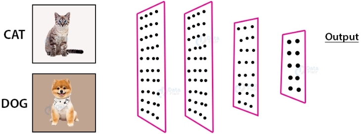
>
> Açıklama: Solda giriş görüntüleri (kedi/köpek), ortada evrişim katmanları (öğrenilen filtreler; kenarlar/tekstürler → parçalar → bütün), sağda yoğun (fully-connected) katman ve çıktı. İkili sınıflandırmada son katman genelde sigmoid olasılık verir: p(cat|x) = σ(wᵀh + b). Kayıp: çapraz entropi L = −[y log p + (1−y) log(1−p)].

**Veri Görselleştirme — x1, x2 örneği**

- Veri boyutu büyüdükçe insanların ham sayı tablosundan faydalı bilgi çıkarması zorlaşır.
- Verinin sunuluş biçimi (uzun tablolar, ham sayılar) anlamayı güçleştirebilir.
- Aynı veriyi bir grafik üzerinde (ör. saçılım diyagramı) göstermek; kümeleri, eğilimleri ve olası karar sınırlarını daha anlaşılır hale getirir.

>\
> 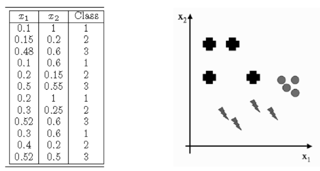
>
> Açıklama: Solda x1, x2 ve sınıf etiketini içeren bir tablo; sağda x1–x2 düzleminde örneklerin dağılımı. Görselleştirme sınıf kümelerini sezgisel hale getirir ve model seçimi/karar sınırı tasarımına yardımcı olur.

**Boyut ve Boyut Azaltma**

- Yüksek boyut (çok sayıda öznitelik) insanlar için kavramsal olarak zordur; bilgisayarlar işleyebilir fakat veri gereksinimi artar ve "boyutlanma laneti" riski doğar.
- İki yaklaşım: (a) Boyut azaltıp problemi kendin çözmek, (b) Boyut azaltmadan makine öğrenmesi ile bilgisayara çözdürmek. Hangisinin avantajlı olduğu probleme, veri miktarına ve bilgi kaybı riskine bağlıdır.
- Boyut azaltmak faydalı bilgileri de ortadan kaldırabilir; bu nedenle seçiminizi doğrulamak için her zaman çapraz doğrulama ile performans karşılaştırması yapın.
- Pratik öneri:
    - Hızlı keşif ve görselleştirme için boyut azaltma (PCA, t‑SNE, UMAP) kullanın.
    - Modelleme için önce güçlü bir temel model deneyin (ağaç tabanlı yöntemler, düzenlemeli lineer modeller, derin ağlar) ve öznitelik önemleri/katkılarını inceleyin.
    - Gerekirse denetimli özellik seçimi veya boyut azaltma uygulayın; bilgi kaybını ve genelleme başarımını metriklerle izleyin.

**Genelleme Kapasitesi**

- Amaç: Modelin yalnızca gördüğü örnekleri ezberlemesi değil, görmediği yeni örneklerde de yüksek performans göstermesidir (genelleme).
- Satranç örneği: Başlarda yendiğiniz bilgisayarı zamanla yenememeniz çoğunlukla sizin kötüleşmeniz değil, modelin daha iyi stratejiler öğrenip farklı rakiplere ve pozisyonlara da uygulayabilmesidir.
- “Siz mi kötü oynuyorsunuz, bilgisayar mı öğreniyor?” — Bilgisayar deneyimledikçe öğrendiği örüntüleri genelleyip yeni durumlara aktarır; bu genelleme kapasitesidir.
- Tehlikeler: Aşırı uyum (overfitting) → eğitimde çok iyi, yeni veride zayıf; yetersiz uyum (underfitting) → eğitim ve testte birden zayıf.
- Nasıl geliştiririz? Yeterli ve çeşitli veri, uygun model kapasitesi, düzenlileştirme (L1/L2, dropout), erken durdurma, veri artırma (augmentation), çapraz doğrulama ve ayrı doğrulama/test setleri.
- Ölçüm: Eğitim–doğrulama/test hataları; genelleme açığı = eğitim hatası − doğrulama/test hatası. Hedef, bu farkı ve toplam hatayı küçültmektir.

**Öğrenme Türleri**

- “Bilgisayar daha iyi bir konuma geldiğini nasıl bilir?” — Aldığı geri bildirim türüne göre: etiketli hedefe göre hata (denetimli), verinin iç yapısına dair ölçütler (denetimsiz) ya da ödül sinyali (takviyeli).
- Danışmanlı (Supervised) Öğrenme:
    - Girdi x ile hedef y verilir; amaç kaybı (örn. MSE, çapraz entropi) minimize ederek doğru fonksiyonu/karar sınırını öğrenmektir.
    - Performans, doğrulama/test metrikleriyle izlenir (doğruluk, F1, RMSE). Örnekler: spam tespiti, fiyat tahmini.
    - Eğitim setinde her giriş için doğru çıkış (etiket) verilir; algoritma bu veriden öğrenerek olası tüm girişler için doğru cevabı vermeye (genellemeye) çalışır.
    - Görevler: sınıflandırma (kategori tahmini) ve regresyon (sayısal değer tahmini).
    - Veri bölmeleri: eğitim/doğrulama/test; ayrıca k-katlı çapraz doğrulama ile güvenilir performans tahmini.
    - Geri bildirim: Etiket–tahmin farkından hesaplanan kayıp ve gradyanla parametreler güncellenir (örn. gradyan inişi). Aşırı uyumu önlemek için düzenlileştirme ve erken durdurma kullanılır.
    
> \
> 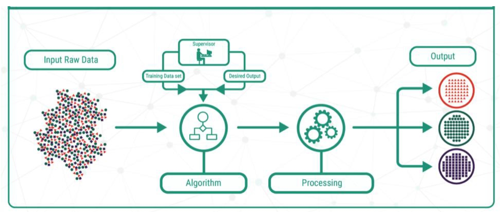
>
> Açıklama: Etiketli veri (x, y) → model f_θ → kayıp L(y, f_θ(x)) → optimizasyon (öğrenme) → değerlendirme (train/val/test). Amaç, görülmeyen örneklerde de düşük hata (iyi genelleme) elde etmektir.

**Danışmanlı Öğrenme — Regresyon**

- Hedef: Sürekli sayısal değişkenin tahmini (ör. fiyat, sıcaklık, talep, ömür).
- Kayıp fonksiyonları: MSE (ortalama karesel hata), MAE (ortalama mutlak hata). MAE aykırı değerlere karşı daha dayanıklıdır; MSE gradyan tabanlı optimizasyonla uyumludur.
- Değerlendirme metrikleri: RMSE, MAE, R². R² ≈ 1’e yakınsa iyi uyum; < 0 ise basit ortalama tahmininden kötü.
- Modeller: Doğrusal regresyon, polinomsal özellikler; düzenlileştirme (Ridge=L2, Lasso=L1, Elastic Net); ağaç/ansamble (Random Forest, GBM), SVR, yapay sinir ağları.
- Ön işleme: Ölçekleme (standart/min‑max), kategorik kodlama, aykırı değer analizi, özellik mühendisliği.
- Değerlendirme: Train/val/test bölmesi; k‑katlı çapraz doğrulama; artık (residual) analizi ile hataların desenini kontrol etme; bias‑variance dengesi.

- Temel ilkeler (özet):
    - Çıkış kategorik değil, gerçek (sürekli) değerlerdir.
    - X’in bir fonksiyonu olan Y’yi tanımlayan bir model seçilir: y ≈ f_θ(x).
    - Tahmin edilen ile gerçek çıkış arasındaki farkı minimize eden parametre/katsayılar (θ) öğrenilir.

> \
> 
>
> Açıklama: Sürekli hedef y için f_θ(x) ile tahmin; kaybı (MSE/MAE) minimize ederek parametreler öğrenilir. R²/RMSE ile performans raporlanır; amaç, görülmeyen veride düşük hata ve kararlı genellemedir.

> \
> 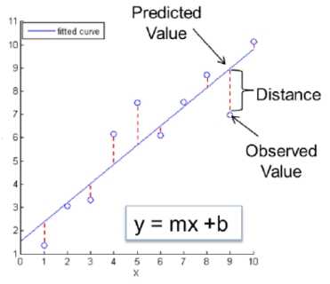
>
> Açıklama: Regresyonda hedef gerçek değerlerdir; bir fonksiyon ailesi seçilir ve parametreler, tahmin–gerçek farkını en aza indirecek şekilde öğrenilir (ERM: ampirik risk minimizasyonu).

**Danışmanlı Öğrenme — Sınıflandırma**

- Hedef: Ayrık/kategorik sınıf etiketinin tahmini (ör. spam/ham, hastalık var/yok, tür A/B/C).
- Kayıp fonksiyonu: Çapraz entropi (log loss); ikili sınıflandırmada sigmoid + BCE, çok sınıflıda softmax + CCE.
- Metrikler: Doğruluk (accuracy), kesinlik (precision), duyarlılık (recall), F1; dengesiz veride ROC‑AUC/PR‑AUC ve sınıf bazlı raporlar kullanın.
- Modeller: Lojistik regresyon, k‑NN, Naive Bayes, SVM, karar ağaçları, Random Forest, Gradient Boosting (XGBoost/LightGBM), yapay sinir ağları.
- Ön işleme: Ölçekleme (özellikle LR/SVM/k‑NN), kategorik kodlama, sınıf dengesi (class_weight, yeniden örnekleme/SMOTE), özellik seçimi.
- Değerlendirme: Karışıklık matrisi, eşik ayarı (threshold tuning), kalibrasyon (Platt/Isotonic), k‑katlı çapraz doğrulama.

> \
> 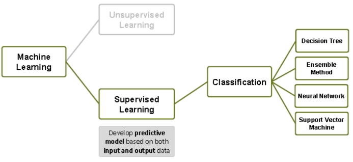
>
> Açıklama: Girdi özellikleri → model → sınıf olasılıkları/prediksiyon; çapraz entropi ile öğrenme, F1/ROC‑AUC gibi metriklerle değerlendirme. Hedef, yeni örneklerde yüksek doğruluk ve dengeli hata profili.

- Kısa yanıtlar:
    - Sınıflandırma nedir? Her veri noktası için en olası/doğru sınıfı tahmin etme problemidir.
    - Neye dayanır? Etiketli verilerden, giriş özniteliklerini kullanarak öğrenir.
    - Neden kullanılır? Daha önce görülmemiş verileri doğru sınıflara ayırmak ve otomatik karar vermek için.
    - Nasıl yapılır? Birçok algoritma (LR, SVM, ağaçlar, k‑NN, NN vb.) ile tahmin modeli kurulur; eğitim verisinin kalitesi ve temsiliyeti sonuç için kritiktir.

> \
> 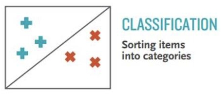
>
> Açıklama: Sınıflandırmada amaç, öznitelik uzayında karar sınırları öğrenerek yeni örnekleri doğru sınıfa atamaktır; veri kalitesi, sınıf dengesi ve uygun metrik seçimi başarıyı belirler.

> \
> 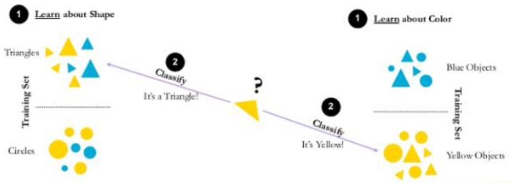
>
> Açıklama: Karar sınırları ve sınıf ayrılabilirliği örnekleri; model/parametre seçimi ve eşik ayarıyla birlikte, dengesiz veri için uygun metrikler (ROC‑AUC/PR‑AUC) başarıyı etkiler.

- Örnek — Bozuk para tanıyan makine:
    - Amaç: Farklı madeni paraları (ör. 1 TL, 50 kr, 25 kr) otomatik olarak doğru sınıfa ayırmak.
    - Aday öznitelikler: Çap (mm), ağırlık (g), kalınlık, kenar tırtıklılığı (dairesellik), materyal/alaşım (manyetik tepki), renk/yansıma, görsel desen/doku.
    - Hangi öznitelikler? Basit ve güvenilir ölçülebilenlerden başlayın: çap ve ağırlık çoğu zaman güçlü ayırıcıdır; kalınlık/kenar bilgisi yardımcı olabilir. Kamera varsa şekil/tekstür eklenebilir.
    - Veri hazırlama: Ölçekleme (standart/min‑max), ölçüm gürültüsü ve toleranslar, sınıf dengesi; farklı üretim yılları/yıpranma koşulları için temsili veri toplayın.
    - Model ve eşik: Lojistik regresyon veya k‑NN ile başlayın; sınıflar zor ayrılıyorsa SVM/Ağaç tabanlı yöntemleri deneyin. Karışıklık matrisi ve sınıf‑bazlı F1 ile eşiği ayarlayın.
    - Özellik seçimi: Korelasyon/mutual information, ağaç önemleri veya permütasyon önemiyle gereksiz/tekrarlı (kollinear) özellikleri eleyin.
    - Basit temel (baseline): Sadece çap ile ayırmayı deneyin → ağırlığı ekleyin → gerekiyorsa kalınlık/şekil; her adımda çapraz doğrulama ile kazancı ölçün.
    - Önemli notlar:
        - Parametre seçimi zor bir süreçtir: Çok sayıda parametre kullanmak istemeyiz; ancak ayrım yapmayı sağlayacak kadar da parametre olmalıdır.
        - Sadece renk kullansak başarısız oluruz; farklı paralar aynı renkte olabilir.
        - Türk lirası örneğinde tüm paralar daire şeklinde olduğundan “daire” bilgisinin ayırt ediciliği düşüktür; tek başına bize bir şey katmaz.

> \
> 
>
> Açıklama: Çap–ağırlık (ve gerekirse kalınlık) uzayında madeni paraların ayrılabilirliği. Basit, güvenilir sensörlerden gelen birkaç özellik, yüksek doğruluk için çoğu zaman yeterlidir; ihtiyaç halinde ek özelliklerle karar sınırı rafine edilir.

- Karar sınırları (decision boundaries):
    - Farklı sınıflandırma algoritmalarının ortak amacı, öznitelik uzayında karar sınırlarını öğrenmektir.
    - Böylece yeni bir girişin hangi sınıfa ait olacağı belirlenmiş olur.
    - Şekilde soldaki doğrulardan oluşan karar sınırları, sağdaki eğrisel karar sınırlarına kıyasla daha düşük performans gösterebilir (karmaşık dağılımlarda doğrusal modeller yetersiz kalır).

> \
> 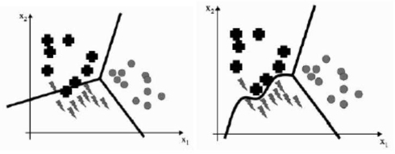
>
> Açıklama: Solda doğrusal (lineer) karar sınırları, sağda doğrusal olmayan (eğrisel) karar sınırları. Veri dağılımı karmaşıksa çekirdekli SVM, ağaç/ansamble yöntemler veya özellik dönüşümleri ile daha esnek sınırlar öğrenilebilir; ancak model karmaşıklığı–genelleme dengesini çapraz doğrulama ve ROC‑AUC/PR‑AUC gibi metriklerle doğrulayın.

- Danışmansız (Unsupervised) Öğrenme:
    - Etiket yoktur; amaç yapıyı keşfetmek (kümeler, düşük boyutlu temsil, yoğunluk). Ölçüm: siluet skoru, rekonstrüksiyon hatası vb.; çoğu zaman alan bilgisinin yorumu gerekir.
    - Örnekler: müşteri segmentasyonu, anomali tespiti, PCA ile boyut indirgeme.
    - Eğitim setinde girişlere karşılık çıkış verilmez; algoritma benzerlikleri kendisi keşfeder ve girişleri kategorize/gruplandırır.
 
**Danışmansız Öğrenme**

- Amaç: Etiket olmadan verinin iç yapısını/örüntülerini ortaya çıkarmak; kümeler, yoğunluk bölgeleri veya düşük boyutlu temsiller keşfetmek.
- Yaygın görevler:
    - Kümeleme: k‑means, hiyerarşik (agglomerative), DBSCAN/HDBSCAN, GMM (Gaussian Mixture Models).
    - Boyut indirgeme/temsil öğrenme: PCA, t‑SNE, UMAP, Autoencoder.
    - Anomali/yoğunluk: Isolation Forest, Local Outlier Factor, KDE.
- Değerlendirme:
    - İçsel metrikler (etiket yok): Silhouette, Davies–Bouldin, Calinski–Harabasz; rekonstrüksiyon hatası (AE/PCA).
    - Dışsal (varsa alan doğrulaması): Etiketler/yargılarla ARI/NMI; çoğu zaman görselleştirme ve uzman yorumu gerekir.
- Ön işleme: Ölçekleme (özellikle k‑means/LOF), aykırı değer analizi, uygun mesafe ölçütü (Euclidean/Cosine/Manhattan), özellik seçimi.
- İpuçları:
    - Küme sayısı k belirsizse: Dirsek yöntemi, Silhouette; hiyerarşik yöntemlerde dendrogram incelemesi.
    - t‑SNE/UMAP görsel amaçlıdır; komşuluk yapısını öne çıkarır ama metrik karşılaştırma için temkinli kullanın.
    - Amaç, veriyi anlamlandırmak ve downstream denetimli görevler için faydalı temsiller/özellikler üretmektir.

> \
> 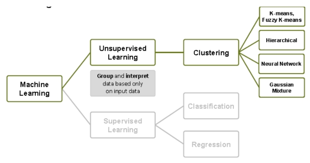
>
> Açıklama: Etiket olmadan yapı/örüntü keşfi. Solda kümeler ve yoğunluk bölgeleri, sağda boyut indirgeme ile iki boyutta görselleştirme; içsel metrikler ve uzman yorumu birlikte kullanılır.

**Danışmansız Öğrenme (Kümeleme)**

- Modelin öğrenmesi sırasında girişlere karşılık beklenen çıkışlar verilmez; kullanılan veri etiketsizdir.
- Kümeleme yöntemleri danışmansız öğrenme yöntemleri içinde değerlendirilir.
- Belli bir kritere göre birbirine benzer örnekler aynı kümeye, birbirinden uzak olanlar farklı kümelere yerleştirilmeye çalışılır.
- Küme sayısı genellikle dışarıdan (k) olarak verilir ya da bir seçim yöntemiyle belirlenir (dirsek, Silhouette).
- Amaçlar: Özellikler arasındaki ortak noktaları bulmak ve gerekirse boyut azaltma ile veriyi daha anlamlı temsil etmek.

> \
> 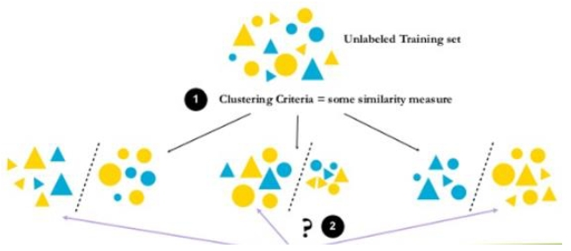
>
> Açıklama: Solda etiketsiz örneklerin benzerliğe göre kümelenmesi, sağda farklı k değerlerinin etkisi. Kümeleme, veri yapısını özetler ve sonraki denetimli görevler için faydalı öznitelikler sağlayabilir.

- Örnek (k=3):
    - (a) Etiketsiz özellik vektörleri (etiket yok, sadece x ∈ ℝ^d).
    - (b) Kümeleme algoritması çalıştırıldığında veriden 3 grup ortaya çıkar; benzer örnekler aynı kümede toplanır.

> \
> 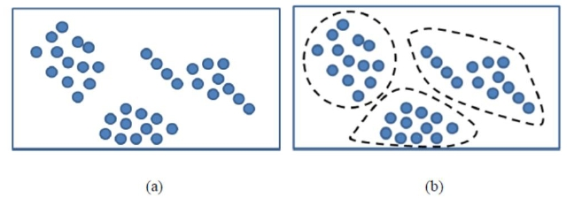
>
> Açıklama: Etiketsiz veri üzerinde k‑means (k=3) benzeri bir süreçle üç küme elde edilmesi. Küme merkezleri ve atamalar görselleştirilmiştir; k seçimi performansı ve yorumlanabilirliği etkiler.
- Takviyeli (Reinforcement) Öğrenme:
    - Ajan–çevre etkileşimi; durum s’te eylem a seçer, ödül r alır. Hedef, beklenen indirgenmiş toplam ödülü maksimize eden politika π’yi öğrenmektir: \( J(\pi) = \mathbb{E}\big[\sum_{t=0}^{\infty} \gamma^{t} r_t\big] \), \(0 \leq \gamma < 1\).
    - Satranç/oyunlar: Hamle/oyun sonu ödülleriyle stratejiler gelişir; öğrenilen stratejiler farklı rakip ve pozisyonlara genellenir.
    - Doğru çıkış verilmez; bunun yerine eylemden sonra bir “kritik işaret” (ödül/ceza sinyali) gelir. Algoritma olumsuz işaret aldığında doğruyu bulana kadar farklı olasılıkları dener (keşif) ve zamanla toplam ödülü artıran politikayı öğrenir.
- Hangi tür? Etiketli hedef varsa denetimli; yoksa ve yapı aranıyorsa denetimsiz; sıralı karar ve ödül varsa takviyeli öğrenme uygundur. Uygulamada hibrit yaklaşımlar da yaygındır.

> \
> 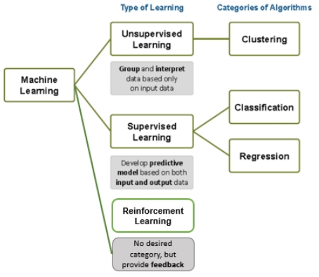
>
> Açıklama: Denetimli — etiketli hedefle kayıp minimize edilir; Denetimsiz — etiket olmadan yapı/temsil keşfi; Takviyeli — ajan–çevre etkileşimiyle ödül maksimize edilir. Model, aldığı geri bildirime göre kendini daha iyi bir konuma taşır.

#### Makine Öğrenmesi Süreci

- Veri toplama ve algılama (Data acquisition and sensing)
    - Fiziksel değişkenlerin ölçümleri; sensör seçimi, örnekleme hızı, kalibrasyon, zaman senkronizasyonu ve veri bütünlüğü.
- Ön işleme (Pre‑processing)
    - Gürültülü verilerin temizlenmesi (filtreleme, aykırı değer, eksik veri işlemleri), normalize/ölçekleme; ilgi görüntülerinin arka plandan ayrılması (segmentasyon, arka plan çıkarma).
- Özellik çıkarımı (Feature extraction)
    - Örüntüyü temsil edecek özelliklerin bulunması; alan bilgisi ile mühendislik (istatistiksel/şekil/tekstür) veya otomatik yöntemler (PCA, Autoencoder/CNN).
- Sınıflandırma (Classification)
    - Yeni bir örüntüden elde edilen özellikleri ve eğitilmiş modeli kullanarak ilgili örüntüyü bir kategoriye atamak; model seçimi, eğitim, doğrulama ve eşik ayarı.
- Son işleme (Post‑processing)
    - Verilen kararların doğruluğunun değerlendirilmesi; zaman içinde yumuşatma/oylama, kural entegrasyonu, izleme ve geri besleme ile sürekli iyileştirme.

#### Temel Kavramlar

- Sistem: Amaç doğrultusunda çıkış sinyalleri üretmek için giriş sinyallerini işleyen; giriş sinyalini başka bir sinyale dönüştüren birimlerdir.
- Zeka: İnsanın düşünme, akıl yürütme, algılama, kavrama, yargılama ve sonuç çıkarma yeteneklerinin tümüdür.
- Akıl: Düşünme, kavrama, anlama yetisidir; doğru ile yanlışı, yalan ile gerçeği ayırt edebilme yetisidir.

- Sinyal: Genellikle zaman içinde üretilen değerler dizisidir ve bilgi taşır; matematiksel olarak değişkenlerin fonksiyonu şeklinde gösterilir. İletilecek veriler elektromanyetik veya elektriksel sinyallere dönüştürülür. Sinyaller, bilgi taşıyan değişkenlerin fonksiyonel gösterimleridir.
- Veri ve Bilgi / Büyük Veri: Bilgi veriden doğar; veriler, içerik işleme ve analiz ile değere dönüşerek bilgi haline gelir. Günümüzde verinin hız, çeşitlilik ve hacim (kapasite) olarak büyük artış göstermesi ve teknolojinin bunu desteklemesiyle "Büyük Veri" kavramı ortaya çıkmıştır.

- Veri (Data): Bilgisayarın belleğine aktarılan sinyaller, resimler, görüntüler, şekiller, rakamlar, metinler ve ses gibi sembollerdir. Veri, bilgi taşıyan fakat henüz anlamlandırılmamış, ilişkilendirilmemiş ve işlenmemiş ham gerçeklerdir; tek başına yorum içermez ve doğrudan karar vermede etkili olmayabilir.
- Bilgi (Information): İşlenmiş, düzenlenmiş ve anlamlandırılmış verilerdir. Bilgi organize, anlamlı ve kullanışlı verilerdir; rapor, grafik ve görseller şeklinde sunulabilir ve ileride kullanılmak üzere saklanır.

- Yetenek - Tecrübe (Knowledge): Karar verme, kestirim yapma ve doğruyu arama süreçlerinde performansı yükseltme yetisi/deneyimidir.
- Understand (Bilinç): Anlayarak, kavrayarak ve hissederek anlamlandırma (bilinçli kavrayış) sürecidir.
- Wisdom (Bilgelik): Değerlendirilmiş anlayıştır; sorgulama ve kestirimle karar vermede ve yorumlamada etkin kullanılır.
- Veri gürültüsü: Algoritmanın amacıyla alakalı olmayan, modeli yanıltabilecek veya verimliliği düşürebilecek veridir; sonuçların kesinliğini/kararlılığını olumsuz etkiler.

- Örüntü (Pattern): Bir nesnenin ya da bir olayın davranışının iki veya üç boyutlu, uzaysal ve geometrik olarak gösterildiği desenlerdir; ilgilenilen varlığın davranışıyla ilgili uzayda gözlenebilir veya ölçülebilir geometrik bilgilerdir.
- Olgu: Doğruluğu ispatlanmış önerme veya beklenen eylemdir.
- Olay: Vaka; örn. “yağmur yağacak” olması olgu, yağmurun gerçekten yağması olaydır.
- Hipotez: Bir problemin çözümünün veya doğruluğunun araştırılmasına yön veren temel düşünceler, varsayımlar ve önermelerdir.

##### Özellikler ve Özellik Vektörü

- Nesnelerin özellikleri:
    - Belli türde bir nesnenin temsilcisidir (ayırt edici bilgi taşır).
    - Hafıza tüketimini azaltır: ham veriye kıyasla daha sıkı/faydalı temsiller sağlar.
    - Hesaplama maliyetini düşürür: daha az/bilinçli boyut → daha hızlı eğitim ve çıkarım.
- Çıkarılan/Seçilen özellikler, farklı sınıflardaki nesneleri iyi ayırt edebilecek nitelikte olmalıdır (discriminative power).
- Özellik vektörü, bu özniteliklerin birlikte sayısal temsili olup x ∈ ℝ^d ile gösterilir; d (boyut) seçimi performans–maliyet–genelleme arasında bir denge gerektirir.

- Örnek — Bir grup grafiksel nesne:
    - Olası özellikler: Şekil, renk, boyut.
    - Bu özellikler, nesneleri farklı sınıflara ayırmayı sağlayacak güçte olmalıdır; gerekirse ek özellikler (doku, kenar sayısı, oranlar) eklenir.

> \
> 
>
> Açıklama: Grafiksel nesneler için temel özellikler (şekil/renk/boyut). Amaç, sınıflar arası ayrımı artıracak temsil seçmek ve x ∈ ℝ^d özellik vektörünü bu doğrultuda tasarlamaktır.

- Özellik vektörü örneklemesi:
    - Genellikle bir nesneyi temsil etmek için birden fazla özellik kullanılır.
    - x1 = şekil (örn. kenar sayısı)
    - x2 = boyut (örn. sayısal bir değer)
    - x3 = renk (örn. RGB renk uzayındaki değerler)
    - ...
    - x_d = diğer sayısal özellikler
    - 𝒙, özellik vektörüdür; d-boyutlu özellik uzayında bir noktayı temsil eder.

> \
> 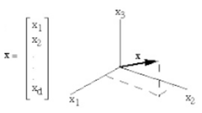
>
> Açıklama: Bir nesnenin x = [x1, x2, x3, ..., x_d] biçiminde temsil edilmesi. Doğru özellik seçimi, sınıflar arası ayrımı ve model performansını doğrudan etkiler.

- Özellik çıkarımı ve sınıflandırma akışı:
    - Özellik çıkarıcı, ham veriden (örn. görüntü, ses) özellikleri çıkartır ve 𝒙 özellik vektörünü oluşturur.
    - Sınıflandırıcı, 𝒙 özellik vektörünü alır ve mevcut kategorilerden birine atar.

> \
> 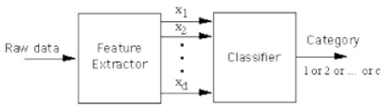
>
> Açıklama: Ham veri → özellik çıkarımı → x özellik vektörü → sınıflandırıcı → kategori. Uçtan uca (CNN/AE) yaklaşımlar özellik çıkarımını otomatikleştirirken, klasik yaklaşımlar el ile seçilmiş öznitelikleri kullanır.

- Grafiksel nesneleri şekillerine göre sınıflandırma:
    - Çıkarılan özellik: Kenar sayısı (x1).
    - Sınıflandırıcı kuralları (basit kural tabanlı örnek):
        - 0 kenar → çember
        - 3 kenar → üçgen
        - 4 kenar → dikdörtgen

> \
> 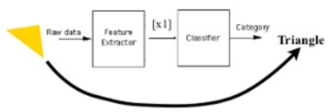
>
> Açıklama: Tek bir özellik (kenar sayısı) ile basit bir kural seti. Gerçek uygulamalarda benzer şekilleri ayırmak için oranlar (en‑boy), köşe açıları, doku gibi ek özellikler gerekebilir.

- Balıkları sınıflandırma (Somon vs Levrek):
    - Problem: Taşıyıcı bant üzerindeki balıkları türlerine göre ayırmak (ikili sınıflandırma).
    - Sınıflar: Somon, Levrek.
    - Olası özellikler: Uzunluk/kalınlık oranı, ağırlık, renk/tekstür, yüzgeç/baş oranları, şekil tanımlayıcıları.
    - Not: Aydınlatma ve poz referansı gibi koşulları sabitlemek; ölçekleme/normalizasyon ve veri artırma ile genellemeyi güçlendirmek gerekir.

> \
> 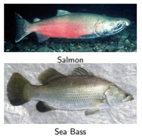
>
> Açıklama: Konveyör üzerindeki balıkların temel ölçümlerinden oluşturulan x özellik vektörü ile Somon/Levrek ayrımı. Kurala dayalı eşikler basit senaryolarda yeterli olabilir; genel çözüm için denetimli modeller (LR/SVM/Ağaç/NN) ve uygun metriklerle doğrulama önerilir.

- Hangi bilgiler türleri ayırt eder?
    - Uzunluk, genişlik, ağırlık, yüzgeç sayısı ve şekli, kuyruk şekli vb.
- Algılama sırasında karşılaşılabilecek problemler:
    - Işık durumu, konveyördeki pozisyon (dönüklük/ölçek), kamera gürültüsü ve bulanıklık, kısmi örtüşme.
- Sınıflandırma süreci (örnek iş akışı):
    - Resmi çek → balığı resimden çıkar (segmentasyon) → ölçümleri yap (özellik çıkarımı) → karar ver (sınıflandırıcı).

- Notlar:
    - Levrek ve somon türleri (doğru özellikler seçildiğinde) öznitelik uzayında genellikle açıkça ayrılabilir.
    - Tüm balıklar uzayı (mümkün özelliklerin evreni) çok geniştir; her boyut bir özelliği temsil eder. Ancak bu özelliklerin çoğu tek bir kameradan güvenilir şekilde ölçülemez; sensör ve kurulum kısıtları seçilen özellik kümesini belirler.

> \
> 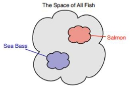
>
> Açıklama: Yüksek boyutlu öznitelik uzayında sınıfların ayrılabilirliği; pratikte gözlemlenebilir/ölçülebilir alt uzayda çalışılır. Doğru sensörler ve sağlam ön işleme, ölçüm hatalarına rağmen ayrımı korur.

- Özellik seçimi = Uzay projeksiyonu:
    - Mümkün (yüksek boyutlu) öznitelik uzayından anlamlı bir alt küme seçmek, veriyi daha düşük boyutlu bir alt uzaya yansıtmak (projeksiyon) demektir.
    - Amaç: Gereksiz/gürültülü boyutları atarak ayrımı korumak ya da artırmak; bellek ve hesaplama maliyetini düşürmek; aşırı uyumu azaltmak.
    - Yöntemler: El ile seçim (alan bilgisi), filtre/sarmalayıcı/gömülü yöntemler; PCA/LDA gibi dönüşümlerle boyut azaltma.

> \
> 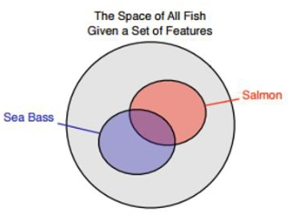
>
> Açıklama: Yüksek boyutlu öznitelik uzayından seçilen özelliklerle daha düşük boyutlu bir alt uzaya yansıtma. Doğru projeksiyon, sınıfların ayrımını korur ve öğrenmeyi kolaylaştırır.

- Özelliklerin marjinal dağılımları (1B projeksiyon):
    - Her bir öznitelik x_i, çok boyutlu dağılımın tekil marjinali p(x_i) olarak düşünülebilir.
    - Başka bir deyişle: x_i eksenine tek boyutlu yansıtma (projeksiyon) alıyoruz; histogram ya da yoğunluk kestirimiyle incelenir.
    - Sınıflara göre marjinal dağılımlar, ayrım gücü ve olası eşikler hakkında doğrudan sezgi verir; örtüşme varsa yeni özellik(ler) veya dönüşümler gerekir.

> \
> 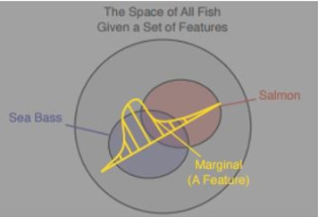
>
> Açıklama: Çok boyutlu öznitelik uzayından tek bir özelliğin marjinal dağılımı p(x_i). Tek boyutlu projeksiyonlar, basit karar kuralları ve eşik seçimleri için güçlü bir araçtır.

- Model = Seçilmiş özelliklerle yaklaşık temsil:
    - Sınıflandırmak istediğimiz her olgu/nesne için bir model kurarız; bu model, seçtiğimiz öznitelikler bağlamında yaklaşık bir temsildir.
    - Amaç: Gerçek dünyanın sonsuz detayını, görev için yeterli ayırt ediciliği koruyacak sınırlı bir özellik kümesiyle yakalamak.
    - Sonuç: İyi seçilmiş öznitelikler, basit modellerin dahi yüksek doğrulukla çalışmasını sağlayabilir; zayıf öznitelikler ise karmaşık modellerle bile zayıf performans verir.

> \
> 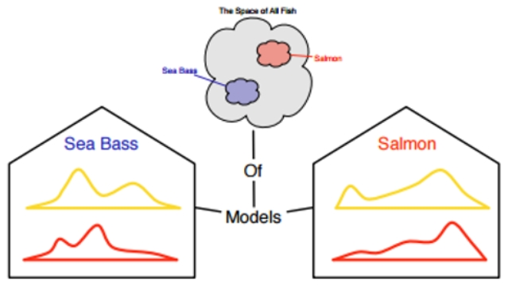
>
> Açıklama: Seçilen özniteliklere göre olgunun kurulan modeli sadece bir yaklaşımdır; temsil gücü seçime bağlıdır ve görevle uyumlu olmalıdır.

- Özellik seçimi — Uzunluk ile eşikleme (Levrek vs Somon):
    - Alan bilgisi: “Levrek, somondan genellikle daha uzundur.” O halde tek bir özellik (uzunluk, l) ile basit bir karar kuralı kurulabilir.
    - Karar kuralı (örnek): l ≥ τ ise Levrek, l < τ ise Somon.
    - Eşik τ nasıl seçilir?
        - Veri temelli seçim: Eğitim/validasyon verisindeki uzunluk dağılımlarını sınıfa göre ayırın; hatayı en aza indiren τ değerini seçin (grid arama ya da sıralı tarama ile).
        - Gaussian varsayımı ve eşit varyans: sınıf ortalamalarının ortası önerilir: $\tau = (\mu_{Levrek}+\mu_{Somon})/2$.
        - Genel kural: sınıf-şartlı yoğunlukların kesiştiği noktada $p(l\mid Levrek)\,P(Levrek) = p(l\mid Somon)\,P(Somon)$ eşitliğini sağlayan τ (eşit öncül ve maliyetlerde Bayes optimal eşik).
        - Maliyet/öncül farklıysa: karar eşiğini sınıf öncülleri ve hata maliyetlerine göre kaydırın (ROC/Youden J ile nokta seçimi, FPR/TPR dengesi).
    - Pratik notlar: Ölçekleme (z‑score), uç değerlerin etkisi, ölçüm hatası; gerekiyorsa uzunlukla birlikte oran tabanlı başka bir özellik ekleyin (örn. uzunluk/genişlik) ve 2B karar sınırı kurun.

- Uzunluk histogramları ve güvenilir eşik l* seçimi:
    - İki sınıf için uzunluk histogramlarını üst üste çizin; dağılımlar genelde örtüşür (bazı somonlar bazı levreklerden daha uzun olabilir ve tersi).
    - Eşik l* nasıl seçilir?
        - Hata enazlama: Toplam yanlış sınıflandırmayı en aza indiren l* (validasyonla tarama veya ROC üzerinden Youden J maksimumu).
        - Sınıf-şartlı kesişim: p(l|Levrek)P(Levrek) = p(l|Somon)P(Somon) noktasına yakın l* (eşit maliyet/öncül varsayımı).
        - Maliyet/öncül ayarı: Yanlış pozitif/negatif maliyetlerine ve P(sınıf) dengesine göre l*’yi kaydırın.
    - Örtüşme büyükse tek özellik yetmez: İkinci bir özelliğe bakın (örn. balık pullarının parlaklığı) ve 2B uzayda karar sınırı öğrenin; basit modeller bile ayrımı iyileştirir.

> \
> 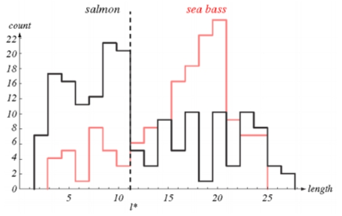
>
> Açıklama: Levrek ve Somon için uzunluk histogramları; güvenilir karar için l*’nin dağımların örtüşmesini dikkate alacak şekilde seçilmesi ve gerekirse ek bir özellik (parlaklık) eklenmesi gerekir.

- Parlaklık histogramları — daha kolay eşik, yine de sınırlı ayırım:
    - İki sınıf için parlaklık (ör. yansıma/ölçeklendirilmiş gri seviye) histogramlarını karşılaştırın; çoğu durumda uzunluğa göre eşik seçimi daha kolay hale gelir.
    - Neden yine de yetersiz olabilir?
        - Aydınlatma değişimi, ıslaklık/specular parlamalar, sensör gürültüsü → dağılımlarda örtüşme sürer.
        - Farklı çekim açıları ve segmentasyon hataları parlaklık ölçümünü saptırır.
    - Ne yapılabilir?
        - Aydınlatma/poz kontrolü, beyaz dengeleme, ışıklandırma normalizasyonu (örn. histogram eşitleme) uygulayın.
        - Parlaklığı uzunluk ile birleştirerek 2B özellik uzayında karar sınırı öğrenin; doğrusal olmayan ayırıcılar (SVM/RBF, ağaçlar) örtüşmeyi daha iyi yönetebilir.

> \
> 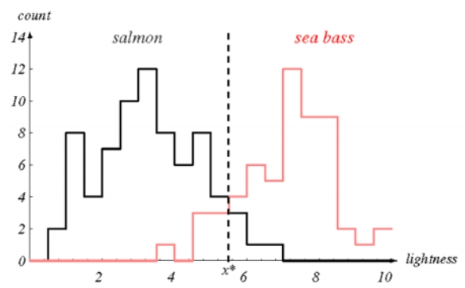
>
> Açıklama: Levrek ve Somon için parlaklık histogramları. Eşik seçimi uzunluğa göre daha kolay görünse de kusursuz ayrım sağlamaz; aydınlatma normalizasyonu ve çoklu özellikler ile ayırım güçlendirilir.

- İki özellikli karar: Parlaklık + Genişlik (2B özellik uzayı)
    - Gözlem: Levrek, somona göre tipik olarak daha geniştir. Parlaklık (x1) ile birlikte genişlik (x2) özelliğini de ekleyerek karar verebiliriz.
    - Temsil: Her balık görüntüsü iki boyutlu özellik uzayında bir nokta ile temsil edilir; özellik vektörü $\mathbf{x} = \begin{bmatrix} x_1 \\ x_2 \end{bmatrix} \in \mathbb{R}^2$.
    - Yarar: 2B uzayda sınıflar çoğu zaman daha iyi ayrılır; uygun bir karar sınırı (doğrusal ya da doğrusal olmayan) ile hata azalır.
    - Pratik: Her ekseni ölçekleyin/standartlaştırın (örn. z‑skor); gerekiyorsa veri arttırma ve gürültüye dayanıklı istatistikler kullanın.

## Model Değerlendirme

- Neden? Eğitilmiş modelin gerçek dünyadaki (görülmemiş) örneklerdeki başarısını öngörmek için.
- Test veri seti:
    - Öğrenmenin performansını tahmin etmek için ayrı bir Test seti kullanılır.
    - Eğitim setiyle aynı (veya çok benzer) dağılımdan gelmelidir; aksi halde dağılım kayması tahmini yanıltır.
- Veri bölme ve dürüst değerlendirme:
    - Train / Validation / Test ayrımı; model ve hiperparametre seçimi Validation üzerinde yapılır, Test yalnızca en sonda kullanılır.
    - Veri sızıntısından kaçının: Ölçekleme/normalizasyon vb. yalnızca Train üzerinde fit edilir ve Val/Test’e uygulanır.
- Kısa not: Küçük veri kümelerinde K-katlı çapraz doğrulama (CV) daha güvenilir bir genelleme tahmini sağlayabilir.
    
### Model Başarılarını Ölçmek için Kullanılan Teknikler

- Eğitim–Test olarak bölme (hold‑out): Veriyi iki (veya üç) parçaya ayırıp, modeli yalnızca eğitim kısmında fit edip test kısmında değerlendiririz. Basit ve hızlı bir ilk yaklaşım sağlar.
- Çapraz Doğrulama (Cross‑Validation): Veriyi K katmana ayırıp her katmanı sırayla test seti yaparak K kez eğitip test ederiz; skorların ortalaması daha güvenilir bir genelleme tahmini verir.

> 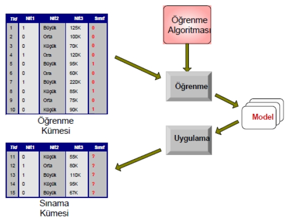
>
> 

Neden çapraz doğrulama?
- Aşırı uyumdan kaçınmak: Yalnızca eğitime çok iyi uyan, fakat yeni veride zayıf kalan modelleri tespit etmeye yardımcı olur.
- Daha güvenilir performans tahmini: Tek bir rastgele bölmeye kıyasla yanlılığı azaltır ve varyansı düşürür.
- Veriyi daha etkin kullanma: Küçük veri setlerinde her gözlem hem eğitimde hem testte (farklı iterasyonlarda) kullanılır.

K‑Katlı Çapraz Doğrulama (K‑Fold)
1) Veri K eşit (veya yaklaşık eşit) katmana bölünür (genelde K=5 ya da 10).
2) 1. iterasyonda katman‑1 test, kalan K−1 katman eğitim olarak kullanılır; skor kaydedilir.
3) Katmanlar sırayla test katmanı olacak şekilde K iterasyon tamamlanır.
4) Nihai skor, K skorun ortalaması (ve genellikle standart sapması) olarak raporlanır.

> 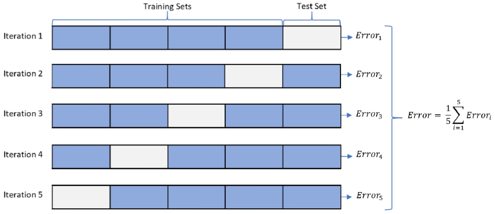
>
> 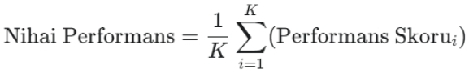

Kısa Python örnekleri (scikit‑learn):

 - Eğitim–Test bölmesi (classification):

        ```python
        from sklearn.datasets import make_classification
        from sklearn.model_selection import train_test_split
        from sklearn.linear_model import LogisticRegression
        from sklearn.metrics import accuracy_score

        X, y = make_classification(n_samples=500, n_features=10, random_state=42)
        X_train, X_test, y_train, y_test = train_test_split(
                X, y, test_size=0.2, stratify=y, random_state=42
        )

        clf = LogisticRegression(max_iter=1000).fit(X_train, y_train)
        acc = accuracy_score(y_test, clf.predict(X_test))
        print({"accuracy": acc})
        ```

 - K‑katlı Çapraz Doğrulama (stratified, classification):

        ```python
        from sklearn.model_selection import cross_val_score, StratifiedKFold
        from sklearn.linear_model import LogisticRegression

        cv = StratifiedKFold(n_splits=5, shuffle=True, random_state=42)
        scores = cross_val_score(LogisticRegression(max_iter=1000), X, y, cv=cv, scoring="accuracy")
        print({"cv_mean": scores.mean(), "cv_std": scores.std()})
        ```

Notlar:
- Sınıflandırmada katmanlı bölme (StratifiedKFold) sınıf oranlarının katmanlar arasında korunmasını sağlar.
- Hiperparametre seçimi için çapraz doğrulama ile GridSearchCV/RandomizedSearchCV kullanın; aynı anda model seçimi ve güvenilir değerlendirme sağlar.

### İç İçe (Nested) Çapraz Doğrulama

Neden? Hiperparametre aramasını ve genelleme değerlendirmesini ayırarak iyimserlik yanlılığını önler. Dış döngüdeki katmanlar gerçek “görülmemiş veri” rolündedir; iç döngüde en iyi hiperparametre bulunur.

- Dış CV (ör. StratifiedKFold, K=5): Değerlendirme katmanları.
- İç CV (ör. StratifiedKFold, K=3): Hiperparametre araması (GridSearchCV/RandomizedSearchCV).

Kısa Python örneği (SVC için nested CV, F1 skoru):

```python
    import numpy as np
    from sklearn.datasets import make_classification
    from sklearn.model_selection import StratifiedKFold, GridSearchCV
    from sklearn.preprocessing import StandardScaler
    from sklearn.pipeline import make_pipeline
    from sklearn.svm import SVC
    from sklearn.metrics import f1_score

    X, y = make_classification(n_samples=500, n_features=20, weights=[0.8, 0.2], random_state=42)

    outer_cv = StratifiedKFold(n_splits=5, shuffle=True, random_state=42)
    inner_cv = StratifiedKFold(n_splits=3, shuffle=True, random_state=42)

    pipe = make_pipeline(StandardScaler(), SVC(probability=False))
    param_grid = {
        'svc__C': [0.1, 1, 10],
        'svc__kernel': ['linear', 'rbf'],
        'svc__gamma': ['scale', 'auto']
    }

    outer_scores = []
    for tr_idx, te_idx in outer_cv.split(X, y):
        X_tr, X_te = X[tr_idx], X[te_idx]
        y_tr, y_te = y[tr_idx], y[te_idx]

        gs = GridSearchCV(pipe, param_grid, cv=inner_cv, scoring='f1', n_jobs=-1)
        gs.fit(X_tr, y_tr)
        y_pred = gs.best_estimator_.predict(X_te)
        outer_scores.append(f1_score(y_te, y_pred))

    print({"nested_f1_mean": float(np.mean(outer_scores)), "nested_f1_std": float(np.std(outer_scores))})
```

İpuçları:
- Dış katman skorlarının ortalamasını ve standart sapmasını raporlayın.
- Model/hyperparametre seçimi YALNIZCA iç döngüde yapılmalı; dış test verisine asla bakılmamalıdır.

### Hiperparametre Optimizasyonu

Bir modeli yalnızca `fit()` etmek yetmez; pek çok modelin başarımı, eğitimden ÖNCE ayarlanan hiperparametrelere bağlıdır.

- Parametre (Parameter): Modelin VERİDEN öğrendiği değerlerdir. Örn. Lojistik Regresyon katsayıları w, bir YSA’daki ağırlıklar.
- Hiperparametre (Hyperparameter): Öğrenme sürecini kontrol eden DIŞ ayarlardır; veriden öğrenilmez, biz belirleriz. Örn. k‑NN’de komşu sayısı k, Decision Tree’de `max_depth`, SVM’de `C` ve `kernel`.

Örnek hiperparametreler:
- k‑NN: `n_neighbors` (k), `metric` (euclidean/manhattan...)
- Karar Ağacı: `max_depth` (ezberi kısıtlar), `criterion` (gini/entropy)
- SVM: `C` (hata cezası; marjin genişliği ↔ hata toleransı), `kernel` (linear/rbf), `gamma` (RBF genişliği)

Train / Validation / Test Ayrımı
- Training: Modeli eğitiriz (~%60–70).
- Validation: Hiperparametre araması için ayrılır (~%15–20). En iyi kombinasyonu burada seçeriz.
- Test: KİLİTLİ kutudur (~%15–20). En sonda sadece final raporu için bir kez kullanılır (sızıntı yapmayın).

Arama Yöntemleri
- Grid Search (ızgara): Belirlediğimiz tüm kombinasyonları dener; basit ve kapsamlıdır fakat kombinasyon sayısı hızla patlar (boyutlanma laneti).

> 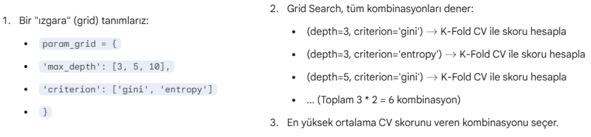

 - Random Search (rastgele): Ön tanımlı dağılımlardan rastgele örnekler dener; çoğu pratikte çok daha hızlıdır ve kısa sürede iyi sonuçlar verir.

> 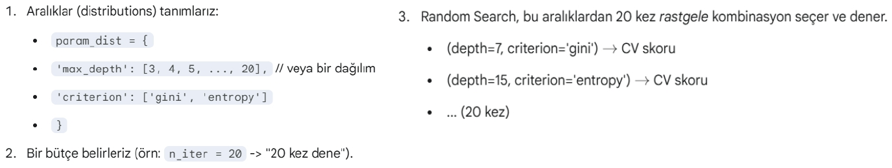
> 
> 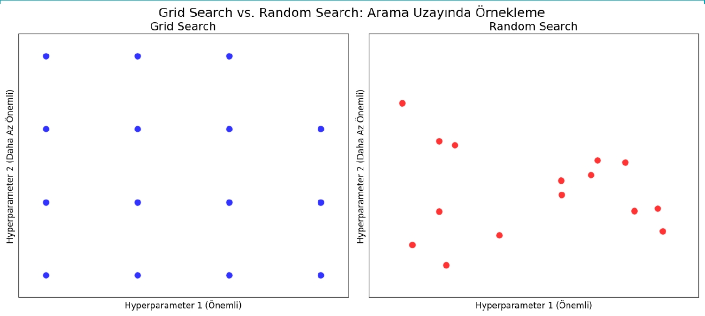

Parametre Arama Akışı (özet)

> 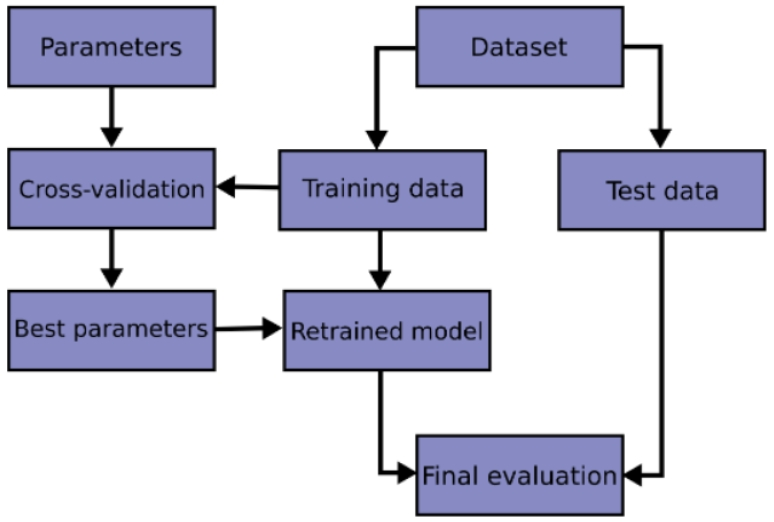

Kısa scikit‑learn örnekleri

 - SVC için Grid Search (Stratified 5‑fold):

```python
    from sklearn.model_selection import GridSearchCV, StratifiedKFold
    from sklearn.pipeline import make_pipeline
    from sklearn.preprocessing import StandardScaler
    from sklearn.svm import SVC

    pipe = make_pipeline(StandardScaler(), SVC())
    param_grid = {
        "svc__kernel": ["linear", "rbf"],
        "svc__C": [0.1, 1, 10, 100],
        "svc__gamma": ["scale", 0.01, 0.1, 1]
    }
    cv = StratifiedKFold(n_splits=5, shuffle=True, random_state=42)
    gs = GridSearchCV(pipe, param_grid=param_grid, cv=cv, scoring="accuracy", n_jobs=-1)
    gs.fit(X, y)
    print({"best_params": gs.best_params_, "cv_best_acc": gs.best_score_})
```

 - SVC için Randomized Search (öncelikle geniş aralıkları hızlı tarama):

```python
    from sklearn.model_selection import RandomizedSearchCV
    from scipy.stats import loguniform

    pipe = make_pipeline(StandardScaler(), SVC(kernel="rbf"))
    param_dist = {
        "svc__C": loguniform(1e-3, 1e3),
        "svc__gamma": loguniform(1e-4, 1e1)
    }
    rs = RandomizedSearchCV(pipe, param_distributions=param_dist, n_iter=50,
                            cv=cv, scoring="accuracy", random_state=42, n_jobs=-1)
    rs.fit(X, y)
    print({"best_params": rs.best_params_, "cv_best_acc": rs.best_score_})
```

İpuçları:
- Skor anahtarlarını (scoring) probleme göre seçin: imbalanced veri için `roc_auc`, `average_precision`, sınıf ağırlıkları için `class_weight`.
- Sonucu raporlarken CV ortalaması ve std verin; seçilen modeli ayrıca ayrı Test seti üzerinde ONAYLAYIN.

- Sınıflandırma ve regresyon bağlamı:
    - İster sınıflandırma ister regresyon olsun, amaç sadece eğitimi açıklamak değil; görülmemiş örnekleri doğru tahmin edebilen bir model (genelleme) elde etmektir.
    - Bu yüzden Test seti, eğitimde hiç kullanılmayan ve eğitim setiyle aynı/benzer dağılımdan gelen örneklerden oluşmalıdır.
- Veri ayrımı pratikleri:
    - Basit ayrım: Eğitim ve Test olarak ikiye bölme (özellikle temel projeler ve ilk değerlendirme için).
    - Daha sağlam yaklaşım: Train/Validation/Test üçlemesi; hiperparametre ayarı Validation ile yapılır, Test sadece final raporlama içindir.
    - Küçük veri: K‑katlı CV ile eğitim/doğrulama döngülerini tekrar ederek daha sabit bir performans tahmini elde edilir.

- Dağılım kayması (distribution shift) ve OOD:
    - Örnek senaryo: a → eğitim kümesi; b ve c → test kümeleri. c, a ve b'den farklı dağılıma sahipse, a'dan öğrenilen özelliklerin c'de aynı başarıyı vermesi beklenmez.
    - Türler: Kovaryat kayması (p(x) değişir), öncül kayması (p(y) değişir), kavram kayması (p(y|x) değişir), alan/cihaz/ortam değişimi (domain shift).
    - Sonuç: Test dağılımı eğitime benzemiyorsa metrikler anlamını yitirir; genelleme bozulur.
    - Azaltma önerileri: Veri artırma ve normalizasyon, alan uyarlama (domain adaptation), önem ağırlığı (importance weighting), sağlam özellikler/ayrıklaştırma, kalibrasyon ve OOD tespiti.

> \
> 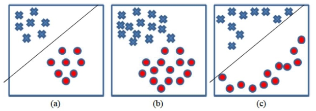
>
> Açıklama: a eğitim; b aynı dağılımdan test; c farklı dağılımdan test. a→c geçişinde dağılım kayması varsa, eğitilen özelliklerin c'de işe yaramaması olağandır.

- Eğitime %100 uyan sınır, testte farklı davranış (overfitting):
    - İki farklı karar sınırı eğitim kümesinde %100 başarı gösterebilir; ancak testte genelleme farklı olur.
    - Aşırı karmaşık/sallantılı sınır, eğitim gürültüsünü ezberler (yüksek varyans) → testte hata artar.
    - Daha basit/ düzgün sınır (yüksek bias, düşük varyans) genelde daha iyi geneller.
    - Ne yapmalı? Ayrımı Validation setinde ölçerek model/hiperparametre seçimi, düzenlileştirme (L2/L1, erken durdurma), veri artırma, marjini genişletme (SVM) ve çapraz doğrulama.

> \
> 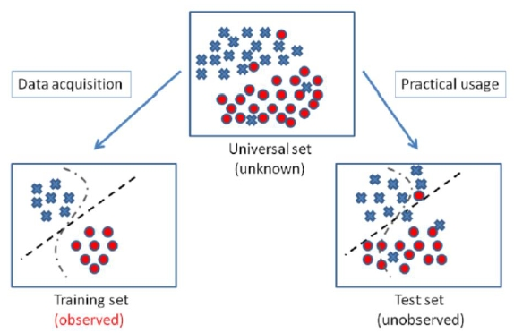
>
> Açıklama: İki karar sınırı eğitimde kusursuz görünse de, test dağılımında daha düzgün/az esnek sınır genellikle daha iyi performans gösterir; bu, bias‑varyans dengesinin bir yansımasıdır.

##### Karar Sınırı ve Model Karmaşıklığı

- Parlaklık (x1) ve Genişlik (x2) dağılımı bir saçılım grafiği (scatter) ile görselleştirilebilir.
- Özellik uzayı iki bölgeye ayrılarak bir karar sınırı çizilebilir; bu sınırın biçimi model sınıfına göre değişir.
    - Basit: Doğrusal sınır (LR, LDA, lineer SVM) → yüksek bias, düşük varyans.
    - Esnek: Doğrusal olmayan sınır (polinom, RBF SVM, ağaç/orman, NN) → düşük bias, yüksek varyans riski.
- Uygun karmaşıklık seçimi:
    - Validation ve/veya CV ile sınırın genellemesini ölçün; gereğinde düzenlileştirme (λ), erken durdurma, özellik mühendisliği uygulayın.
    - Ölçekleme (x1,x2) ve sınıf dengesizliği gibi veri özellikleri sınırın şeklini ve yeri üzerinde etkilidir.

> \
> 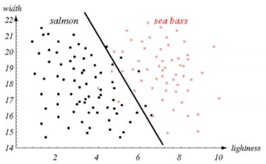
>
> Açıklama: Parlaklık‑genişlik uzayında iki sınıf ve muhtemel bir karar sınırı. Karmaşıklık arttıkça eğitim uyumu artabilir; fakat genelleme için Validation/Test performansı belirleyicidir.

- Özellik sayısı, kalite ve boyutluluk:
    - Daha fazla özellik her zaman daha iyi değildir; güvenilir olmayan (gürültülü, düşük ayırt edicilikte) özellikler genellemeyi bozabilir.
    - Korelasyon: Yüksek korelasyonlu özellikler gereksiz tekrar yaratır; çoklu doğrusal bağlantı (multicollinearity) bazı modelleri (LR) kararsızlaştırır. Özellik seçimi/azaltma yapın.
    - Gürültü ve ölçüm hataları: Ölçüm sürecini iyileştirin; sağlam istatistikler, düzenlileştirme ve veri artırma ile etkisini azaltın.
    - Boyut laneti (curse of dimensionality): Boyut arttıkça örnek yoğunluğu seyrekleşir; karar sınırlarını güvenle öğrenmek için daha çok veri ve/veya düzenlileştirme gerekir.
    - İlke: Yeterli sayıda ve işe yarar (ayırt edici, güvenilir) özellik kullanın; mümkün olduğunda özellik mühendisliği ve boyut azaltma (PCA/LDA) ile temsilinizi sadeleştirin.

- Öznitelik (Feature): Bir olgunun anlaşılır, ayırt edici ve bağımsız ölçülebilir özellikleridir. Etkili örüntü tanıma, sınıflandırma ve regresyon için kritiktir. Genellikle sayısaldır; ancak sentaktik örüntü analizinde kelimeler, çizgiler gibi yapısal öğeler de öznitelik olarak kullanılabilir. İyi öznitelikler öğrenmeyi kolaylaştırır, genelliği ve yorumlanabilirliği artırır. Öznitelik çıkarımı/seçimi (öznitelik mühendisliği) farklı yöntemlerin denenmesini ve alan uzmanı sezgisini gerektirir.

- Öznitelik vektörü (Feature vector): Sayısal özniteliklerin birlikte temsil edildiği vektördür (ör. x ∈ ℝ^d). İkili sınıflandırmada sık kullanılan basit kural: ağırlıklar vektörü w ile skaler çarpım w·x bir eşik değeri τ ile karşılaştırılır; w·x ≥ τ ise sınıf 1, aksi halde 0 olarak etiketlenir. Öznitelik vektörünü kullanan yöntemlere örnek: k-en yakın komşu (k-NN), yapay sinir ağları (YSA) ve Bayesçi yaklaşımlar (örn. Naive Bayes).

- Hesaplamalı düşünme (Computational thinking): Bilgisayar temelli problem çözme yaklaşımıdır; temel bileşenleri soyutlama, ayrıştırma, modülerlik, algoritma tasarımı ve değerlendirmedir.
- Veri bilimi (Data science): Veri açısından zengin sorunları çözmek için disiplinler arası bir yaklaşımdır; makine öğrenimi, büyük ölçekli bilgi işlem, semantik meta veriler, veri iş akışları ve görselleştirmeyi kapsar.
- Kesikli (süreksiz) değişken: Tanımlı olduğu aralıklarda yalnızca ayrık/sonlu (veya sayılabilir) değerler alır. Örn. sınıf etiketi, olay sayısı.
- Sürekli değişken: Tanımlı olduğu aralıkta sonsuz (devamlı) değer kümesini alabilir. Örn. sıcaklık, süre.

- Nicel (kantitatif) değişkenler: Ölçüm sonucu değerleri saptanan sayısal özellikleri ifade eder; sayılabilir veya ölçülebilir büyüklüklerdir. Örn. yaş, gelir, sıcaklık.
- Nitel (kalitatif) değişkenler: Karakteristik özellikleri/durumları ifade eder; sayılamayan, birimlendirilemeyen ve ölçülebilir olmayan niteliklerdir. Örn. renk, kategori, marka (sıfat niteliğinde ayırt ediciler).

- Sıklık (frekans) dağılımı: Verilerin değerlerine göre nasıl dağıldığını gösteren özet yapıdır; aynı periyoda sahip bir sinyalin bütün içinde kaç kez tekrar ettiğini ifade eder.
- Sınıf: Eşit ya da birbirine yakın değerlere sahip deneklerin/örneklerin oluşturduğu her bir gruptur.
- Eşik (threshold): Karar verme için kullanılan eşik değeridir (ör. olasılık > 0.5 ⇒ pozitif). Eşik, modelin parametresi değildir; uygulama hedeflerine göre ayarlanır.
- Sapma (bias) terimi: Birçok modelde sabit terim b (intercept) olarak geçer ve öğrenilen parametrelerin bir parçasıdır; karar eşiği ile karıştırılmamalıdır.

### Bir Modelin Seçilmesi için Gereken Kriterler

Bu bölüm, model seçimini değerlendirirken dikkate alınması gereken temel ölçütleri özetler. Kriterler, problem bağlamına (görev tipi, veri yapısı, kısıtlar) ve işletim ortamına göre önceliklendirilmelidir.

#### Performans ve Doğruluk Kriterleri

- Doğruluk/Kesinlik (Accuracy)
    - Tanım: Modelin gördüğü/görmediği örneklerde doğru etiket tahmin etme oranı; genellikle Accuracy = DoğruTahminler / TümTahminler.
    - Not: Dengesiz veri setlerinde tek başına yanıltıcı olabilir; Kesinlik (Precision), Duyarlılık (Recall), F1, ROC‑AUC/PR‑AUC gibi problem‑özel metriklerle birlikte kullanılmalıdır. Kritik alanlarda (ör. teşhis) başarı metrikleri birincil önemdedir.

- Genelleme Yeteneği (Generalization)
    - Tanım: Modelin eğitim verisini ezberlemeden, görülmeyen (test) veride de yüksek performans göstermesi.
    - İlgili riskler: Aşırı öğrenme (overfitting), eksik öğrenme (underfitting). Çözüm: Çapraz doğrulama, düzenlileştirme, erken durdurma, veri artırma ve titiz validasyon.

#### Operasyonel ve Verimlilik Kriterleri

- Hız (Speed)
    - Eğitim Hızı: Modelin ne kadar hızlı öğrenebildiği.
    - Çıkarım (Inference) Hızı: Canlı sistemde yanıt süresi. Gerçek zamanlı akışlarda (ör. sosyal medya, IoT) çoğu zaman öncelikli kriterdir; gerektiğinde doğruluktan küçük ödün verilebilir.

- Ölçeklenebilirlik (Scalability)
    - Tanım: Veri boyutu/karmaşıklığı/özellik sayısı arttıkça doğruluk ve hızın kabul edilebilir düzeyde kalması.
    - Not: Büyük veri ve dağıtık ortamlarda (distributed training/serving) yatay/dikey ölçeklenebilirlik önemlidir.

- Kaynak Tüketimi (Resource Consumption)
    - Tanım: Eğitim ve tahmin için gereken CPU/GPU, RAM ve disk.
    - Not: Mobil/IoT gibi kısıtlı ortamlarda daha hafif (parametre/veri ayak izi küçük, bellek/döngü bütçesi düşük) modeller tercih edilir.

#### Yapısal ve Uygulama Kriterleri

- Sağlamlık (Robustness)
    - Tanım: Eksik, gürültülü ve aykırı değerli verilerden minimum etkilenme.
    - Not: Ağaç tabanlı yöntemler (RF/GBM) çoğu senaryoda lineer modellere göre aykırılara daha dayanıklı olabilir; yine de ön işleme kritiktir.

- Yorumlanabilirlik (Interpretability / Explainability)
    - Tanım: Modelin kararlarının insanlarca anlaşılabilir ve gerekçelendirilebilir olması.
    - Not: Finans, tıp, hukuk gibi yüksek riskli alanlarda zorunludur. Doğrusal Regresyon ve Karar Ağaçları genelde yüksek yorumlanabilirlik sunar; derin ağlar için SHAP/LIME gibi araçlar gerekebilir.

#### Bağlama Göre Önceliklendirme Örnekleri

- Gerçek Zamanlı/Akan Veri: Hız ve Ölçeklenebilirlik öncelikli; kabul edilebilir doğrulukla düşük gecikme hedeflenir.
- Kritik Analiz (Hastalık, Kredi Riski): Doğruluk/Kesinlik ve Yorumlanabilirlik öncelikli; kararların açıklanabilir olması esastır.
- Kısıtlı Kaynak (Mobil/Edge): Kaynak Tüketimi ve Hız öncelikli; model boyutu ve hesap maliyeti sınırlıdır.

## Makine öğrenme sorunu

- Amaç: Gözlem/ölçüm olarak elde ettiğimiz girdiler x'e dayanarak bilinmeyen bir çıktıyı y ile tahmin edebilecek bir model (hipotez) bulmaktır.
- Hipotez (model): h(x) ile gösterilir; h : X → Y ve tahmin ŷ = h(x) biçimindedir.
- İfade: [Durum, x] → (Olay Modeli / hipotez h) → [Tahmin, ŷ]
    - "Durum" (context) sensör, zaman, ortam bilgisi olabilir; x genellikle d‑boyutlu bir özellik vektörüdür (x ∈ ℝ^d).
    - h(x) modelin verdiği ilişki; öğrenme sürecinde parametreler (θ) ayarlanarak h_θ(x) elde edilir.
- Notlar:
    - Hipotez sınıfı (doğrusal, ağaç, NN vb.) problem ve veri büyüklüğüne göre seçilir.
    - Öğrenme: Verilen (x_i, y_i) örnekleri kullanılarak h_θ en iyi uyumu sağlayacak şekilde optimize edilir.

> \
> 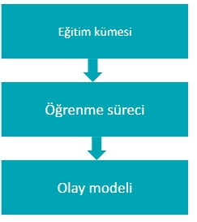
>
> Açıklama: Girdiler x → Hipotez h(x) → Tahmin ŷ. Hipotez (model) eğitim verisiyle öğrenilir.

> \
> 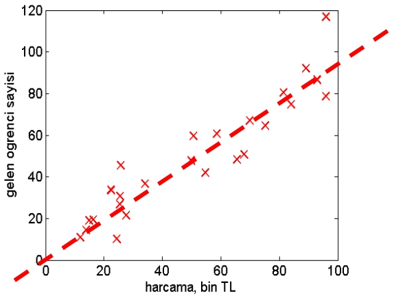
>
> Açıklama: h(x) fonksiyonunun kavramsal gösterimi; x bir özellik vektörü olabilir ve h parametrelerle tanımlanır.

## Lineer Regresyon

- Bütün makine öğrenme uygulamaları aynı genel yöntemi takip eder:
    - Bir olayın modeli için ve bir başarı ölçümü için, önceden var olan verilerden olayın uygun modelini bulmak ve gelecekteki kararlar için bu modeli kullanmak.
- Farklı makine öğrenme yöntemleri, farklı olay modelleri kullanabilir; örneğin ağaç tabanlı yöntemler, kernel yöntemleri veya sinir ağları farklı fonksiyon sınıflarıdır.
- Lineer regresyon modeli, bu yöntemler içinde en basit modellerden biridir ve birçok problemde temel/başlangıç yaklaşımı olarak kullanılır; amaç, y ≈ wᵀx + b biçiminde bir doğrusal ilişki kurup hata (ör. MSE) minimize etmektir.

- Lineer ilişki varsayımı:
    - Lineer regresyonda, neden (girdi x) ile sonuç (çıktı y) arasında yaklaşık olarak doğrusal bir ilişki olduğu varsayılır: y ≈ wᵀx + b.
    - Neden böyle bir varsayım?
        - Basitlik ve yorumlanabilirlik: Katsayılar w, her özelliğin y üzerindeki yönlü etkisini doğrudan gösterir.
        - İlk yaklaşım (baseline): Çok karmaşık modellerden önce doğrusal bir model denemek hızlı ve bilgilendiricidir.
        - Yerel doğrusal yaklaşım: Birçok sistemin küçük bölge/lineerizasyon düzeyinde doğrusal davranışı vardır; doğrusal model, daha karmaşık fonksiyonların yerel bir yaklaşık çözümü olabilir.
        - Hesaplama ve optimizasyon: OLS (en küçük kareler) gibi kapalı-form çözümler ve verimli gradyan yöntemleri sayesinde hızlıca öğrenilebilir.
    - Uyarı: Eğer gerçek ilişki güçlü biçimde doğrusal değilse, polinom terimler, özellik dönüşümleri veya daha karmaşık modeller kullanmak gerekir.

### Notasyon (sürekli kullanılacaktır)

- m: Önceden var olan örneklerin sayısı (eğitim kümesindeki örnek sayısı).
- Eğitim kümesi: Elimizdeki geçmiş verilerin tümü; her örnek bir (x, y) çifti içerir.
- x: Girdi değişkeni / bağımsız değişken / açıklayıcı değişken / "neden" faktörü (ör. reklam harcamaları).
- y: Çıktı değişkeni / bağımlı değişken / sonuç (ör. gelen öğrenci sayısı).
- (x, y): Tek bir örneği gösterir — bir girdi ve ona karşılık gelen çıktı.
- (x_i, y_i): Eğitim kümesindeki i numaralı örnek; i = 1, 2, ..., m.
- h(x) — İlişki fonksiyonu

- h(x) modelin ilişki fonksiyonudur; girdi x için modelin ürettiği tahmini çıktı ŷ = h(x) olarak gösterilir.
- Lineer regresyonda özel olarak: h(x) = wᵀx + b (tek değişkenli için h(x) = w x + b). Burada w ve b model parametreleridir.
- Hedef: Eğitim verisinden (x_i, y_i) örneklerini kullanarak parametreleri öğrenmek ve yeni x'ler için güvenilir ŷ tahminleri üretmektir.

- Hipotez (h): "h(x)" fonksiyonuna hipotez denir.
    - Yani, olayın modeli veya x ile y arasındaki olası ilişki fonksiyonu için belli bir şekli (fonksiyon sınıfını) önceden varsayıyoruz; buna hipotez sınıfı denir (ör. doğrusal, polinom, ağaca dayalı, NN vb.).
    - Öğrenme sürecinde bu hipotez sınıfı içinden veriyle en iyi uyumu sağlayan (parametreleri) seçeriz; bu yüzden iyi bir hipotez sınıfı seçimi önemlidir.

- Basit lineer hipotez örneği:
    - En basit model/hipotez tek değişkenli için şöyle yazılır:
        - y = h_θ(x) = θ0 + θ1 · x
    - Bu modele "lineer model/hipotezi" denir.
    - Burada y bağımlı değişken, x bağımsız değişkendir; θ0 ve θ1 parametre/ ağırlık değerleridir.
    - θ0 terimi bias (sapma) olarak adlandırılır; pratikte θ0'in çarpanı x0 = 1 olarak alınır, bu yüzden formülde ayrı yazılır.
    - Genel çok değişkenli formda: y = h_θ(x) = θ0 + θ1 x1 + θ2 x2 + ... + θd xd = θᵀ x̃, burada x̃ = [1, x1, ..., xd]ᵀ ve θ = [θ0, θ1, ..., θd]ᵀ.


    - Öğrenme süreci (parametre seçimi):
        - Öğrenme, uygun modeli (hipotez) seçtikten sonra eğitim kümesindeki örnekleri kullanarak hipotez fonksiyonunun parametrelerini (θ) belirlemektir.
        - Tek değişkenli lineer örnek için
            - y = h_θ(x) = θ0 + θ1 · x
            - Burada (θ0, θ1) modelin parametreleridir ve eğitim verisiyle (ör. OLS veya optimizasyon) tahmin edilir.
        - Öğrenme sonrasında elde edilen θ ile yeni x için tahmin ŷ = h_θ(x) yapılır.

     - Örnek uygulama — Reklam harcamaları → Gelecek öğrenci sayısı:
    - Problem: Reklam harcamalarına (ör. aylık TL) bağlı olarak gelecek öğrenci sayısını tahmin etmek istiyoruz.
    - Basit tek değişkenli model: y ≈ w·x + b (x = reklam harcaması, y = kayıt/başvuru sayısı). OLS ile w ve b öğrenilir.
    - Veri gereksinimi: Geçmiş reklam bütçeleri ve o dönem gelen öğrenci sayıları; eğitim/validation/test split ile model doğrulanmalıdır.
    - Performans ölçümleri: RMSE, MAE ve R² kullanılır; modelin geçerliliği için residual ( artık ) analizi yapın.
    - Uyarılar: Doğrusal ilişki olmadığı durumlarda log-transform, polinom terimler veya daha esnek modeller (ör. ağaçlar, SVR) deneyin; reklamın etkisi gecikmeli olabilir — zaman serisi yaklaşımları düşünün.

> \
> 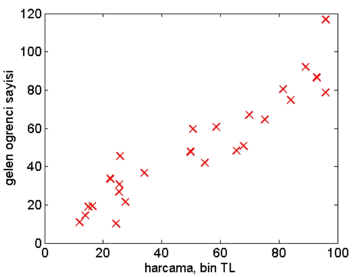
>
> Açıklama: Reklam harcaması (x) ile gelen öğrenci sayısı (y) arasındaki saçılım ve doğrusal fit örneği; bu tür uygulamalar lineer regresyonla hızlı prototipleme için uygundur.

> \
> 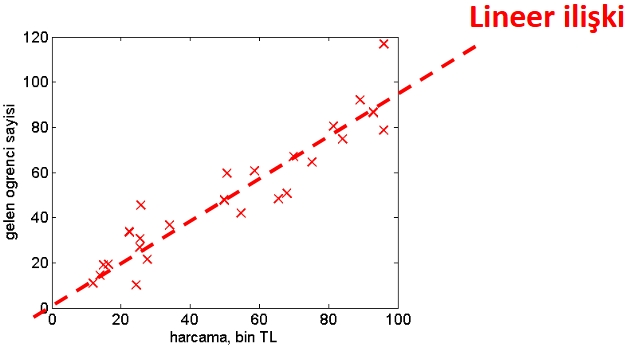
>
> Açıklama: Aynı verinin alternatif gösterimi — örneğin residual analizi veya farklı bir fit görselleştirmesi. Model değerlendirmesinde çeşitli görselleştirmeler yararlıdır.

- Model amaçları (bu lineer regresyon için örnekler):
    - Gelecek öğrenci sayısını tahmin etmek (yeni dönem için başvuru/kayıt tahmini).
    - Belirli bir hedef öğrenci sayısına ulaşmak için gereken reklam harcamasını hesaplamak (ters problem: x* = (y_target − b)/w).

> \
> 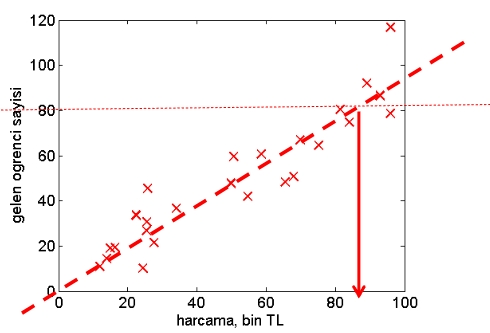
>
> Açıklama: Lineer regresyonun iki yaygın kullanım amacı: doğrudan tahmin (ŷ) ve ters problem (hedefe ulaşmak için gereken x miktarını hesaplama).

> \
> 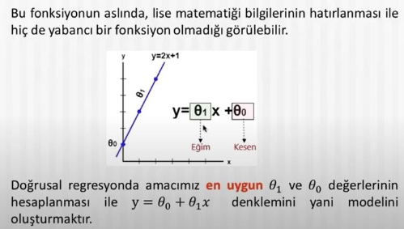
>
> Açıklama: Lineer regresyon uygulamasına ait ek bir görsel; eğitim verisi ve doğrusal fitin farklı bir gösterimi.
>
> \

> 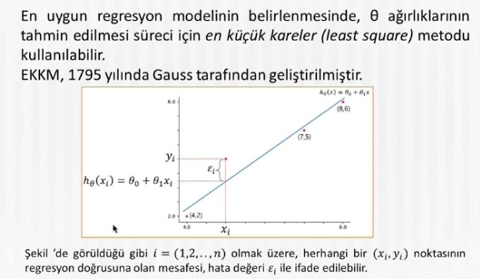
>
> Açıklama: Görsel 38 — eğitim verisi ile elde edilen fitin detaylı gösterimi; parametre tahmini ve veri-saçılımı ilişkisini gösterir.
>
> 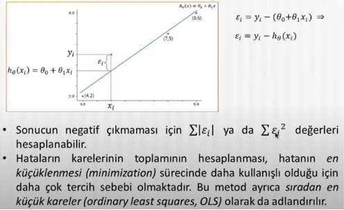
>
> Açıklama: Görsel 39 — modelin hata/rezidü dağılımı veya değerlendirme göstergelerinin (ör. residual plot) görselleştirmesi.

## Çok değişkenli (çok boyutlu) Lineer Regresyon

"Gelecek öğrenci sayısını tahmin etmek" — örnek özellikler (faktörler):
- Reklam harcamaları
- Okuldan mezun olan öğrenci sayısı
- Öğrencilerin ortalama notu
- Kayıt günündeki hava sıcaklığı
- Bizim programımızın ücreti
- Diğer üniversitelerin ücretleri
- ...

Bu bütün faktörler sonucumuzu etkileyebilirler. Böyle problemlere "çok boyutlu lineer regresyon" diyoruz: sonuç birçok faktöre bağlıdır. Bu faktörlere makine öğrenmesi uygulamalarında "özellik" (feature) denir.

Birçok boyutlu lineer regresyon modeli örneği:
- Önce (tek değişkenli): y = h_θ(x) = θ0 + θ1 x
- Şimdi (çok değişkenli): y = h_θ(x) = θ0 + θ1 x1 + θ2 x2 + ... + θn x_n

Örnek özellik haritası (x_i):
- x1: Reklam harcamaları
- x2: Okuldan mezun olan öğrenci sayısı
- x3: Lisans programımızın ücreti
- x4: Diğer üniversitelerin ücretleri
- x5: Öğrencilerin ortalama notu
- x6: Kayıt günündeki hava sıcaklığı
- ...

- Önce: bir özellik (x), iki parametre (θ0, θ1)
- Şimdi: n özellik (x_i), n+1 parametre (θ0, θ1, θ2, ..., θn)


### Maliyet fonksiyonu

- Hipotez parametreleri iyi şekilde nasıl seçilebilir?
    - "İyi" parametre seçimi: Eğitim verisi üzerinde modelin tahminleri gerçek çıktılara yakın (yani hata küçük) olmalıdır.

- Bunun için bir maliyet (cost) fonksiyonu kullanılır:

- Farklı modellerin uygunluğunu kesinleştirmek için, maliyet fonksiyonu kullanılmaktadır.
    - Maliyet fonksiyonu, bir modelin var olan verilere uygunluğu ya da iyiliğini sayısal olarak belirtir; daha küçük J(θ) değeri genellikle daha iyi uyum demektir.

- Bunun için bir maliyet (cost) fonksiyonu kullanılır:
    - Örnek başına kayıp (loss) olarak kare hatayı kullanırız: L(h_θ(x^{(i)}), y^{(i)}) = (h_θ(x^{(i)}) - y^{(i)})^2.
    - Toplam/ortalama maliyet fonksiyonu (Mean Squared Error tabanlı):

$$
J(\theta) = \frac{1}{2m} \sum_{i=1}^{m} (h_{\theta}(x^{(i)}) - y^{(i)})^{2}
$$

        - Buradaki 1/(2m) sabiti, türev alındığında ortaya çıkan 2 faktörünü dengeler ve gradyan ifadesini daha sade yapar.

- Hipotez parametrelerini seçme (öğrenme):
    - Amaç: J(θ)'yi minimize eden θ değerlerini bulmak.
    - Yaklaşımlar:
    - Analitik çözüm (Normal denklem) — lineer OLS için: θ = (X^T X)^{-1} X^T y (küçük/orta boy veri, X^T X terslenebiliyorsa; terslenemiyorsa yalancı ters (pseudo-inverse)/SVD kullanılır).
        - İteratif optimizasyon — Gradyan İnişi (Gradient Descent):
            - Güncelleme: θ := θ - α ∇_θ J(θ), örn. tek adımda her j için
$$
	heta_j := \theta_j - \alpha \cdot \frac{1}{m} \sum_{i=1}^m (h_{\theta}(x^{(i)}) - y^{(i)}) x^{(i)}_j
$$
        - Normal fonksiyonun convex olması sayesinde lineer regresyonda global minimum garanti edilir.

- Bizim sorunumuza tekrar bakalım:
    - Problem şu: Eğitim kümesi \{(x^{(i)}, y^{(i)})\}_{i=1}^m verildiğinde, uygun bir maliyet fonksiyonu (ör. J(θ) yukarıdaki gibi) tanımlayıp, bu maliyeti minimize eden θ'yı bulmalıyız; elde edilen θ ile yeni girdiler için tahmin \hat{y} = h_{\theta}(x) yapılır.

- İyi bir hipotez için, tahmin edilen y'lerin eğitim kümesindeki y'lere yakın olmasını isteriz.
- Bu ölçüde, (θ0, θ1) model parametreleri, tahmin edilen y'lerinin gerçek var olan verilere en yakın olmasını sağlamak zorundadır.
- Tahmin edilen y'lerin gerçek verilerden uzaklığını ölçmek için şu maliyet fonksiyonu kullanılabilir:

$$
J(\theta) = \frac{1}{2m} \sum_{i=1}^{m} \bigl(h_{\theta}(x^{(i)}) - y^{(i)}\bigr)^{2}
$$

        - Bu fonksiyon, her eğitim örneği için tahmin ile gerçek değer arasındaki kare farkları toplar ve ortalamasını alır (1/(2m) sabiti türevleri sadeleştirmek içindir).

        - Bu durumda, J fonksiyonuna “maliyet fonksiyonu” denir.
        - Maliyet fonksiyonu, farklı modellerin gerçek verilere ne kadar yakın olduğunu tanımlamaktadır.
        - Büyük J değerleri, h_{\theta}(x) değerlerinin gerçek verilerden çok uzak olduğunu göstermektedir.

    - Bir örnek için aralık (rezidü):

$$
r^{(i)} = h_{\theta}(x^{(i)}) - y^{(i)}
$$

    - Eğer bu aralıklar (rezidüler) büyük ise, model veriyi iyi yakalayamamış demektir; bu durumda tek tek aralıklar büyük olacak ve toplam/ortalama maliyet J(θ) de büyük olacaktır.

    > 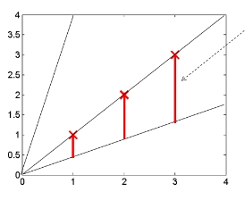
    >
    > Açıklama: Görsel 41 — her örnek için tahmin ile gerçek değer arasındaki farkların (rezidülerin) gösterimi; büyük sapmalar modelin kötü uyduğunu gösterir.
    >
    > En iyi model, gerçek verilere en yakın modeldir; dolayısıyla en küçük J(θ) değerine sahip olandır.
    >
    > 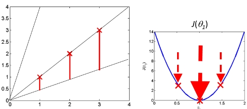
    >
    > Açıklama: Görsel 42 — en iyi modelin seçimi için maliyet değerlerinin karşılaştırılması; küçük J en iyi uyuma işaret eder.
    >
    > Model tahminlerinin gerçek verilere en yakın olmasını sağlamak, (θ0, θ1) için bu optimizasyon problemidir.
    >
    > 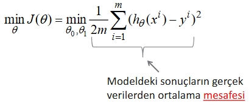
    >
    > Açıklama: Görsel 43 — parametrelerin (θ0, θ1) optimizasyonu ve maliyet yüzeyi/araştırılması görselleştirmesi.
    >
    > Tek değişkenli lineer regresyon probleminde maliyet, iki parametreye (θ0, θ1) bağlıdır; yani J(θ) iki boyutlu bir fonksiyondur.
    >
    > 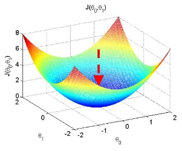
    >
    > Açıklama: Görsel 44 — (θ0, θ1) uzayında maliyet yüzeyi / kontur plot; optimizasyonun niçin 2D bir problem olduğu gösterilir.

## Dereceli azaltma metodu

- En iyi olay modeli, en iyi model parametreleri, en düşük maliyet değeri demektir.
- Maliyetin minimumunu nasıl buluyoruz?

- Dereceli azaltma (gradient descent) metodu, çok güçlü ve çok genel optimizasyon metodudur.
- Bir (θ0, θ1) noktasında başlıyoruz.
- Devamlı olarak, J'nin değerlerini azaltmak için (θ0, θ1) uzayında küçük adımlar yapıyoruz.
- J'nin değerleri her adımda düşmek zorunda değildir; uygun öğrenme oranı (α) seçimi ve konveks J için genel eğilim azalır ve yakınsama beklenir. Aksi hâlde salınım/dağılma görülebilir.

> 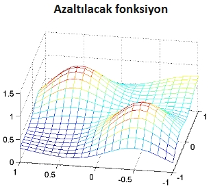

- Bir noktada başladık ...
- ... J değerini azaltan küçük adımları yapıyoruz ...
- ... minimum noktasına gelmek zorundayız

> 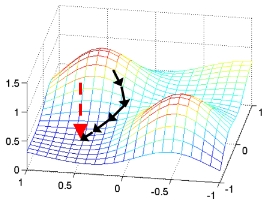

- Sadece lokal olarak bir minimumdur: başka bir noktadan başlayınca başka noktalara gelmek mümkündür.
- Genellikle, bu metot birkaç rastgele başlangıç noktası ile çalıştırılmalı ve en iyi minimum seçilmelidir.

> 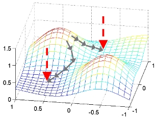

- Ortadaki adımların, J değerini en çok azaltmasını isteriz.
- Bunun için, adımları "gradient" (yani eğim) yönünde yaparız.
- Dereceli azaltma algoritması (özeti):

    - Yakınsamaya kadar tekrarlama {
        - (her iterasyonda türevler hesaplanır)
        - θ_j := θ_j - α * (1/m) Σ_{i=1}^m (h_θ(x^{(i)}) - y^{(i)}) x^{(i)}_j
    - }

> 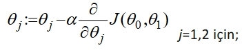

- Bu formülde türetilen ifade, hatanın (rezidülerin) x ile ağırlıklı ortalamasıdır ve α öğrenme oranıdır.

> 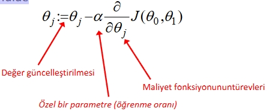

- Önemli Not:
    - Türevler, şu andaki (θ0, θ1) noktası için hepsi döngüden önce hesaplanmalı. Sonra, θ0 ve θ1 değerleri güncelleştirilmelidir.
    - θ0, θ1'in güncelleştirilmesi türevlerin hesaplanmasıyla aynı anda yapılmaz; yani (θ0, θ1) parça-parça şekilde güncelleştirilmez.

- Yakınsamaya kadar tekrarlayın {
    - θ0 := θ0 - α * (1/m) Σ (h_θ(x^{(i)}) - y^{(i)})
    - θ1 := θ1 - α * (1/m) Σ (h_θ(x^{(i)}) - y^{(i)}) x^{(i)}
    - }

- Alpha (α) seçimi — biraz dikkat edilmelidir:
    - Küçük α → yavaş yakınsama.
    - Büyük α → ileri-geri yakınsama (divergens veya osilasyon riski).

> 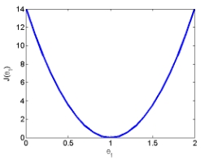

- Alpha seçme örneği: tipik denenebilecek α değerleri: 0.001, 0.003, 0.01, 0.03, 0.1, 0.3, 1, 3, 10 ...

> 
> 

- İyi bir alpha seçmek için, birkaç alpha değeri denenir; her birinde dereceli azaltma çalıştırılır ve yakınsama/performance izlenir.


- Aynı eğitim kümesi için birkaç hipotez denenebilir:
    > 
>
> Açıklama: Görsel 40 — aynı eğitim verisi üzerinde farklı hipotezlerin (ör. farklı derece polinomlar, farklı özellik seçimi vs.) karşılaştırılması; maliyet fonksiyonu değerleri kullanılarak hangi hipotezin daha iyi olduğu sayısal olarak belirlenir.

> 
>
> Açıklama: Model değerlendirmesi veya residual/diagnostic gösterimi için alternatif bir görselleştirme.

- Veri ve denetimli öğrenme:
    - Geçmiş senelerden veya benzer kurumlardan elimizde reklam harcamaları (girdi x) ve gelen öğrenci sayıları (çıktı y) varsa, bu model denetimli öğrenme (supervised learning) ile öğrenilebilir.
    - Etiketli veri (x, y) kullanılarak model parametreleri (w, b) OLS veya optimizasyon yöntemiyle tahmin edilir; model seçimi ve değerlendirme Train/Val/Test üzerine yapılır.

> \
> 
>
> Açıklama: Geçmiş reklam ve sonuç verileriyle denetimli öğrenme uygulanarak model elde edilir; bu model gelecekteki tahminler ve ters problemler için kullanılabilir.


## Sınıflandırma (Classification) — Giriş

- Tanım: Sınıflandırma, girdileri ayrık etiketlere (sınıflara) ayırma problemidir.
    - İkili (binary) sınıflandırma: {0, 1} veya {negatif, pozitif}
    - Çok sınıflı (multi-class) sınıflandırma: {1, 2, ..., K}

- Amaç: Bir karar sınırı/karar kuralı öğrenerek yeni bir x için sınıf etiketi ŷ ∈ {sınıflar} tahmin etmek.
- Tipik örnekler: e-posta spam tespiti, hastalık var/yok, görüntüde kedi/köpek, kredi geri ödeme riski, vb.
- Değerlendirme ölçütleri: Doğruluk (accuracy), kesinlik (precision), duyarlılık (recall), F1, ROC-AUC; veri dengesiz ise sadece doğruluk yanıltıcı olabilir.
- Kayıp/amaç örneği: Lojistik kayıp (log loss) ve çapraz entropi; karar eşiği (threshold) seçimi uygulamaya bağlıdır.

> 
>
> Açıklama: Görsel 53 — sınıflandırma problemine görsel bir giriş; karar sınırları ve sınıf bölgeleri fikrini sezgisel olarak gösterir.

## Sınıflandırma Başarı Metrikleri

Sınıflandırma modellerini değerlendirirken kullanılan metrikler, sorunun bağlamına göre farklı maliyetleri ve öncelikleri yansıtır. Ayrıntılı referans: scikit‑learn — Classification metrics: https://scikit-learn.org/stable/modules/model_evaluation.html#classification-metrics

> 

### Karmaşıklık Matrisi (Confusion Matrix)

Karmaşıklık Matrisi, model tahminlerini gerçek etiketlerle karşılaştırarak hangi sınıflarda doğru/yanlış yaptığını ayrıntılı gösterir. İkili sınıflamada genelde 2×2, çok sınıflıda N×N boyutundadır.

> 
> 
> 

Tanımlar (ikili sınıflama):

- Gerçek Pozitif (TP): Gerçekte Pozitif olanı Pozitif tahmin etmek.
- Gerçek Negatif (TN): Gerçekte Negatif olanı Negatif tahmin etmek.
- Yanlış Pozitif (FP, Tip‑I Hata): Negatif örneği yanlışlıkla Pozitif tahmin etmek (yanlış alarm).
- Yanlış Negatif (FN, Tip‑II Hata): Pozitif örneği yanlışlıkla Negatif tahmin etmek (gözden kaçırma).

Neden FP ve FN ayrı incelenmeli? Çünkü hata maliyetleri bağlama göre değişir. Örn. spam filtresi: FP (geçerli e‑postayı spam sanmak) can sıkıcıdır; tıpta FN (hastayı sağlıklı saymak) kritik risk doğurur.

Örnek küçük veri kümesi ve tahminleri:

| Başvuru | EĞİTİM | YAŞ  | CİNSİYET | KABUL | TAHMİN |
|:-------:|:------:|:----:|:--------:|:-----:|:------:|
| 1 | ORTA  | YAŞLI | ERKEK | EVET  | EVET  |
| 2 | İLK   | GENÇ  | ERKEK | HAYIR | HAYIR |
| 3 | YÜKSEK| ORTA  | KADIN | HAYIR | EVET  |
| 4 | ORTA  | ORTA  | ERKEK | EVET  | EVET  |
| 5 | İLK   | ORTA  | ERKEK | EVET  | EVET  |
| 6 | YÜKSEK| YAŞLI | KADIN | EVET  | EVET  |
| 7 | İLK   | GENÇ  | KADIN | HAYIR | HAYIR |
| 8 | ORTA  | ORTA  | KADIN | EVET  | EVET  |

Bu tablo için özet (KABUL pozitif sınıfı “EVET” kabul edilmiştir): TP=5, TN=2, FP=1, FN=0; Toplam=8.

Python ile karmaşıklık matrisi:

```python
from sklearn.metrics import confusion_matrix

y_true = [1, 0, 1, 0, 1, 1, 0, 0, 0, 0]
y_pred = [0, 1, 1, 0, 1, 1, 1, 0, 0, 0]

cm = confusion_matrix(y_true, y_pred)
print(cm)  # scikit-learn çıktısı [[TN, FP], [FN, TP]] düzenindedir.
```

> 

### Temel Ölçütler

- Doğruluk (Accuracy):

$$
    	ext{ACC} = \frac{TP + TN}{TP + TN + FP + FN}.
$$

- Hata Oranı (Error Rate):

$$
    	ext{ER} = 1 - \text{ACC} = \frac{FP + FN}{TP + TN + FP + FN}.
$$

- Duyarlılık (Recall, Sensitivity, TPR):

$$
    	ext{TPR} = \frac{TP}{TP + FN}.
$$

- Kesinlik (Precision, PPV):

$$
    	ext{PPV} = \frac{TP}{TP + FP}.
$$

- F1‑Skoru (Harmonik ortalama):

$$
    	ext{F1} = 2\,\frac{\text{Precision}\times\text{Recall}}{\text{Precision}+\text{Recall}}.
$$

İpuçları:
- Dengesiz veri setlerinde Accuracy yanıltıcı olabilir; Recall/Precision/F1 ve sınıf‑bazlı raporları kullanın.
- Uygulamaya göre hatanın maliyetine göre eşik ayarı yapılmalıdır (ör. FN maliyeti yüksekse Recall önceliklenir).

> 

### ROC Eğrisi ve AUC

Accuracy neden her zaman yeterli değil? — Dengesiz veri örneği
- Örnek: 100 e‑postanın yalnız 1’i spam olsun (%1). Tüm e‑postalara “spam değil” diyen tembel bir modelin doğruluğu %99 görünür; fakat spam yakalama başarısı %0’dır. Bu nedenle dengesiz veri setlerinde daha zengin metriklere (Recall/Precision, ROC‑AUC, PR‑AUC) ihtiyaç vardır.

ROC eksenleri ve tanımlar
- True Positive Rate (TPR, Recall): \(\displaystyle \frac{TP}{TP+FN}\). “Pozitiflerin yüzde kaçını yakaladık?”
- False Positive Rate (FPR): \(\displaystyle \frac{FP}{FP+TN}\). “Negatiflerin yüzde kaçına yanlışlıkla pozitif dedik?” Not: FPR = 1 − Özgüllük (Specificity), Özgüllük = \(\tfrac{TN}{TN+FP}\).

ROC (Receiver Operating Characteristic) eğrisi nedir?
- Tüm eşik (threshold) değerleri için model performansını gösterir: Y‑ekseni TPR, X‑ekseni FPR’dir.
- Eşik 1.0’dan 0.0’a düşürülürken her noktada (FPR, TPR) hesaplanır; (0,0)’dan başlayıp (1,1)’de biter. Noktaların birleşimi ROC eğrisidir.

> 

Eşik değiştikçe TPR ve FPR değerleri değişir; ROC eğrisi bu değişimi görselleştirir. Eğri altındaki alan (AUC) 1’e yaklaştıkça model ayrıştırma gücü artar.

```python
import numpy as np
from sklearn import metrics

y = np.array([1, 1, 0, 1])
scores = np.array([0.1, 0.4, 0.35, 0.8])  # Pozitif olasılık/skorlar
fpr, tpr, thresholds = metrics.roc_curve(y, scores)
auc_val = metrics.auc(fpr, tpr)
print({"auc": auc_val, "thresholds": thresholds.tolist()})
```

> 

ROC alanının yorumu (AUC)
- Mükemmel model sol‑üst köşeye ((0,1)) yakın seyreder: TPR=1, FPR=0.
- Rastgele model diyagonal (y=x) üzerindedir: ayırt etme gücü yoktur.
- Eğri diyagonalin altına düşerse rastgeleden kötüdür (etiketleri ters çevirmek fayda sağlayabilir).

> 

Pratik: Eşik seçimi (threshold tuning)
- Youden’s J istatistiği: \( J = \max (\,TPR - FPR\,) \). ROC’ta diyagonale en uzak (dikey) noktayı bulur; dengeli bir seçimdir.
- (0,1) noktasına en yakın: \( d = \min \sqrt{(1-TPR)^2 + (FPR)^2} \). Hem yüksek TPR hem düşük FPR isteyen uygulamalar için uygundur.

Kısa Python örneği — en iyi eşiği seçmek:

```python
import numpy as np
from sklearn import metrics

# y: gerçek etiketler (0/1), scores: pozitif sınıf skoru/olasılığı
fpr, tpr, thresholds = metrics.roc_curve(y, scores)
auc_val = metrics.auc(fpr, tpr)

# Youden J (TPR - FPR) maksimize
j_vals = tpr - fpr
thr_j = thresholds[np.argmax(j_vals)]

# (0,1)'e en yakın nokta minimize
dist = np.sqrt((1 - tpr)**2 + (fpr)**2)
thr_01 = thresholds[np.argmin(dist)]

print({"auc": auc_val, "thr_j": float(thr_j), "thr_01": float(thr_01)})
```

Notlar:
- Eşik ayarı iş hedeflerine göre yapılmalı; Precision‑Recall eğrileri dengesiz sınıflarda daha bilgilendirici olabilir.
- Çok sınıflı senaryoda macro/micro/weighted ortalamalarla metrikleri raporlayın; scikit‑learn `classification_report` kullanışlıdır.

## Uzaklık Ölçüleri

- Birçok sınıflandırma ve kümeleme yönteminde (ör. k-NN, k-means) örnekler arası benzerlik/ayrışma, bir uzaklık ölçüsü ile değerlendirilir.
- Gösterimler:
    - p: değişken (özellik) sayısı
    - d_{ij}: i’nci ve j’inci nesneler arasındaki uzaklık
    - x_{ik}: i’nci nesnenin k’ıncı değişkendeki değeri
    - x_{jk}: j’inci nesnenin k’ıncı değişkendeki değeri

> 
>
> Açıklama: Görsel 54 — uzaklık terimleri ve notasyonun kısa özeti.

### Öklid Uzaklığı (Euclidean Distance)

- Tanım:

$$
d_{ij}^{\text{Öklid}} = \sqrt{\sum_{k=1}^{p} (x_{ik} - x_{jk})^{2}}
$$

- Özellikler: Ölçek duyarlıdır; büyük farkları vurgular; metrik özellikleri (pozitiflik, simetri, üçgen eşitsizliği) sağlar.

> 
>
> Açıklama: Görsel 55 — Öklid uzaklığı formülü ve örnek gösterimi.

### Karesel Öklid Uzaklığı (Squared Euclidean)

- Tanım (karekök alınmadan):

$$
d_{ij}^{2} = \sum_{k=1}^{p} (x_{ik} - x_{jk})^{2}
$$

- Notlar:
    - Sıralama açısından çoğu durumda Öklid ile aynı karşılaştırmayı verir (monoton ilişki: sqrt).
    - Karekök olmadığı için hesaplama daha hızlıdır; optimizasyonda sık tercih edilir.
    - Büyük sapmaları daha da fazla cezalandırır (kare terim).

> 
>
> Açıklama: Görsel 56 — karesel Öklid uzaklığı formülü ve kullanım notları.

#### Örnek: Sıcaklık ve Nem Oranı ile Öklid Uzaklığı

Aşağıdaki tabloda üç gün için iki özellik (Sıcaklık, Nem Oranı) verilmiştir. Bu noktalara göre Öklid uzaklıklarını hesaplayalım.

| Gün | Sıcaklık | Nem Oranı |
|-----|----------|-----------|
| 1   | 25       | 80        |
| 2   | 22       | 50        |
| 3   | 18       | 80        |

Uzaklık hesapları (p = 2):

- \( d_{12} = \sqrt{(25-22)^2 + (80-50)^2} = \sqrt{9 + 900} = \sqrt{909} \approx 30.14 \)
- \( d_{13} = \sqrt{(25-18)^2 + (80-80)^2} = \sqrt{49 + 0} = 7 \)
- \( d_{23} = \sqrt{(22-18)^2 + (50-80)^2} = \sqrt{4 + 900} = \sqrt{904} \approx 30.06 \)

Gözlem: Gün 1 ile Gün 3 arasındaki uzaklık 7 ile en küçüktür; bu iki gün (bu iki özellik uzayında) birbirine daha benzerdir.

### Karl Pearson Uzaklığı (Standartlaştırılmış Öklid)

- Öklid uzaklığının değişken varyansına oranlanmasıyla elde edilir; farklı ölçü birimlerine sahip değişkenler için tercih edilir.
- Formül (varyanslarla standardizasyon):

$$
d_{ij}^{\text{KP}} = \sqrt{\sum_{k=1}^{p} \frac{\bigl(x_{ik} - x_{jk}\bigr)^{2}}{s_k^{2}} }
$$

    - Burada s_k^2, k’ıncı değişkenin varyans değeridir; pratikte bazen standart sapma (s_k) ile ölçeklenmiş farklar kullanılır: \(\Delta_k / s_k\).
    - Amaç: Her özelliğin ölçü birimi/ölçeği farklı olsa bile, katkısını karşılaştırılabilir hâle getirmek (ölçek duyarlılığını azaltmak).
    - Uyarı: s_k^2 ≈ 0 ise bölme hatasına yol açmamak için sabit/sıfıra yakın varyanslı özellikleri elemek veya küçük bir ε ile düzenlemek gerekir.

> 
>
> Açıklama: Görsel 57 — standartlaştırılmış (varyansla ölçeklenen) Öklid uzaklığı notasyonu; farklı birim/ölçekli değişkenlerde tercih edilir.

#### Örnek: Sıcaklık ve Nem Oranı ile Karl Pearson Uzaklığı

Veri tablosu (iki özellik: Sıcaklık, Nem Oranı):

| Gün | Sıcaklık | Nem Oranı |
|-----|----------|-----------|
| 1   | 25       | 80        |
| 2   | 22       | 50        |
| 3   | 18       | 80        |

Verilen standart sapmalar (σ): Sıcaklık σ = 8.22, Nem Oranı σ = 200.

Bu derste kullanılan konvansiyona göre (sunum notasyonu):

$$
d_{ij}^{\text{KP}} = \sqrt{ \frac{(\Delta\text{Sıcaklık})^{2}}{(8.22)^{2}} + \frac{(\Delta\text{Nem})^{2}}{(200)^{2}} }
$$

Hesaplar:

- \( d_{12} = \sqrt{ \tfrac{(25-22)^2}{(8.22)^2} + \tfrac{(80-50)^2}{(200)^2} } = \sqrt{0.133 + 0.0225} \approx 0.39 \)
- \( d_{13} = \sqrt{ \tfrac{(25-18)^2}{(8.22)^2} + \tfrac{(80-80)^2}{(200)^2} } = \sqrt{0.725 + 0} \approx 0.85 \)
- \( d_{23} = \sqrt{ \tfrac{(22-18)^2}{(8.22)^2} + \tfrac{(50-80)^2}{(200)^2} } = \sqrt{0.237 + 0.0225} \approx 0.50 \)

Not — yaygın alternatif tanım: Birçok kaynakta standartlaştırılmış Öklid, \( d^2 = \sum_k \tfrac{(x_{ik} - x_{jk})^2}{\operatorname{Var}(x_k)} \) olarak verilir (paydada varyans, karekök dışarıda). Bu tanımda sayısal büyüklük farklı olur fakat karşılaştırmalı sıralama çoğu durumda değişmez.

### Manhattan (City-Block) Uzaklığı

- Tanım: Birimler arasındaki farkların mutlak değerlerinin toplamıdır (L1 uzaklığı).

$$
d_{ij}^{\text{Manhattan}} = \sum_{k=1}^{p} \bigl| x_{ik} - x_{jk} \bigr|
$$

- Ne zaman tercih edilir?
    - Değişkenler arasında ilişki (korelasyon) yoksa veya zayıfsa,
    - Aykırı değerlere (outlier) Öklid'e göre daha dayanıklı bir ölçü isteniyorsa,
    - Şehir blokları/ızgara hareket maliyetleri gibi L1 uygun maliyetler söz konusuysa.

> 
>
> Açıklama: Görsel 58 — Manhattan (city-block) uzaklığının tanımı ve görsel sezgisi.

#### Örnek: Sıcaklık ve Nem Oranı ile Manhattan Uzaklığı

Aynı tablo (Sıcaklık, Nem Oranı):

| Gün | Sıcaklık | Nem Oranı |
|-----|----------|-----------|
| 1   | 25       | 80        |
| 2   | 22       | 50        |
| 3   | 18       | 80        |

Hesaplar (p = 2):

- \( d_{12} = |25-22| + |80-50| = 3 + 30 = 33 \)
- \( d_{13} = |25-18| + |80-80| = 7 + 0 = 7 \)
- \( d_{23} = |22-18| + |50-80| = 4 + 30 = 34 \)

Gözlem: Öklid örneğinde olduğu gibi, Gün 1 ve Gün 3 birbirine en yakındır (d = 7).

### Minkowski (Lp) Uzaklığı

- Genel tanım: Öklid (L2) ve Manhattan (L1) uzaklıklarının genellemesidir.

$$
d_{ij}^{(p)} = \Biggl( \sum_{k=1}^{d} \bigl| x_{ik} - x_{jk} \bigr|^{\,p} \Biggr)^{\!1/p}
$$

    - Burada d özellik (boyut) sayısı, p ise norm derecesidir.
    - Özel durumlar:
        - p = 1 → Manhattan (L1)
        - p = 2 → Öklid (L2)
        - p → ∞ → Chebyshev: \( d_{ij}^{(\infty)} = \max_k |x_{ik} - x_{jk}| \)

- Pratik ipuçları:
    - p arttıkça büyük farklar daha da baskın hâle gelir (outlier etkisi artar).
    - d yüksek olduğunda tüm Lp uzaklıkları birbirine daha çok benzemeye meyleder; uygun ölçekleme/özellik seçimi kritik olur.

> 
>
> Açıklama: Görsel 59 — Minkowski (Lp) uzaklığı ve p/λ parametresi; λ değiştikçe farklı metrikler elde edilir.

- Notasyon:
    - Bazı kaynaklarda p yerine λ kullanılır (bu notlarda p ≡ λ kabul edilir).
- Sonuçlar (λ seçimine göre):
    - λ = 1 ⇒ Manhattan Uzaklığı (L1)
    - λ = 2 ⇒ Öklid Uzaklığı (L2)

### Özellik Ölçekleme (Feature Scaling) — Mesafe Tabanlı Yöntemler

Mesafe ölçülerinde farklı ölçeklerdeki özellikler sonucu domine eder. Bu nedenle k-NN, k-means gibi yöntemlerde ölçekleme şarttır.

- Neden?
    - Sıcaklık (°C) ve Nem (%) gibi farklı birimlerde/ölçeklerde özellikler, ham Öklid/Manhattan ile karşılaştırıldığında büyük ölçekli olanı öne çıkarır.
    - Standardize Öklid (Karl Pearson) bu problemi değişken varyansına göre ağırlıklandırarak azaltır.

- Yöntemler:
    - Standardizasyon (z-skor): \( z = \tfrac{x - \mu}{\sigma} \)
        - Ortalama 0, standart sapma 1 olacak şekilde dönüştürür; birim etkisini kaldırır.
        - Outlier’lar varsa robuslaştırılmış seçenekler: Medyan ve IQR ile ölçekleme.
    - Min–Max ölçekleme: \( x' = \tfrac{x - x_{\min}}{x_{\max} - x_{\min}} \in [0,1] \)
        - Sınırları sabitler; aykırı değerlere duyarlı olabilir.
    - Vektör normlama (birim-norm): \( x' = \tfrac{x}{\lVert x \rVert_2} \) vb.
        - Özellikle kosinüs benzerliği/uzaklığı veya metin vektörlerinde faydalıdır.

- Uygulama notları:
    - Eğitim–doğrulama–test sızıntısını önlemek için ölçekleme parametrelerini (\(\mu,\sigma, x_{\min}, x_{\max}\)) yalnızca eğitim verisinden öğrenin ve diğer bölümlere uygulayın.
    - k-means/k-NN + Öklid kullanırken standardizasyon çoğunlukla varsayılan iyi başlangıçtır.


#### Normalleştirme (Min–Max)

- Tanım: Sayısal değerleri belirli ve küçük bir aralığa (genellikle [0,1]) yerleştirmek için yapılan ölçeklendirme işlemidir.
- En Büyük–En Küçük (Min–Max) Normalleştirme: Orijinal veri üzerinde doğrusal bir dönüşüm yapar; veri içindeki en küçük ve en büyük değerler referans alınır.

$$
x_i' = \frac{x_i - \min(x)}{\max(x) - \min(x)} \in [0,1]
$$

- Terimler:
    - \(x_i'\): Dönüştürülmüş değer
    - \(x_i\): Gözlem değeri
    - \(\max(x)\): Verideki en büyük x değeri
    - \(\min(x)\): Verideki en küçük x değeri

Not: “Standartlaştırma” (z-skor) farklı bir dönüşümdür ve \( z = \tfrac{x - \mu}{\sigma} \) ile yapılır (yukarıdaki Yöntemler bölümüne bakınız).


##### Örnek: Min–Max Normalleştirme (min=2, max=90)

Aşağıdaki X değerleri, min=2 ve max=90 kullanılarak \( x' = \tfrac{x - 2}{90 - 2} \) formülüyle [0,1] aralığına dönüştürülmüştür (sonuçlar 4 ondalığa yuvarlanmıştır):

| X  | min(x) | max(x) | İşlem                 | Sonuç   |
|----|--------|--------|-----------------------|---------|
| 15 | 2      | 90     | (15 − 2) / (90 − 2)  | 0.1477  |
| 5  | 2      | 90     | (5 − 2) / (90 − 2)   | 0.0341  |
| 22 | 2      | 90     | (22 − 2) / (90 − 2)  | 0.2273  |
| 59 | 2      | 90     | (59 − 2) / (90 − 2)  | 0.6477  |
| 90 | 2      | 90     | (90 − 2) / (90 − 2)  | 1.0000  |
| 30 | 2      | 90     | (30 − 2) / (90 − 2)  | 0.3182  |
| 2  | 2      | 90     | (2 − 2) / (90 − 2)   | 0.0000  |
| 80 | 2      | 90     | (80 − 2) / (90 − 2)  | 0.8864  |
| 20 | 2      | 90     | (20 − 2) / (90 − 2)  | 0.2045  |


## K-en Yakın Komşu (K-NN) Algoritması

- K-en yakın komşu algoritması (K-nearest neighbor, K-NN) mesafeye dayalı bir sınıflandırma yöntemidir.
- Amaç: Sınıfları bilinen (etiketli) bir örnek kümesinden yararlanarak, yeni gelen bir gözlemin hangi sınıfa ait olduğunu belirlemek.
- Esas: Yeni gözlem ile eğitim kümesindeki her bir gözlem arasındaki uzaklıklar hesaplanır; en küçük uzaklığa sahip k adet komşu seçilir ve çoğunluk oyu ile sınıf atanır.
- Uzaklık ölçütleri: Öklid, Standardize Öklid (Karl Pearson), Manhattan vb. (bkz. Uzaklık Ölçüleri).

### Adımlar

a) K parametresi belirlenir (verilen noktaya bakılacak komşu sayısı).

b) Yeni gözlem ile eğitim kümesindeki tüm noktalar arasındaki uzaklıklar tek tek hesaplanır.

c) Uzaklıklara göre noktalar sıralanır ve en küçük olan k tanesi seçilir.

d) Bu k komşunun sınıf etiketleri sayılır; en çok tekrarlanan sınıf belirlenir (çoğunluk oyu).

e) Seçilen sınıf, yeni gözlemin tahmini kategorisi olarak kabul edilir.

### Pratik Notlar

- K seçimi:
    - Çok küçük K (ör. 1) → gürültüye duyarlı; çok büyük K → karar sınırları aşırı düzleşir (yüksek bias).
    - İkili sınıflandırmada bağ durumlarını azaltmak için K'nin tek sayı seçilmesi pratik bir tercihtir.
- Bağ (tie) durumları: Eşit oy çıkarsa en yakın komşunun sınıfı veya mesafe-ağırlıklı oylama kullanılabilir.
- Ağırlıklı K-NN (opsiyonel): Daha yakın komşulara daha yüksek ağırlık verilir, ör. ağırlık = 1/(d+ε) veya 1/d^2.
- Ölçekleme önemli: Mesafe tabanlı olduğu için özellik ölçeklemesi (standardizasyon) genellikle gereklidir (bkz. Özellik Ölçekleme).
- Karmaşıklık: Naif uygulamada her tahmin için O(n·d) mesafe hesabı gerekir; büyük n için indeksleme/yakın komşu yapıları düşünülebilir.


### Örnek 1: (8,4) İçin K-NN Sınıflandırma (k = 4)

Verilen: X1 ve X2 nitelikleri ile Y sınıfından oluşan bir gözlem tablosu; yeni gözlem (8,4).

> 
>
> Açıklama: Görsel 60 — X1, X2 ve Y (sınıf) değerlerini içeren gözlem tablosu.

a) K’nın belirlenmesi: k = 4 kabul edilir.

b) Uzaklıkların hesaplanması: (8,4) ile her bir gözlem arasındaki uzaklıklar Öklid uzaklığına göre hesaplanır.

> 
>
> Açıklama: Görsel 61 — Öklid uzaklığı formülü ve hesap adımı.

Örnek hesap (birinci gözlem (2,4) için):

$$
d\bigl((8,4),(2,4)\bigr) = \sqrt{(8-2)^2 + (4-4)^2} = 6.
$$

Benzer şekilde tüm gözlemler için uzaklıklar hesaplanır ve aşağıdaki tablo elde edilir:

> 
>
> Açıklama: Görsel 62 — (8,4) noktasının tüm gözlemlere olan uzaklıkları.

c) En küçük uzaklıkların belirlenmesi: Satırlar uzaklığa göre sıralanır, en küçük k = 4 tanesi seçilir (en yakın 4 komşu).

> 
>
> Açıklama: Görsel 63 — Uzaklığa göre sıralama ve en küçük 4 uzaklığın seçimi.

d) Seçilen komşuların sınıfları: Bu dört komşunun Y sınıfları incelenir; 1 adet İYİ ve 3 adet KÖTÜ vardır.

> 
>
> Açıklama: Görsel 64 — Seçilen komşuların sınıf dağılımı ve baskın sınıf.

e) Sonuç: KÖTÜ sınıfı, İYİ sınıfından daha fazla olduğu için (8,4) noktasının sınıfı KÖTÜ olarak belirlenir.


### Örnek 2: (7,8,5) İçin K-NN — Min–Max Normalizasyon ile (k = 3)

Verilen: Y sınıf niteliğini içeren bir gözlem tablosu. Yeni gözlem noktası: (7, 8, 5).

> 
>
> Açıklama: Görsel 65 — X özellikleri ve Y sınıfını içeren ham veri tablosu.

Önce tüm özellikler min–max ile (0,1) aralığına dönüştürülür. Aday noktanın normalizasyon sonucu: (0.27, 0.43, 0.07).

> 
>
> Açıklama: Görsel 66 — Min–max normalleştirmesi sonrası dönüştürülmüş değerler.

a) K’nın belirlenmesi: k = 3.

b) Uzaklıkların hesaplanması: Aday nokta (0.27, 0.43, 0.07) ile her bir normalleştirilmiş gözlem arasındaki Öklid uzaklıkları hesaplanır.

> 
>
> Açıklama: Görsel 67 — Normalleştirilmiş uzayda Öklid uzaklığı hesapları.

c) En küçük uzaklıkların belirlenmesi: Satırlar uzaklığa göre sıralanır, en küçük k = 3 tanesi seçilir.

> 
>
> Açıklama: Görsel 68 — Uzaklığa göre sıralama ve en küçük 3 uzaklığın seçimi.

d) Komşuların sınıfları: Seçilen 3 komşunun Y sınıfları incelenir; 1 adet HAYIR ve 2 adet EVET vardır.

> 
>
> Açıklama: Görsel 69 — Seçilen komşuların sınıf dağılımı ve baskın sınıf.

e) Sonuç: EVET sayısı HAYIR sayısından fazla olduğundan (7,8,5) gözleminin sınıfı EVET olarak kabul edilir.


### Ağırlıklı Oylama (Weighted Voting)

Basit çoğunluk oylamasında her komşu aynı ağırlığa sahiptir. Ancak bazı durumlarda, daha yakın komşuların daha etkili olması istenir. Bu amaçla ağırlıklı oylama kullanılır.

- Fikir: Komşu katkısı mesafe ile ters orantılıdır; daha yakın komşu daha büyük ağırlık alır.
- Sık kullanılan ağırlıklar: \( w_j = \tfrac{1}{d(i,j)+\varepsilon} \) veya \( w_j = \tfrac{1}{d(i,j)^2+\varepsilon} \)
- Sınıf skoru: \( S_c = \sum_{j \in \mathcal{N}_k,\; y_j=c} w_j \). Tahmin edilen sınıf: \( \arg\max_c S_c \).

> 
>
> Açıklama: Görsel 70 — d(i,j) yeni nokta i ile komşu j arasındaki Öklid uzaklığıdır; her sınıf için ağırlıklandırılmış katkılar toplanır.

Örnek 2 için ağırlıklı oylama:

- EVET (Toplam) = 2,52 + 1,32 = 3,84
- HAYIR = 5,17

> 
>
> Açıklama: Görsel 71 — Ağırlıklı oylama sınıf skorları; en büyük skor HAYIR.

Sonuç: Ağırlıklı oylama ile (7,8,5) gözleminin sınıfı HAYIR olur. Bu, ağırlıklandırmanın çoğunluk oyundan farklı bir sonuç verebileceğini gösterir (daha yakın HAYIR komşularının etkisi daha büyüktür).

> 
>
> Açıklama: Görsel 72 — Ağırlıklı oylamanın uygulama akışı/örnek adımları.

## Destek Vektör Makineleri (Support Vector Machines — SVM)

SVM, denetimli öğrenmede özellikle sınıflandırmada yaygın olup, uygun çekirdek (kernel) fonksiyonlarıyla doğrusal ve doğrusal olmayan karar sınırlarını öğrenebilir. Veri tamamen ayrılabiliyorsa tek bir hiper‑düzlemle ayrım yapılır; ayrılmıyorsa yumuşak kenar (soft margin) ve/veya çekirdek hilesi (kernel trick) kullanılır.

> 

### Karar Düzlemi, Marjin ve Destek Vektörleri

- İkili sınıflandırmada etiketler genellikle y ∈ {−1, +1} alınır. Doğrusal SVM’de karar hiper‑düzlemi:

$$
f(\mathbf{x}) = \mathbf{w}^{\top}\mathbf{x} + b = 0.
$$

- Sınır düzlemleri: \( \mathbf{w}^{\top}\mathbf{x} + b = +1 \) ve \( \mathbf{w}^{\top}\mathbf{x} + b = -1 \). Bu iki sınır arasındaki bant “marjin”dir ve genişliği \( 2/\lVert\mathbf{w}\rVert_2 \) olur. Marjini maksimize etmek genel ayırt ediciliği artırır.
- Destek vektörleri, marjine en yakın (veya üzerinde) bulunan eğitim örnekleridir; çözüm yalnızca bu noktalara dayanır.

> 

### Sert ve Yumuşak Kenar Formülasyonu

- Sert kenar (tam ayrılabilir):

$$
\min_{\mathbf{w}, b} \ \tfrac{1}{2}\,\lVert\mathbf{w}\rVert^2 \quad \text{böyle ki}\quad y_i\big(\mathbf{w}^{\top}\mathbf{x}_i + b\big) \ge 1,\ \forall i.
$$

- Yumuşak kenar (ayrılamayan veri; esneme değişkenleri \(\xi_i\)):

$$
\min_{\mathbf{w}, b,\,\boldsymbol{\xi}} \ \tfrac{1}{2}\,\lVert\mathbf{w}\rVert^2 + C\sum_i \xi_i \quad \text{böyle ki}\quad y_i\big(\mathbf{w}^{\top}\mathbf{x}_i + b\big) \ge 1 - \xi_i,\ \xi_i \ge 0.
$$

- Eşdeğer kayıp perspektifi (hinge loss): \( L_{\text{hinge}}(y, f(x)) = \max\{0, 1 - y\,f(x)\} \); amaç, düzenlileştirme ile birlikte ortalama hinge kaybını minimize etmektir.

> 

### Kernel Hilesi (Kernel Trick)

Doğrusal olmayan ayrımlar için veriyi açıkça daha yüksek boyuta taşımak yerine, çekirdek fonksiyonları ile iç çarpımlar \( \phi(\mathbf{x}_i)^{\top}\phi(\mathbf{x}_j) \) hesaplanır:

- Doğrusal: \( K(\mathbf{x},\mathbf{x}') = \mathbf{x}^{\top}\mathbf{x}' \)
- Polinom: \( K(\mathbf{x},\mathbf{x}') = (\gamma\,\mathbf{x}^{\top}\mathbf{x}' + r)^d \)
- RBF/Gauss: \( K(\mathbf{x},\mathbf{x}') = \exp(-\gamma\,\lVert\mathbf{x}-\mathbf{x}'\rVert^2) \)
- Sigmoid (tanh): \( K = \tanh(\gamma\,\mathbf{x}^{\top}\mathbf{x}' + r) \)

> 

Pratik ipuçları:
- Özellik ölçekleme (standartlaştırma) SVM için çok önemlidir, özellikle RBF/Polinom çekirdeğinde.
- C (düzenlileştirme): Büyük C → hataya düşük tolerans (daha dar marjin), küçük C → daha geniş marjin (daha fazla tolerans).
- RBF’de γ (gamma): Büyük γ → daha “dar” etkiler (aşırı uyum riski), küçük γ → daha “genel” karar sınırı.

Kısa scikit‑learn örnekleri:

```python
from sklearn.svm import SVC
from sklearn.preprocessing import StandardScaler
from sklearn.pipeline import make_pipeline

# Doğrusal SVM (çizgisel ayırıcı)
clf_lin = make_pipeline(StandardScaler(), SVC(kernel="linear", C=1.0))
clf_lin.fit(X_train, y_train)
acc_lin = clf_lin.score(X_test, y_test)

# RBF çekirdekli SVM (doğrusal olmayan)
clf_rbf = make_pipeline(StandardScaler(), SVC(kernel="rbf", C=1.0, gamma="scale"))
clf_rbf.fit(X_train, y_train)
acc_rbf = clf_rbf.score(X_test, y_test)
print({"acc_linear": acc_lin, "acc_rbf": acc_rbf})
```

Notlar:
- Olasılık çıktısı gerekirse `SVC(probability=True)` ile kalibrasyon yapılabilir (maliyetlidir). Alternatif: `CalibratedClassifierCV`.
- Regresyon için SVR/SVR(kernel=...) varyantları mevcuttur (ε‑insensitive loss).

### Avantajlar (özet)

- Çözüm yalnızca destek vektörlerine dayanır; seyrek ve genellemesi kuvvetlidir.
- Küçük/orta boy veri kümelerinde güçlü karar sınırları öğrenir; yüksek boyutlarda da etkilidir.
- Uygun çekirdeklerle doğrusal olmayan karmaşık sınırlar oluşturabilir.

## Karar Ağaçları

- Karar ağaçları, ağaç yapısı şeklindeki bir dizi karar kuralıyla veri kümesini bölerek hedef değişkenin tahmin edilmesini sağlar.
- Akış şemasına benzeyen yapılardır: Her bir öznitelik bir düğümle temsil edilir. Dallar ve yapraklar ağaç yapısının elemanlarıdır. En üst yapı “kök”, aradaki yapılar “dal”, en son sınıflandırıcı/çıktı düğümleri “yaprak”tır.
- Parametrik olmayan bir denetimli öğrenme algoritmasıdır; hem sınıflandırma (Decision Tree Classifier) hem de regresyon (Decision Tree Regressor) görevlerinde kullanılır.

> 
>
> Açıklama: Görsel 73 — Karar ağacı yapısı: kök, iç düğümler (kurallar) ve yapraklar (tahmin).

Kısa notlar:

- Bölme ölçütleri (sınıflandırma): Gini safsızlığı, Entropi (Bilgi Kazancı)
- Bölme ölçütü (regresyon): Ortalama kare hatası (MSE), Ortalama mutlak hata (MAE)
- Aşırı öğrenmeyi (overfitting) önlemek için: maksimum derinlik, yaprak başına minimum örnek sayısı, budama (cost-complexity pruning) gibi düzenleme kontrolleri ayarlanır.


### Dallanma Kriterleri

- Karar ağaçlarında en kritik konulardan biri, herhangi bir düğümden (özellikle kökten) itibaren hangi kritere göre dallanılacağıdır.
- Kullanılan algoritmaya (CART, ID3/C4.5, CHAID vb.) göre ağacın şekli değişebilir. Kök düğümün farklı seçilmesi, yapraklara giden yolu ve dolayısıyla sınıflandırma sonucunu değiştirebilir.
- Uygulama bağlamında sıkça aranan hedef: O noktada dallara ayrıldığında kayıtların olabildiğince “dengeli” ve bilgi açısından ayırt edici parçalara bölünmesidir; böylece istenen sınıfa/yanıta en kısa yoldan ulaşmak amaçlanır.
- Pratikte yaygın ölçütler (hatırlatma):
    - Sınıflandırma: Gini safsızlığı, Entropi (Bilgi Kazancı)
    - Regresyon: MSE/MAE bazlı bölmeler


### Örnek: Kök Düğüm Seçimi ve Dallanma Üzerine

Aşağıdaki veri kümesinde sınıf değişkeni Beden’dir (bağımlı değişken). Amaç, uygun kök düğümü ve dallanma mantığını tartışmaktır.

| Cinsiyet | Kilo | Boy | Beden |
|----------|------|-----|-------|
| K        | 48   | 170 | Orta  |
| K        | 49   | 151 | Küçük |
| K        | 52   | 158 | Orta  |
| K        | 56   | 165 | Orta  |
| E        | 59   | 160 | Küçük |
| K        | 61   | 159 | Orta  |
| E        | 62   | 162 | Küçük |
| E        | 63   | 174 | Orta  |
| K        | 68   | 168 | Orta  |
| K        | 69   | 177 | Büyük |
| E        | 72   | 170 | Orta  |
| E        | 74   | 165 | Küçük |
| E        | 85   | 175 | Orta  |
| E        | 85   | 190 | Büyük |
| E        | 98   | 190 | Büyük |

> 
>
> Açıklama: Görsel 74 — Örnek veri kümesi üzerinde farklı kök seçimlerinin ağaç yapısına etkisi.

Tartışma notları:

- Beden değişkeni sınıf değişkenidir (bağımlı değişken). Hangi değişken kök düğüm olmalı?
- Farklı algoritmalar (CART, ID3/C4.5, CHAID) farklı ağaçlar üretebilir; kök seçimi değişince sınıflandırma yolu ve sonucu da değişebilir.
- Farklı ağaç yapıları aynı sonucu verebilir; bu durum özellikle değişken sayısı fazla olduğunda görülebilir.
- Bu örnekte “kök düğüm olarak Cinsiyet’in seçilmesi” daha mantıklı bir başlangıç olabilir (ayrıştırma gücüne ve basitliğe göre).

> 
>
> Açıklama: Görsel 75 — Boy ve Kilo için dallanma seçenekleri: kaç dal kullanılmalı? Aralıklara bölme ve cinsiyete göre farklı aralıklar mantıklı mı?

İleri düşünme soruları:

- Boy ve Kilo düğümleri için kaç dal olmalı? Sürekli değişkenler için tipik yaklaşım ikili bölme (eşik t: Boy < t / Boy ≥ t) veya aralıklara bölme (binning) şeklindedir.
- Boy ve Kilo değerlerini aralıklara bölmek (discretization) mantıklı mı? Veri miktarı, model sadeliği ve performans arasında denge kurmak gerekir.
- Boy ve Kilo’yu Cinsiyete göre farklı aralıklara bölmek mantıklı mı? Etkileşim (Cinsiyet × Boy/Kilo) anlamlı ise evet; aksi halde gereksiz karmaşıklık yaratabilir. Ağaç algoritmaları bu etkileşimi kendiliğinden yakalayabilir (önce Cinsiyet’e, sonra Boy/Kilo’ya bölerek).

### Karar ağacı oluşturma adımları

- Ağaç top-down recursive divide-and-conquer bir yaklaşımla kurulur.
- Başlangıç: Ağaç, tüm veriyi içeren tek bir kök düğümle başlar.
- Nitelikler: Kategorik kabul edilir; sürekli nitelikler için eşik/arıklara bölme (discretization) ya da doğrudan eşik tabanlı bölme uygulanır.
- Durdurma koşulları:
    - Örneklerin hepsi (veya büyük çoğunluğu) aynı sınıfa aitse: düğüm yapraktır ve sınıf etiketini alır.
    - Bölmeyi yapacak uygun nitelik kalmamışsa.
    - Kalan nitelik değerlerine uyan örnek kalmamışsa.
- Aksi durumda: Örnekleri sınıflara en iyi bölecek nitelik ve/veya eşik seçilir, veri alt kümelere ayrılır ve aynı süreç her alt düğümde tekrarlanır.

### En iyi bölen niteliği belirleme (İyilik Fonksiyonu)

- Farklı algoritmalar farklı iyilik fonksiyonları kullanır; bu seçim ağacın şeklini ve performansını etkiler.
- Bilgi kazancı (Information Gain): ID3, C4.5
    - Klasik hâli ayrık niteliklere yöneliktir; sürekli nitelikler için aday eşikler taranarak en iyi bölme seçilir.
- Gini indeksi (CART)
    - Her nitelik için ikili bölmeler (eşik tabanlı) denenir; olası tüm ikili bölmeler sınanarak en iyi ayrım seçilir.

### Entropi

- Entropi, bir sistemdeki belirsizliğin ölçüsüdür. Karar ağaçlarında (özellikle ID3/C4.5) kök ve sonraki düğümlerde hangi nitelikten bölüneceğini belirlemede kullanılır.

$$
H(S) = - \sum_{c} p(c) \, \log_2 p(c)
$$

- Özellikler (ikili sınıflandırma bağlamında):
    - Örneklerin hepsi aynı sınıfa aitse: entropi = 0
    - Örnekler sınıflar arasında eşit dağılmışsa: entropi = 1
    - Rastgele/ara dağılımlarda: 0 < entropi < 1

> 
>
> Açıklama: Görsel 76 — Shannon entropi denklemi (Claude Shannon, 1948).

> 
>
> Açıklama: Görsel 77 — Entropi değerlerinin sınıf dağılımına göre değişimi.

#### Örnek: Entropi Hesabı

Veri kümesi: \( S = \{\text{evet},\,\text{evet},\,\text{hayır},\,\text{hayır},\,\text{hayır},\,\text{hayır},\,\text{hayır},\,\text{hayır}\} \)

Olasılıklar: \( p(\text{evet}) = 2/8 = 0.25 \), \( p(\text{hayır}) = 6/8 = 0.75 \).

$$
H(S) = -\bigl( 0.25\,\log_2 0.25 + 0.75\,\log_2 0.75 \bigr) \approx 0.81128.
$$

> 
>
> Açıklama: Görsel 78 — Örnek sınıf dağılımı için entropi hesap adımları.


#### Örnek: MEMNUN Entropisi

Veri kümesi (8 gözlem): MODEL, CİNSİYET, YAŞ, MEMNUN.

Sınıf olasılıkları: \( p(\text{HAYIR}) = 5/8 \), \( p(\text{EVET}) = 3/8 \).

$$
H(\text{MEMNUN}) = - \Bigl( \tfrac{5}{8}\,\log_2 \tfrac{5}{8} + \tfrac{3}{8}\,\log_2 \tfrac{3}{8} \Bigr) \approx 0{,}954.
$$


### Bilgi Kazancı (ID3 / C4.5)

- Bilgi kuramı kavramları kullanılarak karar ağacı oluşturulur; amaç, sınıflandırma için gerekli karşılaştırma sayısını azaltmaktır.
- Soru: Bir nitelik üzerinde dallandığımızda entropi ne kadar düşer? Bu düşüş “bilgi kazancı”dır.
- Tanım (ikili/çok sınıflı genel hâl):

$$
\operatorname{Gain}(T, X) = H(T) - H(T\mid X), \quad H(T\mid X) = \sum_{x \in \mathcal{X}} p(x)\, H(T\mid X{=}x).
$$

    Notasyon notu: Bazı slayt/kitaplarda \( H(X,T) \) yazımı görülür; burada kastedilen şartlı entropinin beklenen değeridir (\( H(T\mid X) \)).

#### İşlem Adımları

1) Sınıf niteliğinin entropisini hesapla: \( H(T) \)

> 
>
> Açıklama: Görsel 79 — Sınıf (hedef) değişkeninin entropisinin hesaplanması.

2) Her özellik için sınıfa bağımlı (şartlı) entropiyi hesapla: \( H(T\mid X) \)

> 
>
> Açıklama: Görsel 80 — Özelliklere göre alt kümelerde entropi ve ağırlıklı ortalama.

3) Kazançları bul ve en büyük kazanca sahip özelliği düğüm olarak seç: \( \operatorname{Gain}(T, X) = H(T) - H(T\mid X) \)


#### Örnek: Bilgi Kazancı Hesabı (BORÇ özelliği)

Veri kümesi (hedef: RİSK):

| ID | BORÇ   | GELİR | STATÜ    | RİSK |
|----|--------|-------|----------|------|
| 1  | Yüksek | Yüksek| İşveren  | Kötü |
| 2  | Yüksek | Yüksek| Ücretli  | Kötü |
| 3  | Yüksek | Düşük | Ücretli  | Kötü |
| 4  | Düşük  | Düşük | Ücretli  | İyi  |
| 5  | Düşük  | Düşük | İşveren  | Kötü |
| 6  | Düşük  | Yüksek| İşveren  | İyi  |
| 7  | Düşük  | Yüksek| Ücretli  | İyi  |
| 8  | Düşük  | Düşük | Ücretli  | İyi  |
| 9  | Düşük  | Düşük | İşveren  | Kötü |
| 10 | Düşük  | Yüksek| İşveren  | İyi  |

1) Sınıf entropisi: RİSK = {kötü,kötü,kötü,iyi,kötü,iyi,iyi,iyi,kötü,iyi} ⇒ p(İyi)=0.5, p(Kötü)=0.5

$$
H(\text{RİSK}) = -\bigl(0.5\log_2 0.5 + 0.5\log_2 0.5\bigr) = 1.
$$

2) BORÇ’a göre şartlı entropiler ve ağırlıklar:

- BORÇ=Yüksek: 3 örnek, sınıf dağılımı (3 Kötü, 0 İyi) ⇒ \( H(\text{RİSK}\mid \text{BORÇ}{=}\text{Yüksek}) = 0 \)
- BORÇ=Düşük: 7 örnek, sınıf dağılımı (2 Kötü, 5 İyi) ⇒ \( H(\text{RİSK}\mid \text{BORÇ}{=}\text{Düşük}) \approx 0{,}863 \)

Ağırlıklı şartlı entropi (slayttaki değerlerle):

$$
H(\text{RİSK}\mid \text{BORÇ}) = \tfrac{3}{10}\cdot 0 + \tfrac{7}{10}\cdot 0{,}863 \approx 0{,}64.
$$

3) Bilgi kazancı:

$$
\operatorname{Gain}(\text{RİSK}, \text{BORÇ}) = H(\text{RİSK}) - H(\text{RİSK}\mid \text{BORÇ}) \approx 1 - 0{,}64 = 0{,}36.
$$

Not: Benzer şekilde \( \operatorname{Gain}(\text{RİSK},\text{GELİR}) \) ve \( \operatorname{Gain}(\text{RİSK},\text{STATÜ}) \) hesaplanır; en büyük kazanca sahip nitelik kök düğüm seçilir.


#### Örnek: Bilgi Kazancı — MEMNUN Veri Kümesi

Veri kümesi (8 gözlem):

| MODEL | CİNSİYET | YAŞ | MEMNUN |
|-------|----------|-----|--------|
| X5    | ERKEK    | 21  | HAYIR  |
| X3    | KADIN    | 19  | EVET   |
| X5    | ERKEK    | 22  | HAYIR  |
| X3    | ERKEK    | 21  | EVET   |
| X3    | ERKEK    | 30  | EVET   |
| X3    | KADIN    | 60  | HAYIR  |
| X3    | KADIN    | 45  | HAYIR  |
| X3    | ERKEK    | 55  | HAYIR  |

Sınıf entropisi:

$$
H(\text{MEMNUN}) = -\Bigl( \tfrac{5}{8}\log_2 \tfrac{5}{8} + \tfrac{3}{8}\log_2 \tfrac{3}{8} \Bigr) \approx 0{,}954.
$$

1) MODEL için kazanç:

- Alt kümeler:
    - MODEL = X5: (2 HAYIR, 0 EVET) ⇒ \( H = 0 \)
    - MODEL = X3: (3 EVET, 3 HAYIR) ⇒ \( H = 1 \)
- Ağırlıklı şartlı entropi: \( H(\text{MEMNUN}\mid \text{MODEL}) = \tfrac{2}{8}\cdot 0 + \tfrac{6}{8}\cdot 1 = 0{,}75 \)
- Kazanç: \( 0{,}954 - 0{,}75 = 0{,}204 \)

2) CİNSİYET için kazanç:

- Alt kümeler:
    - ERKEK: (2 HAYIR, 3 EVET) ⇒ \( H \approx 0{,}971 \)
    - KADIN: (2 HAYIR, 1 EVET) ⇒ \( H \approx 0{,}918 \)
- Ağırlıklı şartlı entropi: \( H(\text{MEMNUN}\mid \text{CİNSİYET}) = \tfrac{5}{8}\cdot 0{,}971 + \tfrac{3}{8}\cdot 0{,}918 \approx 0{,}951 \)
- Kazanç: \( 0{,}954 - 0{,}951 = 0{,}003 \)

3) YAŞ için kazanç (eşikler taranarak):

- \( \le 19/ >19 \): \( H\_{\le 19} = 0,\ H\_{>19} \approx 0{,}863 \) ⇒ \( H = \tfrac{1}{8}\cdot 0 + \tfrac{7}{8}\cdot 0{,}863 = 0{,}754 \), Kazanç ≈ 0.200
- \( \le 21/ >21 \): \( H\_{\le 21} \approx 0{,}918,\ H\_{>21} \approx 0{,}722 \) ⇒ \( H \approx 0{,}796 \), Kazanç ≈ 0.158
- \( \le 22/ >22 \): \( H\_{\le 22} = 1,\ H\_{>22} \approx 0{,}811 \) ⇒ \( H \approx 0{,}905 \), Kazanç ≈ 0.049
- \( \le 30/ >30 \): \( H\_{\le 30} \approx 0{,}971,\ H\_{>30} = 0 \) ⇒ \( H = \tfrac{5}{8}\cdot 0{,}971 + \tfrac{3}{8}\cdot 0 = 0{,}607 \), Kazanç ≈ 0.347
- \( \le 45/ >45 \): \( H\_{\le 45} = 1,\ H\_{>45} = 0 \) ⇒ \( H = 0{,}75 \), Kazanç ≈ 0.204
- \( \le 55/ >55 \): \( H\_{\le 55} \approx 0{,}985,\ H\_{>55} = 0 \) ⇒ \( H \approx 0{,}862 \), Kazanç ≈ 0.092
- \( \le 60/ >60 \): \( H\_{\le 60} \approx 0{,}954 \) (tüm veri) ⇒ Kazanç = 0

Özet: En yüksek kazanç YAŞ ≤ 30 eşiği ile \( \approx 0{,}347 \).

> 
>
> Açıklama: Görsel 100 — MODEL, CİNSİYET ve YAŞ için bilgi kazancı karşılaştırması.

Alt ağaç (YAŞ ≤ 30) için yeniden kazançlar:

- Filtre: YAŞ ≤ 30 kayıtları tutulur (5 gözlem). \( H(\text{MEMNUN}) = - (\tfrac{2}{5}\log_2 \tfrac{2}{5} + \tfrac{3}{5}\log_2 \tfrac{3}{5}) \approx 0{,}971 \).
- MODEL için: X5 alt kümesi (2 HAYIR) ⇒ H=0; X3 alt kümesi (3 EVET) ⇒ H=0 → Ağırlıklı H = 0, Kazanç = 0.971
- CİNSİYET için: ERKEK (2 HAYIR, 2 EVET) ⇒ H = 1; KADIN (1 EVET) ⇒ H = 0 → Ağırlıklı H = \( \tfrac{4}{5}\cdot 1 + \tfrac{1}{5}\cdot 0 = 0{,}8 \), Kazanç = 0.171

> 
>
> Açıklama: Görsel 101 — YAŞ ≤ 30 alt kümesinde bilgi kazançları (MODEL ve CİNSİYET).

Kurallar (özet):

- Eğer YAŞ ≤ 30 ve MODEL = X3 ise ⇒ MEMNUN = EVET
- Eğer YAŞ ≤ 30 ve MODEL = X5 ise ⇒ MEMNUN = HAYIR
- Eğer YAŞ > 30 ise ⇒ MEMNUN = HAYIR


## Uygulama: Hava Problemi (ID3 / C4.5)

Başlangıç kümesi ve sınıf dağılımı:

- OYUN = {hayır, hayır, hayır, hayır, hayır, evet, evet, evet, evet, evet, evet, evet, evet, evet}
- C1 = “hayır”, C2 = “evet”
- p(C1) = 5/14, p(C2) = 9/14

> 
>
> Açıklama: Görsel 81 — Hava problemi verisi ve sınıf dağılımı (OYUN).

### Adım 1: Birinci Dallanma

> 
>
> 
>
> 
>
> 

Birinci dallanma sonrası oluşan karar ağacı:

> 

### Adım 2: HAVA = “güneşli” dalı için dallanma

> 
>
> Açıklama: Görsel 88 — “güneşli” alt kümesi üzerinde olası bölmeler.

> 
>
> 
>
> 
>
> 
>
> 

### Adım 3: HAVA = “bulutlu” dalı için dallanma

> 
>
> 
>
> 
>
> 
>
> 

### Sonuç: Oluşturulan Karar Ağacı

> 
>
> Açıklama: Görsel 99 — Nihai karar ağacı (ID3/C4.5 adımları ile elde edilen).


### C4.5 Algoritması

- C4.5, Quinlan tarafından ID3’ün devamı olarak geliştirilmiştir; sayısal (nümerik) niteliklerle karar ağacı kurmayı destekler.
- ID3’e göre temel farkları:
    - Nümerik değerleri kategorik kararlara dönüştürmek için bir eşik (threshold) belirler ve \( x < t \) / \( x \ge t \) şeklinde dallandırır.
    - Bilinmeyen/eksik değerler için bir işleme yöntemi sunar (ör. olasılıksal dağıtım veya örnek ağırlıklarıyla paylaştırma).
    - (Not) Uygulamada budama (pruning) yaparak aşırı öğrenmeyi azaltır.
- Eşik seçimi: Aday eşikler üzerinde bilgi kazancı değerlendirilir; en büyük bilgi kazancını veren eşik seçilerek dallanma yapılır.

Not — yaygın pratik: C4.5, bilgi kazancının yüksek kardinaliteli nitelikleri kayırma eğilimine karşı “kazanç oranı” (gain ratio) da kullanır. Bu notlarda slayt içeriğine uygun olarak eşik seçiminde bilgi kazancı vurgulanmıştır.


### Sınıflandırma ve Regresyon Ağaçları (CART)

- Tarihçe: 1984’te Breiman, Friedman, Olshen ve Stone tarafından ortaya konmuştur. CART, her iç düğümde veriyi İKİYE bölen ikili (binary) karar ağaçları üretir.
- Temel ilke: Her karar düğümünde bir nitelik ve olası bir eşik seçilir; düğüm, “sol” ve “sağ” olmak üzere iki dala ayrılır. Bu işlem özyinelemeli şekilde devam eder.

#### Bölme (Split) Nasıl Seçilir?

1) Tüm nitelikler taranır. Sayısal (nümerik) nitelikler için aday eşikler genelde sıralı değerler arasındaki orta noktalardır. Kategorik nitelikler için ikili bölmeler (alt küme–tamamlayanı) denenir.
2) Her aday bölme için bir iyilik ölçütü hesaplanır; en büyük safsızlık azalımı (impurity decrease) sağlayan bölme seçilir.
3) Durdurma: Minimum yaprak örneği, maksimum derinlik, min impurity decrease gibi koşullar; aksi halde yaprakta sınıf çoğunluğu (sınıflandırma) veya hedefin ortalaması/medyanı (regresyon) atanır.

#### Sınıflandırma için Ölçütler

- Gini Safsızlığı (Gini Index): CART’ta varsayılan ölçüttür.
    - Bir düğümde sınıf oranları p(c) ise: Gini(t) = 1 − ∑_c p(c)^2
    - Aday bölme s = (t → L,R) için ağırlıklı safsızlık: Gini_s = (|L|/|t|)·Gini(L) + (|R|/|t|)·Gini(R)
    - Kazanç: Δ = Gini(t) − Gini_s; en büyük Δ seçilir.

- Twoing Kriteri: Çok sınıflı sorunlarda sınıfları iki “süper-sınıfa” ayıracak bölmeleri teşvik eder.
    - Sezgi: Sol ve sağ dallardaki sınıf oranları farklarını büyütmeyi hedefler.
    - Tipik form: Score(s) = (|L|·|R| / |t|^2) · [½ · ∑_c |p_L(c) − p_R(c)|]^2. Değer ne kadar büyükse bölme o kadar iyidir.

#### Twoing Algoritması (detay)

Bir t düğümü için aday bir bölme, veriyi iki alt kümeye ayırır: sol (L) ve sağ (R). Aşağıdaki büyüklükler tanımlanır:

- Sol ve sağ dal oranları: $P_L = \tfrac{|L|}{|t|}$, $P_R = \tfrac{|R|}{|t|}$.
- Sınıf koşullu oranları: $p_L(j) = \tfrac{n_j(L)}{|L|}$, $p_R(j) = \tfrac{n_j(R)}{|R|}$; burada $n_j(\cdot)$ ilgili alt kümedeki j sınıfı adedidir.

Slayt notasyonunda (sol/sağ için $P_{sol}, P_{sağ}$; koşullu olasılıklar $P(j\mid t_{sol}), P(j\mid t_{sağ})$) Twoing uygunluk ölçüsü şu şekilde yazılır:

$$
\Phi_s(t) = 2\,P_{sol}\,P_{sağ} \sum_{j=1}^{K} \bigl\lvert P(j\mid t_{sol}) - P(j\mid t_{sağ}) \bigr\rvert.
$$

Not — kaynak farkı: Bazı referanslarda aşağıdaki eşdeğere yakın bir form kullanılır ve karesel terim içerir:

$$
        	ext{Score}(s) = \frac{|L|\,|R|}{|t|^2} \left[\tfrac{1}{2}\sum_{j=1}^{K} \bigl\lvert p_L(j) - p_R(j) \bigr\rvert\right]^2.
$$

İki form da pratikte benzer sıralama yapar; amaç, sol ve sağdaki sınıf dağılımlarını mümkün olduğunca birbirinden farklı kılmaktır. İşlem adımları:

1) Aday bölmeyi (özellik + eşik/alt küme) oluştur.
2) $P_L, P_R$ ve her sınıf için $p_L(j), p_R(j)$ değerlerini hesapla.
3) $\Phi_s(t)$ (veya eşdeğeri skor) değerini hesapla.
4) Tüm adaylar içinde en büyük skoru veren bölmeyi seç.

##### Örnek: Twoing ile Karar Ağacı (MEMNUN — 11 gözlem)

Tabloda çalışanların maaş, deneyim, görev niteliklerine göre hedef niteliği MEMNUN olan 11 gözlem verilmiştir. Twoing algoritmasıyla karar ağacı oluşturalım.

> 
>
> Açıklama: 11 gözlem ve nitelikler (MAAŞ, DENEYİM, GÖREV) ile MEMNUN hedefi.

Önce tüm aday bölünmeleri üretelim.

> 
>
> Açıklama: Özellik–eşik/alt küme temelli tüm aday ikili bölmeler.

Her aday bölme için sol/sağ taraf sınıf olasılıkları hesaplanır.

> 
>
> 

Twoing uygunluk ölçüsü (slayt notasyonu):

$$
\Phi_s(t) = 2\,P_{sol}\,P_{sağ} \sum_{j\in\{EVET, HAYIR\}} \bigl\lvert P(j\mid t_{sol}) - P(j\mid t_{sağ}) \bigr\rvert.
$$

Örnek bir aday için (Bölünme 1):

$$
\Phi_s(t) = 2\cdot 0.09\cdot 0.91\,\Bigl(|1.00 - 0.60| + |0.00 - 0.40|\Bigr) = 0.131.
$$

Adayların özeti:

| BÖLÜNME | Psol | Psağ | P(Evet|tsol) | P(Evet|tsağ) | P(Hayır|tsağ) | P(Hayır|tsol) | Uygunluk Ölçüsü |
|---------:|:----:|:----:|:------------:|:------------:|:-------------:|:-------------:|:----------------:|
| 1 | 0.09 | 0.91 | 1.00 | 0.60 | 0.40 | 0.00 | 0.131 |
| 2 | 0.45 | 0.55 | 0.60 | 0.67 | 0.33 | 0.40 | 0.069 |
| 3 | 0.45 | 0.55 | 0.60 | 0.67 | 0.33 | 0.40 | 0.069 |
| 4 | 0.18 | 0.82 | 1.00 | 0.56 | 0.44 | 0.00 | 0.260 |
| 5 | 0.45 | 0.55 | 0.60 | 0.67 | 0.33 | 0.40 | 0.069 |
| 6 | 0.36 | 0.64 | 0.50 | 0.71 | 0.29 | 0.50 | 0.194 |
| 7 | 0.55 | 0.45 | 0.33 | 1.00 | 0.00 | 0.67 | 0.663 |
| 8 | 0.45 | 0.55 | 1.00 | 0.33 | 0.67 | 0.00 | 0.663 |

En büyük uygunluk ölçüsünü veren bölünme seçilir (örnekte 7 veya 8). Ağaç inşasına bu bölünmeden başlanır ve alt düğümlerde aynı işlem yinelemeli sürdürülür.

> 
>
> 

Bu örnekten elde edilen kurallar:

1) EĞER (GÖREV = YÖNETİCİ) İSE (MEMNUN = EVET)
2) EĞER (GÖREV = UZMAN) VE (MAAŞ = NORMAL) İSE (MEMNUN = EVET)
3) EĞER (GÖREV = UZMAN) VE (MAAŞ = DÜŞÜK VEYA MAAŞ = YÜKSEK) VE (DENEYİM = YOK) İSE (MEMNUN = EVET)
4) EĞER (GÖREV = UZMAN) VE (MAAŞ = DÜŞÜK VEYA MAAŞ = YÜKSEK) VE (DENEYİM = ORTA VEYA DENEYİM = İYİ) İSE (MEMNUN = HAYIR)

#### Gini Algoritması (detay)

Gini algoritmasında her aday bölünmede düğüm iki parçaya ayrılır ve sol/sağ alt düğümlerin safsızlıkları hesaplanır.

- Tanımlar:
    - k: sınıf sayısı, T: mevcut düğümdeki örnekler
    - |T_sol|, |T_sağ|: sol/sağ alt düğümlerdeki örnek sayıları
    - L_i: sol taraftaki i’nci sınıf adedi, R_i: sağ taraftaki i’nci sınıf adedi

- Sol ve sağ için Gini safsızlığı:

$$
\operatorname{Gini}_{sol} = 1 - \sum_{i=1}^{k} \left( \frac{L_i}{|T_{sol}|} \right)^2, \quad
\operatorname{Gini}_{sağ} = 1 - \sum_{i=1}^{k} \left( \frac{R_i}{|T_{sağ}|} \right)^2.
$$

- Aday bölmenin ağırlıklı Gini değeri (özellik j için): n eğitim kaydı varsa

$$
\operatorname{Gini}_j = \frac{1}{n}\Bigl( |T_{sol}|\,\operatorname{Gini}_{sol} + |T_{sağ}|\,\operatorname{Gini}_{sağ} \Bigr)
= \frac{|T_{sol}|}{n}\,\operatorname{Gini}_{sol} + \frac{|T_{sağ}|}{n}\,\operatorname{Gini}_{sağ}.
$$

- Seçim: Her j niteliği için hesaplanan \(\operatorname{Gini}_j\) değerleri arasından en küçük olanı seçilir ve bölünme bu nitelik/eşik üzerinden yapılır. Sonra aynı işlem alt düğümlerde tekrarlanır.

##### Örnek: Gini ile Karar Ağacı

> 
>
> 
>
> 
>
> 
>
> 
>
> 
>
> 

Bu örnekten elde edilen kurallar:

1) EĞER (YAŞ = GENÇ) İSE (SONUÇ = HAYIR)
2) EĞER (YAŞ = ORTA VEYA YAŞ = YAŞLI) VE (CİNSİYET = ERKEK) İSE (SONUÇ = EVET)
3) EĞER (YAŞ = ORTA VEYA YAŞ = YAŞLI) VE (CİNSİYET = KADIN) VE (YAŞ = YAŞLI) İSE (SONUÇ = EVET)
4) EĞER (YAŞ = ORTA VEYA YAŞ = YAŞLI) VE (CİNSİYET = KADIN) VE (YAŞ = ORTA) İSE (SONUÇ = HAYIR)

##### Sayısal Değerler için Gini Algoritması

Sayısal nitelikler için (örn. YAŞ) C4.5’teki eşik tarama yaklaşımına benzer şekilde, her aday eşik için Gini ölçütü hesaplanır ve en küçük değeri veren eşik seçilir.

- Adımlar:
    1) Nümerik özelliğin benzersiz değerlerini sırala; ardışık değerlerin ortalarını aday eşik olarak belirle.
    2) Her eşik için iki alt küme oluştur (≤ t, > t) ve sol/sağ Gini değerlerini hesapla.
    3) Ağırlıklı Gini’yi hesapla ve en küçük değere sahip eşiği seç.

MEMNUN veri kümesi (8 gözlem) örneği:

Öznitelik bazında Gini (kategorikler):

- MODEL: \( Gini_{X5} = 1 - (0/2)^2 - (2/2)^2 = 0 \), \( Gini_{X3} = 1 - (3/6)^2 - (3/6)^2 = 0.5 \)
    - Ağırlıklı: \( Gini_{MODEL} = \tfrac{2\cdot 0 + 6\cdot 0.5}{8} = 0.375 \)
- CİNSİYET:
    - ERKEK: \( Gini = 1 - (2/5)^2 - (3/5)^2 = 0.48 \)
    - KADIN: \( Gini = 1 - (1/3)^2 - (2/3)^2 \approx 0.45 \)
    - Ağırlıklı: \( Gini_{C\İNS\İYET} = \tfrac{5\cdot 0.48 + 3\cdot 0.45}{8} \approx 0.469 \)

YAŞ için aday eşikler ve Gini değerleri:

| Eşik t | Sol (≤ t) | Sağ (> t) | Gini_sol | Gini_sağ | Ağırlıklı Gini |
|:------:|:----------:|:---------:|:--------:|:--------:|:--------------:|
| 19 | (1E, 0H) | (2E, 5H) | 0.000 | 0.408 | 0.357 |
| 21 | (2E, 1H) | (1E, 4H) | 0.445 | 0.320 | 0.369 |
| 22 | (2E, 2H) | (1E, 3H) | 0.500 | 0.375 | 0.438 |
| 30 | (3E, 2H) | (0E, 3H) | 0.480 | 0.000 | 0.300 |
| 45 | ... | ... | — | — | 0.375 |
| 55 | ... | ... | — | — | 0.429 |
| 60 | ... | ... | — | — | 0.469 |

Özet (en iyi eşik ve en iyi öznitelik):

- En küçük Gini değeri YAŞ için t = 30’da: 0.300
- Öznitelik karşılaştırması: MODEL = 0.375, CİNSİYET ≈ 0.469, YAŞ = 0.300 ⇒ En iyi: YAŞ (t = 30)

> 
>
> Açıklama: YAŞ için aday eşiklerde Gini ölçütleri ve öznitelik bazında özet; en küçük değer t = 30 eşiklidir.

#### Regresyon için Ölçütler

- Varyans (MSE) Azalımı: Düğümdeki hedef değişken için kare hatayı azaltacak bölme seçilir.
    - MSE(t) = (1/|t|) ∑_{i∈t} (y_i − ȳ_t)^2
    - Bölme sonrası ağırlıklı hata: MSE_s = (|L|/|t|)·MSE(L) + (|R|/|t|)·MSE(R)
    - Kazanç: Δ = MSE(t) − MSE_s; en büyük Δ seçilir.

##### Regresyon Ağaçları (detay)

Temel fikir: Her düğümde veri iki dala ayrılır ve her dal için ortalama kare hata (MSE) hesaplanır. En küçük toplam hata veren bölme seçilir.

- Bir t düğümünde n(t) örnek için:

$$
R(t) = \frac{1}{n(t)} \sum_{x_i\in t} \bigl(y_i - \bar y_t\bigr)^2, \quad \bar y_t = \frac{1}{n(t)} \sum_{x_i\in t} y_i.
$$

- İkili bölme ile t → (t_{sol}, t_{sağ}). Aday bölme için hesaplanır:

$$
R(t_{sol}) = \frac{1}{n(t_{sol})} \sum_{x_i\in t_{sol}} \bigl(y_i - \bar y_{t_{sol}}\bigr)^2,\quad
R(t_{sağ}) = \frac{1}{n(t_{sağ})} \sum_{x_i\in t_{sağ}} \bigl(y_i - \bar y_{t_{sağ}}\bigr)^2.
$$

Seçim ölçütü: Bölme, \( R(t_{sol}) + R(t_{sağ}) \) toplamını minimize edecek şekilde seçilir (eşdeğer olarak MSE_s minimize edilir).

###### Örnek (küçük veri seti)

Veri (Y hedefi):

| Örnek | X1 | X2 | Y |
|:-----:|:--:|:--:|:--:|
| 1 | 12 | 34 | 44 |
| 2 | 18 | 25 | 35 |
| 3 | 11 | 18 | 30 |
| 4 | 9  | 23 | 45 |
| 5 | 15 | 31 | 43 |

Örnek bölme: X1 ≤ 12 (1. eleman referans alınarak)

- t_{sol} = {44, 30, 45}, t_{sağ} = {35, 43}
- \( \bar y_{t_{sol}} = (44+30+45)/3 = 39.67 \), \( \bar y_{t_{sağ}} = (35+43)/2 = 39 \)
- \( R(t_{sol}) = \tfrac{(44-39.67)^2 + (30-39.67)^2 + (45-39.67)^2}{3} = 46.89 \)
- \( R(t_{sağ}) = \tfrac{(35-39)^2 + (43-39)^2}{2} = 16 \)
- Toplam: \( R(t_{sol}) + R(t_{sağ}) = 62.89 \)

Tüm olası eşiklerde benzer hesap yapılarak aşağıdaki tablo elde edilir:

| Koşul | R(t_{sol}) + R(t_{sağ}) |
|:------|:------------------------:|
| X1 ≤ 12 | 62.89 |
| X1 ≤ 18 | 34.64 |
| X1 ≤ 11 | 72.47 |
| X1 ≤ 9  | 33.50 |
| X1 ≤ 15 | 37.25 |
| X2 ≤ 34 | 34.64 |
| X2 ≤ 25 | 39.14 |
| X2 ≤ 18 | 15.69 |
| X2 ≤ 23 | 72.47 |
| X2 ≤ 31 | 36.69 |

En küçük toplam hata X2 ≤ 18 koşulundadır. Bölme noktası, bu değerin bir altındaki sonraki değerle ortalaması alınarak belirlenir:

$$
    	ext{Bölme Noktası} = \frac{18 + 23}{2} = 20.5.
$$

> 
>
> Açıklama: En iyi bölme X2 ≈ 20.5 eşiğindedir; düğümdeki örnekler iki dala ayrılarak toplam MSE minimize edilir.

#### Regresyon Başarı Metrikleri

Regresyon modellerini değerlendirirken kullanılan başlıca metrikler MSE, RMSE ve R²’dir. Ayrıntılı referans için: scikit‑learn — Regression metrics: https://scikit-learn.org/stable/modules/model_evaluation.html#regression-metrics

> 

##### Ortalama Kare Hata (MSE) ve Kök Ortalama Kare Hata (RMSE)

- Tanım:

$$
\operatorname{MSE} = \frac{1}{n} \sum_{i=1}^{n} (y_i - \hat y_i)^2, \quad \operatorname{RMSE} = \sqrt{\operatorname{MSE}}.
$$

- Yorum:
    - MSE kare hataları ortalar; büyük hataları daha fazla cezalandırır (aykırı değerlere duyarlıdır).
    - RMSE, hedef değişkenin birimiyle aynı birimdedir; yorumlaması daha sezgiseldir.

Kısa Python örneği (scikit‑learn):

```python
from sklearn.metrics import mean_squared_error

y_true = [3.0, 2.0, 4.0, 5.0]
y_pred = [2.5, 2.1, 3.9, 4.8]

mse  = mean_squared_error(y_true, y_pred, squared=True)   # MSE
rmse = mean_squared_error(y_true, y_pred, squared=False)  # RMSE

print({"mse": mse, "rmse": rmse})
```

> 

##### Belirleme Katsayısı (R²)

- Tanım (toplam sapma SS_tot ve artık sapma SS_res ile):

$$
R^2 = 1 - \frac{\sum_i (y_i - \hat y_i)^2}{\sum_i (y_i - \bar y)^2} = 1 - \frac{\operatorname{SS}_{res}}{\operatorname{SS}_{tot}}, \quad \bar y = \frac{1}{n}\sum_i y_i.
$$

- Yorum:
    - R² ≈ 1: Model, varyansın büyük kısmını açıklar (iyi uyum). 0: Sadece ortalama tahmini kadar. < 0: Ortalama tahmininden daha kötü.
    - Çoklu doğrusal regresyonda R², özellik sayısıyla artma eğilimindedir; bu yüzden karşılaştırmalarda düzeltilmiş R² (Adjusted R²) tercih edilebilir.

Kısa Python örneği (scikit‑learn):

```python
from sklearn.metrics import r2_score

y_true = [3.0, 2.0, 4.0, 5.0]
y_pred = [2.5, 2.1, 3.9, 4.8]

r2 = r2_score(y_true, y_pred)
print({"r2": r2})
```

> 

Notlar:
- Farklı metrikler farklı hedefleri optimize eder; örneğin MAE aykırı değerlere daha dayanıklıdır, MSE/RMSE büyük hataları daha çok cezalandırır.
- Model seçimi/karşılaştırması için aynı veri bölmeleri (örn. k‑katlı Çapraz Doğrulama) üzerinde aynı metrikleri kullanın; veri sızıntısını önleyin.

> 


#### Uygulama Notları

- Nümerik nitelikler: Değerleri sırala; ardışık benzersiz değerlerin ortalarını eşik adayı olarak dene.
- Kategorik nitelikler: Tüm alt küme bölmeleri üstel sayıda olabilir; pratikte sınıf-odaklı sezgisel aramalar veya hedef sayısı küçükse tam tarama yapılır.
- Budama: CART tipik olarak cost-complexity pruning (α-uyumlu budama) uygular; doğrulama seti ile α seçilebilir.

> 
>
> Açıklama: CART’ta her düğüm ikili bölünür; örnekte, seçilen nitelik ve eşik ile veri iki dala ayrılmış, Gini/Twoing veya MSE azalıma göre en iyi bölme tercih edilmiştir.

### Kural Çıkartma (Rule Extraction)

> 
>
> Açıklama: Görsel 102 — Karar ağacından türetilen kuralların örnek gösterimi.

- Karar ağacından elde edilen kurallar (örnek):
    1. EĞER (NİTELİK1 = a) VE (NİTELİK2 = Eşit veya Küçük) İSE (SINIF = Sınıf1)
    2. EĞER (NİTELİK1 = a) VE (NİTELİK2 = Büyük) İSE (SINIF = Sınıf2)
    3. EĞER (NİTELİK1 = b) İSE (SINIF = Sınıf1)
    4. EĞER (NİTELİK1 = c) VE (NİTELİK3 = yanlış) İSE (SINIF = Sınıf1)
    5. EĞER (NİTELİK1 = c) VE (NİTELİK3 = doğru) İSE (SINIF = Sınıf2)

### Bilinmeyen Öznitelik Değerleri (Missing Values)

Eksik/kayıp değer içeren nitelikler için bilgi kazancı hesaplanırken aşağıdaki yaklaşım kullanılabilir:

- Kayıplı örnekler hariç tutularak \( H(T) \) ve \( H(T\mid X) \) normal şekilde hesaplanır (sadece bilinen X değerleri ile).
- Sonuç, kayıpsız örnek oranı \( F \) ile ölçeklenir:

$$
F = \frac{\text{X değeri bilinen örnek sayısı}}{\text{toplam örnek sayısı}}, \quad \operatorname{Gain}_X = F\,\bigl( H(T) - H(T\mid X) \bigr).
$$

Örnek veri kümesi (NİTELİK1’de bir eksik “?” değer var, toplam 14 kayıt):

| NİTELİK1 | NİTELİK2 | NİTELİK3 | SINIF  |
|----------|----------|----------|--------|
| a        | 70       | Doğru    | Sınıf1 |
| a        | 90       | Doğru    | Sınıf2 |
| a        | 85       | Yanlış   | Sınıf2 |
| a        | 95       | Yanlış   | Sınıf2 |
| a        | 70       | Yanlış   | Sınıf1 |
| ?        | 90       | Doğru    | Sınıf1 |
| b        | 78       | Yanlış   | Sınıf1 |
| b        | 65       | Doğru    | Sınıf1 |
| b        | 75       | Yanlış   | Sınıf1 |
| c        | 80       | Doğru    | Sınıf2 |
| c        | 70       | Doğru    | Sınıf2 |
| c        | 80       | Yanlış   | Sınıf1 |
| c        | 80       | Yanlış   | Sınıf1 |
| c        | 96       | Yanlış   | Sınıf1 |

 Hedef entropisi (tüm 14 kayıt, SINIF dağılımı: 9 Sınıf1, 5 Sınıf2):

$$
H(\text{SINIF}) = -\Bigl( \tfrac{9}{14}\log_2 \tfrac{9}{14} + \tfrac{5}{14}\log_2 \tfrac{5}{14} \Bigr) \approx 0{,}94.
$$

Not: Hedef entropisi H(SINIF) tüm 14 kayıtla hesaplanır. Aşağıda koşullu entropi yalnızca NİTELİK1 değeri bilinen 13 kayıt üzerinde hesaplanır.

Koşullu entropi (yalnız NİTELİK1’i bilinen 13 kayıt):

\( H(\text{SINIF}\mid \text{NİTELİK1}) \approx 0{,}747 \)

Ölçek faktörü ve ayarlanmış kazanç:

$$
F = \tfrac{13}{14}, \quad \operatorname{Gain}(\text{NİTELİK1},\text{SINIF}) = F\,\bigl(0{,}961 - 0{,}747\bigr) \approx 0{,}199.
$$

### Ezber (Overfitting) ve Budama

Tüm makine öğrenmesi yöntemlerinde olduğu gibi, karar ağaçları da uygun önlemler alınmadığında ezber (overfitting) yapabilir. Bu nedenle ağaç oluşturulurken/sonrasında budama teknikleri (ör. cost-complexity pruning, minimum yaprak örneği, maksimum derinlik) kullanılmalıdır.

> 
>
> Açıklama: Görsel 103 — Aşırı öğrenme etkisi ve budama ile modelin sadeleştirilmesi.

#### Ağaç Budama

Budama, sınıflandırmaya kayda değer katkısı olmayan bölümlerin karar ağacından çıkarılması işlemidir. Bu sayede ağaç hem daha sade hem de daha anlaşılabilir hale gelir. İki temel budama yaklaşımı vardır:

- Ön budama (pre-pruning): Ağaç oluşturulurken uygulanır. Bölünme, belirlenen bir eşik sağlanmıyorsa (ör. minimum bilgi kazancı, minimum örnek, maksimum derinlik, hata toleransı) o noktada durdurulur ve eldeki alt kümenin baskın sınıf etiketi yaprak olarak atanır.
- Sonradan budama (post-pruning): Ağaç tamamen kurulduktan sonra uygulanır. Alt ağaçları silerek yaprak oluşturma (subtree replacement), alt ağaçları yükseltme (subtree raising) ve dal kesme gibi tekniklerle sadeleştirme yapılır; karar genellikle doğrulama kümesi performansı ya da maliyet–karmaşıklık (cost-complexity) ölçütüne göre verilir.

##### Örnek: Hata toleransı ile budama

> 
>
> Açıklama: Hata toleransı %33 seçilirse “Nem” düğümünün alt dallarındaki “Evet” oranı %30’dur. Bu yüzden “Nem” düğümü budanır ve yerine “Hayır” yaprağı konur.


