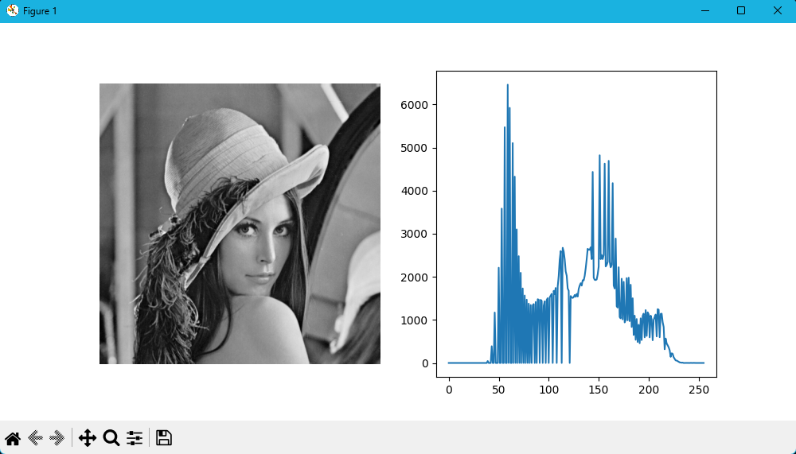
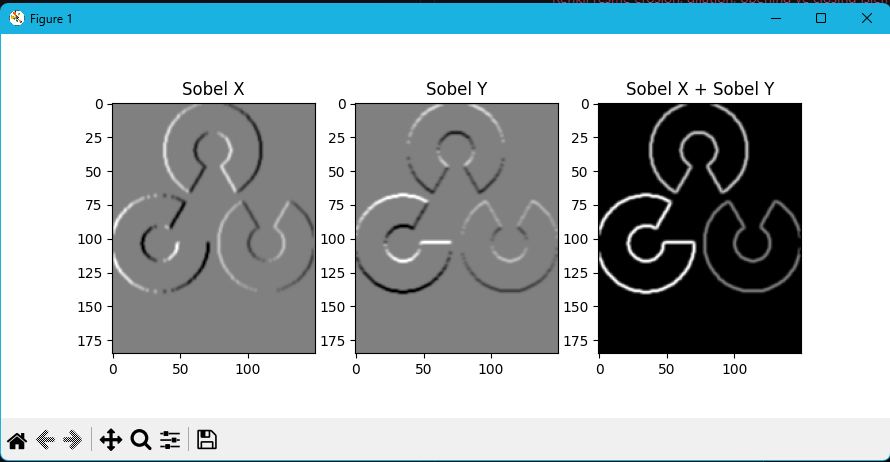

# Digital Image Processing Course Notes
## Table of Contents

# 1. [Giris](#Giris)


## Ikili Görüntüler (Binary Images)
- 0 ve 1'lerden oluşan görüntülerdir.
- Siyah ve beyaz renklerden oluşur.
- Siyah renk 0, beyaz renk 1 olarak kabul edilir.\


## Gri Seviye Görüntüler (Gray Level Images)
- Siyah ve beyaz arasında sonsuz sayıda ton içerir.
- 0'dan 255'e kadar olan sayılarla ifade edilir.
- 0 siyah, 255 beyazdır.\


## Renkli Görüntüler (Color Images)
- RGB (Red, Green, Blue) renk modeli kullanılır.
- 3 kanal içerir.
- Her bir kanal 0-255 arasında değer alır.\


## OpenCV
```python
import cv2

image = cv2.imread("image.jpg")
print(image.shape)
print(image)
```


```python
import cv2

image = cv2.imread("Examples/lena.png")
cv2.imshow("Lena", image)
cv2.waitKey(0)
cv2.destroyAllWindows()
```


```python
import cv2

image = cv2.imread("Examples/lena.png")
blue = image[:,:,0]
green = image[:,:,1]
red = image[:,:,2]

cv2.imshow("Blue", blue)
cv2.imshow("Green", green)
cv2.imshow("Red", red)
cv2.waitKey(0)
cv2.destroyAllWindows()
```
- OpenCV'de renk kanallari BGR sırasıyla saklanır.\


```python
import cv2

image = cv2.imread("Examples/lenna.jpg",0)
print(image.shape)
print(image)
cv2.imshow("image",image)
cv2.waitKey(0)
cv2.destroyAllWindows()
```
- Gri seviye görüntü okuma.\


```python
import cv2
image = cv2.imread("Examples/lena.png")
cv2.rectangle(image,(110,10),(350,280),(255,0,0),3)
cv2.imshow("resim",image)
cv2.waitKey(0)
cv2.destroyAllWindows()
```
- Renkli görüntüde dikdörtgen çizme.
- İlk parametre resim, ikinci parametre başlangıç koordinatları, üçüncü parametre bitiş koordinatları, dördüncü parametre renk, beşinci parametre kalınlık.\


```python
import cv2

resim = cv2.imread("Examples/lena.png",0)
cv2.rectangle(resim,(110,10),(350,280),255,3)
cv2.imshow("resim",resim)
cv2.waitKey(0)
cv2.destroyAllWindows()
```
- Gri seviye görüntüde dikdörtgen çizme.
- İlk parametre resim, ikinci parametre başlangıç koordinatları, üçüncü parametre bitiş koordinatları, dördüncü parametre renk, beşinci parametre kalınlık.\


```python
import cv2

image = cv2.imread("Examples/lena.png")
cv2.circle(image, (240, 160), 150, (150, 150, 100), 5)
cv2.imshow("image", image)
cv2.waitKey(0)
cv2.destroyAllWindows()
```
- Renkli görüntüde daire çizme.
- İlk parametre resim, ikinci parametre merkez koordinatları, üçüncü parametre yarıçap, dördüncü parametre renk, beşinci parametre kalınlık.\


```python
import cv2

image = cv2.imread("Examples/lena.png")
cv2.line(image, (0, 0), (511, 511), (150, 200, 0), 5)
cv2.imshow("image", image)
cv2.waitKey(0)
cv2.destroyAllWindows()
```
- Renkli görüntüde çizgi çizme.
- İlk parametre resim, ikinci parametre başlangıç koordinatları, üçüncü parametre bitiş koordinatları, dördüncü parametre renk, beşinci parametre kalınlık.\


```python
import cv2

image = cv2.imread("Examples/lena.png")
cv2.putText(image, "Lena", (40, 150), 2, 2, (255, 0, 0))
cv2.imshow("image", image)
cv2.waitKey(0)
cv2.destroyAllWindows()
```
- Renkli görüntüde metin yazma.
- İlk parametre resim, ikinci parametre metin, üçüncü parametre koordinatlar, dördüncü parametre font, beşinci parametre boyut, altıncı parametre renk.\


```python
import cv2
import numpy as np

image = np.zeros((500,500,3))
cv2.rectangle(image,(50,50),(450,450),(255,0,0),5)
cv2.rectangle(image,(100,100),(400,400),(0,255,0),5)
cv2.rectangle(image,(150,150),(350,350),(0,0,255),5)
cv2.circle(image,(250,250),90,(255,255,255),3)
cv2.line(image,(50,50),(450,450),(255,255,255),5)
cv2.line(image,(50,450),(450,50),(255,255,255),5)
cv2.imshow("Result",image)
cv2.imwrite("Examples/out.png",image)
cv2.waitKey(0)
cv2.destroyAllWindows()
```
- Siyah bir resim oluşturma.
- Dikdörtgen, daire ve çizgi çizme.
- Resmi kaydetme.\


```python
import cv2

image = cv2.imread("Examples/lena.png")
cv2.rectangle(image, (150, 100), (400, 250), (0, 0, 255), 5)
image2 = image[200:350, 200:350]
cv2.imshow("image", image)
cv2.imshow("image2", image2)
cv2.waitKey(0)
cv2.destroyAllWindows()
```
- Resimden belli bir bölgeyi alma.
- İlk parametre resim, ikinci parametre başlangıç koordinatları, üçüncü parametre bitiş koordinatları.\


```python
import cv2
import numpy as np

image = cv2.imread("Examples/lena.png")
source = cv2.imread("Examples/lena.png")
cv2.rectangle(source, (100, 100), (200, 200), (0, 0, 255), 5)
part = source[100:200, 100:200]
newImage = np.copy(image)
newImage[300:400, 100:200] = part
cv2.imshow("image", image)
cv2.imshow("source", source)
cv2.imshow("part", part)
cv2.imshow("newImage", newImage)
cv2.waitKey(0)
cv2.destroyAllWindows()
```
- Resimden belli bir bölgeyi alma ve başka bir resmin üzerine yapıştırma.
- İlk parametre resim, ikinci parametre başlangıç koordinatları, üçüncü parametre bitiş koordinatları.\


```python
import cv2
import numpy as np

image = cv2.imread("Examples/lena.png")
cv2.imshow("image1", np.flip(image, 0))
cv2.imshow("image2", np.flip(image, 1))
cv2.imshow("image3", np.flip(image, 2))
cv2.imshow("image", image)
cv2.waitKey(0)
cv2.destroyAllWindows()
```
- Resmi yatay, dikey ve renk kanallarına göre ters çevirme.\


```python
import cv2
import numpy as np

image = cv2.imread("Examples/lena.png")
cv2.imshow("Original", image)
frame = np.zeros((512, 512, 3), np.uint8)
frame[192:320, 192:320] = [255, 255, 255]
cv2.imshow("Frame", frame)
bool_frame = frame.astype('bool')
frame[bool_frame] = image[bool_frame]
cv2.imshow("Final Image", frame)
cv2.waitKey(0)
cv2.destroyAllWindows()
```
- Siyah bir resim oluşturma.
- Belirli bir bölgeyi beyaz yapma.
- Resimde beyaz olan yerleri orijinal resimdeki değerlerle değiştirme.\


## Matplotlib
```python
import cv2 as cv
import numpy as np
from matplotlib import pyplot as plt

img1 = np.ones([250,250]) * 255
img2 = np.ones([250,250]) * 128
img3 = np.ones([250,250]) * 0
fig, ax = plt.subplots(3,1)
ax[0].imshow(img1,'gray',vmin=0,vmax=255)
ax[1].imshow(img2,'gray',vmin=0,vmax=255)
ax[2].imshow(img3,'gray',vmin=0,vmax=255)
plt.show()
```
- Matplotlib ile 3 farklı resmi gösterme.\


```python
import cv2
import numpy as np
from matplotlib import pyplot as plt

image = cv2.imread('Examples/lena.png')
fig, ax = plt.subplots(1,2)
ax[0].imshow(image)
ax[1].imshow(cv2.cvtColor(image, cv2.COLOR_BGR2RGB))
plt.show()
```
- Matplotlib ile renkli resmi gösterme.
- OpenCV'de renk kanallari BGR sırasıyla saklanır.
- Matplotlib'de renk kanallari RGB sırasıyla saklanır.
- Bu yüzden renkli resmi gösterirken renk kanallarını değiştirmek gerekmektedir.\


```python
import cv2
import numpy as np

gray = cv2.imread("Examples/lena.png",0)
black_white = np.copy(gray)
black_white[black_white < 128] = 0
black_white[black_white >= 128] = 255
cv2.imshow("gray",gray)
cv2.imshow("black_white",black_white)
cv2.waitKey(0)
cv2.destroyAllWindows()
```
- Gri seviye resmi siyah beyaz yapma.
- 128'den küçük olanları siyah, büyük olanları beyaz yapma.\


```python
import cv2
import numpy as np

gray = cv2.imread("Examples/lena.png",0)
blackWhite = np.copy(gray)
threshold = np.mean(gray)
blackWhite[blackWhite < threshold] = 0
blackWhite[blackWhite >= threshold] = 255
cv2.imshow("gray",gray)
cv2.imshow("blackWhite",blackWhite)
cv2.waitKey(0)
cv2.destroyAllWindows()
```
- Gri seviye resmi siyah beyaz yapma.
- Ortalama değerden küçük olanları siyah, büyük olanları beyaz yapma.\


```python
import cv2

image = cv2.imread('Examples/lena.png')
gray_image = cv2.cvtColor(image, cv2.COLOR_BGR2GRAY)
cv2.imshow('Goruntu', gray_image)
cv2.waitKey(0)
cv2.destroyAllWindows()
```
- Renkli resmi gri seviyeye dönüştürme.
- cv2.COLOR_BGR2GRAY: BGR renk modelinden gri seviye renk modeline dönüştürme.
- cvtColor fonksiyonu ile renk dönüşümü yapılır.\

```python
import cv2 as cv
import matplotlib.pyplot as plt

img = cv.imread('Examples/lena.png',0)
ret,thresh1 = cv.threshold(img,127,255,cv.THRESH_BINARY)
ret,thresh2 = cv.threshold(img,127,255,cv.THRESH_BINARY_INV)
ret,thresh3 = cv.threshold(img,127,255,cv.THRESH_TRUNC)
ret,thresh4 = cv.threshold(img,127,255,cv.THRESH_TOZERO)
ret,thresh5 = cv.threshold(img,127,255,cv.THRESH_TOZERO_INV)

titles = ['Original Image','BINARY','BINARY_INV','TRUNC','TOZERO','TOZERO_INV']
images = [img, thresh1, thresh2, thresh3, thresh4, thresh5]

for i in range(6):
    plt.subplot(2,3,i+1),plt.imshow(images[i],'gray')
    plt.title(titles[i])
    plt.xticks([]),plt.yticks([])
plt.show()
```
- Gri seviye resmi farklı eşik değerlerine göre siyah beyaz yapma.
- cv2.threshold fonksiyonu ile eşik değerine göre siyah beyaz yapma işlemi yapılır.\


```python
import cv2
import numpy as np

img1 = np.zeros((400,400), dtype= np.uint8)
cv2.rectangle( img1,(75,75),(325,325), 255,-1 )
img2 = np.zeros((400,400), dtype= np.uint8)
cv2.circle( img2,(200,200),150, 255,-1 )
img3 = cv2.bitwise_and(img1, img2)
cv2.imshow("resim_1",img1)
cv2.imshow("resim_2",img2)
cv2.imshow("Bitwise and",img3)
cv2.waitKey(0)
cv2.destroyAllWindows()
```
- Siyah bir resim oluşturma.
- Dikdörtgen ve daire çizme.
- İki resmi bitwise and işlemi yapma.\


```python
import cv2
import numpy as np
import matplotlib.pyplot as plt

image = cv2.imread("Examples/lena.png")
image = cv2.resize(image, (400, 400))
imageAnd = np.zeros((400, 400, 3), dtype=np.uint8)
cv2.circle(imageAnd, (200, 200), 150, (255, 255, 255), -1)

rectangle = np.zeros((400, 400, 3), dtype=np.uint8)
cv2.rectangle(rectangle, (75, 75), (325, 325), (255, 255, 255), -1)

circle = np.zeros((400, 400, 3), dtype=np.uint8)
cv2.circle(circle, (200, 200), 150, (255, 255, 255), -1)

notImage = cv2.bitwise_not(rectangle)
andImage = cv2.bitwise_and(rectangle, circle)
orImage = cv2.bitwise_or(rectangle, circle)
xorImage = cv2.bitwise_xor(rectangle, circle)
imageAnded = cv2.bitwise_and(image, imageAnd)

plt.figure(figsize=(10, 10))
plt.subplot(3, 3, 1)
plt.imshow(cv2.cvtColor(rectangle, cv2.COLOR_BGR2RGB))
plt.title("Rectangle")

plt.subplot(3, 3, 2)
plt.imshow(cv2.cvtColor(circle, cv2.COLOR_BGR2RGB))
plt.title("Circle")

plt.subplot(3, 3, 3)
plt.imshow(cv2.cvtColor(notImage, cv2.COLOR_BGR2RGB))
plt.title("Not")

plt.subplot(3, 3, 4)
plt.imshow(cv2.cvtColor(andImage, cv2.COLOR_BGR2RGB))
plt.title("And")

plt.subplot(3, 3, 5)
plt.imshow(cv2.cvtColor(orImage, cv2.COLOR_BGR2RGB))
plt.title("Or")

plt.subplot(3, 3, 6)
plt.imshow(cv2.cvtColor(xorImage, cv2.COLOR_BGR2RGB))
plt.title("Xor")

plt.subplot(3, 3, 7)
plt.imshow(cv2.cvtColor(imageAnded, cv2.COLOR_BGR2RGB))
plt.title("Image Anded")

plt.show()
```
- Renkli resim oluşturma ve yeniden boyutlandırma.
- Siyah bir resim oluşturma.
- Dikdörtgen ve daire çizme.
- İki resmi bitwise işlemleri yapma.
- Renkli resim ve siyah beyaz resmi bitwise and işlemi yapma.\


```python
import cv2
import numpy as np
import matplotlib.pyplot as plt

image = cv2.imread('Examples/lena.png',0)
histogram = cv2.calcHist([image],channels=[0],mask=None,histSize=[256],ranges=[0,256])
fig, ax = plt.subplots(1,2,figsize=(10,5))
ax[0].imshow(image,cmap='gray')
ax[0].axis('off')
ax[1].plot(histogram)
plt.show()
```
- Gri seviye resmin histogramını çizme.
- cv2.calcHist fonksiyonu ile histogram hesaplama yapılır.\


## Ortalama Filtre
```python
import cv2
import numpy as np

image = cv2.imread("Examples/lena.png",0)
kernel=np.array([
[1,1,1],
[1,1,1],
[1,1,1]]) / 9
res = cv2.filter2D(img,-1,kernel)
cv2.imshow("Resut",res)
cv2.waitKey(0)
cv2.destroyAllWindows()
```
- Gri seviye resme ortalama filtre uygulama.
- 3x3 boyutunda bir kernel oluşturulur.
- Kernelin elemanları toplamı 9'a bölünerek ortalama alınır.\


## Blur Filtreleri
### Gaussian Blur
```python
import cv2
import matplotlib.pyplot as plt

image = cv2.imread("Examples/lena.png")
res3 = cv2.GaussianBlur(image,(3,3),0)
res5 = cv2.GaussianBlur(image,(5,5),0)
res9 = cv2.GaussianBlur(image,(9,9),0)
res25 = cv2.GaussianBlur(image,(25,25),0)

plt.figure(figsize=(10,10))
plt.subplot(2,2,1)
plt.imshow(cv2.cvtColor(res3, cv2.COLOR_BGR2RGB))
plt.title("3x3")

plt.subplot(2,2,2)
plt.imshow(cv2.cvtColor(res5, cv2.COLOR_BGR2RGB))
plt.title("5x5")

plt.subplot(2,2,3)
plt.imshow(cv2.cvtColor(res9, cv2.COLOR_BGR2RGB))
plt.title("9x9")

plt.subplot(2,2,4)
plt.imshow(cv2.cvtColor(res25, cv2.COLOR_BGR2RGB))
plt.title("25x25")

plt.show()
```
- Renkli resme Gaussian blur filtre uygulama.
- cv2.GaussianBlur fonksiyonu ile Gaussian blur filtre uygulanır.\


### Ortalama Süzgeci
```python
import cv2
import numpy as np

image = cv2.imread("Examples/lena.png")
res9 = cv2.blur(image,(9,9))

cv2.imshow("Original",image)
cv2.imshow("Resut",res9)
cv2.waitKey(0)
cv2.destroyAllWindows()
```
- Renkli resme ortalama süzgeci uygulama.
- cv2.blur fonksiyonu ile ortalama süzgeci uygulanır.\


### Medyan Süzgeci
```python
import cv2
import numpy as np

image = cv2.imread("Examples/lena.png")
res9 = cv2.medianBlur(image,9)

cv2.imshow("Original",image)
cv2.imshow("Resut",res9)
cv2.waitKey(0)
cv2.destroyAllWindows()
```
- Renkli resme medyan süzgeci uygulama.
- cv2.medianBlur fonksiyonu ile medyan süzgeci uygulanır.\


### Box Süzgeci
```python
import cv2
import numpy as np

image = cv2.imread("Examples/lena.png")
res9 = cv2.boxFilter(image,-1,(9,9))

cv2.imshow("Original",image)
cv2.imshow("Resut",res9)
cv2.waitKey(0)
cv2.destroyAllWindows()
```
- Renkli resme box süzgeci uygulama.
- cv2.boxFilter fonksiyonu ile box süzgeci uygulanır.\


## Gamma Filtre
```python
import cv2
import numpy as np

image = cv2.imread("Examples/lena.png",0)
image_new = image.copy()
gamma = 1.1
image_new = np.power(image_new, gamma)
image_new = np.clip(image_new,0,255)
image_new = np.uint8(image_new)

cv2.imshow("Original",image)
cv2.imshow("Resut",image_new)
cv2.waitKey(0)
cv2.destroyAllWindows()
```
- Gri seviye resme gamma filtre uygulama.
- np.power fonksiyonu ile gamma filtre uygulanır.\


## Birleştirme
```python
import cv2
import numpy as np

image1 = cv2.imread("Examples/lena.png")
image2 = cv2.imread("Examples/lena.png")

image1 = cv2.resize(image1, (200, 400))
image2 = cv2.resize(image2, (200, 400))

result1 = cv2.hconcat([image1, image2])
result2 = cv2.vconcat([image1, image2])

cv2.imshow("Result 1", result1)
cv2.imshow("Result 2", result2)
cv2.waitKey(0)
cv2.destroyAllWindows()
```
- İki resmi birleştirme.
- cv2.hconcat fonksiyonu ile yatay birleştirme yapılır.
- cv2.vconcat fonksiyonu ile dikey birleştirme yapılır.\


## Add, AddWeighted, Subtract
```python
import cv2

image1 = cv2.imread("Examples/lena.png")
image1 = cv2.resize(image1, (400, 400))
image2 = cv2.imread("Examples/python.png")
image2 = cv2.resize(image2, (400, 400))

result1 = cv2.add(image1, image2)
result2 = cv2.addWeighted(image1, 0.2, image2, 0.8, gamma=10)
result3 = cv2.subtract(image1, image2)

cv2.imshow("Result 1", result1)
cv2.imshow("Result 2", result2)
cv2.imshow("Result 3", result3)

cv2.waitKey(0)
cv2.destroyAllWindows()
```
- İki resmi toplama, ağırlıklı toplama ve çıkarma.
- cv2.add fonksiyonu ile iki resmi toplama yapılır.
- cv2.addWeighted fonksiyonu ile iki resmi ağırlıklı toplama yapılır.
- cv2.subtract fonksiyonu ile iki resmi çıkarma yapılır.\


## Thresholding
```python
import cv2
import numpy as np
from matplotlib import pyplot as plt

image = cv2.imread('Examples/lena.png',0)
ret,thresh1 = cv2.threshold(image,127,255,cv2.THRESH_BINARY)
ret, thresh2 = cv2.threshold(image, 127, 255, cv2.THRESH_BINARY + cv2.THRESH_OTSU)
thresh3 = cv2.adaptiveThreshold(image,255,cv2.ADAPTIVE_THRESH_MEAN_C,
cv2.THRESH_BINARY,11,2)
thresh4 = cv2.adaptiveThreshold(image,255,cv2.ADAPTIVE_THRESH_GAUSSIAN_C,
cv2.THRESH_BINARY,11,2)

fig,ax = plt.subplots(2, 3, figsize=(10,10))
ax[0,0].set_title("Orginal Image")
ax[0,0].imshow(image,cmap='gray')
ax[0,1].set_title("Global Thresholding (v=127)")
ax[0,1].imshow(thresh1,cmap='gray')
ax[0,2].set_title("Otsu's Thresholding")
ax[0,2].imshow(thresh2,cmap='gray')
ax[1,0].set_title("Adaptive Mean Thresholding")
ax[1,0].imshow(thresh3,cmap='gray')
ax[1,1].set_title("Adaptive Gaussian Thresholding")
ax[1,1].imshow(thresh4,cmap='gray')

plt.show()
```
- Gri seviye resme farklı thresholding işlemleri uygulama.
- cv2.threshold fonksiyonu ile global thresholding yapılır.
- cv2.THRESH_BINARY: Eşik değerine göre siyah beyaz yapma.
- cv2.THRESH_OTSU: Otsu'nun eşikleme yöntemi.
- cv2.adaptiveThreshold fonksiyonu ile adaptive thresholding yapılır.
- cv2.ADAPTIVE_THRESH_MEAN_C: Ortalama değere göre eşikleme.
- cv2.ADAPTIVE_THRESH_GAUSSIAN_C: Gauss dağılımına göre eşikleme.\


## Erosion, Dilation, Opening, Closing
```python
import cv2
import numpy as np

image = cv2.imread("Examples/OpenCV.png")
image = cv2.resize(image, (300, 300))
kernel = np.ones((15,15),np.uint8)
erosion = cv2.erode(image,kernel)
dilation = cv2.dilate(image,kernel)
opening = cv2.morphologyEx(image, cv2.MORPH_OPEN, kernel)
closing = cv2.morphologyEx(image, cv2.MORPH_CLOSE, kernel)

cv2.imshow("Original",image)
cv2.imshow("Erosion",erosion)
cv2.imshow("Dilation",dilation)
cv2.imshow("Opening",opening)
cv2.imshow("Closing",closing)

cv2.waitKey(0)
cv2.destroyAllWindows()
```
- Renkli resme erosion, dilation, opening ve closing işlemleri uygulama.
- cv2.erode fonksiyonu ile erosion işlemi yapılır.
- cv2.dilate fonksiyonu ile dilation işlemi yapılır.
- cv2.morphologyEx fonksiyonu ile opening ve closing işlemi yapılır.\


## Edge Detection
```python
import cv2
import numpy as np
from matplotlib import pyplot as plt

image = cv2.imread('Examples/OpenCV.png',0)
edges1 = cv2.Sobel(image,cv2.CV_64F,1,0,ksize=5)
edges2 = cv2.Sobel(image,cv2.CV_64F,0,1,ksize=5)
edges3 = np.sqrt(edges1**2 + edges2**2)

fig,ax = plt.subplots(1, 3, figsize=(15,15))
ax[0].set_title("Sobel X")
ax[0].imshow(edges1,cmap='gray')
ax[1].set_title("Sobel Y")
ax[1].imshow(edges2,cmap='gray')
ax[2].set_title("Sobel X + Sobel Y")
ax[2].imshow(edges3,cmap='gray')

plt.show()
```
- Gri seviye resme Sobel edge detection uygulama.
- cv2.Sobel fonksiyonu ile Sobel edge detection uygulanır.\


```python
import cv2
import numpy as np
from matplotlib import pyplot as plt

image = cv2.imread('Examples/OpenCV.png',0)

PrewitKernelX = np.array([[-1,0,1],[-1,0,1],[-1,0,1]])
PrewitKernelY = np.array([[1,1,1],[0,0,0],[-1,-1,-1]])
PrewitX = cv2.filter2D(image, cv2.CV_64F, PrewitKernelX)
PrewitY = cv2.filter2D(image, cv2.CV_64F, PrewitKernelY)
Prewit = np.sqrt(PrewitX**2 + PrewitY**2)
Prewit = np.uint8(Prewit)

RobertsKernelX = np.array([[1,0],[0,-1]])
RobertsKernelY = np.array([[0,1],[-1,0]])
RobertsX = cv2.filter2D(image, cv2.CV_64F, RobertsKernelX)
RobertsY = cv2.filter2D(image, cv2.CV_64F, RobertsKernelY)
Roberts = np.sqrt(RobertsX**2 + RobertsY**2)
Roberts = np.uint8(Roberts)

fig,ax = plt.subplots(2, 3, figsize=(15,15))

ax[0,0].set_title("Prewit X")
ax[0,0].imshow(PrewitX,cmap='gray')
ax[0,1].set_title("Prewit Y")
ax[0,1].imshow(PrewitY,cmap='gray')
ax[0,2].set_title("Prewit X + Y")
ax[0,2].imshow(Prewit,cmap='gray')

ax[1,0].set_title("Roberts X")
ax[1,0].imshow(RobertsX,cmap='gray')
ax[1,1].set_title("Roberts Y")
ax[1,1].imshow(RobertsY,cmap='gray')
ax[1,2].set_title("Roberts X + Y")
ax[1,2].imshow(Roberts,cmap='gray')

plt.show()
```
- Gri seviye resme Prewit ve Roberts edge detection uygulama.
- cv2.filter2D fonksiyonu ile Prewit ve Roberts edge detection uygulanır.\


```python
import cv2
import numpy as np
from matplotlib import pyplot as plt

image = cv2.imread('Examples/OpenCV.png',0)
edges1 = cv2.Canny(image,100,200)
edges2 = cv2.Canny(image,50,100)
median = cv2.medianBlur(image,5)
lowTH = int(max(0, 0.7*median))
highTH = int(max(255, 1.3*median))
edges3 = cv2.Canny(image, lowTH, highTH, L2gradient=True)

fig,ax = plt.subplots(1, 3, figsize=(15,15))
ax[0].set_title("Canny Edge Detection 100-200")
ax[0].imshow(edges1,cmap='gray')
ax[1].set_title("Canny Edge Detection 50-100")
ax[1].imshow(edges2,cmap='gray')
ax[2].set_title("Canny Edge Detection Median")
ax[2].imshow(edges3,cmap='gray')

plt.show()
```
- Gri seviye resme Canny edge detection uygulama.
- cv2.Canny fonksiyonu ile Canny edge detection uygulanır.\


## Bağlantı Bileşenleri
```python
import cv2
import numpy as np
import matplotlib.pyplot as plt

image = np.array([
[0, 0, 1, 1, 0, 0],
[0, 0, 1, 1, 0, 0],
[0, 0, 0, 1, 1, 1],
[0, 0, 0, 0, 1, 1],
[1, 1, 0, 0, 0, 0],
[1, 1, 0, 1, 1, 0]
], dtype=np.uint8)

num_labels, labels = cv2.connectedComponents(image)
print(num_labels - 1)

plt.imshow(labels, cmap="nipy_spectral")
plt.title("Connected Components")
plt.show()
```
- Bağlantı bileşenlerini bulma.
- cv2.connectedComponents fonksiyonu ile bağlantı bileşenleri bulunur.\


## Contour
```python
import cv2

image = cv2.imread("Examples/rice.jpg")
image = cv2.resize(image, (500, 500))
gray = cv2.cvtColor(image, cv2.COLOR_BGR2GRAY)
ret, thresh = cv2.threshold(gray, 127, 255, 0)
contours, hierarchy = cv2.findContours(thresh, cv2.RETR_TREE, cv2.CHAIN_APPROX_SIMPLE)
print("Number of contours: " + str(len(contours)))

cv2.drawContours(image, contours, -1, (0, 255, 0), 2)

for i in range(len(contours)):
    M = cv2.moments(contours[i])
    if M["m00"] != 0:
        cX = int(M["m10"] / M["m00"])
        cY = int(M["m01"] / M["m00"])
        cv2.putText(image, str(i), (cX, cY), cv2.FONT_HERSHEY_SIMPLEX, 0.5, (0, 0, 255), 1)


cv2.imshow("Result", image)
cv2.waitKey(0)
cv2.destroyAllWindows()
```
- Resimdeki konturları bulma.
- cv2.findContours fonksiyonu ile konturlar bulunur.
- cv2.drawContours fonksiyonu ile konturlar çizilir.
- cv2.moments fonksiyonu ile konturların ağırlık merkezi bulunur.
- cv2.putText fonksiyonu ile konturların üzerine numaralar yazılır.\


## Renk Değiştirme
```python
import cv2
import numpy as np

image = cv2.imread("Examples/lena.png")
image = cv2.resize(image, (500, 500))
b, g, r = cv2.split(image)

blue = cv2.merge([r, g, b])
green = cv2.merge([b, r, g])
red = cv2.merge([g, b, r])

cv2.imshow("Original", image)
cv2.imshow("Blue", blue)
cv2.imshow("Green", green)
cv2.imshow("Red", red)

cv2.waitKey(0)
cv2.destroyAllWindows()
```
- Renkli resimde renk kanallarını değiştirme.
- cv2.split fonksiyonu ile renk kanallarını ayırma.
- cv2.merge fonksiyonu ile renk kanallarını birleştirme.\


## Görüntü Parçalama ve Birleştirme
```python
import cv2

image = cv2.imread("Examples/lena.png")
image = cv2.resize(image, (400, 400))
image1 = image[0:200, 0:200]
image2 = image[0:200, 200:400]
image3 = image[200:400, 0:200]
image4 = image[200:400, 200:400]

newImage[0:200, 0:200] = image4
newImage[0:200, 200:400] = image3
newImage[200:400, 0:200] = image2
newImage[200:400, 200:400] = image1

cv2.imshow("Original", image)
cv2.imshow("Result", newImage)
cv2.waitKey(0)
cv2.destroyAllWindows()
```

## Trackbar
```python
import cv2
import numpy as np

def nothing(x):
    pass

image = np.zeros((300, 512, 3), np.uint8)
cv2.namedWindow("image")

cv2.createTrackbar("R", "image", 0, 255, nothing)
cv2.createTrackbar("G", "image", 0, 255, nothing)
cv2.createTrackbar("B", "image", 0, 255, nothing)

switch = "0 : OFF \n1 : ON"
cv2.createTrackbar(switch, "image", 0, 1, nothing)

while True:
    cv2.imshow("image", image)
    if cv2.waitKey(1) & 0xFF == 27:
        break

    r = cv2.getTrackbarPos("R", "image")
    g = cv2.getTrackbarPos("G", "image")
    b = cv2.getTrackbarPos("B", "image")
    s = cv2.getTrackbarPos(switch, "image")

    if s == 0:
        image[:] = 0
    else:
        image[:] = [b, g, r]

cv2.destroyAllWindows()
```
- Trackbar oluşturma.
- cv2.createTrackbar fonksiyonu ile trackbar oluşturulur.
- cv2.getTrackbarPos fonksiyonu ile trackbar değeri alınır.\


