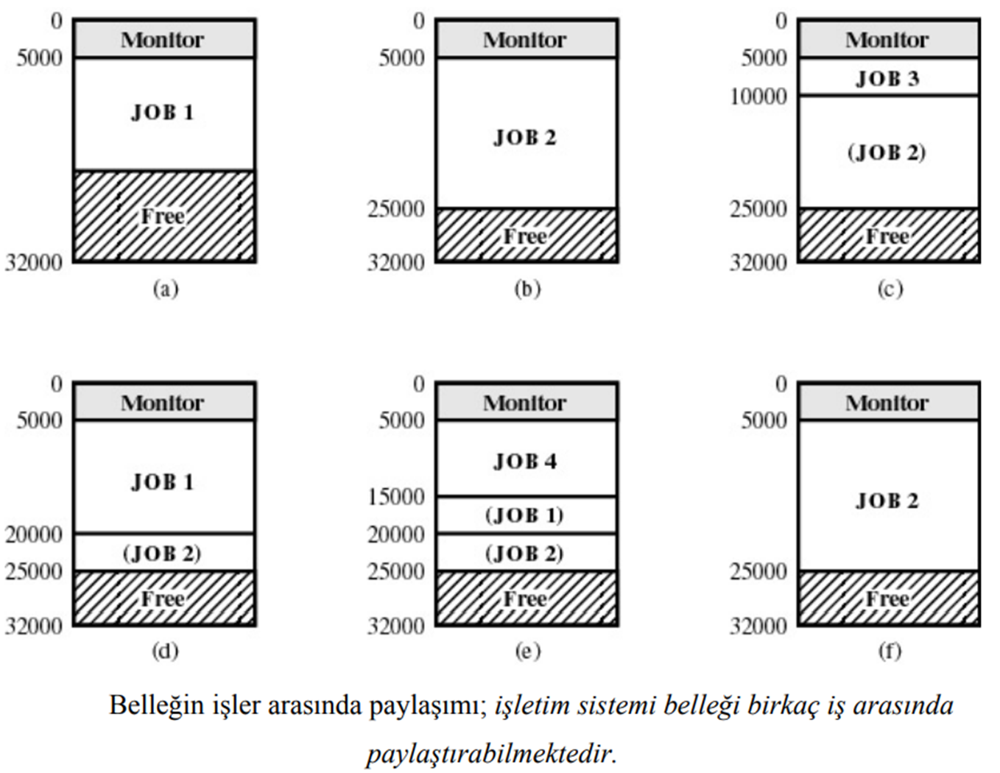

# Operation Systems Class Notes
## TR
### Giriş
- Yazılım olmadna bir bilgisayar **METAL** yığınıdır.
* Yazılım bilgiyi saklayabilir, işleyebilir ve daha önceden saklanmış bilgiyi kullanabilir.

- Donanımı kullanılabilir yapan yazılımlara ihtiyaç vardır. Bilgisayar kaynaklarını:
    > - Denetler
    > - Paylaştırır
- Üzerinde program geliştirme ve çalıştırma ortamına ihtiyaç vardır.
- Bu işlemler için işletim sistemine ihtiyaç vardır.
> Çekirdek + Kabuk = İşletim Sistemi 

#### Kernel (Çekirdek)
- İşletim Sistemlerindeki her şeyin üzerinde denetimi olan merkezi bileşenidir.
- Uygulamalar ve donanım seviyesindeki bilgi işlemleri arasında bir köprü görevi görür. 

- Çekirdeğin görevleri sistemin kaynaklarını yönetmeyi de kapsamaktadır.

- Genellikle çekirdek, işletim sisteminin temel bir elemanı olarak, yazılımın fonksiyonunu yerine getirebilmesi için kontrol etmesi gereken kaynaklar için düşük seviye soyutlama katmanı sağlayabilir. 
- İşletim sistemi görevleri, tasarımları ve uygulanmalarına göre farklı çekirdekler tarafından farklı şekillerde yapılır.
- Sistem açılırken belleğe yüklenir ve sistem kapatılıncaya kadar ana bellekte kalır.
- Çekirdek veya Core olarak da isimlendirilir.
- İşletim sisteminin kalbidir; yazılım ve donanımı birbirine bağlar.
- Donanıma kullanıcıların ve uygulama yazılımlarının doğrudan erişimlerini sınırlandırır ve düzenler.
- Bir çok sistemde kabuk ve çekirdek ayrımı sadece kavramsaldır.
- İşletim sisteminin ana bileşeni olan çekirdek, uygulama programları ile donanım bileşenleri arasında köprü vazifesi görür.

#### Shell (Kabuk)
- Bilgisayar bilimlerinde kabuk kelimesi daha çok çevreleyici, kaplayıcı anlamında kullanılmaktadır.
- İşletim sistemlerinde çekirdeğin (kernel) dış dünya ve kullanıcılar ile iletişim kurmasını sağlayan işletim sisteminin parçasına kabuk (shell) adı verilmektedir.
- Kabuk, kullanıcıdan gelen komutları işleyerek çekirdeğe ileten bir arayüz görevi görür.
- Kabuk, kullanıcılar ve çekirdek arasında bir köprü görevi görür.
- Çekirdeğin sağladığı servislere erişim sağlayan bir ara katmandır.
- İki farklı kabuk çeşidi vardır:
    - **Grafiksel Kabuklar** (GUI - Graphical User Interface)
        - Monitörünüze yansıyan grafiksel görünümdür.
        - Klavye ve fare aracılığı ile bilgisayarı birçok farklı iş için kullanabilmenizi sağlar.
        - Son kullanıcı açısından işletim sisteminin anlamı bu arayüzdür.
        - Örnek: Windows, MacOS, Ubuntu
    - **Metin Tabanlı Kabuklar**
        * MS-DOS gibi sadece komut girilebilen metin tabanlı arabirimlere sahip işletim sistemleri de vardır.
        * Linux veya sunucu işletim sistemlerinde ise komut satırı işlevlerini kullanmak son derece kritik ve popülerdir.
        * Örnek: DOS, Bash, CMD

#### İşletim Sistemi
- İşletim sistemi, orkestro şefi gibi çalışır.
- İşletim sistemi, kullanıcı ve donanım, yazılım ve donanım ve son
olarak yazılım ve yazılım arasındaki ara yazılımdır.
- İşletim sistemi; bilgisayar sistemini oluşturan donanım ve yazılım nitelikli kaynakları kullanıcılar arasında kolay, hızlı ve güvenli bir işletim hizmetine olanak verecek biçimde paylaştırırken bu kaynakların kullanım verimliliğini en üst düzeyde tutmayı amaçlayan bir yazılım sistemidir.

- **Tek Görevlilik (Single Tasking)**
    - İşletim sistemi, aynı anda sadece bir işlem yapabilir.
- **Çok Görevlilik (Multi Tasking)**
    - İşletim sistemi, aynı anda birden fazla işlemi bellekte tutabilir ve işleyebilir.
- **İşlem Tanımı**
    - Çalışan bir programdır.
- **İşlem Başlatma Yöntemleri**
    - Sistem açılırken başlatılan işlemler
    - Kullanıcı tarafından başlatılan işlemler
    - Başka bir işlem tarafından başlatılan işlemler
- **Önplan İşlemleri**
    - Kullanıcı ile etkileşimli çalışan işlemlerdir.
- **Arkaplan İşlemleri**
    - Kullanıcı ile etkileşimli olmayan işlemlerdir.
    - Windows'ta hizmetler (services), Linux'ta daamonlar (daemons) olarak adlandırılır.
- **İplik (Thread)**
    - Bir işlem seviyesinde aynı anda bir çok aktivitenin yapılması için bir işlem içerisinde birden çok iş parçacığının (thread) çalışmasıdır.
    - Aynı işlem üzerinde çalışan iş parçacıkları, bu işlemin tüm adres alanına, genel değişkenlerine ve kullanmakta olduğu dosyalara erişebilir.
- **Çoklu İş Parçacığı (Multi Threading)**
    - İşletim sistemi, aynı anda birden fazla iş parçacığını işleyebilir.
- **Çok Kullanıcılı Sistemler**
    - Aynı bilgisayarı birden fazla kullanıcının kullanması durumu Çok kullanıcılı (MultiUser) sistem olarak tanımlanır.
    - Bu sistemler zaman paylaşımlı (time-sharing) sistemler olarak da bilinir.
- **Kesme (Interrupt)**
    - Donanım cihazlarının işletim sistemine isteklerini bildirme yöntemi
- **Kullanıcı Arayüzü**
    - İşletim sistemini belli bir işi yaptırmak için komuta ettiğimiz yazılım
    > - **Grafik Kullanıcı Arayüzü (Graphical User Interface –GUI)**
    > - **Komut Satırı Arayüzü (Command Line Interface – CLI)**
- **Bellek Yönetimi (Memory Management)**
    - Belleğin kontrolü işletim sisteminin Bellek yöneticisindedir
    - Programların çalıştırılması esnasında gerekli belleğin onlara tahsis edilmesi ve program sonlandığında kullanılan belleğin geri alınması
    - Belleğin hangi parçalarının, hangi programlar tarafından kullanılıyor olduğunun ve boş alanların takibi
    - Sanal bellek kullanımı sırasında program parçalarının bellek-disk arasında transfer edilmesi
- **Sanal Bellek (Virtual Memory)**
    - Windows ve Linux işletim sistemleri üzerinde, üst üste pek çok uygulamayı aynı anda çalıştırsanız ve bu uygulamalar mevcut bellekten daha fazla bellek alanı da kaplasa, işletim sistemi uygulamalarınızı, biraz yavaşlama görülmekle beraber, sorunsuz olarak çalıştıracaktır.
    - Öyleyse fiziksel bellekten taşan, bilgiler nerede tutulmaktadır?
    - Bu işlem, işletim sisteminin sanal bellek hüneri sayesinde gerçekleştirilir.
    - Sanal bellek (virtual memory) tekniğinde, diskin bir bölgesi tıpkı bir RAM bellek gibi, çalışmakta olan uygulamalar tarafından kullanılabilmektedir
    - İşletim sistemi gerçek belleği Fiziksel bellek + Disk bellek olarak gösterir
#### Bilgisayar Sistemlerinin Temel Elemanları
- İşletim sistemleri, bir veya daha fazla sürecin (proses) donanım kaynaklarını kullanmasını sağlayarak, bilgisayar sistemi kullanıcılarına çeşitli hizmetler sunar.

- İşlemci (Ana işlem birimi – AİB)
- Ana Hafıza
    - Gerçek hafıza veya birincil hafıza olarak da bilinir.
    - Elektrik kesildiğinde bilgileri kaybolduğundan, uçucu (silinen) bir hafızadır.
- G/Ç modülleri (Input/Output)
    - İkincil hafıza sürücüleri
    - Haberleşme birimleri
    - Terminaller (uç birimler)
- Sistem BUS (Adres yolu, Veri Yolu, Denetim yolu)
    - Süreçler, hafıza ve G/Ç modülleri arasında haberleşmeyi sağlar.

#### İşletim Sisteminin Fonksiyonları
- İşleri sıraya koymalıdır
- İşi kontrol eden dili yorumlayabilmelidir
- Hata durumlarında ilgili işlemleri sonuçlandırmalıdır
- Giriş/Çıkış işlemlerini sonuçlandırmalıdır
- Kesmelerin gereğini yerine getirmelidir
- İşlerde öncelik tanıyabilmelidir
- Kaynakları kontrol etmelidir
- Kullanıcıların birbirlerinin haklarına müdahalelerini önlemelidir
- Bilgisayara birden fazla erişim sağlamalıdır
- İyi bir ara yüzü olmalıdır
- Bilgisayar kaynaklarının hesabını tutmalıdır.
- Bilgileri uzun vadede saklamalıdır.

#### İşletim Sisteminden İstenilen Özellikler
- Etkinlik: İşletim sistemi, bir işi etkin ve verimli bir şekilde yapmalıdır.
- İşler arasındaki zaman: Bir işi bitirip diğer işi başlama süresi kısa olmalıdır.
- Kullanılmayan MİB zamanı: Merkezi işlem birimin kullanmadığı süre kısa olmalıdır.
- Toplu işlemler arasındaki zaman: Toplu işlem dosyalarının işlenmesi arasındaki süre kısa olmalıdır.
- Cevap verme süresi: Sistemin cevap verme süresi kısa olmalıdır.
- Az zamanda çok iş yapılmalıdır.
- Güvenirlik: Sistem tamamen hatalardan arındırılmış olmalıdır.
- Süreklilik: Sistem bakım yapılabilir ve dokümanı bol olmalıdır.
- Düşük boyut: Sistem kendinden taviz vermeden küçük boyutta olmalıdır.

#### Çalışma Soruları
- **Soru-1:** İşletim Sistemlerinin en yaygın tanımını yaparak bir işletim sisteminden istenen 5 özellik yazınız?
    > **Cevap:** 
    > 1. İşler arasındaki zaman: Bir işi bitirip diğer işi başlama süresi kısa olmalıdır.
    > 2. Kullanılmayan MİB zamanı: Merkezi işlem birimin kullanmadığı süre kısa olmalıdır.
    > 3. Toplu işlemler arasındaki zaman: Toplu işlem dosyalarının işlenmesi arasındaki süre kısa olmalıdır.
    > 4. Cevap verme süresi: Sistemin cevap verme süresi kısa olmalıdır.
    > 5. Az zamanda çok iş yapılmalıdır.
- **Soru-2:** İşletim sistemlerinin yerine getirmesi gereken 10 fonksiyonunu yazınız?
    > **Cevap:** 
    > 1. İşleri sıraya koymalıdır
    > 2. İşi kontrol eden dili yorumlayabilmelidir
    > 3. Hata durumlarında ilgili işlemleri sonuçlandırmalıdır
    > 4. Giriş/Çıkış işlemlerini sonuçlandırmalıdır
    > 5. Kesmelerin gereğini yerine getirmelidir
    > 6. İşlerde öncelik tanıyabilmelidir
    > 7. Kaynakları kontrol etmelidir
    > 8. Kullanıcıların birbirlerinin haklarına müdahalelerini önlemelidir
    > 9. Bilgisayara birden fazla erişim sağlamalıdır
    > 10. İyi bir ara yüzü olmalıdır
- **Soru-3:** Bilgisayar sistemlerinin genel yapısını çizerek elemanlarını açıklayınız?
    > **Cevap:** 
    > 

### İşletim Sistemlerinin Tarihçesi
#### Çalışma Soruları
- **Soru-1:** Sizce bilgisayarın gelişimindeki en önemli tarihsel olaylardan 3 tanesini gerekçesiyle yazınız?
    > **Cevap:** 
    > 1. 1940'lar: İlk bilgisayarlar ortaya çıktı.
    > 2. 1950'ler: İlk işletim sistemleri geliştirildi.
    > 3. 1960'lar: İlk kişisel bilgisayarlar ortaya çıktı.
- **Soru-2:** İşletim sistemlerinin gelişiminde geçilen kuşakları en önemli özellikleri ile birlikte yazınız?
    > **Cevap:** 
    > 1. 1. Kuşak: Vakum tüpleri ile çalışan bilgisayarlar
    > 2. 2. Kuşak: Transistörler ile çalışan bilgisayarlar
    > 3. 3. Kuşak: Entegre devreler ile çalışan bilgisayarlar
    > 4. 4. Kuşak: Mikroişlemciler ile çalışan bilgisayarlar
    > 5. 5. Kuşak: Kişisel bilgisayarlar/Yapay zekalı bilgisayarlar
- **Soru-3:** Gelecek işletim sistemlerinde 6. kuşak sizce hangi özellikleri ile ön plana çıkacaktır açıklayınız?
    > **Cevap:** 
    > 1. Yapay zeka
    > 2. Nesnelerin interneti
    > 3. Bulut bilişim
    > 4. Büyük veri
    > 5. Sanal gerçeklik
    > 6. Blok zincir
    > 7. Dijital sağlık
    > 8. Dijital para birimleri
    > 9. Dijital güvenlik
    > 10. Dijital hizmetler

### İşletim Sistemlerine Genel Bakış
#### Giriş
- İşletim sistemi kullanıcıyla bilgisayar donanımı arasında iletişim sağlayan programdır. Programın amacı kullanıcı programlarını çalıştırmak için kullanıcıya ortam oluşturmaktır. İşletim sistemi bilgisayarı, yazılım ve donanımlarını kullanmak için elverişli duruma getirir ve donanımı etkili kullanır. Buna göre işletim sistemlerinin başlıca amaçları:
    > 1. Kullanıcı programlarını çalıştırılması
    > 2. Kullanıcı problemlerinin çözümünün kolaylaştırılması
    > 3. Bilgisayar sisteminin kullanımını daha elverişli hale getirilmesi
    > 4. Bilgisayar kaynaklarının verimli bir şekilde kullanılması (Çok kullanıcılı sistemlerde önem kazanır)
- İşletim sistemi, donanımla yazılım arasında bir yönetici arayüzü olarak görev yapar. Her bir donanım birimi, tüm kaynakları erişip yönetebilmektedir.
- Çalışma sırasında oluşan hataların ve çakışmaların önlenmesi işletim sisteminin görevidir.
- İşletim sistemleri bilgisayar kullanıcısı ile donanım arasında çalışan bir yazılımdır. Amacı kullanıcının programlarını çalıştırabilmesi için ortam sağlamaktır.
- İşletim sistemi faklı kullanıcıların uygulama programlarının donanım kaynaklarını kullanımını kontrol eder ve koordine eder.

- Bilgisayar kaynaklarının dağıtımı için şu problemlerin çözümü gerektirir:
    - Ana işlem biriminin zamana göre paylaşımı
    - Disk alanının yönetilmesi
    - Giriş/Çıkış aygıtlarının yönetimi
- **İşletim Sistemi Tarafından Sağlanan Hizmetler:**
    - Program geliştirme
    - Editörler ve Debuggerlar
    - Program yürütme
    - G/Ç sürücülerine erişim
    - Dosyalara erişimi kontrol etme
    - Hata denetimi ve cevaplama
        - Dahili ve harici donanım hataları
            - Hafıza hataları
            - Sürücü arızaları
        - Yazılım hataları
            - Aritmetik taşma
            - Yasaklanmış hafıza bölgelerine erişim
        - İşletim sisteminin, uygulama isteklerini yerine getirememesi
    - Muhasebe (hesaplama)
        - İstatistik toplama
        - Kullanıcı hesaplarını sağlama
- İşletim sistemleri, sıradan bilgisayar yazılımları gibi aynı tarz fonksiyonlara sahiptirler. Örn: Programları yürütür.

#### İşletim Sistemlerinin Sınıflandırılması

##### Ana Bilgisayar (Mainframe) İşletim Sistemleri
- Mainframe bilgisayarlar aynı anda binlerce kullanıcıya hizmet verebilen ve çok sayıda işlemciye sahip büyük bilgisayarlardır. Bu bilgisayarların şu an ki kullandığımız kişisel bilgisayarlarımızdan bir farkı daha fazla girdi ve çıktı (input/output) kapasitelerine sahip olmalarıdır.
- Mainframe işletim sistemleri, yukarıdaki gibi güçlü bir donanıma sahip olan bilgisayarlar için geliştirilmiştir. Bu işletim sistemi birden fazla işi aynı anda yapabilir. Ayrıca yüksek sayıda girdi ve çıktı kapasitesi sayesinde devasa boyutlardaki verileri işleyebilir.

- İşletim sistemi kullanıcılarına üç tip hizmet sunar. Bunlar;
    - Toplu iş sistemleri (Batch systems), rutin işleri mevcut bir kullanıcı olmadan işleyebilir.
    - Hareket işleme (Transaction processing), çok sayıda olan küçük istekleri idare edebilir.
    - Zaman paylaşımı (Timesharing), ana bilgisayara uzaktan bağlanan birden fazla kullanıcıya aynı anda hizmet verebilir.

##### Sunucu (Server) İşletim Sistemleri
- Sunucu işletim sistemleri adından da anlaşılacağı üzere sunucular üzerinde çalışırlar. Bilgisayar ağı üzerinden birden fazla kullanıcının hem yazılımları hem de donanımları kullanmalarına ve paylaşmalarına izin verir. (Örnek: Solaris, FreeBSD, Linux ve Windows Server)

- Ağ yapısı gerektirmektedir: Yerel alan ağları veya Geniş alan ağları
- Ağ için, ya istemci-sunucu, yada eşit bağlantı (peer-to-peer) modeli kullanılabilir.
- Sunucu sistemlerin üstünlükleri:
    - Kaynakların ortaklaşa kullanımı
    - İşlem hızının yükselmesi - yükün paylaşımı
    - Güvenilirlik
    - İletişim

##### Çok İşlemcili (Multiprocessor) İşletim Sistemleri
- Multiprocessor işletim sistemleri, içerisinde birden fazla işlemci barındıran bilgisayarlarda kullanılırlar. Bu sistemi kullanan bilgisayarlar, nasıl bağlandıklarına ve paylaştıkları şeylere göre “paralel bilgisayarlar (parallel computers)” ve “çoklu bilgisayarlar (multicomputers)” olarak adlandırılırlar.
- Bu sistem, sunucu işletim sisteminin özelliklerini destekler buna ek olarak iletişim, bağlanabilirlik ve tutarlılık gibi ekstra özellikler de barındırır. (Örnek: Windows ve Linux)

- Başka bir ifade ile çok işlemcili sistemler - birden fazla AİB’nin yakın iletişimde bulunduğu sistemlerdir.
- Sıkıca birleştirilmiş sistem - işlemciler belleği ve saati paylaşıyorlar; İletişim, genelde ortak bellek aracılığıyla gerçekleştiriliyor.
- Paralel sistemlerin üstünlükleri:
    - Yüksek işlem yeteneği
    - Yüksek güvenilirlik

- **Simetrik çoklu işlem (Symmetric multiprocessing -SMP)**
    - Her işlemci işletim sisteminin aynı kopyasını çalıştırır.
    - Başarım düşmeden, çoklu işlemci yapısı çalışabilir.
    - Pek çok işletim sistemi SMP’yi destekliyor.
- **Simetrik olmayan çoklu işlem (Asymmetric multiprocessing)**
    - Her işlemci özel bir probleme tahsis edilir; ana işlemci işleri planlaştırır ve diğer işlemciler arasında dağıtır.
    - Genelde, çok büyük sistemler için kullanılmaktadır.

##### Kişisel Bilgisayar (Personal Computer) İşletim Sistemleri
- Kişisel bilgisayarlarımızda çalışan işletim sistemidir. Çoklu programlamayı (multiprogramming) destekler. Tek kullanıcı için tasarlanmışlardır.
- Kişisel rakamlı yardımcılar (Personal Digital Assistant (PDA))
- Hücresel telefonlar (Cellular telephones)
- Özellikleri:
    - Sınırlı bellek
    - Düşük hızlı işlemciler
    - Küçük ekran.
- Örnek: Linux, FreeBSD, Windows, OS X

##### El Bilgisayarı (Handheld) İşletim Sistemleri
- Handheld işletim sistemlerinin çalıştığı bilgisayarlar aslında “kişisel dijital asistan (PDA)” olarak bilinirler. Bu küçük bilgisayarlar işlemlerimizi yaparken bir yere bağlı bulunmak durumunda değillerdir. Günümüzde tablet ve akıllı telefonlar olarak adlandırabilirler. (Örnek: Android ve IOS)

##### Gömülü (Embedded) Sistem İşletim Sistemleri
- Embedded işletim sistemleri belirli işler yapan cihazları (fırın, buzdolabı vb.) kontrol eden bilgisayarlarda kullanılır. Bu bilgisayarları özelleşmiş bilgisayarlardır. Bu sebeple içerisine kendimiz program indirip çalıştıramayız.
- İçerisinde kullanılan bütün yazılımlar ROM(Read Only Memory) adı verilen bir bellek bölgesinde cihazın yapım aşamasında yerleştirilmiştir. Bunların dışında herhangi bir yazılım çalıştırmazlar. (Örnek: Embedded Linux, QNX ve VxWorks)

##### Sensör-Düğüm (Sensor-Node) İşletim Sistemleri
- Sensor-node işletim sistemleri; olay güdümlü, dışarıdaki olaylara cevap verebilen ve belirli periyotlarda sensörleri ile ölçüm yapabilen bir işletim sistemidir.
- Bu işletim sistemi sensörlerden oluşan büyük ağlarda kullanılır. Her sensör düğümü işlemci, bellek ve en az bir sensör barındıran, birbirleri ile ve merkezi bir istasyon ile kablosuz haberleşen minik gerçek bilgisayarlar.
- Düğümlerin sahip olduğu bellek ve işlemci miktarı genellikle çok sınırlıdır. Bu nedenle işletim sistemi, düğümlerin enerji tüketimini ve işlemci kullanımını optimize etmek için tasarlanmıştır.
- Embedded sistemlerde olduğu gibi bu özel bilgisayarlara da kullanıcı olarak program indiremiyoruz. İçerisinde çalışan yazılımlar kurulu halde gelir. (Örnek: TinyOS, Contiki, LiteOS)

##### Gerçek Zamanlı (Real-Time) İşletim Sistemleri
- Bu sistemlerin kullanıldığı bilgisayarlarda, zaman hayati derecede önem taşır. Bu sistemler aşağıdaki gibi ikiye ayırılır.
    - Hard real-time sistemler, verilen işin söylenen zamanda yapılacağının garantisini verir. Bu sistemler askeri alanda kullanılır.
    - Soft real-time sistemler, verilen iş arada sırada söylenen zamanda yapılmayıp aksayabilir. Bu ufak aksama istenilen bir şey değildir fakat kabul edilebilir çünkü kalıcı hasarlara yol açmaz. Kullandığımız akıllı telefonlar bu sisteme örnek olarak verilebilir.
- Hard real-time sistemler de embedded ve sensor-node sistemleri gibi içerisinde yazılımları ile birlikte gelir. Kullanıcı kendiliğinden program indirip çalıştıramaz.
- Bilimsel denemelerde, fabrikalarda üretimin otomatik denetiminde, tıbbi görüntü sitemleri gibi uygulamalarda kontrol amacı ile sıkça kullanılmaktadır.
- Önemli özelliği, iyi tanımlanmış belirli zaman kısıtlamalarının bulunmasıdır.
- Gerçek zaman sistemleri ya sert (hard), yada hafif (soft) gerçek zamanlı olabilir:
    - Sert gerçek zaman sistemleri:
        - İkinci bellek sınırlıdır veya yoktur, veriler kısa süreli bellekte, veya sabit bellekte saklanır.
        - Zaman paylaşımlı çalışmalar genel amaçlı işletim sistemleri tarafından desteklenmiyor.
    - Hafif gerçek zaman sistemleri:
        - Sanayi robotlarının denetiminde sınırlı kullanılmaktadır.
        - Gelişmiş işletim sistemlerinin özelliklerini gerektiren uygulamalarda yararlıdır.

##### Akıllı Kart (Smart Card) İşletim Sistemleri
- En küçük işletim sistemleridir ve işlemciye sahip akıllı kartlar üzerinde çalışırlar. (Örnek: Sim Kartları, Kredi Kartları vb)

##### İşlem Ortamlarına göre OS Sınıflandırması
- İşletim sistemleri, işlem ortamlarına göre sınıflandırılabilir. Bu sınıflandırma işletim sisteminin çalıştığı ortama göre yapılır. İşte bu sınıflandırma:
    - Web tabanlı işlemler
    - Gömülmüş işlemler

#### İşletim Sisteminin Gelişimi
- İşletim sistemlerinin gelişim süreci aşağıdaki aşamalardan geçmiştir:
    - Basit toplu işletim sistemleri
    - Zaman paylaşım tabanlı çoklu programlama
    - Kişisel bilgisayarların işletim sistemleri
    - Paralel sistemler
    - Dağıtık sistemler (Paylaşılmış sistemler)
    - Gerçek zaman sistemleri

1. **Basit toplu işletim sistemleri (Batch Systems)**
    - İlk bilgisayarların genelde işletim sistemleri yoktu. İşletim sistemleri bilgisayarların donanımları geliştikten sonra ortaya çıkmaya başlamıştır. Bu tür sistemlerde işlemcinin zamanının büyük kısmı giriş çıkış işlemlerini beklemekle geçer. Çünkü, G/Ç aygıtlarının hızı işlemcinin hızından düşük olduğu için işlemci bu aygıtları beklemek zorundadır. Bunu önlemek için Spooling tekniği (Ana işlem birimini giriş çıkış biriminden ayırma işlemi) kullanılır. Böylece CPU gelen girişi ya doğrudan, ya da işleyip çıkışa aktarır.

    
    - Üçüncü nesil bilgisayarların getirdiği bir diğer önemli özellikle, aynı anda gelen çok sayıda program destelerinin, kendinden önce gelenin çalışıp bitmesini beklemeden arka arkaya okutulup disk üzerinden sıra ile çalışmayı beklemelerinin sağlanması idi. Bu olanağa “SPOOLING” (Simultaneous Peripheral Operation On Line) adı verilmiştir.

2. **Zaman Paylaşım Tabanlı Çoklu Programlama**
    - Aynı zaman diliminde bellekte birkaç iş bulunur. İşlerin hangisinin ve hangi ardışıklıkla çalıştırılacağının belirlenmesi için iş planlanması (job scheduling) yapılır. Kaynaklar paylaştırılarak kullanılır. Bu sistemlerde AİB (CPU)’nun çalışma zamanı küçük zaman aralıklarına bölünür, ve bu zaman aralıkları ardışık olarak programlar tarafından kullanılır. Onun için ayrılan zaman aralığı bittiğinde bu iş kuyruğa geçer ve yeniden işlenmek için bekler.
    
    
    

3. **Kişisel Bilgisayarların İşletim Sistemleri**
    - Kişisel bilgisayarlar, işletim sistemlerinin en yaygın kullanıldığı bilgisayar türüdür. Bu işletim sistemleri, tek bir kullanıcıya hizmet vermek üzere tasarlanmıştır. Bu işletim sistemleri, genellikle masaüstü bilgisayarlar, dizüstü bilgisayarlar ve sunucular üzerinde çalışır. (Örnek: Windows, MacOS, Linux)

4. **Paralel İşletim Sistemleri**
    - Paralel sistemlerde birden fazla işlemci olur. Bu işlemciler bazı kaynakları (ana veri yolu, saat (cp), bazen de ana belleği, G/Ç kaynakları) ortak kullanırlar. Böyle sistemlere güçlü bağlı sistem denir.
    
    - Çok işlemcili sistemlerin oluşturulma nedeni işlem hızının ve güvenirliğinin arttırılmasıdır. İşlemci sayısı arttıkça işlem hızı artar ancak bir noktada sabitlenir.
    - Bu yasa, Amdahl Yasası olarak bilinir. Amdahl Yasası, bir sistemde paralelleştirilebilen ve paralelleştirilemeyen işlemlerin toplam performansa etkisini açıklar. Özellikle işlemci sayısı arttıkça işlem hızındaki artışın bir noktada sınırlı kaldığını gösterir. Çünkü programların bazı kısımları seri çalışmak zorundadır ve bu kısımlar sistemin toplam hız artışını sınırlar.

5. **Dağıtık Sistemler**
    - Bu sistemlerde her bir bilgisayar sisteminin kendi kaynakları, işlemcisi, I/O aygıtları ve fonksiyonları bulunur. Bunlara zayıf bağlı sistemler denir. Ağ ortamında çalışan bilgisayarlardan oluşur. Bilgisayarlar arasında iletişim, ağ ortamı ile gerçekleşir. Bu sistemlerin oluşturulma nedenleri;
        - Kaynakların paylaşımı
        - İşlem hızının yükseltilmesi
        - Güvenilirlik
        - Yeni iletişim olanaklarının sağlanması

6. **Gerçek Zaman Sistemleri**
    - Bu sistemlerde işlemlere uygulama alanlarına bağlı olarak zaman sınırlamaları getirilir. Böyle sistemler sanayi kontrol sistemlerinde, bilimsel araştırmalarda kullanılır. Bu tür sistemlerde çok gerekli olmamakla beraber disk belleği kullanılır. Daha fazla ROM (sabit bellek) kullanılır.
    
    

#### Çalışma Soruları
- **Soru-1:** İşletim sistemlerini sınıflandırarak çok işlemcili sistemleri detaylı bir şekilde açıklayınız?
    > **Cevap:** 
    > - **Ana Bilgisayar (Mainframe) İşletim Sistemleri:** Mainframe bilgisayarlar aynı anda binlerce kullanıcıya hizmet verebilen ve çok sayıda işlemciye sahip büyük bilgisayarlardır. Bu bilgisayarların şu an ki kullandığımız kişisel bilgisayarlarımızdan bir farkı daha fazla girdi ve çıktı (input/output) kapasitelerine sahip olmalarıdır.
    > - **Sunucu (Server) İşletim Sistemleri:** Sunucu işletim sistemleri adından da anlaşılacağı üzere sunucular üzerinde çalışırlar. Bilgisayar ağı üzerinden birden fazla kullanıcının hem yazılımları hem de donanımları kullanmalarına ve paylaşmalarına izin verir. (Örnek: Solaris, FreeBSD, Linux ve Windows Server)
    > - **Çok İşlemcili (Multiprocessor) İşletim Sistemleri:** Multiprocessor işletim sistemleri, içerisinde birden fazla işlemci barındıran bilgisayarlarda kullanılırlar. Bu sistemleri kullanan bilgisayarlar, nasıl bağlandıklarına ve paylaştıkları şeylere göre “paralel bilgisayarlar (parallel computers)” ve “çoklu bilgisayarlar (multicomputers)” olarak adlandırılırlar.
    > - **Kişisel Bilgisayar (Personal Computer) İşletim Sistemleri:** Kişisel bilgisayarlarımızda çalışan işletim sistemidir. Çoklu programlamayı (multiprogramming) destekler. Tek kullanıcı için tasarlanmışlardır.
    > - **El Bilgisayarı (Handheld) İşletim Sistemleri:** Handheld işletim sistemleri, içerisinde birden fazla işlemci barındıran bilgisayarlarda kullanılırlar. Bu sistemleri kullanan bilgisayarlar, nasıl bağlandıklarına ve paylaştıkları şeylere göre “paralel bilgisayarlar (parallel computers)” ve “çoklu bilgisayarlar (multicomputers)” olarak adlandırılırlar.
    > - **Gömülü (Embedded) Sistem İşletim Sistemleri:** Embedded işletim sistemleri belirli işler yapan cihazları (fırın, buzdolabı vb.) kontrol eden bilgisayarlarda kullanılır. Bu bilgisayarları özelleşmiş bilgisayarlardır. Bu sebeple içerisine kendimiz program indirip çalıştıramayız.
    > - **Sensör-Düğüm (Sensor-Node) İşletim Sistemleri:** Sensor-node işletim sistemleri; olay güdümlü, dışarıdaki olaylara cevap verebilen ve belirli periyotlarda sensörleri ile ölçüm yapabilen bir işletim sistemidir.
    > - **Gerçek Zamanlı (Real-Time) İşletim Sistemleri:** Bu sistemlerin kullanıldığı bilgisayarlarda, zaman hayati derecede önem taşır. Bu sistemler aşağıdaki gibi ikiye ayırılır.
    > - **Akıllı Kart (Smart Card) İşletim Sistemleri:** En küçük işletim sistemleridir ve işlemciye sahip akıllı kartlar üzerinde çalışırlar.

- **Soru-2:** İşletim sistemleri sınıflarından «gerçek zamanlı işletim sistemlerini» detaylı bir şekilde açıklayınız?
    > **Cevap:** 
    > - **Gerçek Zaman Sistemleri:** Bu sistemlerde işlemlere uygulama alanlarına bağlı olarak zaman sınırlamaları getirilir. Böyle sistemler sanayi kontrol sistemlerinde, bilimsel araştırmalarda kullanılır. Bu tür sistemlerde çok gerekli olmamakla beraber disk belleği kullanılır. Daha fazla ROM (sabit bellek) kullanılır.
    > - Gerçek zaman sistemleri ya sert (hard), yada hafif (soft) gerçek zamanlı olabilir:
    >     - **Sert gerçek zaman sistemleri:**
    >         - İkinci bellek sınırlıdır veya yoktur, veriler kısa süreli bellekte, veya sabit bellekte saklanır.
    >         - Zaman paylaşımlı çalışmalar genel amaçlı işletim sistemleri tarafından desteklenmiyor.
    >     - **Hafif gerçek zaman sistemleri:**
    >         - Sanayi robotlarının denetiminde sınırlı kullanılmaktadır.
    >         - Gelişmiş işletim sistemlerinin özelliklerini gerektiren uygulamalarda yararlıdır.

- **Soru-3:** İşletim sistemlerinin gelişiminde geçilmiş aşamaları yazınız?
    > **Cevap:** 
    > 1. Basit toplu işletim sistemleri
    > 2. Zaman paylaşım tabanlı çoklu programlama
    > 3. Kişisel bilgisayarların işletim sistemleri
    > 4. Paralel sistemler
    > 5. Dağıtık sistemler (Paylaşılmış sistemler)
    > 6. Gerçek zaman sistemleri

- **Soru-4:** Dağıtık işletim sistemleri ile çoklu işlemcili işletim sistemleri arasındaki farkı açıklayınız?
    > **Cevap:** 
    > - **Çoklu İşlemcili (Multiprocessor) İşletim Sistemleri:** Multiprocessor işletim sistemleri, içerisinde birden fazla işlemci barındıran bilgisayarlarda kullanılırlar. Bu sistemleri kullanan bilgisayarlar, nasıl bağlandıklarına ve paylaştıkları şeylere göre “paralel bilgisayarlar (parallel computers)” ve “çoklu bilgisayarlar (multicomputers)” olarak adlandırılırlar.
    > - **Dağıtık Sistemler:** Bu sistemlerde her bir bilgisayar sisteminin kendi kaynakları, işlemcisi, I/O aygıtları ve fonksiyonları bulunur. Bunlara zayıf bağlı sistemler denir. Ağ ortamında çalışan bilgisayarlardan oluşur. Bilgisayarlar arasında iletişim, ağ ortamı ile gerçekleşir. Bu sistemlerin oluşturulma nedenleri;
    >     - Kaynakların paylaşımı
    >     - İşlem hızının yükseltilmesi
    >     - Güvenilirlik
    >     - Yeni iletişim olanaklarının sağlanması

### İşletim Sistemlerinin Bileşenleri
#### Giriş
- Birbirinden farklı çeşitli işletim sistemleri bulunmasına rağmen, bunlar arasında ortak yapı özellikleri ve bileşenleri vardır. Fonksiyonel bakımdan işletim sistemlerinin bileşenleri:
    - Görev yönetimi (Process manager)
    - Ana bellek yönetimi (Memory manager)
    - Kütük yönetimi (File manager)
    - Disk (2. bellek) yönetimi (Second Storage)
    - Ağ üzerinde çalışma (Ağ fonksiyonları yönetimi: Networking)
    - Sistem koruması
    - Komut derleyici sistemler

#### Görev Yönetimi
- Genel halde görev çalışır durumda olan programdır. Bu program pasif bir varlıktır. Görev ise aktiftir.
- Görevler, AİB zamanı, bellek, kütükler, G/Ç aygıt kaynakları gerektirir. Bu kaynaklar ilgili göreve onun oluştuğu anda aktarılır. Görev sonlandıktan veya kesildikten sonra, işletim sistemi bu kaynakları görevden alır ve bir diğer görevle arasında paylaştırır.
- Görevin çalışması ardışık işlemlerdir. Her bir zaman diliminde ana işlem birimi tarafından görevi bir komut çalıştırır. İki görev aynı programa ait olsa da ayrı görevler gibi bakılır ve çalıştırılır.
- Görev işletim sisteminde bir iş birimidir. İşletim sistemi, farklı görevlerin aynı zamanda çalışmasını ve kaynakların ortak kullanımını kontrol eder.
- İşletim sistemi, görev yönetiminde aşağıdaki işleri icra eder:
    - Kullanıcı ve sistem birimlerinin oluşturulması, silinmesi
    - Görevlerin oluşturulması, durdurulması ve yeniden çalıştırılması
    - Görevlerin zamana uyum sağlama mekanizmasının gerçekleştirilmesi
    - Görevler arasında iletişim sağlanması
    - Kilitlenmelerin yönetimi
- İki görev aynı zamanda çalıştırıldığında aynı kaynakları kullanmak isteyebilirler. Bu durumda, zamana uyum sağlama mekanizması kullanılır. (Örneğin, araçların trafikte yeşil yanıncaya kadar bekleyip sonra geçmesi gibi)
- Ortak kaynakların kullanımında her iki görev de bekleme durumuna geçerse (bu sonsuz döngü oluşturur) kilitlenme olur. Yani, biri diğerinin sonucunu beklerken, diğeri de ötekinin sonucunu bekler.

#### Ana Bellek Yönetimi
- Bellek her birisinin kendi adresi olan baytlar veya kelimelerden oluşan büyük dizidir. Bellek AİB ve G/Ç aygıtlarının paylaştığı ve hızlı erişilebilen bir veri ambarıdır. Ana Bellek geçici bellektir.
- Ana işlem biriminin (AİB) verimliliğini ve kullanıcı sorgularına yanıt verme hızını yükseltmek için, bellekte aynı zamanda birden fazla program saklanması gereklidir. Bu halde belleğin yönetimi için farklı yaklaşımlar ve algoritmalar kullanılmaktadır. Bu yaklaşımların seçimi, birçok farklı özellikte sistemin donanım tasarımına bağlıdır.
- Bellek yönetimiyle ilgili her bir algoritma özel donanım desteği gerektirir. Bellek yönetimi ile ilgili, işletim sistem aşağıdakilerden sorumludur:
    - Belleğin şimdiki durumda, hangi kısmının ve kim tarafından kullanıldığı hakkında bilginin elde edilmesi
    - Bellek alanı boş olduğunda bu alana hangi görevlerin yüklenmesi hakkında, karar oluşturulması

#### Kütük Yönetimi
- Kütük, oluşturucusu tarafından belirlenmiş ilişkili bilgiler topluluğudur. Çoğunlukla, kütükler kaynak ve nesne türünde programları ve verileri ifade ederler.
- Görev ve bellek yönetimi kullanıcı için sanaldır. Kütük yönetimi ise kullanıcıyı görsel olarak ilgilendirir. Örneğin; diske yazılan kütükle, CD’ye yazılan kütük birbirinden farklıdır. Ancak İşletim Sistem bu ayrıntıları saklar ve aynıymış gibi görüntülenmesini sağlar. Yani, bilgi istenilen kütükte amacına uygun bir şekilde depolanır.
- Bilgisayar sisteminin kullanımı kolaylaştırmak için İşletim Sistemi veri depolarını aynı biçimli mantıksal görünümde olmasını sağlar. Mantıksal depolama (kaydetme, saklama) birimini tanımlamak için uygun aygıtların fiziki nitelikleri boyutlanır (sektör, track,.vs.). Bu mantıksal depolama (kayıt) birimine kütük denir. Kütüğün oluşturulması, silinmesi ve adının değiştirilmesi kütük yönetimine aittir.
- Genel halde kütükler programları ve verileri ifade eder. Kütüklerin yönetimini kolaylaştırmak için dizinler oluşturulur.
- İşletim Sistem kütük yönetiminde aşağıdakilerden sorumludur:
    - Kütüklerin oluşturulması ve silinmesi
    - Dizinlerin oluşturulması ve silinmesi
    - Kütük ve dizinlerin yönetimi
    - Kütüklerin disk belleğine (2.belleğe) haritalanması (kaydedilmesi)
    - Kütüklerin 2. bellekte yedeklenmesi (back up)

#### Giriş/Çıkış (I/O) Yönetimi
- Giriş/Çıkış sisteminin yönetimi, içerdiği birimlerle aşağıdaki fonksiyonları gerçekleştirir:
    - Bileşenleri oluşturur. (Tampon önbellekleme sistemi)
    - Ön belleğe yazıp-okuma
    - Spooling işlemlerinin gerçekleştirilmesi
    - Aygıt-sürücü (device driver) arayüzlerinin yönetimi
    - Belirli donanım aygıtları için sürücülerin yönetimi

#### Disk (2. Bellek) Yönetimi
- Ana belleğin, geçici ve tüm veri-programların sürekli saklanılması için çok küçük olması nedeniyle bilgisayar sistemleri ikincil belleğe ihtiyaç duymaktadırlar.
- İşletim Sistem ikincil belleğe bağlı aşağıdaki girişimlerden sorumludur:
    - Boş disk alanı yönetimi
    - Diskin paylaşımı
    - Diskin planlanması

#### Ağ Fonksiyonları Yönetimi
- Ağ ortamı veya dağıtık sistem, ortak giriş-çıkış aygıtları, saati ve ana belleği olmayan işlemciler (bilgisayarlar) topluluğundan oluşur. Her işlemcinin kendine ait belleği bulunur.
- Birbirlerine iletişim hatları aracılığıyla bağlanırlar ve iletişimi protokollerle gerçekleştirirler.
- Ağ kullanıcıları aynı ortak kaynaklara erişebildiği gibi, kullanıcı bazında erişimde mümkündür.
- Bu durum:
    - Hesaplama (bilgi-işleme) hızını yükseltir.
    - Verilerin kullanılabilirlik alanını genişletir.
    - Güvenilirliği yükseltir.

#### Sistem Koruması
- İşletim Sistemlerinde koruma; koruma ve güvenlik olarak iki çeşittir. Eğer bilgisayarın birden fazla kullanıcısı varsa ve çoklu görevin birden fazla çalışmasına izin verilirse bu görevler birbirinin girişimlerinden korunmalıdır. Bu amaçla İşletim Sistemi; kütüklere, bellek kesimlerine (segment), işlemciye ve diğer kaynaklara görevlerin kontrollü erişimini sağlar.
- Tanımlı kullanıcılar arasında erişim yetkilendirmesi yaparak kullanıcı verilerini korumayı amaçlar.
- Örneğin; görev yalnız kendisi için ayrılmış adres alanında çalışabilir yada zamanlama görevin belirlenmiş zaman içerisinde ana işlemcinin de çalışmasını sağlamalıdır.
- Koruma mekanizması İşletim Sistemi bileşenleri arasındaki arayüzlerinde oluşabilecek hataları önlemekle güvenliği yükseltir.
- İşletim Sisteminin koruma sistemi aşağıdaki işlemlerden sorumludur:
    - Erişim Kontrolü
        - Sisteme kullanıcı erişimini düzenler; İzinli ve izinsiz kullanımları ayırt edebilme.
    - Bilgi Erişim Kontrolü
        - Sistem içindeki veri akışını ve verinin kullanıcılara dağıtımını düzenler; Denetimleri belirleme.
    - Sertifikasyon
        - Sertifikasyonlara göre erişim ve akış kontrol performansı sağlanır; İzinsiz erişimleri engelleyebilme.

#### Komut Derleyicisi
- Sistemin kullanıcı ve İşletim Sistemi arasında arayüz oluşturan yorumlayıcı sistem programıdır. Gelişmiş sistemlerde kullanıcı arkadaşlığı bulunan, komut derleyicilerin tasarımına önem verilir.
- Böyle arkadaş arayüzler, pencerelerin ve menü sistemlerinin oluşmasını destekler, görevlerin oluşturulması ve yönetimi, giriş-çıkış yönetimi, kütük sistemlerine erişim, koruma ve ağ üzerinde çalışma, bu komutlarla gerçekleştirilir.
- İşletim Sisteminin Komut Derleyicisi aşağıdaki işlemlerden sorumludur:
    - Pek çok komut, işletim sistemine denetim fonksiyonları amacı ile yönlendirilir. Bu komutlar aşağıdaki işlemleri gerçekleştirir:
        - Görev oluşumu ve yönetimi
        - G/Ç yönetimi
        - Bellek yönetimi
        - Ana belleğin yönetimi
        - Kütük sistemlerine erişim
        - Koruma
        - Ağ ortamında çalışma
    - Denetim fonksiyonlarını okuyan ve derleyen programa
        - Komut satırının derleyicisi veya
        - Çekirdek (Kernel) (UNIX sisteminde) denir.
    - Komut derleyicisinin işlevi, komut fonksiyonunu okumak ve yürütmektir.

#### Çalışma Soruları
- **Soru-1:** İşletim sistemlerinin bileşenlerini yazarak görev yönetimini açıklayınız?
    > **Cevap:** 
    > - Görev yönetimi (Process manager)
    > - Ana bellek yönetimi (Memory manager)
    > - Kütük yönetimi (File manager)
    > - Disk (2. bellek) yönetimi (Second Storage)
    > - Ağ üzerinde çalışma (Ağ fonksiyonları yönetimi: Networking)
    > - Sistem koruması
    > - Komut derleyici sistemler
    > - **Görev Yönetimi:** Görevler, AİB zamanı, bellek, kütükler, G/Ç aygıt kaynakları gerektirir. Bu kaynaklar ilgili göreve onun oluştuğu anda aktarılır. Görev sonlandıktan veya kesildikten sonra, işletim sistemi bu kaynakları görevden alır ve bir diğer görevle arasında paylaştırır.

- **Soru-2:** İşletim sistemlerinin bileşenlerini yazarak ana bellek yönetimini açıklayınız?
    > **Cevap:** 
    > - Görev yönetimi (Process manager)
    > - Ana bellek yönetimi (Memory manager)
    > - Kütük yönetimi (File manager)
    > - Disk (2. bellek) yönetimi (Second Storage)
    > - Ağ üzerinde çalışma (Ağ fonksiyonları yönetimi: Networking)
    > - Sistem koruması
    > - Komut derleyici sistemler
    > - **Ana Bellek Yönetimi:** Bellek her birisinin kendi adresi olan baytlar veya kelimelerden oluşan büyük dizidir. Bellek AİB ve G/Ç aygıtlarının paylaştığı ve hızlı erişilebilen bir veri ambarıdır. Ana Bellek geçici bellektir.

- **Soru-3:** Koruma sistemini açıklayarak işletim sistemlerinin koruma sisteminin sorumlu olduğu işlemleri yazınız?
    > **Cevap:** 
    > - **Koruma Sistemi:** İşletim Sistemlerinde koruma; koruma ve güvenlik olarak iki çeşittir. Eğer bilgisayarın birden fazla kullanıcısı varsa ve çoklu görevin birden fazla çalışmasına izin verilirse bu görevler birbirinin girişimlerinden korunmalıdır. Bu amaçla İşletim Sistemi; kütüklere, bellek kesimlerine (segment), işlemciye ve diğer kaynaklara görevlerin kontrollü erişimini sağlar.
    > - İşletim Sisteminin koruma sistemi aşağıdaki işlemlerden sorumludur:
    >     - Erişim Kontrolü
    >         - Sisteme kullanıcı erişimini düzenler; İzinli ve izinsiz kullanımları ayırt edebilme.
    >     - Bilgi Erişim Kontrolü
    >         - Sistem içindeki veri akışını ve verinin kullanıcılara dağıtımını düzenler; Denetimleri belirleme.
    >     - Sertifikasyon
    >         - Sertifikasyonlara göre erişim ve akış kontrol performansı sağlanır; İzinsiz erişimleri engelleyebilme.

### İşletim Sistemlerinin Yapısı
#### Giriş
- İşletim sistemlerinin genel yapısı yandaki şekilde verilmiştir. Katmanlı yapı ile oluşturulur. Burada 
    - Kullanıcı arayüzü 
    - Sistem çağrıları, 
    - API’ler 
    - Ön plana çıkmaktadır.

#### İşletim Sistemi Kullanıcı Servisleri
- İşletim sistemi servislerinin bir grubu kullanıcıya doğrudan faydalı olan fonksiyonlar sunar:
    - Kullanıcı arayüzü – Neredeyse tüm işletim sistemleri bir kullanıcı arayüzüne sahiptir.
        - Değişiklik gösterir: Komut satırı, Grafiksel Kullanıcı Arayüzü
    - Program çalıştırma – Sistem, bir programı hafızaya yükleyebilmeli, çalıştırabilmeli ve normal veya anormal (hata durumunda) bir şekilde sonlandırabilmeli,
    - G/Ç işlemleri - Çalışan bir program G/Ç işlemi gerektirebilir.

##### Kullanıcı Servisleri – Program Çalıştırma
- Dosya sistemi değişiklikleri
    - Programlar aracılığıyla;
        - dosyalara yazabilir,
        - dosyalar/dizinler oluşturulabilir,
        - dosyalar/dizinler aranabilir,
        - dosyalar/dizinler silinebilir,
        - dosyalar/dizinler listelenebilir,
        - dosya veya dizinlerin erişim izinleri değiştirilebilir.

##### Kullanıcı Servisleri – İletişim
- İletişim : İşlemler bilgi alış verişinde bulunabilirler  ya da aynı bilgisayar üzerinde veya ağ üzerinde bulunan farklı bilgisayarlar üzerinde;
    - İletişim ortak hafıza ile veya mesaj  gönderimi  ile sağlanabilir.
    - Paketler işletim sistemi tarafından taşınır.

##### Kullanıcı Servisleri – Hata
- Hata tespiti : İşletim sistemi sürekli olarak olası hataları takip eder.
    - Hatalar CPU, hafıza donanımı, I/O cihazları veya kullanıcı  programı kaynaklı olabilir,
    - Her bir hata tipi için, işletim sistemi uygun olan işlemi  gerçekleştirerek bilgisayarın doğru ve tutarlı şekilde  çalışmasına devam etmesini sağlamalıdır,
    - Hata ayıklamak için sunulan mekanizmalar, sistemin verimli  şekilde kullanımı için kullanıcıya ve programcıya sağlanmalıdır.

##### Kaynak Paylaşım Servisleri
- İşletim sistemi servislerinin bir diğer grubu kaynakların paylaşımını sağlayarak bilgisayarın etkili bir şekilde kullanımını sağlar
- Kaynak paylaştırma : Birden fazla kullanıcı ya da birden fazla iş aynı  anda çalıştırıldığında kaynaklar her birine adil şekilde paylaştırılmalıdır,
- Hesap tutma – Hangi kullanıcının hangi tip sistem kaynağının ne  kadarını kullandığını takip etmek,
- Koruma ve güvenlik – Çok kullanıcılı bir sistemde bir bilginin sahibi  bu bilginin kim tarafından kullanılabileceğini kontrol etmek ister, aynı  anda çalışan işlemlerin birbirine müdahalesi engellenmelidir,
    - Koruma - sistem kaynaklarına her tür erişimin kontrol atlında  tutulmasını gerektirir
    - Güvenlik - sisteme dışarıdan erişmek isteyenlerin kimlik  doğrulamasını yapmaktan I/O cihazlarının geçersiz erişim  isteklerine engel olunmasına kadar çeşitlilik gösterir.

##### İşletim Sistemi Kullanıcı Arayüzü - CLI
- Komut yorumlayıcısı  direk komut  girişini sağlar; Bazen çekirdeğin parçası olarak gerçekleştirilir, bazen sistem programı olarak.
    - Bazen farklı özellikleri barındıran farklı versiyonları bulunur.
- Kabuklar (shells)
    - Temel olarak, kullanıcıdan bir komut alır ve bunu çalıştırır.
        - Bazen komutlar kabuğun bir parçasıdır, bazen programların  adıdır
        - Eğer ikincisi ise, yeni komutların eklenmesi kabuğun  güncellenmesini gerektirmez

##### İşletim Sistemi Kullanıcı Arayüzü - GUI
- Kullanıcı dostu masaüstü  benzetmesi kullanan arayüzdür.
    - Genellikle fare, klavye ve bilgisayar ekranı kullanılır
    - Simgeler dosyaları, programları, eylemleri vs. ifade eder
    - Nesneler üzerinde fare tıklamaları pek çok eylemi tetikler: bilgi  sağlama, fonksiyon çalıştırma, dizin açma vs.
- Pek çok sistem CLI ve GUI arayüzlerini birlikte sunar.
    - Microsoft  Windows grafiksel arayüze ek olarak CLI komut kabuğu  sunar.
    - Apple Mac OS X  “Aqua” GUI arayüzüne ek olarak alt katmanlarda  UNIX çekirdeği ve kabuklarını bulundurur.
    - Solaris  CLI arayüzüne ek olarak opsiyonel olarak GUI arayüzleri  kullanabilir. (Java Desktop)

#### Sistem Çağrıları
- İşletim sistemi tarafından sunulan servisler için programlama  arayüzüdür.
- Genellikle üst seviye dillerde yazılır.  (C veya C++)
- Genellikle sistem çağrıları direk çağırılmazlar. Bunun yerine üst seviye  Uygulama Programı Arayüzü  (API)  aracılığıyla kullanılırlar.
    - En çok kullanılan API’lar:
        - Windows için Win32 API
        - Java Sanal Makinası için Java API
- Sistem çağrıları yerine API’ların kullanılmasının sebebi taşınabilirlik ve basit olmasıdır.
- Sistem Çağrısı Örneği
    - Bir dosyanın içeriğini başka bir dosyaya kopyalayan sistem çağrıları;
    
- Sistem Çağrısını Gerçekleştirimi
    - Genellikle her bir sistem çağrısı ile bir sayı ilişkilendirilir.
        - Sistem çağrısı arayüzü bu sayılarla indekslenmiş bir tablo tutar.
    - Sistem çağrısı arayüzü, işletim sistemi kabuğunda gerçekleştirilmiş  sistem çağrısını çağırır ve eğer dönen bir bilgi varsa bu bilgi ile sistem  çağrısı durumunu geri döndürür.
    - Sistem çağırısını çağıran uygulama sistem çağrısının nasıl gerçekleştirildiğini bilmelidir.
        - API’ye uymalı ve işletim sisteminin çağrı ile ne yapacağını bilmelidir.
        - İşletim sistemi arayüzünün pek çok detayı API ile programcıdan  gizlenir.
- API – Sistem Çağrısı – İşletim Sistemi İlişkisi
    
- Sistem Çağrısına Parametre Gönderimi
    - Genellikle, istenen sistem çağrısının numarasından fazlası gönderilir
        - Gönderilecek bilginin tipi ve miktarı işletim sistemine ve yapılacak  çağrıya göre değişir
    - İşletim sistemine parametre göndermeyi sağlayan üç genel yöntem
        - En basiti parametreleri yazmaçlar (registers) içinde göndermek
        - Parametreler hafızada bir blokta veya tabloda tutulur ve blokun  adresi yazmaç ile gönderilir.
        - Parameterler program tarafından yığına (stack) atılır ve işletim  sistemi tarafından yığından çekilir.
        - Blok ve yığın yöntemlerinde, gönderilen parametrelerin sayısı ve  büyüklüğü konusunda herhangi bir sınır yoktur.
    - Tablo ile Parametre Gönderimi
        

#### Sistem Çağrı Tipleri
- İşlem kontrolü
- Dosya yönetimi
- Cihaz yönetimi
- Bilgi sağlama
- İletişim
- Koruma

> Microsoft-DOS ile Program Çalıştırma
> 

#### Sistem Programları
- Program geliştirmek ve çalıştırmak için rahat bir  ortam sağlarlar.
- Aşağıdaki gruplara ayrılabilirler :
    - Dosya manipülasyonu
    - Durum bilgisi
    - Dosya değiştirme
    - Programlama dili desteği
    - Program yükleme ve çalıştırma
    - İletişim
    - Uygulama programları
- Program geliştirmek ve çalıştırmak için rahat bir ortam sağlamak
    - Bazıları sistem çağrıları yapan basit arayüzler
    - Bazıları ise çok daha karmaşık programlar
- Dosya yönetimi
    - Dosya oluşturma
    - Dosya silme
    - Dosya kopyalama
    - Dosya yeniden adlandırma
    - Dosya yazdırma
    - Dosyaları listeleme
    - Genel olarak dosyaları ve dizinleri değiştirme
- Durum bilgisi
    - Bazıları sistemden aşağıdaki bilgileri ister;
        - Tarih
        - Saat
        - Kullanılabilir hafıza miktarı
        - Kullanılabilir disk alanı
        - Kullanıcı sayısı
    - Diğerleri performans, kayıtlar ve hata ayıklama bilgileri ister.
    - Tipik olarak, bu programlar elde edilen bilgiyi uygun formata getirip  terminale veya diğer çıktı cihazlarına yazdırır.
    - Bazı sistemler konfigürasyon bilgisini tutmak ve kullanmak için bir  kayıt ortamı kullanır.
- Dosya değiştirme
    - Dosyaları oluşturmak ve değiştirmek için metin düzenleyicileri
    - Dosyaların içeriğinde arama yapmak ve dosya içeriklerini  dönüştürmek için özel komutlar kullanılır.
- Programlama dili desteği; Derleyiciler, hata ayıklayıcılar  ve  yorumlayıcılar bazen işletim sistemi ile  birlikte sunulur.
- Program yükleme ve çalıştırma; Çeşitli yükleyiciler, üst seviye diller ve  makine dili için hata ayıklama sistemleri
- İletişim – İşlemler; Kullanıcılar ve bilgisayar sistemleri arasında sanal  bağlantılar oluşturmak için mekanizma sunar
    - Kullanıcıların birbirlerinin ekranına mesaj yollamasını, web  sayfalarında gezinmesini elektronik posta göndermesini, uzak  bilgisayarlara bağlanmasını ve makineler arasında dosya  göndermesini sağlar.

#### İşletim Sistemi Tasarımı ve Gerçekleştirimi
- İdeal işletim sistemi tasarımı ve gerçekleştirimine dair ideal bir çözüm  yok. Ancak başarılı olduğu gözlemlenen yaklaşımlar var.
- İşletim sistemlerinin içsel yapısı çok farklılık gösterir.
- Donanım seçimi ve sistem tipi önemlidir.
- Kullanıcı hedefleri ve Sistem hedefleri
    - Kullanıcı hedefleri ; İşletim sistem rahat kullanılmalı, kolayca  öğrenilmeli, tutarlı, güvenli ve hızlı olmalı
    - Sistem hedefleri ; İşletim sistemi kolay tasarlanmalı ve  gerçekleştirilmeli, bakımı kolay yapılmalı. Esnek olmalı, tutarlı,  hatasız ve verimli çalışmalı
- Basit Yapı
    - MS-DOS en az alanda en çok fonksiyonu sağlamak için yazılmıştır.
        - Modüllere ayrılmamıştır.
        - MS-DOS belli bir yapıya sahip olsa da arayüzleri ve  fonksyionlarının seviyeleri iyi ayrılmamıştır.
    
    
- Katmanlı Yaklaşım
    - İşletim sistemi belli sayıda katmana ayrılır.
    - Her katman alt seviyedeki diğer katmanların üzerine yerleşir.
    - En alt katman donanım katmanıdır.
    - En üst katman ise kullanıcı arayüzüdür.
    - Sistemin modüler olması için katmanlar şu kriteri sağlayacak şekilde  seçilirler:
        - Üst katmanlar sadece altındaki katmanların fonksiyonlarını ve servisleri kullanmalıdır.
- UNIX
    - UNIX sınırlı bir yapılandırmaya sahip: İki tane birbirinden ayrılabilir parçaya sahiptir.
        - Sistem programları
        - Çekirdek
    - Fiziksel donanımın üstünde ve sistem çağrısı arayüzünün  altında herşey,
        - Dosya sistemi, CPU zamanlaması, hafıza yönetimi ve diğer işletim sistemi fonksiyonlarını sağlıyor.
        - Tek seviyede çok sayıda fonksiyonu barındırıyor.

#### Mikroçekirdek Sistem Yapısı
- Çekirdek modunda çalışan işletim sistemlerinde, çekirdek modunda çalışan herşeyi kullanıcı alanına taşıyor.
- Modüller arasındaki iletişim mesaj gönderme  yoluyla gerçekleşiyor,
- Faydaları:
    - Mikroçekirdeğin özelliklerini arttırmak daha kolay,
    - İşletim sistemini yeni mimarilere geçirmek daha kolay,
    - Daha tutarlı    (çekirdek modunda çok daha az kod çalışıyor)
    - Daha güvenli
- Zararları:
    - Çekirdek modu ile kullanıcı modu arasında iletişimin getirdiği aşırı yüklenmenin getirdiği performans sorunu
- Modüller
    - Pek çok işletim sistemi çekirdek modüllerini kullanır.
    - Nesneye yönelik yaklaşımı kullanır
    - Tüm temel bileşenler ayrıdır
    - Birbirleriyle belirli arayüzler üzerinden iletişim kurarlar
    - Her biri gerektiğinde çekirdeğe yüklenebilir durumdadır
- Katmanlara benzerler ama daha çok esneklik sağlarlar

#### Sanal Makineler
- Sanal makineler katmanlı yaklaşımı kullanır.
- Donanımı ve işletim sistemi çekirdeğini donanım katmanıymış gibi  kullanırlar.
- Sanal makineler alt seviyedeki donanım ne olursa olsun üst  seviyedeki programlara aynı arayüzü sunarlar.
- İşletim sisteminin ev sahibi (host) işlemlere kendi işlemcisi ve sanal  hafızası varmış izlenimi verir.
- Tüm  konuklara (guest) üzerinde çalışılan bilgisayarın sanal bir  kopyası sağlanır.
- Sanal Makinelerin Tarihçesi ve Faydaları
    - İlk olarak IBM ana bilgisayarlarında 1972 yılında  kullanılmaya başlandı.
    - Temel olarak, birden fazla çalıştırma ortamı aynı donanımı paylaşabilir ve birbirlerinden korunurlar.
    - Sistem geliştirmek ve test etmek için kullanışlıdır.
    - Az kullanılan birden fazla işletim sistemini bir araya getirerek sistem  kaynaklarının daha etkili kullanımını sağlar

#### İşletim Sistemi Oluşturma
- İşletim sistemi herhangi bir sınıf bilgisayar sistemi için çalışabilecek  şekilde tasarlanır.
- Ancak, her bir bilgisayar sistemi için ayrı konfigüre edilmelidir.
- SYSGEN programı donanım sisteminin konfigürasyonuna dair bilgileri  elde eder.
- Yükleme (Booting)  çekirdeği yükleyerek bilgisayarı başlatır.

#### Sistemin Yüklenmesi
- Donanımın işletim sistemini başlatabilmesi için işletim sisteminin  donanım tarafından erişilebilir olması gerekir.
    - ROM’da tutulan BIOS bilgisayar ile ilgili ön kontrolleri yapar ve  işletim sistemini yükleyecek olan  önyükleyici programı  çalıştırır.
    - Neden ROM?
        - ROM’a bilgisayar virüsleri kolay bulaşamaz.
    - Önyükleyici program  çekirdeği bulup hafızaya yükleyen ve  çekirdeğin çalışmasını başlatan program
- Büyük işletim sistemlerinde yükleme iki adımda gerçekleşir:
    - Diskte yeri belirli olan yükleme bloğundan  önyükleyici program yüklenir.
    - Ön yükleyici program çekirdeği hafızaya yükler ve çalışmasını  başlatır.

#### Çalışma Soruları
- **Soru-1:** İşletim sistemlerinin yapısında bulunan sistem çağrılarını detaylı bir şekilde açıklayarak çağrı tiplerini yazınız?
    > **Cevap:** 
    > - **Sistem Çağrıları:** İşletim sistemi tarafından sunulan servisler için programlama arayüzüdür.
    > - **Sistem Çağrı Tipleri:**
    >     - İşlem kontrolü
    >     - Dosya yönetimi
    >     - Cihaz yönetimi
    >     - Bilgi sağlama
    >     - İletişim
    >     - Koruma
- **Soru-2:** İşletim sistemlerinde kullanılabilen Sanal Makineleri açıklayınız?
    > **Cevap:** 
    > - Sanal makineler katmanlı yaklaşımı kullanır.
    > - Donanımı ve işletim sistemi çekirdeğini donanım katmanıymış gibi kullanırlar.
    > - Sanal makineler alt seviyedeki donanım ne olursa olsun üst seviyedeki programlara aynı arayüzü sunarlar.
    > - İşletim sisteminin ev sahibi (host) işlemlere kendi işlemcisi ve sanal hafızası varmış izlenimi verir.
    > - Tüm konuklara (guest) üzerinde çalışılan bilgisayarın sanal bir kopyası sağlanır.
- **Soru-3:** Kullanıcı arayüzlerini açıklayınız?
    > **Cevap:** 
    > - **Kullanıcı Arayüzü:** İşletim sistemi servislerinin bir grubu kullanıcıya doğrudan faydalı olan fonksiyonlar sunar.
    >     - Kullanıcı arayüzü – Neredeyse tüm işletim sistemleri bir kullanıcı arayüzüne sahiptir.
    >     - Program çalıştırma – Sistem, bir programı hafızaya yükleyebilmeli, çalıştırabilmeli ve normal veya anormal (hata durumunda) bir şekilde sonlandırabilmeli,
    >     - G/Ç işlemleri - Çalışan bir program G/Ç işlemi gerektirebilir.
    > - **Kullanıcı Servisleri – Program Çalıştırma:**
    >     - Dosya sistemi değişiklikleri
    >     - Programlar aracılığıyla;
    >         - dosyalara yazabilir,
    >         - dosyalar/dizinler oluşturulabilir,
    >         - dosyalar/dizinler aranabilir,
    >         - dosyalar/dizinler silinebilir,
    >         - dosyalar/dizinler listelenebilir,
    >         - dosya veya dizinlerin erişim izinleri değiştirilebilir.
    > - **Kullanıcı Servisleri – İletişim:**
    >     - İletişim : İşlemler bilgi alış verişinde bulunabilirler  ya da aynı bilgisayar üzerinde veya ağ üzerinde bulunan farklı bilgisayarlar üzerinde;
    >         - İletişim ortak hafıza ile veya mesaj  gönderimi  ile sağlanabilir.
    >         - Paketler işletim sistemi tarafından taşınır.
    > - **Kullanıcı Servisleri – Hata:**
    >     - Hata tespiti : İşletim sistemi sürekli olarak olası hataları takip eder.
    >         - Hatalar CPU, hafıza donanımı, I/O cihazları veya kullanıcı  programı kaynaklı olabilir,
    >         - Her bir hata tipi için, işletim sistemi uygun olan işlemi  gerçekleştirerek bilgisayarın doğru ve tutarlı şekilde  çalışmasına devam etmesini sağ
    >         - Hata ayıklamak için sunulan mekanizmalar, sistemin verimli  şekilde kullanımı için kullanıcıya ve programcıya sağlanmalıdır.

