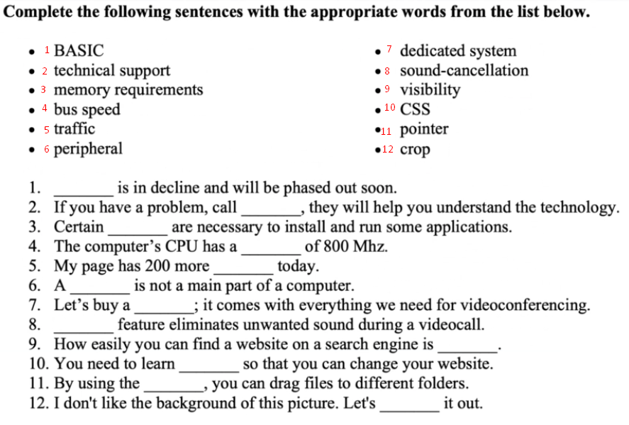
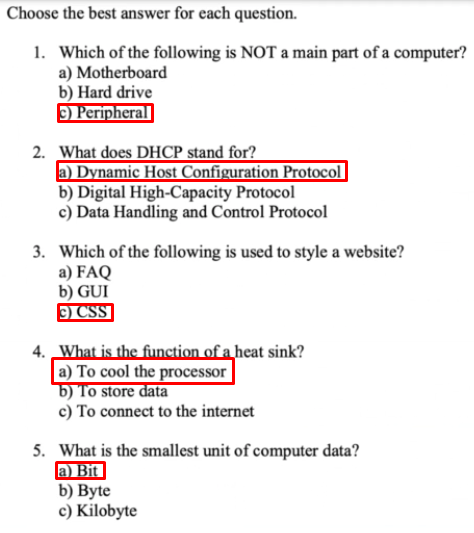
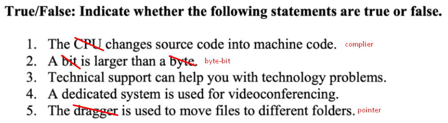
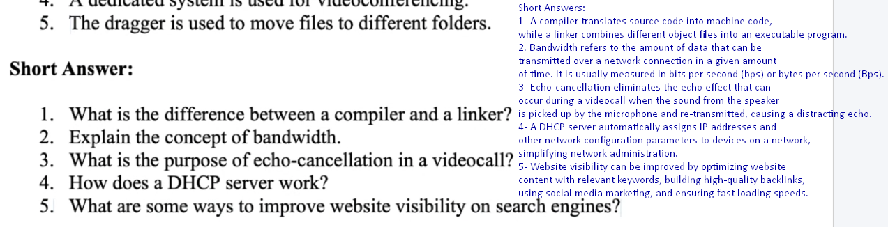
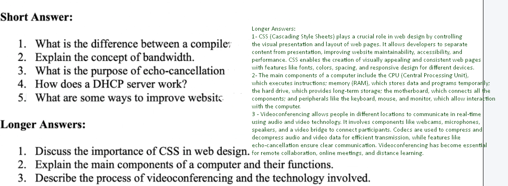
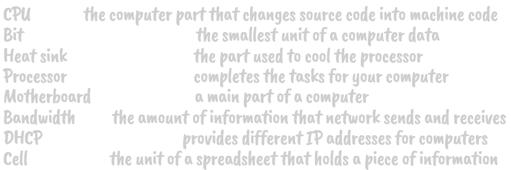

# Technicial English Class Notes
> Book: Career Paths - Information Technology, Virginia Evans, Express Publishing\
> Midterm Pages: 6, 7, 8, 9, 10, 11, 12, 13, 14, 15, 16, 17, 18, 19, 20, 21, 51, 52
> Final Pages: 22, 23, 24, 25, 26, 27, 28, 29, 30, 31, 32, 33, 34, 35, 45, 46, 47, 48, image1, image2, image3, image4, image5, image6
# Midterm
## Page 6, 7
- Software
  > EN: Programs/instructions added to computers\
  > TR: Bilgisayarlara eklenen programlar/talimatlar
- Code
  > EN: Program language\
  > TR: Programlama dili
- Hardware
  > EN: Physical parts of a computer\
  > TR: Bilgisayarın fiziksel parçaları
- Data processing
  > EN: The act of using information\
  > TR: Bilgiyi kullanma eylemi
- Information Security
  > EN: The act of protecting information\
  > TR: Bilgiyi koruma eylemi
- Online
  > EN: Connected to the internet\
  > TR: İnternete bağlı
- Tech support
  > EN: Helping people use/understand technology\
  > TR: İnsanların teknolojiyi kullanmasına/anlamasına yardım etme
- Data
  > EN: Numbers entered/held in a computer\
  > TR: Bilgisayara girilen/tutulan sayılar
- Quality Ensurance
  > EN: Checking products for problems\
  > TR: Ürünleri sorunlar için kontrol etme
- Encoding
  > EN: Putting secret information into a code\
  > TR: Gizli bilgileri bir kod içine koyma

## Page 8, 9
- Desktop Computer
  > EN: A computer that sits on a desk\
  > TR: Bir masanın üzerinde duran bir bilgisayar
- Mainframe
  > EN: A large computer that can do many things at once\
  > TR: Aynı anda birçok şey yapabilen büyük bir bilgisayar
- Workstation
  > EN: A computer that is used for a special job\
  > TR: Özel bir iş için kullanılan bir bilgisayar
- PDA
  > EN: A small computer that fits in your hand\
  > TR: Elinize sığan küçük bir bilgisayar
- Cell phone
  > EN: A small phone that you can carry with you\
  > TR: Yanınızda taşıyabileceğiniz küçük bir telefon
- Laptop
  > EN: A small computer that you can carry with you\
  > TR: Yanınızda taşıyabileceğiniz küçük bir bilgisayar
- Supercomputer
  > EN: A very powerful computer\
  > TR: Çok güçlü bir bilgisayar
- Server
  > EN: A computer that provides information to other computers\
  > TR: Diğer bilgisayarlara bilgi sağlayan bir bilgisayar
- Handheld
  > EN: A small computer that fits in your hand\
  > TR: Elinize sığan küçük bir bilgisayar

## Page 10, 11
- Motherboard
  > EN: A slotted board with circuits and ports\
  > TR: Devreler ve portlarla yuvalı bir kart
- Case
  > EN: The box that holds the computer parts\
  > TR: Bilgisayar parçalarını tutan kutu
- Fan
  > EN: A device that keeps the computer cool\
  > TR: Bilgisayarı serin tutan bir cihaz
- Ram
  > EN: A short term, quick memory source\
  > TR: Kısa süreli, hızlı bellek kaynağı
- Hard Drive
  > EN: A part used to store large amounts of data\
  > TR: Büyük miktarda veri depolamak için kullanılan bir parça
- Power Supply
  > EN: A device that provides power to the computer\
  > TR: Bilgisayara güç sağlayan bir cihaz
- Processor
  > EN: A part that completes tasks for the computer\
  > TR: Bilgisayar için görevleri tamamlayan bir parça
- Expansion Card
  > EN: A part used to increase a computer's functions\
  > TR: Bir bilgisayarın işlevlerini artırmak için kullanılan bir parça
- Heat Sink
  > EN: A part used to cool the processor\
  > TR: İşlemciyi soğutmak için kullanılan bir parça

## Page 12, 13
- Monitor
  > EN: A device that displays images\
  > TR: Görüntüleri gösteren bir cihaz
- Microphone
  > EN: A device that gathers sounds\
  > TR: Sesleri toplayan bir cihaz
- Scanner
  > EN: A device that reads images and sends them to a computer\
  > TR: Görüntüleri okuyan ve bilgisayara gönderen bir cihaz
- Mouse
  > EN: A device that is ued to control a pointer or cursor\
  > TR: Bir işaretçiyi veya imleci kontrol etmek için kullanılan bir cihaz
- Keyboard
  > EN: A device that enters information into a computer\
  > TR: Bilgisayara bilgi giren bir cihaz
- Printer
  > EN: A device that puts images on paper\
  > TR: Kağıda görüntüler koyan bir cihaz
- Touch screen
  > EN: A device that allows you to control a computer by touching the screen\
  > TR: Bir bilgisayarı ekrana dokunarak kontrol etmenizi sağlayan bir cihaz

## Page 14, 15
- LAN
  > EN: A network that connects computers in a small area\
  > TR: Küçük bir alandaki bilgisayarları birbirine bağlayan bir ağ
- Cat 5
  > EN: A type of cable used to connect computers\
  > TR: Bilgisayarları bağlamak için kullanılan bir kablo türü
- IP Address
  > EN: A number that identifies a computer on a network\
  > TR: Bir ağıdaki bir bilgisayarı tanımlayan bir numara
- Network
  > EN: A group of computers that are connected\
  > TR: Bağlı olan bilgisayarların bir grubu
- Internet
  > EN: A global network of computers\
  > TR: Bilgisayarların küresel ağı
- DHCP
  > EN: A system that assigns IP addresses to computers\
  > TR: Bilgisayarlara IP adresleri atayan bir sistem
- Router
  > EN: A device that connects computers to the internet\
  > TR: Bilgisayarları internete bağlayan bir cihaz
- WLAN
  > EN: A network that connects computers wirelessly\
  > TR: Bilgisayarları kablosuz olarak bağlayan bir ağ
- Cycle
  > EN: A series of events that repeat\
  > TR: Tekrar eden olayların bir serisi
- Configuration
  > EN: The way a computer is set up\
  > TR: Bir bilgisayarın nasıl kurulduğu

## Page 16, 17
- Folder
  > EN: A place to store files\
  > TR: Dosyaları saklamak için bir yer
- Minimize
  > EN: To make a window smaller\
  > TR: Bir pencereyi küçültmek
- Icon
  > EN: A small picture that represents a program\
  > TR: Bir programı temsil eden küçük bir resim
- Graphical User Interface
  > EN: A way to interact with a computer using pictures\
  > TR: Resimler kullanarak bir bilgisayarla etkileşimde bulunma yolu
- Menu
  > EN: A list of options\
  > TR: Seçeneklerin bir listesi
- Shortcut
  > EN: A quick way to do something\
  > TR: Bir şeyi hızlı bir şekilde yapmanın bir yolu
- Desktop
  > EN: The main screen on a computer\
  > TR: Bir bilgisayardaki ana ekran
- Operating System
  > EN: The software that runs a computer\
  > TR: Bir bilgisayarı çalıştıran yazılım
- Pointer
  > EN: A small arrow that moves on the screen\
  > TR: Ekranda hareket eden küçük bir ok
- Windows
  > EN: A type of operating system\
  > TR: Bir işletim sistemi türü
- Drag
  > EN: To move something on the screen\
  > TR: Ekranda bir şeyi taşımak

## Page 18, 19
- Format
  > EN: File type\
  > TR: Dosya türü
- Spell Check
  > EN: A program that checks for spelling errors\
  > TR: Yazım hatalarını kontrol eden bir program
- Document
  > EN: A file that contains information\
  > TR: Bilgi içeren bir dosya
- Template
  > EN: A file that is used as a starting point\
  > TR: Bir başlangıç noktası olarak kullanılan bir dosya
- Word Processing Program
  > EN: A program that creates documents\
  > TR: Belgeler oluşturan bir program
- Font
  > EN: The style of the letters\
  > TR: Harflerin stili
- Layout
  > EN: The way a document is arranged\
  > TR: Bir belgenin düzenlendiği şekil
- Compatibility
  > EN: The ability to work with other programs\
  > TR: Diğer programlarla çalışma yeteneği
- Macro
  > EN: A series of commands that can be run together\
  > TR: Birlikte çalıştırılabilen komutların bir serisi

## Page 20, 21
- E-Mail Address
  > EN: A name that identifies an e-mail account\
  > TR: Bir e-posta hesabını tanımlayan bir isim
- E-Mail Client
  > EN: A program that sends and receives e-mails\
  > TR: E-postaları gönderen ve alan bir program
- Domain Name
  > EN: The name of a company or organization\
  > TR: Bir şirketin veya organizasyonun adı
- Username Password
  > EN: A name and code that allows access to a computer\
  > TR: Bir bilgisayara erişime izin veren bir isim ve kod
- Attachment
  > EN: A file that is sent with an e-mail\
  > TR: Bir e-postayla gönderilen bir dosya
- POP3
  > EN: A system that receives e-mails\
  > TR: E-postaları alan bir sistem
- SMTP
  > EN: A system that sends e-mails\
  > TR: E-postaları gönderen bir sistem
- ISP
  > EN: A company that provides internet access\
  > TR: İnternet erişimi sağlayan bir şirket
- WebMail
  > EN: A system that allows you to check e-mail from a web browser\
  > TR: Bir web tarayıcısından e-postaları kontrol etmenize izin veren bir sistem

## Page 51, 52
- USB Flash Drive
  > EN: A small device that stores data\
  > TR: Veri depolayan küçük bir cihaz
- CD-R
  > EN: A type of CD that can be written on once\
  > TR: Bir kez yazılabilen bir CD türü
- CD-RW
  > EN: A type of CD that can be written on many times\
  > TR: Birçok kez yazılabilen bir CD türü
- Magnetic Tape
  > EN: A type of tape that stores data\
  > TR: Veri depolayan bir bant türü
- Array
  > EN: A group of disks that work together\
  > TR: Birlikte çalışan disklerin bir grubu
- Zip Drive
  > EN: A device that stores data on a disk\
  > TR: Bir diske veri depolayan bir cihaz
- Floppy Disk
  > EN: A small disk that stores data\
  > TR: Veri depolayan küçük bir disk
- RAID
  > EN: A system that stores data on multiple disks\
  > TR: Verileri birden fazla diske depolayan bir sistem
- Failure
  > EN: When something stops working\
  > TR: Bir şeyin çalışmayı durdurduğunda
- Data Compression
  > EN: Making data smaller\
  > TR: Verileri küçültme
- SATA
  > EN: A type of cable used to connect disks\
  > TR: Diskleri bağlamak için kullanılan bir kablo türü

# Final
## Page 22, 23
- URL
  > EN: The address of a website\
  > TR: Bir web sitesinin adresi
- Meta Tag
  > EN: Information about a website\
  > TR: Bir web sitesi hakkında bilgi
- Search Engine
  > EN: A program that finds information on the internet\
  > TR: İnternette bilgi bulan bir program
- Hyperlink
  > EN: A link to another website\
  > TR: Başka bir web sitesine bağlantı
- HTTP
  > EN: A system that sends web pages to your computer\
  > TR: Web sayfalarını bilgisayarınıza gönderen bir sistem
- HTML
  > EN: A language used to create web pages\
  > TR: Web sayfaları oluşturmak için kullanılan bir dil
- Web Browser
  > EN: A program that displays web pages\
  > TR: Web sayfalarını gösteren bir program
- Web Host
  > EN: A company that stores web pages\
  > TR: Web sayfalarını depolayan bir şirket
- Website
  > EN: A group of web pages\
  > TR: Web sayfalarının bir grubu
- WWW
  > EN: A system that connects web pages\
  > TR: Web sayfalarını bağlayan bir sistem

## Page 24, 25
- Resolution
  > EN: The number of pixels on a screen\
  > TR: Bir ekrandaki piksellerin sayısı
- Crop
  > EN: To cut part of an image\
  > TR: Bir resmin bir kısmını kesmek
- Contrast
  > EN: The difference between light and dark\
  > TR: Işık ve karanlık arasındaki fark
- Graphic editing program
  > EN: A program that changes images\
  > TR: Resimleri değiştiren bir program
- Exposure
  > EN: The amount of light in a photo\
  > TR: Bir fotoğraftaki ışık miktarı
- Resize
  > EN: To change the size of an image\
  > TR: Bir resmin boyutunu değiştirmek
- JPEG
  > EN: A type of image file\
  > TR: Bir resim dosyası türü
- Pixel
  > EN: A small dot on a screen\
  > TR: Bir ekrandaki küçük nokta
- Tint
  > EN: A small amount of color\
  > TR: Küçük bir renk miktarı

## Page 26, 27
- Formula
  > EN: A set of instructions\
  > TR: Bir dizi talimat
- Table
  > EN: A set of data in rows and columns\
  > TR: Satırlar ve sütunlar halindeki bir veri seti
- Spreadsheet
  > EN: A program that creates tables\
  > TR: Tablolar oluşturan bir program
- Cell
  > EN: A box in a table\
  > TR: Bir tabloda bir kutu
- Database
  > EN: A program that stores data\
  > TR: Verileri depolayan bir program
- Field
  > EN: A category of data\
  > TR: Bir veri kategorisi
- Query
  > EN: A question about data\
  > TR: Verilerle ilgili bir soru
- Function
  > EN: A formula that does a specific task\
  > TR: Belirli bir görevi yapan bir formül
- Operator
  > EN: A symbol that performs a task\
  > TR: Bir görevi yerine getiren bir sembol
- Worksheet
  > EN: A page in a spreadsheet\
  > TR: Bir elektronik tabloda bir sayfa
- Sort
  > EN: To put data in order\
  > TR: Verileri sıraya koymak

## Page 28, 29
- Web Design
  > EN: The process of creating a website\
  > TR: Bir web sitesi oluşturma süreci
- Web Development
  > EN: The process of creating a website\
  > TR: Bir web sitesi oluşturma süreci
- Navigation
  > EN: The way you move around a website\
  > TR: Bir web sitesinde dolaşma şekli
- Coding
  > EN: Writing instructions for a website\
  > TR: Bir web sitesi için talimat yazma
- Functionality
  > EN: The way a website works\
  > TR: Bir web sitesinin çalışma şekli
- Usability
  > EN: How easy a website is to use\
  > TR: Bir web sitesinin ne kadar kolay kullanıldığı
- Visibility
  > EN: How easy a website is to find\
  > TR: Bir web sitesinin ne kadar kolay bulunduğu
- CSS
  > EN: A language used to design websites\
  > TR: Web siteleri tasarlamak için kullanılan bir dil
- Appearance
  > EN: The way a website looks\
  > TR: Bir web sitesinin göründüğü şekil
- Content
  > EN: The information on a website\
  > TR: Bir web sitesindeki bilgi

## Page 30, 31
- Offset Lithography
  > EN: A printing process\
  > TR: Bir baskı süreci
- Electronic Paper
  > EN: A type of paper that can display images\
  > TR: Görüntüler gösterebilen bir kağıt türü
- Electrostatic Printing
  > EN: A printing process\
  > TR: Bir baskı süreci
- Clip Art
  > EN: Images that can be used in documents\
  > TR: Belgelerde kullanılabilen resimler
- Page Layout
  > EN: The way a page is arranged\
  > TR: Bir sayfanın düzenlendiği şekil
- Desktop Publishing
  > EN: The process of creating documents\
  > TR: Belgeler oluşturma süreci
- Graphic Communication
  > EN: The process of creating images\
  > TR: Görüntüler oluşturma süreci
- Design
  > EN: The way something looks\
  > TR: Bir şeyin göründüğü şekil
- Compherensive Layout
  > EN: A plan for a document\
  > TR: Bir belge için bir plan

## Page 32, 33
- Webcam
  > EN: A camera that sends images to a computer\
  > TR: Bir bilgisayara görüntü gönderen bir kamera
- Dedicated System
  > EN: A computer that does one job\
  > TR: Bir işi yapan bir bilgisayar
- Video Conference
  > EN: A meeting that takes place over the internet\
  > TR: İnternet üzerinden gerçekleşen bir toplantı
- Multipoint Video Conference
  > EN: A meeting that takes place over the internet\
  > TR: İnternet üzerinden gerçekleşen bir toplantı
- Document Sharing
  > EN: A system that allows people to work on the same document\
  > TR: İnsanların aynı belge üzerinde çalışmasına izin veren bir sistem
- Monitor
  > EN: A device that displays images\
  > TR: Görüntüleri gösteren bir cihaz
- Video Bridge
  > EN: A device that connects video conferences\
  > TR: Video konferansları birleştiren bir cihaz
- Echo Cancellation
  > EN: A system that removes background noise\
  > TR: Arka plan gürültüsünü kaldıran bir sistem

## Page 34, 35
- E-Commerce
  > EN: Buying and selling things on the internet\
  > TR: İnternet üzerinden alışveriş yapma
- Traffic
  > EN: The number of people who visit a website\
  > TR: Bir web sitesini ziyaret eden insanların sayısı
- FAQ
  > EN: A list of common questions and answers\
  > TR: Sıkça sorulan soruların ve cevapların bir listesi
- Shopping Cart
  > EN: A system that holds items you want to buy\
  > TR: Satın almak istediğiniz öğeleri tutan bir sistem
- Brick and Mortar
  > EN: A physical store\
  > TR: Fiziksel bir mağaza
- Affiliate
  > EN: A company that sells another company's products\
  > TR: Başka bir şirketin ürünlerini satan bir şirket
- Banner
  > EN: An advertisement on a website\
  > TR: Bir web sitesindeki bir reklam
- Page View
  > EN: The number of times a page is visited\
  > TR: Bir sayfanın ziyaret edildiği sayı
- Digital Certificate
  > EN: A code that proves a website is secure\
  > TR: Bir web sitesinin güvenli olduğunu kanıtlayan bir kod
- Certificate Authority
  > EN: A company that provides digital certificates\
  > TR: Dijital sertifikalar sağlayan bir şirket

## Page 45, 46
- Motherboard
  > EN: A slotted board with circuits and ports\
  > TR: Devreler ve portlarla yuvalı bir kart
- RAM
  > EN: A short term, quick memory source\
  > TR: Kısa süreli, hızlı bellek kaynağı
- Virtual Memory
  > EN: A system that uses hard drive space as memory\
  > TR: Sabit disk alanını bellek olarak kullanan bir sistem
- CPU
  > EN: A part that completes tasks for the computer\
  > TR: Bilgisayar için görevleri tamamlayan bir parça
- Hard Drive
  > EN: A part used to store large amounts of data\
  > TR: Büyük miktarda veri depolamak için kullanılan bir parça
- DIMM
  > EN: A type of memory\
  > TR: Bir bellek türü
- MB
  > EN: A unit of memory\
  > TR: Bir bellek birimi
- Bit size
  > EN: The amount of data a computer can process\
  > TR: Bir bilgisayarın işleyebileceği veri miktarı
- Bus Speed
  > EN: The speed at which data travels\
  > TR: Verinin seyahat ettiği hız
- Mhz
  > EN: A unit of speed\
  > TR: Bir hız birimi
- SIMM
  > EN: A type of memory\
  > TR: Bir bellek türü
- Paging File
  > EN: A file that stores data\
  > TR: Veri depolayan bir dosya

## Page 47, 48
- C
  > EN: A programming language\
  > TR: Bir programlama dili
- C++
  > EN: A programming language\
  > TR: Bir programlama dili
- Java
  > EN: A programming language\
  > TR: Bir programlama dili
- C#
  > EN: A programming language\
  > TR: Bir programlama dili
- Assembler
  > EN: A programming language\
  > TR: Bir programlama dili
- Basic
  > EN: A programming language\
  > TR: Bir programlama dili
- Compiler
  > EN: A program that changes code into a program\
  > TR: Kodu bir programa dönüştüren bir program
- Linker
  > EN: A program that connects parts of a program\
  > TR: Bir programın parçalarını birleştiren bir program
- Machine Code
  > EN: A language that a computer understands\
  > TR: Bir bilgisayarın anladığı bir dil
- CPU
  > EN: A part that completes tasks for the computer\
  > TR: Bilgisayar için görevleri tamamlayan bir parça
- Multi-threading
  > EN: A system that allows a computer to do many things at once\
  > TR: Bir bilgisayarın aynı anda birçok şey yapmasına izin veren bir sistem

## Image 1, 2, 3, 4, 5, 6

